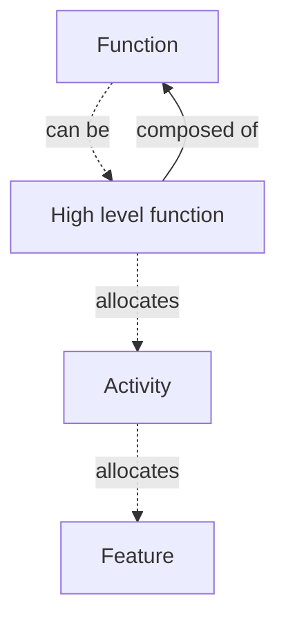
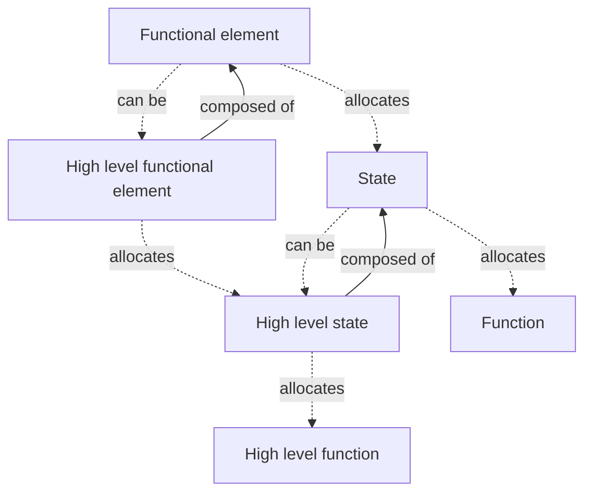
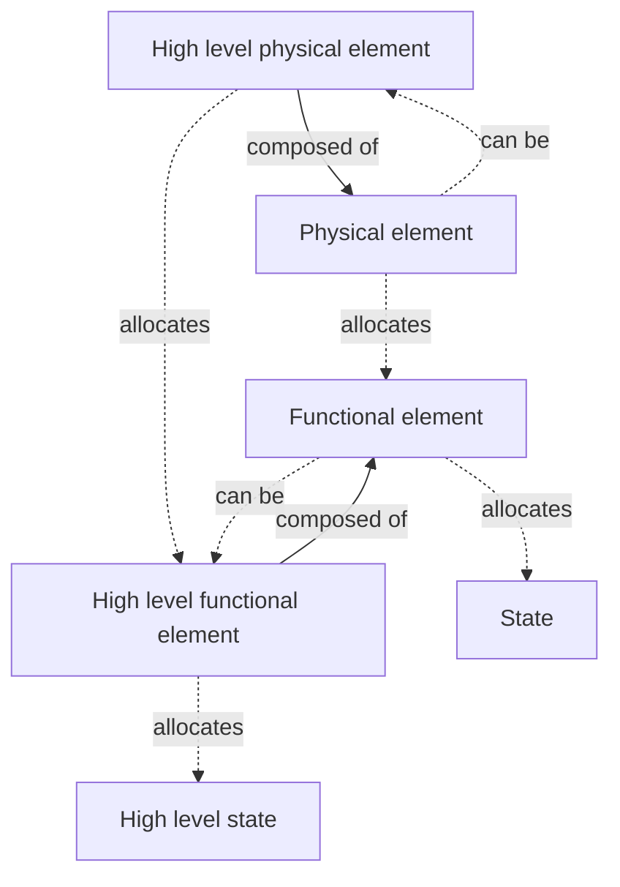
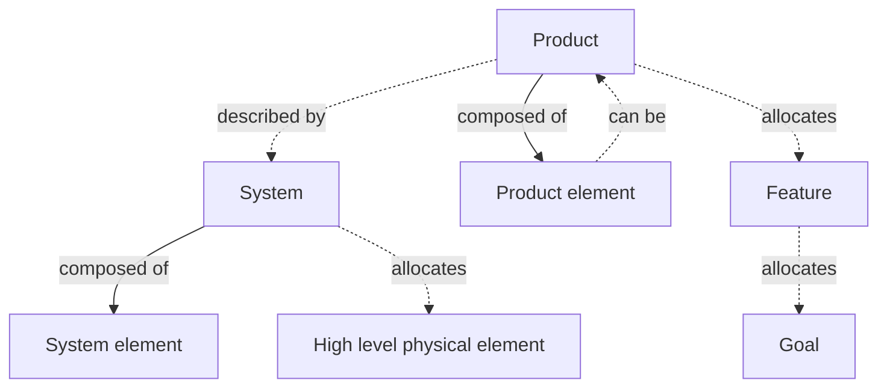
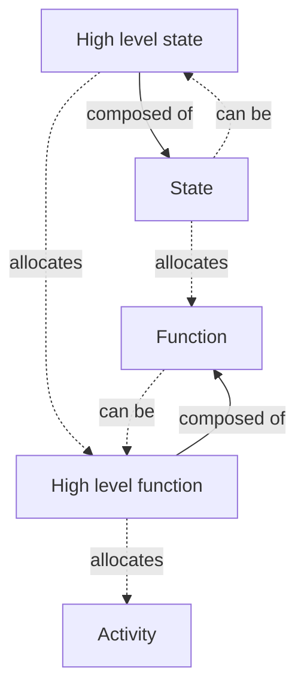
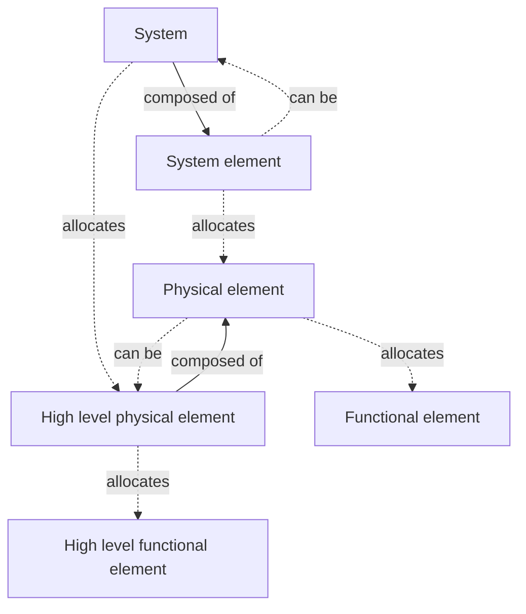

# 3SE Glossary

*Generated on 2026-03-23 13:58 UTC*

This glossary contains **150 3SE term(s)**, **68 other term(s)** and **12 reference(s)**.

## Contents

- [3SE Terms](#3se-terms)
  - [Acceptance - 3SE](#acceptance---3se)
  - [Activity - 3SE](#activity---3se)
  - [Analysis - 3SE](#analysis---3se)
  - [Attack - 3SE](#attack---3se)
  - [Attribute - 3SE](#attribute---3se)
  - [Change - 3SE](#change---3se)
  - [Constraint - 3SE](#constraint---3se)
  - [Data - 3SE](#data---3se)
  - [Decision gate - 3SE](#decision-gate---3se)
  - [Demonstration - 3SE](#demonstration---3se)
  - [Enabling function - 3SE](#enabling-function---3se)
  - [Enabling functional element - 3SE](#enabling-functional-element---3se)
  - [Enabling physical element - 3SE](#enabling-physical-element---3se)
  - [Enabling system - 3SE](#enabling-system---3se)
  - [Engineering risk - 3SE](#engineering-risk---3se)
  - [Epic - 3SE](#epic---3se)
  - [Epic analysis - 3SE](#epic-analysis---3se)
  - [Exchange - 3SE](#exchange---3se)
  - [Failure - 3SE](#failure---3se)
  - [Fault - 3SE](#fault---3se)
  - [Feature - 3SE](#feature---3se)
  - [Feature analysis - 3SE](#feature-analysis---3se)
  - [Flow - 3SE](#flow---3se)
  - [Function - 3SE](#function---3se)
  - [Function breakdown structure - 3SE](#function-breakdown-structure---3se)
  - [Functional analysis - 3SE](#functional-analysis---3se)
  - [Functional architecture - 3SE](#functional-architecture---3se)
  - [Functional element - 3SE](#functional-element---3se)
  - [Functional element breakdown structure - 3SE](#functional-element-breakdown-structure---3se)
  - [Functional interface - 3SE](#functional-interface---3se)
  - [Functional Requirement - 3SE](#functional-requirement---3se)
  - [Goal - 3SE](#goal---3se)
  - [Goal analysis - 3SE](#goal-analysis---3se)
  - [Hardware - 3SE](#hardware---3se)
  - [Hardware block - 3SE](#hardware-block---3se)
  - [Hardware component - 3SE](#hardware-component---3se)
  - [Hardware constraint - 3SE](#hardware-constraint---3se)
  - [Hardware feature - 3SE](#hardware-feature---3se)
  - [Hardware function - 3SE](#hardware-function---3se)
  - [Hardware functional requirement - 3SE](#hardware-functional-requirement---3se)
  - [Hardware interface - 3SE](#hardware-interface---3se)
  - [Hardware non-functional requirement - 3SE](#hardware-non-functional-requirement---3se)
  - [Hardware product - 3SE](#hardware-product---3se)
  - [Hazard - 3SE](#hazard---3se)
  - [High level function - 3SE](#high-level-function---3se)
  - [High level functional element - 3SE](#high-level-functional-element---3se)
  - [High level physical element - 3SE](#high-level-physical-element---3se)
  - [High level state - 3SE](#high-level-state---3se)
  - [Information - 3SE](#information---3se)
  - [Inspection - 3SE](#inspection---3se)
  - [Integration testing - 3SE](#integration-testing---3se)
  - [Iteration - 3SE](#iteration---3se)
  - [Iteration analysis - 3SE](#iteration-analysis---3se)
  - [Maturity gate - 3SE](#maturity-gate---3se)
  - [Non-functional requirement - 3SE](#non-functional-requirement---3se)
  - [Operational analysis - 3SE](#operational-analysis---3se)
  - [Organization risk - 3SE](#organization-risk---3se)
  - [Physical architecture - 3SE](#physical-architecture---3se)
  - [Physical element - 3SE](#physical-element---3se)
  - [Physical element breakdown structure - 3SE](#physical-element-breakdown-structure---3se)
  - [Physical interface - 3SE](#physical-interface---3se)
  - [Problem - 3SE](#problem---3se)
  - [Product - 3SE](#product---3se)
  - [Product analysis - 3SE](#product-analysis---3se)
  - [Product breakdown structure - 3SE](#product-breakdown-structure---3se)
  - [Product element - 3SE](#product-element---3se)
  - [Project - 3SE](#project---3se)
  - [Project analysis - 3SE](#project-analysis---3se)
  - [Project risk - 3SE](#project-risk---3se)
  - [Release - 3SE](#release---3se)
  - [Release analysis - 3SE](#release-analysis---3se)
  - [Requirement - 3SE](#requirement---3se)
  - [Requirement analysis - 3SE](#requirement-analysis---3se)
  - [Residual risk - 3SE](#residual-risk---3se)
  - [Risk - 3SE](#risk---3se)
  - [Risk analysis - 3SE](#risk-analysis---3se)
  - [Safety activity - 3SE](#safety-activity---3se)
  - [Safety feature - 3SE](#safety-feature---3se)
  - [Safety goal - 3SE](#safety-goal---3se)
  - [Safety hardware constraint - 3SE](#safety-hardware-constraint---3se)
  - [Safety hardware feature - 3SE](#safety-hardware-feature---3se)
  - [Safety hardware function - 3SE](#safety-hardware-function---3se)
  - [Safety hardware functional requirement - 3SE](#safety-hardware-functional-requirement---3se)
  - [Safety hardware non-functional requirement - 3SE](#safety-hardware-non-functional-requirement---3se)
  - [Safety hardware product - 3SE](#safety-hardware-product---3se)
  - [Safety risk - 3SE](#safety-risk---3se)
  - [Safety software constraint - 3SE](#safety-software-constraint---3se)
  - [Safety software feature - 3SE](#safety-software-feature---3se)
  - [Safety software function - 3SE](#safety-software-function---3se)
  - [Safety software functional requirement - 3SE](#safety-software-functional-requirement---3se)
  - [Safety software non-functional requirement - 3SE](#safety-software-non-functional-requirement---3se)
  - [Safety software product - 3SE](#safety-software-product---3se)
  - [Safety system constraint - 3SE](#safety-system-constraint---3se)
  - [Safety system function - 3SE](#safety-system-function---3se)
  - [Safety system functional requirement - 3SE](#safety-system-functional-requirement---3se)
  - [Safety system non-functional requirement - 3SE](#safety-system-non-functional-requirement---3se)
  - [Security activity - 3SE](#security-activity---3se)
  - [Security feature - 3SE](#security-feature---3se)
  - [Security goal - 3SE](#security-goal---3se)
  - [Security hardware constraint - 3SE](#security-hardware-constraint---3se)
  - [Security hardware feature - 3SE](#security-hardware-feature---3se)
  - [Security hardware function - 3SE](#security-hardware-function---3se)
  - [Security hardware functional requirement - 3SE](#security-hardware-functional-requirement---3se)
  - [Security hardware non-functional requirement - 3SE](#security-hardware-non-functional-requirement---3se)
  - [Security hardware product - 3SE](#security-hardware-product---3se)
  - [Security risk - 3SE](#security-risk---3se)
  - [Security software constraint - 3SE](#security-software-constraint---3se)
  - [Security software feature - 3SE](#security-software-feature---3se)
  - [Security software function - 3SE](#security-software-function---3se)
  - [Security software functional requirement - 3SE](#security-software-functional-requirement---3se)
  - [Security software non-functional requirement - 3SE](#security-software-non-functional-requirement---3se)
  - [Security software product - 3SE](#security-software-product---3se)
  - [Security system constraint - 3SE](#security-system-constraint---3se)
  - [Security system function - 3SE](#security-system-function---3se)
  - [Security system functional requirement - 3SE](#security-system-functional-requirement---3se)
  - [Security system non-functional requirement - 3SE](#security-system-non-functional-requirement---3se)
  - [Software - 3SE](#software---3se)
  - [Software component - 3SE](#software-component---3se)
  - [Software constraint - 3SE](#software-constraint---3se)
  - [Software feature - 3SE](#software-feature---3se)
  - [Software function - 3SE](#software-function---3se)
  - [Software functional requirement - 3SE](#software-functional-requirement---3se)
  - [Software interface - 3SE](#software-interface---3se)
  - [Software non-functional requirement - 3SE](#software-non-functional-requirement---3se)
  - [Software product - 3SE](#software-product---3se)
  - [Software unit - 3SE](#software-unit---3se)
  - [Solution - 3SE](#solution---3se)
  - [Stakeholder - 3SE](#stakeholder---3se)
  - [Stakeholder constraint - 3SE](#stakeholder-constraint---3se)
  - [Stakeholder functional requirement - 3SE](#stakeholder-functional-requirement---3se)
  - [Stakeholder non-functional requirement - 3SE](#stakeholder-non-functional-requirement---3se)
  - [State - 3SE](#state---3se)
  - [State breakdown structure - 3SE](#state-breakdown-structure---3se)
  - [System - 3SE](#system---3se)
  - [System breakdown structure - 3SE](#system-breakdown-structure---3se)
  - [System constraint - 3SE](#system-constraint---3se)
  - [System element - 3SE](#system-element---3se)
  - [System function - 3SE](#system-function---3se)
  - [System functional requirement - 3SE](#system-functional-requirement---3se)
  - [System interface - 3SE](#system-interface---3se)
  - [System non-functional requirement - 3SE](#system-non-functional-requirement---3se)
  - [Systems engineering - 3SE](#systems-engineering---3se)
  - [Systems principles - 3SE](#systems-principles---3se)
  - [Task - 3SE](#task---3se)
  - [Task analysis - 3SE](#task-analysis---3se)
  - [Test - 3SE](#test---3se)
  - [Test case - 3SE](#test-case---3se)
  - [Test run - 3SE](#test-run---3se)
  - [Validation - 3SE](#validation---3se)
  - [Verification - 3SE](#verification---3se)
- [Other Terms](#other-terms)
  - [Acceptance - IEEE 1012](#acceptance---ieee-1012)
  - [Activity - ISO/IEC/IEEE 24765](#activity---isoiecieee-24765)
  - [Attack path - ISO/SAE 21434](#attack-path---isosae-21434)
  - [Attribute - ISO/IEC/IEEE 24765](#attribute---isoiecieee-24765)
  - [Behavioral component - ARCADIA](#behavioral-component---arcadia)
  - [Behavioral port - ARCADIA](#behavioral-port---arcadia)
  - [Change - ISO/IEC/IEEE 24765](#change---isoiecieee-24765)
  - [Computer program - ISO/IEC/IEEE 24765](#computer-program---isoiecieee-24765)
  - [Constraint - IREB CPRE](#constraint---ireb-cpre)
  - [Cybersecurity control - ISO/SAE 21434](#cybersecurity-control---isosae-21434)
  - [Cybersecurity goal - ISO/SAE 21434](#cybersecurity-goal---isosae-21434)
  - [Decision gate - ISO/IEC/IEEE 24765](#decision-gate---isoiecieee-24765)
  - [Demonstration - ISO/IEC/IEEE 24765](#demonstration---isoiecieee-24765)
  - [Enabling system - ISO/IEC/IEEE 15288](#enabling-system---isoiecieee-15288)
  - [Epic - SAFe 6.0](#epic---safe-6.0)
  - [Failure - ISO 26262-1](#failure---iso-26262-1)
  - [Fault - ISO 26262-1](#fault---iso-26262-1)
  - [Feature - SAFe 6.0](#feature---safe-6.0)
  - [Function - ISO/IEC/IEEE 24765](#function---isoiecieee-24765)
  - [Functional analysis - ISO/IEC/IEEE 24765](#functional-analysis---isoiecieee-24765)
  - [Functional architecture - ISO/IEC/IEEE 24765](#functional-architecture---isoiecieee-24765)
  - [Functional exchange - ARCADIA](#functional-exchange---arcadia)
  - [Functional Requirement - IREB CPRE](#functional-requirement---ireb-cpre)
  - [Functional safety requirement - ISO 26262-1](#functional-safety-requirement---iso-26262-1)
  - [Goal - Requirements Engineering Fundamentals 2nd Edition](#goal---requirements-engineering-fundamentals-2nd-edition)
  - [Hardware - ISO/IEC/IEEE 24765](#hardware---isoiecieee-24765)
  - [Hazard - ISO 26262-1](#hazard---iso-26262-1)
  - [Hosting physical component - ARCADIA](#hosting-physical-component---arcadia)
  - [Inspection - ISO/IEC/IEEE 24765](#inspection---isoiecieee-24765)
  - [Integration testing - ISTQB](#integration-testing---istqb)
  - [Interface - ISO/IEC/IEEE 24765](#interface---isoiecieee-24765)
  - [Iteration - ISO/IEC/IEEE 24765](#iteration---isoiecieee-24765)
  - [Non-functional Requirement - IREB CPRE](#non-functional-requirement---ireb-cpre)
  - [Operational interaction - ARCADIA](#operational-interaction---arcadia)
  - [Operational mode - Systems Opportunities and Requirements](#operational-mode---systems-opportunities-and-requirements)
  - [Phase gate - ISO/IEC/IEEE 24765](#phase-gate---isoiecieee-24765)
  - [Physical port - ARCADIA](#physical-port---arcadia)
  - [Problem - ISO/IEC/IEEE 24765](#problem---isoiecieee-24765)
  - [Product - ISO/IEC/IEEE 24765](#product---isoiecieee-24765)
  - [Product analysis - ISO/IEC/IEEE 24765](#product-analysis---isoiecieee-24765)
  - [Product breakdown structure - ISO/IEC/IEEE 24765](#product-breakdown-structure---isoiecieee-24765)
  - [Project - ISO/IEC/IEEE 24765](#project---isoiecieee-24765)
  - [Project risk - ISO/IEC/IEEE 24765](#project-risk---isoiecieee-24765)
  - [Quality Requirement - IREB CPRE](#quality-requirement---ireb-cpre)
  - [Release - ISO/IEC/IEEE 24765](#release---isoiecieee-24765)
  - [Requirement - IREB CPRE](#requirement---ireb-cpre)
  - [Residual risk - ISO/IEC/IEEE 24765](#residual-risk---isoiecieee-24765)
  - [Risk - IEEE 1012](#risk---ieee-1012)
  - [Risk analysis - ISO/IEC/IEEE 24765](#risk-analysis---isoiecieee-24765)
  - [Safety goal - ISO 26262-1](#safety-goal---iso-26262-1)
  - [Safety mechanism - ISO 26262-1](#safety-mechanism---iso-26262-1)
  - [Software component - ISO/IEC/IEEE 24765](#software-component---isoiecieee-24765)
  - [Software product - ISO/IEC/IEEE 24765](#software-product---isoiecieee-24765)
  - [Software unit - ISO/IEC/IEEE 24765](#software-unit---isoiecieee-24765)
  - [Solution - ISO/IEC/IEEE 24765](#solution---isoiecieee-24765)
  - [Stakeholder - IREB CPRE](#stakeholder---ireb-cpre)
  - [System - ISO/IEC/IEEE 15288](#system---isoiecieee-15288)
  - [System breakdown structure - ISO/IEC/IEEE 24765](#system-breakdown-structure---isoiecieee-24765)
  - [System element - ISO/IEC/IEEE 15288](#system-element---isoiecieee-15288)
  - [Systems engineering - ISO/IEC/IEEE 15288](#systems-engineering---isoiecieee-15288)
  - [Task - ISO/IEC/IEEE 24765](#task---isoiecieee-24765)
  - [Technical safety requirement - ISO 26262-1](#technical-safety-requirement---iso-26262-1)
  - [Test - ISO/IEC/IEEE 24765](#test---isoiecieee-24765)
  - [Test case - IEEE 1012](#test-case---ieee-1012)
  - [Test run - ISTQB](#test-run---istqb)
  - [Test suite - ISTQB](#test-suite---istqb)
  - [Validation - IEEE 1012](#validation---ieee-1012)
  - [Verification - IEEE 1012](#verification---ieee-1012)
- [References](#references)
  - [ARCADIA language reference : meta model](#arcadia-language-reference--meta-model)
  - [IEEE 1012:2016](#ieee-10122016)
  - [IREB CPRE Glossary](#ireb-cpre-glossary)
  - [ISO 26262-1:2018](#iso-26262-12018)
  - [ISO/IEC/IEEE 15288:2015](#isoiecieee-152882015)
  - [ISO/IEC/IEEE 15288:2023](#isoiecieee-152882023)
  - [ISO/IEC/IEEE 24765:2017](#isoiecieee-247652017)
  - [ISO/SAE 21434:2021](#isosae-214342021)
  - [ISTQB Glossary](#istqb-glossary)
  - [Requirements Engineering Fundamentals](#requirements-engineering-fundamentals)
  - [Scaled Agile Framework [SAFe] - 6.0](#scaled-agile-framework-[safe]---60)
  - [Systems Opportunities and Requirements](#systems-opportunities-and-requirements)

---

## 3SE Terms

*150 term(s) defined by the 3SE framework.*

### Acceptance - 3SE

> Evaluation of the attributes and features of an entity conducted to enable a stakeholder to determine whether the right entity is built and to accept it. Note : it determines if the entity satisfies the stakeholders’ requirements and the stakeholders’ goals.

| Relation | Terms |
|---|---|
| Related | [feature-3se-069b48ef5d0f7505](https://www.3se.info/3se-onto/terms/feature-3se-069b48ef5d0f7505), [goal-3se-069b48ef5d2171ed](https://www.3se.info/3se-onto/terms/goal-3se-069b48ef5d2171ed), [requirement-3se-069b48ef5d727ceb](https://www.3se.info/3se-onto/terms/requirement-3se-069b48ef5d727ceb), [attribute-3se-069b72bee1327dcf](https://www.3se.info/3se-onto/terms/attribute-3se-069b72bee1327dcf), [stakeholder-3se-069bc40b97d97d03](https://www.3se.info/3se-onto/terms/stakeholder-3se-069bc40b97d97d03) |
| Close match | [acceptance-1012-2016-069ac9d90baa7544](https://www.3se.info/3se-onto/terms/acceptance-1012-2016-069ac9d90baa7544) |

*Created: 2026-03-14 · Modified: 2026-03-19 · Creator: @rcasteran*

---

### Activity - 3SE

> Set of cohesive functions to be performed to achieve a stakeholder's goal, which transforms incoming exchanges into outgoing exchanges.

| Relation | Terms |
|---|---|
| Related | [functional-analysis-3se-069b9d2c8d85724b](https://www.3se.info/3se-onto/terms/functional-analysis-3se-069b9d2c8d85724b), [function-3se-069b48ef5d187435](https://www.3se.info/3se-onto/terms/function-3se-069b48ef5d187435), [goal-3se-069b48ef5d2171ed](https://www.3se.info/3se-onto/terms/goal-3se-069b48ef5d2171ed), [stakeholder-3se-069bc40b97d97d03](https://www.3se.info/3se-onto/terms/stakeholder-3se-069bc40b97d97d03), [exchange-3se-069bc4ea5316749f](https://www.3se.info/3se-onto/terms/exchange-3se-069bc4ea5316749f), [operational-analysis-3se-069b9d2c8dbe721c](https://www.3se.info/3se-onto/terms/operational-analysis-3se-069b9d2c8dbe721c), [function-breakdown-structure-3se-069c03f8a3ee7e9d](https://www.3se.info/3se-onto/terms/function-breakdown-structure-3se-069c03f8a3ee7e9d) |
| Superclass of | [safety-activity-3se-069ab4192b7d7c00](https://www.3se.info/3se-onto/terms/safety-activity-3se-069ab4192b7d7c00), [security-activity-3se-069ab4192b8e7951](https://www.3se.info/3se-onto/terms/security-activity-3se-069ab4192b8e7951) |
| Narrow match | [activity-24765-2017-069ab4000ad177a9](https://www.3se.info/3se-onto/terms/activity-24765-2017-069ab4000ad177a9) |
| Allocates | [feature-3se-069b48ef5d0f7505](https://www.3se.info/3se-onto/terms/feature-3se-069b48ef5d0f7505) |

*Created: 2026-03-13 · Modified: 2026-03-22 · Creator: @rcasteran*

---

### Analysis - 3SE

> Evaluation method of an attribute or feature of an entity using a set of model and calculation

| Relation | Terms |
|---|---|
| Related | [attribute-3se-069b72bee1327dcf](https://www.3se.info/3se-onto/terms/attribute-3se-069b72bee1327dcf) |
| Superclass of | [epic-analysis-3se-069b9d2c8d6c7640](https://www.3se.info/3se-onto/terms/epic-analysis-3se-069b9d2c8d6c7640), [feature-analysis-3se-069b9d2c8d747c84](https://www.3se.info/3se-onto/terms/feature-analysis-3se-069b9d2c8d747c84), [functional-analysis-3se-069b9d2c8d85724b](https://www.3se.info/3se-onto/terms/functional-analysis-3se-069b9d2c8d85724b), [functional-architecture-3se-069b9d2c8d957426](https://www.3se.info/3se-onto/terms/functional-architecture-3se-069b9d2c8d957426), [goal-analysis-3se-069b9d2c8da575a4](https://www.3se.info/3se-onto/terms/goal-analysis-3se-069b9d2c8da575a4), [iteration-analysis-3se-069b9d2c8db57db4](https://www.3se.info/3se-onto/terms/iteration-analysis-3se-069b9d2c8db57db4), [operational-analysis-3se-069b9d2c8dbe721c](https://www.3se.info/3se-onto/terms/operational-analysis-3se-069b9d2c8dbe721c), [physical-architecture-3se-069b9d2c8dc67374](https://www.3se.info/3se-onto/terms/physical-architecture-3se-069b9d2c8dc67374), [product-analysis-3se-069b9d2c8dd77a8d](https://www.3se.info/3se-onto/terms/product-analysis-3se-069b9d2c8dd77a8d), [project-analysis-3se-069b9d2c8ddf7fa8](https://www.3se.info/3se-onto/terms/project-analysis-3se-069b9d2c8ddf7fa8), [release-analysis-3se-069b9d2c8de871b3](https://www.3se.info/3se-onto/terms/release-analysis-3se-069b9d2c8de871b3), [requirement-analysis-3se-069b9d2c8df07af5](https://www.3se.info/3se-onto/terms/requirement-analysis-3se-069b9d2c8df07af5), [risk-analysis-3se-069bda7c99d17d32](https://www.3se.info/3se-onto/terms/risk-analysis-3se-069bda7c99d17d32), [task-analysis-3se-069b9d2c8df9750e](https://www.3se.info/3se-onto/terms/task-analysis-3se-069b9d2c8df9750e) |

*Created: 2026-03-14 · Modified: 2026-03-20 · Creator: @rcasteran*

---

### Attack - 3SE

> Set of deliberate actions to compromise one or more attributes of the system of interest that is worth protecting.

| Relation | Terms |
|---|---|
| Related | [system-3se-069b85f238f3792d](https://www.3se.info/3se-onto/terms/system-3se-069b85f238f3792d), [attribute-3se-069b72bee1327dcf](https://www.3se.info/3se-onto/terms/attribute-3se-069b72bee1327dcf), [security-risk-3se-069bdd80b61570ed](https://www.3se.info/3se-onto/terms/security-risk-3se-069bdd80b61570ed) |
| Broad match | [attack-path-21434-2021-069ab4192b34725a](https://www.3se.info/3se-onto/terms/attack-path-21434-2021-069ab4192b34725a) |

*Created: 2026-03-18 · Modified: 2026-03-21 · Creator: @rcasteran*

---

### Attribute - 3SE

> Inherent property or characteristic of an entity that can be observed quantitatively or qualitatively and evaluated against some acceptance criteria.

| Relation | Terms |
|---|---|
| Related | [analysis-3se-069b5a9129c37ebe](https://www.3se.info/3se-onto/terms/analysis-3se-069b5a9129c37ebe), [demonstration-3se-069b5a9129d57eb1](https://www.3se.info/3se-onto/terms/demonstration-3se-069b5a9129d57eb1), [non-functional-req-3se-069b88438059727d](https://www.3se.info/3se-onto/terms/non-functional-req-3se-069b88438059727d), [requirement-3se-069b48ef5d727ceb](https://www.3se.info/3se-onto/terms/requirement-3se-069b48ef5d727ceb), [test-3se-069b5a912a117976](https://www.3se.info/3se-onto/terms/test-3se-069b5a912a117976), [acceptance-3se-069b5a9129b27d3e](https://www.3se.info/3se-onto/terms/acceptance-3se-069b5a9129b27d3e), [attack-3se-069bb0a752ae71a6](https://www.3se.info/3se-onto/terms/attack-3se-069bb0a752ae71a6) |
| Narrow match | [attribute-24765-2017-069b72bee10a7f6c](https://www.3se.info/3se-onto/terms/attribute-24765-2017-069b72bee10a7f6c) |

*Created: 2026-03-15 · Modified: 2026-03-20 · Creator: @rcasteran*

---

### Change - 3SE

> Modification to any deliverable of a release.

| Relation | Terms |
|---|---|
| Related | [release-3se-069b48ef5d6a7595](https://www.3se.info/3se-onto/terms/release-3se-069b48ef5d6a7595) |
| Close match | [change-24765-2017-069b5b3d9ea27656](https://www.3se.info/3se-onto/terms/change-24765-2017-069b5b3d9ea27656) |

*Created: 2026-03-14 · Modified: 2026-03-17 · Creator: @rcasteran*

---

### Constraint - 3SE

> Requirement that limits the solution space beyond what is necessary for meeting the given functional and non-functional requirements.

| Relation | Terms |
|---|---|
| Related | [functional-req-3se-069b88438050789a](https://www.3se.info/3se-onto/terms/functional-req-3se-069b88438050789a), [non-functional-req-3se-069b88438059727d](https://www.3se.info/3se-onto/terms/non-functional-req-3se-069b88438059727d), [solution-3se-069bc40b97cf7f18](https://www.3se.info/3se-onto/terms/solution-3se-069bc40b97cf7f18) |
| Subclass of | [requirement-3se-069b48ef5d727ceb](https://www.3se.info/3se-onto/terms/requirement-3se-069b48ef5d727ceb) |
| Superclass of | [hardware-constraint-3se-069be64e18377cf1](https://www.3se.info/3se-onto/terms/hardware-constraint-3se-069be64e18377cf1), [safety-hardware-constraint-3se-069bdc3120aa7eff](https://www.3se.info/3se-onto/terms/safety-hardware-constraint-3se-069bdc3120aa7eff), [safety-software-constraint-3se-069bdc3120c37bc8](https://www.3se.info/3se-onto/terms/safety-software-constraint-3se-069bdc3120c37bc8), [safety-system-constraint-3se-069bdc3120dd749a](https://www.3se.info/3se-onto/terms/safety-system-constraint-3se-069bdc3120dd749a), [security-hardware-constraint-3se-069bdc3121007939](https://www.3se.info/3se-onto/terms/security-hardware-constraint-3se-069bdc3121007939), [security-software-constraint-3se-069bdc31211a740f](https://www.3se.info/3se-onto/terms/security-software-constraint-3se-069bdc31211a740f), [security-system-constraint-3se-069bdc3121337fbd](https://www.3se.info/3se-onto/terms/security-system-constraint-3se-069bdc3121337fbd), [software-constraint-3se-069be64e18697419](https://www.3se.info/3se-onto/terms/software-constraint-3se-069be64e18697419), [stakeholder-constraint-3se-069bdc8805087d03](https://www.3se.info/3se-onto/terms/stakeholder-constraint-3se-069bdc8805087d03), [system-constraint-3se-069be64e188b7d26](https://www.3se.info/3se-onto/terms/system-constraint-3se-069be64e188b7d26) |
| Exact match | [constraint-cpre-069a9faf2c897700](https://www.3se.info/3se-onto/terms/constraint-cpre-069a9faf2c897700) |
| Narrow match | [non-functional-req-cpre-069a9faf2ca97723](https://www.3se.info/3se-onto/terms/non-functional-req-cpre-069a9faf2ca97723) |

*Created: 2026-03-16 · Modified: 2026-03-19 · Creator: @rcasteran*

---

### Data - 3SE

> Functional flow made of symbols.

| Relation | Terms |
|---|---|
| Related | [information-3se-069bc4ea53337e0e](https://www.3se.info/3se-onto/terms/information-3se-069bc4ea53337e0e) |
| Subclass of | [flow-3se-069bc4ea53207933](https://www.3se.info/3se-onto/terms/flow-3se-069bc4ea53207933) |

*Created: 2026-03-19 · Modified: 2026-03-22 · Creator: @rcasteran*

---

### Decision gate - 3SE

> Verification of a candidate release during an independent technical assessment where a decision is made to continue to the next iteration (with or without modifications) or to raise a problem.

| Relation | Terms |
|---|---|
| Related | [iteration-3se-069b48ef5d347061](https://www.3se.info/3se-onto/terms/iteration-3se-069b48ef5d347061), [problem-3se-069b5b3d9ece7ec8](https://www.3se.info/3se-onto/terms/problem-3se-069b5b3d9ece7ec8), [release-3se-069b48ef5d6a7595](https://www.3se.info/3se-onto/terms/release-3se-069b48ef5d6a7595), [verification-3se-069b5a912a2372d7](https://www.3se.info/3se-onto/terms/verification-3se-069b5a912a2372d7), [project-risk-3se-069bda7c99c176e4](https://www.3se.info/3se-onto/terms/project-risk-3se-069bda7c99c176e4) |
| Close match | [decision-gate-24765-2017-069b48ef5ce978eb](https://www.3se.info/3se-onto/terms/decision-gate-24765-2017-069b48ef5ce978eb) |

*Created: 2026-03-13 · Modified: 2026-03-20 · Creator: @rcasteran*

---

### Demonstration - 3SE

> Evaluation method of an attribute or feature of an entity under a set of test case in its context of use.

| Relation | Terms |
|---|---|
| Related | [attribute-3se-069b72bee1327dcf](https://www.3se.info/3se-onto/terms/attribute-3se-069b72bee1327dcf), [test-case-3se-069b5b3d9ee67de5](https://www.3se.info/3se-onto/terms/test-case-3se-069b5b3d9ee67de5) |
| Related match | [demonstration-24765-2017-069b5a9129cd7349](https://www.3se.info/3se-onto/terms/demonstration-24765-2017-069b5a9129cd7349) |

*Created: 2026-03-14 · Modified: 2026-03-20 · Creator: @rcasteran*

---

### Enabling function - 3SE

> Function devolved to an enabling system.

| Relation | Terms |
|---|---|
| Related | [enabling-functional-element-3se-069b9d2c8d4a7d97](https://www.3se.info/3se-onto/terms/enabling-functional-element-3se-069b9d2c8d4a7d97), [enabling-system-3se-069b9d2c8d64720e](https://www.3se.info/3se-onto/terms/enabling-system-3se-069b9d2c8d64720e), [function-3se-069b48ef5d187435](https://www.3se.info/3se-onto/terms/function-3se-069b48ef5d187435) |

*Created: 2026-03-22 · Modified: 2026-03-22 · Creator: @rcasteran*

---

### Enabling functional element - 3SE

> Part of an enabling system responsible for carrying out some of the enabling functions devolved to the enabling system, by interacting with functional elements of the system and/or actors.

| Relation | Terms |
|---|---|
| Related | [enabling-physical-element-3se-069b9d2c8d5375f6](https://www.3se.info/3se-onto/terms/enabling-physical-element-3se-069b9d2c8d5375f6), [functional-element-3se-069b9d2c8d9d7504](https://www.3se.info/3se-onto/terms/functional-element-3se-069b9d2c8d9d7504), [enabling-system-3se-069b9d2c8d64720e](https://www.3se.info/3se-onto/terms/enabling-system-3se-069b9d2c8d64720e), [system-3se-069b85f238f3792d](https://www.3se.info/3se-onto/terms/system-3se-069b85f238f3792d), [enabling-function-3se-069c06710282799a](https://www.3se.info/3se-onto/terms/enabling-function-3se-069c06710282799a) |

*Created: 2026-03-17 · Modified: 2026-03-22 · Creator: @rcasteran*

---

### Enabling physical element - 3SE

> Part of an enabling system responsible for defining the resources to carrying out the enabling functional element of the enabling system, by interacting with physical elements of the system and/or actors.

| Relation | Terms |
|---|---|
| Related | [enabling-functional-element-3se-069b9d2c8d4a7d97](https://www.3se.info/3se-onto/terms/enabling-functional-element-3se-069b9d2c8d4a7d97), [physical-element-3se-069b9d2c8dce7f9b](https://www.3se.info/3se-onto/terms/physical-element-3se-069b9d2c8dce7f9b), [enabling-system-3se-069b9d2c8d64720e](https://www.3se.info/3se-onto/terms/enabling-system-3se-069b9d2c8d64720e), [system-3se-069b85f238f3792d](https://www.3se.info/3se-onto/terms/system-3se-069b85f238f3792d) |

*Created: 2026-03-17 · Modified: 2026-03-18 · Creator: @rcasteran*

---

### Enabling system - 3SE

> System that supports the system of interest during its life cycle stages to achieve the goals it is designed for.

| Relation | Terms |
|---|---|
| Related | [enabling-functional-element-3se-069b9d2c8d4a7d97](https://www.3se.info/3se-onto/terms/enabling-functional-element-3se-069b9d2c8d4a7d97), [enabling-physical-element-3se-069b9d2c8d5375f6](https://www.3se.info/3se-onto/terms/enabling-physical-element-3se-069b9d2c8d5375f6), [goal-3se-069b48ef5d2171ed](https://www.3se.info/3se-onto/terms/goal-3se-069b48ef5d2171ed), [system-interface-3se-069bd66fb6547971](https://www.3se.info/3se-onto/terms/system-interface-3se-069bd66fb6547971), [enabling-function-3se-069c06710282799a](https://www.3se.info/3se-onto/terms/enabling-function-3se-069c06710282799a) |
| Subclass of | [system-3se-069b85f238f3792d](https://www.3se.info/3se-onto/terms/system-3se-069b85f238f3792d) |
| Close match | [enabling-system-15288-2023-069b9d2c8d5b7b0b](https://www.3se.info/3se-onto/terms/enabling-system-15288-2023-069b9d2c8d5b7b0b) |

*Created: 2026-03-17 · Modified: 2026-03-22 · Creator: @rcasteran*

---

### Engineering risk - 3SE

> Risk related to a technical uncertainty (feasability, scope...) about a release.

| Relation | Terms |
|---|---|
| Related | [release-3se-069b48ef5d6a7595](https://www.3se.info/3se-onto/terms/release-3se-069b48ef5d6a7595) |
| Subclass of | [risk-3se-069b5b3d9eda7fcf](https://www.3se.info/3se-onto/terms/risk-3se-069b5b3d9eda7fcf) |

*Created: 2026-03-20 · Modified: 2026-03-20 · Creator: @rcasteran*

---

### Epic - 3SE

> Significant solution development initiative for a given release

| Relation | Terms |
|---|---|
| Related | [epic-analysis-3se-069b9d2c8d6c7640](https://www.3se.info/3se-onto/terms/epic-analysis-3se-069b9d2c8d6c7640), [task-3se-069b48ef5d8579f8](https://www.3se.info/3se-onto/terms/task-3se-069b48ef5d8579f8), [task-analysis-3se-069b9d2c8df9750e](https://www.3se.info/3se-onto/terms/task-analysis-3se-069b9d2c8df9750e), [release-3se-069b48ef5d6a7595](https://www.3se.info/3se-onto/terms/release-3se-069b48ef5d6a7595), [solution-3se-069bc40b97cf7f18](https://www.3se.info/3se-onto/terms/solution-3se-069bc40b97cf7f18) |
| Narrow match | [epic-safe-6-0-069b48ef5d067458](https://www.3se.info/3se-onto/terms/epic-safe-6-0-069b48ef5d067458) |

*Created: 2026-03-13 · Modified: 2026-03-19 · Creator: @rcasteran*

---

### Epic analysis - 3SE

> Analysis of the iteration to determine what Epics are assigned to it.

| Relation | Terms |
|---|---|
| Related | [epic-3se-069b48ef5cfd71ab](https://www.3se.info/3se-onto/terms/epic-3se-069b48ef5cfd71ab), [iteration-3se-069b48ef5d347061](https://www.3se.info/3se-onto/terms/iteration-3se-069b48ef5d347061) |
| Subclass of | [analysis-3se-069b5a9129c37ebe](https://www.3se.info/3se-onto/terms/analysis-3se-069b5a9129c37ebe) |

*Created: 2026-03-17 · Modified: 2026-03-20 · Creator: @rcasteran*

---

### Exchange - 3SE

> Output produced by an activity and consumed by another activity.

| Relation | Terms |
|---|---|
| Related | [activity-3se-069b48ef5cd47253](https://www.3se.info/3se-onto/terms/activity-3se-069b48ef5cd47253) |
| Superclass of | [information-3se-069bc4ea53337e0e](https://www.3se.info/3se-onto/terms/information-3se-069bc4ea53337e0e) |
| Close match | [operational-interaction-arcadia-2023-069bc4ea533d7044](https://www.3se.info/3se-onto/terms/operational-interaction-arcadia-2023-069bc4ea533d7044) |

*Created: 2026-03-19 · Modified: 2026-03-20 · Creator: @rcasteran*

---

### Failure - 3SE

> Termination of the ability of a system to perform a function as specified due to a fault.

| Relation | Terms |
|---|---|
| Related | [fault-3se-069bb0f6e7f77cb3](https://www.3se.info/3se-onto/terms/fault-3se-069bb0f6e7f77cb3), [function-3se-069b48ef5d187435](https://www.3se.info/3se-onto/terms/function-3se-069b48ef5d187435), [hazard-3se-069bb0a752de7917](https://www.3se.info/3se-onto/terms/hazard-3se-069bb0a752de7917), [safety-system-function-3se-069b85f238b97282](https://www.3se.info/3se-onto/terms/safety-system-function-3se-069b85f238b97282), [security-system-function-3se-069b85f238da748f](https://www.3se.info/3se-onto/terms/security-system-function-3se-069b85f238da748f), [system-3se-069b85f238f3792d](https://www.3se.info/3se-onto/terms/system-3se-069b85f238f3792d), [safety-hardware-function-3se-069bdc8804d574d2](https://www.3se.info/3se-onto/terms/safety-hardware-function-3se-069bdc8804d574d2), [safety-software-function-3se-069bdc8804ed70bf](https://www.3se.info/3se-onto/terms/safety-software-function-3se-069bdc8804ed70bf), [security-hardware-function-3se-069bdc8804f67cf8](https://www.3se.info/3se-onto/terms/security-hardware-function-3se-069bdc8804f67cf8), [security-software-function-3se-069bdc8804ff7f51](https://www.3se.info/3se-onto/terms/security-software-function-3se-069bdc8804ff7f51) |
| Close match | [failure-26262-1-069bb0f6e7d079d7](https://www.3se.info/3se-onto/terms/failure-26262-1-069bb0f6e7d079d7) |

*Created: 2026-03-18 · Modified: 2026-03-20 · Creator: @rcasteran*

---

### Fault - 3SE

> Abnormal condition of a physical element that can cause a system to fail.

| Relation | Terms |
|---|---|
| Related | [failure-3se-069bb0f6e7e675e8](https://www.3se.info/3se-onto/terms/failure-3se-069bb0f6e7e675e8), [system-3se-069b85f238f3792d](https://www.3se.info/3se-onto/terms/system-3se-069b85f238f3792d), [physical-element-3se-069b9d2c8dce7f9b](https://www.3se.info/3se-onto/terms/physical-element-3se-069b9d2c8dce7f9b) |
| Narrow match | [fault-26262-1-069bb0f6e7ef785b](https://www.3se.info/3se-onto/terms/fault-26262-1-069bb0f6e7ef785b) |

*Created: 2026-03-18 · Modified: 2026-03-18 · Creator: @rcasteran*

---

### Feature - 3SE

> A Feature represents at least one activity that delivers value by achieving a stakeholder's goal, is evaluated against some acceptance criteria, and is delivered in a release.

| Relation | Terms |
|---|---|
| Related | [acceptance-3se-069b5a9129b27d3e](https://www.3se.info/3se-onto/terms/acceptance-3se-069b5a9129b27d3e), [feature-analysis-3se-069b9d2c8d747c84](https://www.3se.info/3se-onto/terms/feature-analysis-3se-069b9d2c8d747c84), [functional-req-3se-069b88438050789a](https://www.3se.info/3se-onto/terms/functional-req-3se-069b88438050789a), [goal-analysis-3se-069b9d2c8da575a4](https://www.3se.info/3se-onto/terms/goal-analysis-3se-069b9d2c8da575a4), [operational-analysis-3se-069b9d2c8dbe721c](https://www.3se.info/3se-onto/terms/operational-analysis-3se-069b9d2c8dbe721c), [product-analysis-3se-069b9d2c8dd77a8d](https://www.3se.info/3se-onto/terms/product-analysis-3se-069b9d2c8dd77a8d), [release-analysis-3se-069b9d2c8de871b3](https://www.3se.info/3se-onto/terms/release-analysis-3se-069b9d2c8de871b3), [release-3se-069b48ef5d6a7595](https://www.3se.info/3se-onto/terms/release-3se-069b48ef5d6a7595), [stakeholder-3se-069bc40b97d97d03](https://www.3se.info/3se-onto/terms/stakeholder-3se-069bc40b97d97d03), [product-breakdown-structure-3se-069c01ba91ef747d](https://www.3se.info/3se-onto/terms/product-breakdown-structure-3se-069c01ba91ef747d) |
| Superclass of | [hardware-feature-3se-069c058ef4b77346](https://www.3se.info/3se-onto/terms/hardware-feature-3se-069c058ef4b77346), [safety-feature-3se-069ab4192b867336](https://www.3se.info/3se-onto/terms/safety-feature-3se-069ab4192b867336), [safety-hardware-feature-3se-069c058ef4e6774e](https://www.3se.info/3se-onto/terms/safety-hardware-feature-3se-069c058ef4e6774e), [safety-software-feature-3se-069c058ef4f372bc](https://www.3se.info/3se-onto/terms/safety-software-feature-3se-069c058ef4f372bc), [security-feature-3se-069ab4192b977269](https://www.3se.info/3se-onto/terms/security-feature-3se-069ab4192b977269), [security-hardware-feature-3se-069c058ef5007083](https://www.3se.info/3se-onto/terms/security-hardware-feature-3se-069c058ef5007083), [security-software-feature-3se-069c058ef50c77bb](https://www.3se.info/3se-onto/terms/security-software-feature-3se-069c058ef50c77bb), [software-feature-3se-069c058ef5187d78](https://www.3se.info/3se-onto/terms/software-feature-3se-069c058ef5187d78) |
| Close match | [feature-safe-6-0-069a9f3e92177c2b](https://www.3se.info/3se-onto/terms/feature-safe-6-0-069a9f3e92177c2b) |
| Allocates | [goal-3se-069b48ef5d2171ed](https://www.3se.info/3se-onto/terms/goal-3se-069b48ef5d2171ed) |

*Created: 2026-03-13 · Modified: 2026-03-22 · Creator: @rcasteran*

---

### Feature analysis - 3SE

> Analysis of the goal to determine what feature is contributing to it.

| Relation | Terms |
|---|---|
| Related | [feature-3se-069b48ef5d0f7505](https://www.3se.info/3se-onto/terms/feature-3se-069b48ef5d0f7505), [goal-3se-069b48ef5d2171ed](https://www.3se.info/3se-onto/terms/goal-3se-069b48ef5d2171ed) |
| Subclass of | [analysis-3se-069b5a9129c37ebe](https://www.3se.info/3se-onto/terms/analysis-3se-069b5a9129c37ebe) |

*Created: 2026-03-17 · Modified: 2026-03-20 · Creator: @rcasteran*

---

### Flow - 3SE

> Output produced by a function and consumed by another function.

| Relation | Terms |
|---|---|
| Related | [function-3se-069b48ef5d187435](https://www.3se.info/3se-onto/terms/function-3se-069b48ef5d187435), [functional-interface-3se-069bc53af258726b](https://www.3se.info/3se-onto/terms/functional-interface-3se-069bc53af258726b), [hardware-interface-3se-069bd66fb6017920](https://www.3se.info/3se-onto/terms/hardware-interface-3se-069bd66fb6017920), [physical-interface-3se-069bd66fb639714a](https://www.3se.info/3se-onto/terms/physical-interface-3se-069bd66fb639714a), [software-interface-3se-069bd66fb64b7c7c](https://www.3se.info/3se-onto/terms/software-interface-3se-069bd66fb64b7c7c), [system-interface-3se-069bd66fb6547971](https://www.3se.info/3se-onto/terms/system-interface-3se-069bd66fb6547971) |
| Superclass of | [data-3se-069bc4ea52e671c7](https://www.3se.info/3se-onto/terms/data-3se-069bc4ea52e671c7) |
| Close match | [functional-exchange-arcadia-2023-069bc4ea532a72d7](https://www.3se.info/3se-onto/terms/functional-exchange-arcadia-2023-069bc4ea532a72d7) |

*Created: 2026-03-19 · Modified: 2026-03-20 · Creator: @rcasteran*

---

### Function - 3SE

> A transformation of incoming flows to outgoing flows, by means of some mechanisms, and subject to certain controls.

| Relation | Terms |
|---|---|
| Related | [activity-3se-069b48ef5cd47253](https://www.3se.info/3se-onto/terms/activity-3se-069b48ef5cd47253), [functional-analysis-3se-069b9d2c8d85724b](https://www.3se.info/3se-onto/terms/functional-analysis-3se-069b9d2c8d85724b), [functional-architecture-3se-069b9d2c8d957426](https://www.3se.info/3se-onto/terms/functional-architecture-3se-069b9d2c8d957426), [functional-element-3se-069b9d2c8d9d7504](https://www.3se.info/3se-onto/terms/functional-element-3se-069b9d2c8d9d7504), [failure-3se-069bb0f6e7e675e8](https://www.3se.info/3se-onto/terms/failure-3se-069bb0f6e7e675e8), [flow-3se-069bc4ea53207933](https://www.3se.info/3se-onto/terms/flow-3se-069bc4ea53207933), [software-3se-069bb0a752e7712e](https://www.3se.info/3se-onto/terms/software-3se-069bb0a752e7712e), [function-breakdown-structure-3se-069c03f8a3ee7e9d](https://www.3se.info/3se-onto/terms/function-breakdown-structure-3se-069c03f8a3ee7e9d), [state-breakdown-structure-3se-069c062b365f7e5d](https://www.3se.info/3se-onto/terms/state-breakdown-structure-3se-069c062b365f7e5d), [enabling-function-3se-069c06710282799a](https://www.3se.info/3se-onto/terms/enabling-function-3se-069c06710282799a) |
| Superclass of | [hardware-function-3se-069be64e184f7488](https://www.3se.info/3se-onto/terms/hardware-function-3se-069be64e184f7488), [safety-hardware-function-3se-069bdc8804d574d2](https://www.3se.info/3se-onto/terms/safety-hardware-function-3se-069bdc8804d574d2), [safety-software-function-3se-069bdc8804ed70bf](https://www.3se.info/3se-onto/terms/safety-software-function-3se-069bdc8804ed70bf), [safety-system-function-3se-069b85f238b97282](https://www.3se.info/3se-onto/terms/safety-system-function-3se-069b85f238b97282), [security-hardware-function-3se-069bdc8804f67cf8](https://www.3se.info/3se-onto/terms/security-hardware-function-3se-069bdc8804f67cf8), [security-software-function-3se-069bdc8804ff7f51](https://www.3se.info/3se-onto/terms/security-software-function-3se-069bdc8804ff7f51), [security-system-function-3se-069b85f238da748f](https://www.3se.info/3se-onto/terms/security-system-function-3se-069b85f238da748f), [software-function-3se-069be64e18717acd](https://www.3se.info/3se-onto/terms/software-function-3se-069be64e18717acd), [system-function-3se-069be64e18947ea8](https://www.3se.info/3se-onto/terms/system-function-3se-069be64e18947ea8) |
| Close match | [function-24765-2017-069ab4000af473aa](https://www.3se.info/3se-onto/terms/function-24765-2017-069ab4000af473aa) |
| Can be | [high-level-function-3se-069c03f8a415717a](https://www.3se.info/3se-onto/terms/high-level-function-3se-069c03f8a415717a) |

*Created: 2026-03-13 · Modified: 2026-03-22 · Creator: @rcasteran*

---

### Function breakdown structure - 3SE

> Function hierarchy that is typically used to partition the assigned work and associated resource by following the principles below:
(1) A high level function is composed of at least two functions.
(2) A high level function allocates an activity.
(3) A function can be a high level function.

| Relation | Terms |
|---|---|
| Related | [activity-3se-069b48ef5cd47253](https://www.3se.info/3se-onto/terms/activity-3se-069b48ef5cd47253), [function-3se-069b48ef5d187435](https://www.3se.info/3se-onto/terms/function-3se-069b48ef5d187435), [high-level-function-3se-069c03f8a415717a](https://www.3se.info/3se-onto/terms/high-level-function-3se-069c03f8a415717a) |

**Structure**

*Created: 2026-03-22 · Modified: 2026-03-22 · Creator: @rcasteran*

---

### Functional analysis - 3SE

> Analysis of an activity to determine what functions are contributing to it and their relation.

| Relation | Terms |
|---|---|
| Related | [activity-3se-069b48ef5cd47253](https://www.3se.info/3se-onto/terms/activity-3se-069b48ef5cd47253), [function-3se-069b48ef5d187435](https://www.3se.info/3se-onto/terms/function-3se-069b48ef5d187435) |
| Subclass of | [analysis-3se-069b5a9129c37ebe](https://www.3se.info/3se-onto/terms/analysis-3se-069b5a9129c37ebe) |
| Related match | [functional-analysis-24765-2017-069b9d2c8d7d712f](https://www.3se.info/3se-onto/terms/functional-analysis-24765-2017-069b9d2c8d7d712f) |

*Created: 2026-03-17 · Modified: 2026-03-20 · Creator: @rcasteran*

---

### Functional architecture - 3SE

> Analysis of the function to determine what states of a functional element are activating it.

| Relation | Terms |
|---|---|
| Related | [function-3se-069b48ef5d187435](https://www.3se.info/3se-onto/terms/function-3se-069b48ef5d187435), [functional-element-3se-069b9d2c8d9d7504](https://www.3se.info/3se-onto/terms/functional-element-3se-069b9d2c8d9d7504), [state-3se-069b48ef5d787fea](https://www.3se.info/3se-onto/terms/state-3se-069b48ef5d787fea) |
| Subclass of | [analysis-3se-069b5a9129c37ebe](https://www.3se.info/3se-onto/terms/analysis-3se-069b5a9129c37ebe) |
| Related match | [functional-architecture-24765-2017-069b9d2c8d8d723e](https://www.3se.info/3se-onto/terms/functional-architecture-24765-2017-069b9d2c8d8d723e) |

*Created: 2026-03-17 · Modified: 2026-03-20 · Creator: @rcasteran*

---

### Functional element - 3SE

> Part of a system element responsible for carrying out some of the functions devolved to the system, by interacting with other functional elements of the system and/or enabling functional elements and/or actors.

| Relation | Terms |
|---|---|
| Related | [enabling-functional-element-3se-069b9d2c8d4a7d97](https://www.3se.info/3se-onto/terms/enabling-functional-element-3se-069b9d2c8d4a7d97), [function-3se-069b48ef5d187435](https://www.3se.info/3se-onto/terms/function-3se-069b48ef5d187435), [functional-architecture-3se-069b9d2c8d957426](https://www.3se.info/3se-onto/terms/functional-architecture-3se-069b9d2c8d957426), [physical-architecture-3se-069b9d2c8dc67374](https://www.3se.info/3se-onto/terms/physical-architecture-3se-069b9d2c8dc67374), [system-3se-069b85f238f3792d](https://www.3se.info/3se-onto/terms/system-3se-069b85f238f3792d), [system-element-3se-069b85f238fb79eb](https://www.3se.info/3se-onto/terms/system-element-3se-069b85f238fb79eb), [functional-interface-3se-069bc53af258726b](https://www.3se.info/3se-onto/terms/functional-interface-3se-069bc53af258726b), [functional-element-breakdown-structure-3se-069c03f8a40b7253](https://www.3se.info/3se-onto/terms/functional-element-breakdown-structure-3se-069c03f8a40b7253), [physical-element-breakdown-structure-3se-069c03464b5670d2](https://www.3se.info/3se-onto/terms/physical-element-breakdown-structure-3se-069c03464b5670d2) |
| Close match | [behavioral-component-arcadia-2023-069b9d2c8d277fda](https://www.3se.info/3se-onto/terms/behavioral-component-arcadia-2023-069b9d2c8d277fda) |
| Allocates | [state-3se-069b48ef5d787fea](https://www.3se.info/3se-onto/terms/state-3se-069b48ef5d787fea) |
| Can be | [high-level-functional-element-3se-069c03f8a41e7206](https://www.3se.info/3se-onto/terms/high-level-functional-element-3se-069c03f8a41e7206) |

*Created: 2026-03-17 · Modified: 2026-03-22 · Creator: @rcasteran*

---

### Functional element breakdown structure - 3SE

> Functional element hierarchy that is typically used to partition the assigned work and associated resource by following the principles below:
(1) A high level functional element is composed of at least two functional elements.
(2) A high level functional element allocates at least one high level state.
(3) A functional element allocates at least one state.
(4) A functional element can be a high level functional element.

| Relation | Terms |
|---|---|
| Related | [functional-element-3se-069b9d2c8d9d7504](https://www.3se.info/3se-onto/terms/functional-element-3se-069b9d2c8d9d7504), [high-level-functional-element-3se-069c03f8a41e7206](https://www.3se.info/3se-onto/terms/high-level-functional-element-3se-069c03f8a41e7206), [high-level-state-3se-069c062b3637735e](https://www.3se.info/3se-onto/terms/high-level-state-3se-069c062b3637735e), [state-3se-069b48ef5d787fea](https://www.3se.info/3se-onto/terms/state-3se-069b48ef5d787fea) |

**Structure**

*Created: 2026-03-22 · Modified: 2026-03-22 · Creator: @rcasteran*

---

### Functional interface - 3SE

> Part of system interface across which two functional elements and/or functional enabling elements and/or actors meet and exchange flows.

| Relation | Terms |
|---|---|
| Related | [functional-element-3se-069b9d2c8d9d7504](https://www.3se.info/3se-onto/terms/functional-element-3se-069b9d2c8d9d7504), [flow-3se-069bc4ea53207933](https://www.3se.info/3se-onto/terms/flow-3se-069bc4ea53207933), [system-interface-3se-069bd66fb6547971](https://www.3se.info/3se-onto/terms/system-interface-3se-069bd66fb6547971) |
| Related match | [behavioral-port-arcadia-2023-069bc53af24b724a](https://www.3se.info/3se-onto/terms/behavioral-port-arcadia-2023-069bc53af24b724a) |

*Created: 2026-03-19 · Modified: 2026-03-20 · Creator: @rcasteran*

---

### Functional Requirement - 3SE

> Requirement concerning the feature that shall be realized by the solution.

| Relation | Terms |
|---|---|
| Related | [feature-3se-069b48ef5d0f7505](https://www.3se.info/3se-onto/terms/feature-3se-069b48ef5d0f7505), [constraint-3se-069b8843802f7569](https://www.3se.info/3se-onto/terms/constraint-3se-069b8843802f7569), [solution-3se-069bc40b97cf7f18](https://www.3se.info/3se-onto/terms/solution-3se-069bc40b97cf7f18), [safety-hardware-non-functional-req-3se-069bdc3120bb78da](https://www.3se.info/3se-onto/terms/safety-hardware-non-functional-req-3se-069bdc3120bb78da), [safety-software-non-functional-req-3se-069bdc3120d47249](https://www.3se.info/3se-onto/terms/safety-software-non-functional-req-3se-069bdc3120d47249), [safety-system-non-functional-req-3se-069bdc3120ee7a1c](https://www.3se.info/3se-onto/terms/safety-system-non-functional-req-3se-069bdc3120ee7a1c), [security-hardware-non-functional-req-3se-069bdc3121117d6c](https://www.3se.info/3se-onto/terms/security-hardware-non-functional-req-3se-069bdc3121117d6c), [security-software-non-functional-req-3se-069bdc31212b77bd](https://www.3se.info/3se-onto/terms/security-software-non-functional-req-3se-069bdc31212b77bd), [security-system-non-functional-req-3se-069bdc31214573e2](https://www.3se.info/3se-onto/terms/security-system-non-functional-req-3se-069bdc31214573e2), [stakeholder-non-functional-req-3se-069bdc88051a751e](https://www.3se.info/3se-onto/terms/stakeholder-non-functional-req-3se-069bdc88051a751e), [hardware-non-functional-req-3se-069be64e186075ed](https://www.3se.info/3se-onto/terms/hardware-non-functional-req-3se-069be64e186075ed), [software-non-functional-req-3se-069be64e18827c2c](https://www.3se.info/3se-onto/terms/software-non-functional-req-3se-069be64e18827c2c), [system-non-functional-req-3se-069be64e18a67d6e](https://www.3se.info/3se-onto/terms/system-non-functional-req-3se-069be64e18a67d6e) |
| Subclass of | [requirement-3se-069b48ef5d727ceb](https://www.3se.info/3se-onto/terms/requirement-3se-069b48ef5d727ceb) |
| Superclass of | [hardware-functional-req-3se-069be64e18587020](https://www.3se.info/3se-onto/terms/hardware-functional-req-3se-069be64e18587020), [safety-hardware-functional-req-3se-069bdc3120b37468](https://www.3se.info/3se-onto/terms/safety-hardware-functional-req-3se-069bdc3120b37468), [safety-software-functional-req-3se-069bdc3120cb7dbe](https://www.3se.info/3se-onto/terms/safety-software-functional-req-3se-069bdc3120cb7dbe), [safety-system-functional-req-3se-069bdc3120e57dc8](https://www.3se.info/3se-onto/terms/safety-system-functional-req-3se-069bdc3120e57dc8), [security-hardware-functional-req-3se-069bdc312109712d](https://www.3se.info/3se-onto/terms/security-hardware-functional-req-3se-069bdc312109712d), [security-software-functional-req-3se-069bdc3121227d90](https://www.3se.info/3se-onto/terms/security-software-functional-req-3se-069bdc3121227d90), [security-system-functional-req-3se-069bdc31213c7b04](https://www.3se.info/3se-onto/terms/security-system-functional-req-3se-069bdc31213c7b04), [software-functional-req-3se-069be64e18797e1b](https://www.3se.info/3se-onto/terms/software-functional-req-3se-069be64e18797e1b), [stakeholder-functional-req-3se-069bdc88051177e5](https://www.3se.info/3se-onto/terms/stakeholder-functional-req-3se-069bdc88051177e5), [system-functional-req-3se-069be64e189d7ee9](https://www.3se.info/3se-onto/terms/system-functional-req-3se-069be64e189d7ee9) |
| Related match | [functional-req-cpre-069a9faf2c977232](https://www.3se.info/3se-onto/terms/functional-req-cpre-069a9faf2c977232) |

*Created: 2026-03-16 · Modified: 2026-03-21 · Creator: @rcasteran*

---

### Goal - 3SE

> Stakeholder’s description of a situation he wants to achieve thanks to a solution to be developed or the development project.

| Relation | Terms |
|---|---|
| Related | [acceptance-3se-069b5a9129b27d3e](https://www.3se.info/3se-onto/terms/acceptance-3se-069b5a9129b27d3e), [activity-3se-069b48ef5cd47253](https://www.3se.info/3se-onto/terms/activity-3se-069b48ef5cd47253), [enabling-system-3se-069b9d2c8d64720e](https://www.3se.info/3se-onto/terms/enabling-system-3se-069b9d2c8d64720e), [feature-analysis-3se-069b9d2c8d747c84](https://www.3se.info/3se-onto/terms/feature-analysis-3se-069b9d2c8d747c84), [goal-analysis-3se-069b9d2c8da575a4](https://www.3se.info/3se-onto/terms/goal-analysis-3se-069b9d2c8da575a4), [project-3se-069b48ef5d5877bf](https://www.3se.info/3se-onto/terms/project-3se-069b48ef5d5877bf), [requirement-3se-069b48ef5d727ceb](https://www.3se.info/3se-onto/terms/requirement-3se-069b48ef5d727ceb), [validation-3se-069b5a912a1a7945](https://www.3se.info/3se-onto/terms/validation-3se-069b5a912a1a7945), [solution-3se-069bc40b97cf7f18](https://www.3se.info/3se-onto/terms/solution-3se-069bc40b97cf7f18), [stakeholder-3se-069bc40b97d97d03](https://www.3se.info/3se-onto/terms/stakeholder-3se-069bc40b97d97d03), [system-3se-069b85f238f3792d](https://www.3se.info/3se-onto/terms/system-3se-069b85f238f3792d) |
| Superclass of | [safety-goal-3se-069bdc3120a277c9](https://www.3se.info/3se-onto/terms/safety-goal-3se-069bdc3120a277c9), [security-goal-3se-069bdc3120f77833](https://www.3se.info/3se-onto/terms/security-goal-3se-069bdc3120f77833) |
| Broad match | [goal-req-eng-fundamentals-2nd-ed-069a9faf2ca170d4](https://www.3se.info/3se-onto/terms/goal-req-eng-fundamentals-2nd-ed-069a9faf2ca170d4) |

*Created: 2026-03-13 · Modified: 2026-03-22 · Creator: @rcasteran*

---

### Goal analysis - 3SE

> Analysis of the goals to determine if they can be further decomposed into goals or allocated to a feature.

| Relation | Terms |
|---|---|
| Related | [feature-3se-069b48ef5d0f7505](https://www.3se.info/3se-onto/terms/feature-3se-069b48ef5d0f7505), [goal-3se-069b48ef5d2171ed](https://www.3se.info/3se-onto/terms/goal-3se-069b48ef5d2171ed) |
| Subclass of | [analysis-3se-069b5a9129c37ebe](https://www.3se.info/3se-onto/terms/analysis-3se-069b5a9129c37ebe) |

*Created: 2026-03-17 · Modified: 2026-03-20 · Creator: @rcasteran*

---

### Hardware - 3SE

> Physical element that is used to process, store, or transmit software or data, and that exposes hardware interfaces.

| Relation | Terms |
|---|---|
| Related | [hardware-block-3se-069a9bc4a33c79b5](https://www.3se.info/3se-onto/terms/hardware-block-3se-069a9bc4a33c79b5), [software-3se-069bb0a752e7712e](https://www.3se.info/3se-onto/terms/software-3se-069bb0a752e7712e), [hardware-interface-3se-069bd66fb6017920](https://www.3se.info/3se-onto/terms/hardware-interface-3se-069bd66fb6017920), [safety-hardware-constraint-3se-069bdc3120aa7eff](https://www.3se.info/3se-onto/terms/safety-hardware-constraint-3se-069bdc3120aa7eff), [safety-hardware-functional-req-3se-069bdc3120b37468](https://www.3se.info/3se-onto/terms/safety-hardware-functional-req-3se-069bdc3120b37468), [safety-hardware-non-functional-req-3se-069bdc3120bb78da](https://www.3se.info/3se-onto/terms/safety-hardware-non-functional-req-3se-069bdc3120bb78da), [security-hardware-constraint-3se-069bdc3121007939](https://www.3se.info/3se-onto/terms/security-hardware-constraint-3se-069bdc3121007939), [security-hardware-functional-req-3se-069bdc312109712d](https://www.3se.info/3se-onto/terms/security-hardware-functional-req-3se-069bdc312109712d), [security-hardware-non-functional-req-3se-069bdc3121117d6c](https://www.3se.info/3se-onto/terms/security-hardware-non-functional-req-3se-069bdc3121117d6c), [safety-hardware-function-3se-069bdc8804d574d2](https://www.3se.info/3se-onto/terms/safety-hardware-function-3se-069bdc8804d574d2), [security-hardware-function-3se-069bdc8804f67cf8](https://www.3se.info/3se-onto/terms/security-hardware-function-3se-069bdc8804f67cf8), [hardware-constraint-3se-069be64e18377cf1](https://www.3se.info/3se-onto/terms/hardware-constraint-3se-069be64e18377cf1), [hardware-function-3se-069be64e184f7488](https://www.3se.info/3se-onto/terms/hardware-function-3se-069be64e184f7488), [hardware-functional-req-3se-069be64e18587020](https://www.3se.info/3se-onto/terms/hardware-functional-req-3se-069be64e18587020), [hardware-non-functional-req-3se-069be64e186075ed](https://www.3se.info/3se-onto/terms/hardware-non-functional-req-3se-069be64e186075ed), [hardware-product-3se-069c058ef4de7a0a](https://www.3se.info/3se-onto/terms/hardware-product-3se-069c058ef4de7a0a), [safety-hardware-product-3se-069c058ef4ec7f65](https://www.3se.info/3se-onto/terms/safety-hardware-product-3se-069c058ef4ec7f65), [security-hardware-product-3se-069c058ef506753d](https://www.3se.info/3se-onto/terms/security-hardware-product-3se-069c058ef506753d) |
| Subclass of | [physical-element-3se-069b9d2c8dce7f9b](https://www.3se.info/3se-onto/terms/physical-element-3se-069b9d2c8dce7f9b) |
| Narrow match | [hardware-24765-2017-069a9bc4a30f7367](https://www.3se.info/3se-onto/terms/hardware-24765-2017-069a9bc4a30f7367) |

*Created: 2026-03-18 · Modified: 2026-03-22 · Creator: @rcasteran*

---

### Hardware block - 3SE

> Functionally distinct part of a hardware, composed of at least one hardware component, and which exposes hardware block interfaces.

| Relation | Terms |
|---|---|
| Related | [hardware-component-3se-069a9bc4a34678c2](https://www.3se.info/3se-onto/terms/hardware-component-3se-069a9bc4a34678c2), [hardware-3se-069bb0a752d57cb1](https://www.3se.info/3se-onto/terms/hardware-3se-069bb0a752d57cb1) |

*Created: 2026-03-05 · Modified: 2026-03-18 · Creator: @rcasteran*

---

### Hardware component - 3SE

> Atomic level part of a hardware block that is subjected to electrical characterization testing.

| Relation | Terms |
|---|---|
| Related | [hardware-block-3se-069a9bc4a33c79b5](https://www.3se.info/3se-onto/terms/hardware-block-3se-069a9bc4a33c79b5) |

*Created: 2026-03-05 · Modified: 2026-03-18 · Creator: @rcasteran*

---

### Hardware constraint - 3SE

> Constraint about a hardware.

| Relation | Terms |
|---|---|
| Related | [hardware-3se-069bb0a752d57cb1](https://www.3se.info/3se-onto/terms/hardware-3se-069bb0a752d57cb1) |
| Subclass of | [constraint-3se-069b8843802f7569](https://www.3se.info/3se-onto/terms/constraint-3se-069b8843802f7569) |

*Created: 2026-03-21 · Modified: 2026-03-21 · Creator: @rcasteran*

---

### Hardware feature - 3SE

> A feature about a hardware product

| Relation | Terms |
|---|---|
| Related | [hardware-product-3se-069c058ef4de7a0a](https://www.3se.info/3se-onto/terms/hardware-product-3se-069c058ef4de7a0a) |
| Subclass of | [feature-3se-069b48ef5d0f7505](https://www.3se.info/3se-onto/terms/feature-3se-069b48ef5d0f7505) |

*Created: 2026-03-22 · Modified: 2026-03-22 · Creator: @rcasteran*

---

### Hardware function - 3SE

> Function of a hardware.

| Relation | Terms |
|---|---|
| Related | [hardware-3se-069bb0a752d57cb1](https://www.3se.info/3se-onto/terms/hardware-3se-069bb0a752d57cb1) |
| Subclass of | [function-3se-069b48ef5d187435](https://www.3se.info/3se-onto/terms/function-3se-069b48ef5d187435) |

*Created: 2026-03-21 · Modified: 2026-03-21 · Creator: @rcasteran*

---

### Hardware functional requirement - 3SE

> Functional requirement about a hardware.

| Relation | Terms |
|---|---|
| Related | [hardware-3se-069bb0a752d57cb1](https://www.3se.info/3se-onto/terms/hardware-3se-069bb0a752d57cb1) |
| Subclass of | [functional-req-3se-069b88438050789a](https://www.3se.info/3se-onto/terms/functional-req-3se-069b88438050789a) |

*Created: 2026-03-21 · Modified: 2026-03-21 · Creator: @rcasteran*

---

### Hardware interface - 3SE

> Boundary across which two hardware elements meet and exchange flows.

| Relation | Terms |
|---|---|
| Related | [flow-3se-069bc4ea53207933](https://www.3se.info/3se-onto/terms/flow-3se-069bc4ea53207933), [hardware-3se-069bb0a752d57cb1](https://www.3se.info/3se-onto/terms/hardware-3se-069bb0a752d57cb1) |
| Subclass of | [physical-interface-3se-069bd66fb639714a](https://www.3se.info/3se-onto/terms/physical-interface-3se-069bd66fb639714a) |

*Created: 2026-03-20 · Modified: 2026-03-22 · Creator: @rcasteran*

---

### Hardware non-functional requirement - 3SE

> Non-functional requirement about a hardware.

| Relation | Terms |
|---|---|
| Related | [functional-req-3se-069b88438050789a](https://www.3se.info/3se-onto/terms/functional-req-3se-069b88438050789a), [hardware-3se-069bb0a752d57cb1](https://www.3se.info/3se-onto/terms/hardware-3se-069bb0a752d57cb1) |
| Subclass of | [non-functional-req-3se-069b88438059727d](https://www.3se.info/3se-onto/terms/non-functional-req-3se-069b88438059727d) |

*Created: 2026-03-21 · Modified: 2026-03-21 · Creator: @rcasteran*

---

### Hardware product - 3SE

> Implementation of a system composed of hardware only.

| Relation | Terms |
|---|---|
| Related | [hardware-3se-069bb0a752d57cb1](https://www.3se.info/3se-onto/terms/hardware-3se-069bb0a752d57cb1), [hardware-feature-3se-069c058ef4b77346](https://www.3se.info/3se-onto/terms/hardware-feature-3se-069c058ef4b77346), [safety-hardware-feature-3se-069c058ef4e6774e](https://www.3se.info/3se-onto/terms/safety-hardware-feature-3se-069c058ef4e6774e), [security-hardware-feature-3se-069c058ef5007083](https://www.3se.info/3se-onto/terms/security-hardware-feature-3se-069c058ef5007083), [system-3se-069b85f238f3792d](https://www.3se.info/3se-onto/terms/system-3se-069b85f238f3792d) |
| Subclass of | [product-3se-069b48ef5d4e7ef8](https://www.3se.info/3se-onto/terms/product-3se-069b48ef5d4e7ef8) |

*Created: 2026-03-22 · Modified: 2026-03-22 · Creator: @rcasteran*

---

### Hazard - 3SE

> Potential source of physical injury or damage to the health of persons caused by a failure of the system of interest.

| Relation | Terms |
|---|---|
| Related | [system-3se-069b85f238f3792d](https://www.3se.info/3se-onto/terms/system-3se-069b85f238f3792d), [failure-3se-069bb0f6e7e675e8](https://www.3se.info/3se-onto/terms/failure-3se-069bb0f6e7e675e8), [safety-risk-3se-069bdd80b5e478a0](https://www.3se.info/3se-onto/terms/safety-risk-3se-069bdd80b5e478a0) |
| Close match | [hazard-26262-1-069ab4192b747d7d](https://www.3se.info/3se-onto/terms/hazard-26262-1-069ab4192b747d7d) |

*Created: 2026-03-18 · Modified: 2026-03-21 · Creator: @rcasteran*

---

### High level function - 3SE

> Combination of interacting functions.

| Relation | Terms |
|---|---|
| Related | [function-breakdown-structure-3se-069c03f8a3ee7e9d](https://www.3se.info/3se-onto/terms/function-breakdown-structure-3se-069c03f8a3ee7e9d), [state-breakdown-structure-3se-069c062b365f7e5d](https://www.3se.info/3se-onto/terms/state-breakdown-structure-3se-069c062b365f7e5d) |
| Composed of | [function-3se-069b48ef5d187435](https://www.3se.info/3se-onto/terms/function-3se-069b48ef5d187435) |
| Allocates | [activity-3se-069b48ef5cd47253](https://www.3se.info/3se-onto/terms/activity-3se-069b48ef5cd47253) |

*Created: 2026-03-22 · Modified: 2026-03-22 · Creator: @rcasteran*

---

### High level functional element - 3SE

> Combination of interacting functional elements.

| Relation | Terms |
|---|---|
| Related | [functional-element-breakdown-structure-3se-069c03f8a40b7253](https://www.3se.info/3se-onto/terms/functional-element-breakdown-structure-3se-069c03f8a40b7253), [physical-element-breakdown-structure-3se-069c03464b5670d2](https://www.3se.info/3se-onto/terms/physical-element-breakdown-structure-3se-069c03464b5670d2) |
| Composed of | [functional-element-3se-069b9d2c8d9d7504](https://www.3se.info/3se-onto/terms/functional-element-3se-069b9d2c8d9d7504) |
| Allocates | [high-level-state-3se-069c062b3637735e](https://www.3se.info/3se-onto/terms/high-level-state-3se-069c062b3637735e) |

*Created: 2026-03-22 · Modified: 2026-03-22 · Creator: @rcasteran*

---

### High level physical element - 3SE

> Combination of interacting physical elements.

| Relation | Terms |
|---|---|
| Related | [physical-element-breakdown-structure-3se-069c03464b5670d2](https://www.3se.info/3se-onto/terms/physical-element-breakdown-structure-3se-069c03464b5670d2), [system-breakdown-structure-3se-069bee1cdb507cf6](https://www.3se.info/3se-onto/terms/system-breakdown-structure-3se-069bee1cdb507cf6) |
| Composed of | [physical-element-3se-069b9d2c8dce7f9b](https://www.3se.info/3se-onto/terms/physical-element-3se-069b9d2c8dce7f9b) |
| Allocates | [high-level-functional-element-3se-069c03f8a41e7206](https://www.3se.info/3se-onto/terms/high-level-functional-element-3se-069c03f8a41e7206) |

*Created: 2026-03-22 · Modified: 2026-03-22 · Creator: @rcasteran*

---

### High level state - 3SE

> Combination of interacting states.

| Relation | Terms |
|---|---|
| Related | [functional-element-breakdown-structure-3se-069c03f8a40b7253](https://www.3se.info/3se-onto/terms/functional-element-breakdown-structure-3se-069c03f8a40b7253), [state-breakdown-structure-3se-069c062b365f7e5d](https://www.3se.info/3se-onto/terms/state-breakdown-structure-3se-069c062b365f7e5d) |
| Composed of | [state-3se-069b48ef5d787fea](https://www.3se.info/3se-onto/terms/state-3se-069b48ef5d787fea) |
| Allocates | [high-level-function-3se-069c03f8a415717a](https://www.3se.info/3se-onto/terms/high-level-function-3se-069c03f8a415717a) |

*Created: 2026-03-22 · Modified: 2026-03-22 · Creator: @rcasteran*

---

### Information - 3SE

> Functional exchange made of structured data.

| Relation | Terms |
|---|---|
| Related | [data-3se-069bc4ea52e671c7](https://www.3se.info/3se-onto/terms/data-3se-069bc4ea52e671c7) |
| Subclass of | [exchange-3se-069bc4ea5316749f](https://www.3se.info/3se-onto/terms/exchange-3se-069bc4ea5316749f) |

*Created: 2026-03-19 · Modified: 2026-03-22 · Creator: @rcasteran*

---

### Inspection - 3SE

> Evaluation method of an entity using one or more of the human senses.

| Relation | Terms |
|---|---|
| Related match | [inspection-24765-2017-069b5a9129de776f](https://www.3se.info/3se-onto/terms/inspection-24765-2017-069b5a9129de776f) |

*Created: 2026-03-14 · Modified: 2026-03-15 · Creator: @rcasteran*

---

### Integration testing - 3SE

> Evaluation of the interactions between parts of an entity which aims at ensuring that the entity is built right.

| Relation | Terms |
|---|---|
| Close match | [integration-istqb-069b5a9129f872b2](https://www.3se.info/3se-onto/terms/integration-istqb-069b5a9129f872b2) |

*Created: 2026-03-14 · Modified: 2026-03-15 · Creator: @rcasteran*

---

### Iteration - 3SE

> Time frame in which a set of tasks is developed to produce a release.

| Relation | Terms |
|---|---|
| Related | [decision-gate-3se-069b48ef5cf37878](https://www.3se.info/3se-onto/terms/decision-gate-3se-069b48ef5cf37878), [epic-analysis-3se-069b9d2c8d6c7640](https://www.3se.info/3se-onto/terms/epic-analysis-3se-069b9d2c8d6c7640), [iteration-analysis-3se-069b9d2c8db57db4](https://www.3se.info/3se-onto/terms/iteration-analysis-3se-069b9d2c8db57db4), [task-3se-069b48ef5d8579f8](https://www.3se.info/3se-onto/terms/task-3se-069b48ef5d8579f8), [task-analysis-3se-069b9d2c8df9750e](https://www.3se.info/3se-onto/terms/task-analysis-3se-069b9d2c8df9750e), [release-3se-069b48ef5d6a7595](https://www.3se.info/3se-onto/terms/release-3se-069b48ef5d6a7595) |
| Broad match | [iteration-24765-2017-069b48ef5d2a723b](https://www.3se.info/3se-onto/terms/iteration-24765-2017-069b48ef5d2a723b) |

*Created: 2026-03-13 · Modified: 2026-03-17 · Creator: @rcasteran*

---

### Iteration analysis - 3SE

> Analysis of the project to determine what iterations are completing it.

| Relation | Terms |
|---|---|
| Related | [iteration-3se-069b48ef5d347061](https://www.3se.info/3se-onto/terms/iteration-3se-069b48ef5d347061), [project-3se-069b48ef5d5877bf](https://www.3se.info/3se-onto/terms/project-3se-069b48ef5d5877bf) |
| Subclass of | [analysis-3se-069b5a9129c37ebe](https://www.3se.info/3se-onto/terms/analysis-3se-069b5a9129c37ebe) |

*Created: 2026-03-17 · Modified: 2026-03-20 · Creator: @rcasteran*

---

### Maturity gate - 3SE

> Verification of a candidate release during a development phase gate where a decision is made to continue to the next phase (with or without modifications) or to end the development. 

| Relation | Terms |
|---|---|
| Related | [release-3se-069b48ef5d6a7595](https://www.3se.info/3se-onto/terms/release-3se-069b48ef5d6a7595), [verification-3se-069b5a912a2372d7](https://www.3se.info/3se-onto/terms/verification-3se-069b5a912a2372d7), [project-risk-3se-069bda7c99c176e4](https://www.3se.info/3se-onto/terms/project-risk-3se-069bda7c99c176e4) |
| Narrow match | [phase-gate-24765-2017-069b48ef5d46720a](https://www.3se.info/3se-onto/terms/phase-gate-24765-2017-069b48ef5d46720a) |

*Created: 2026-03-13 · Modified: 2026-03-20 · Creator: @rcasteran*

---

### Non-functional requirement - 3SE

> Requirement that pertains to an attribute of the solution.

| Relation | Terms |
|---|---|
| Related | [attribute-3se-069b72bee1327dcf](https://www.3se.info/3se-onto/terms/attribute-3se-069b72bee1327dcf), [constraint-3se-069b8843802f7569](https://www.3se.info/3se-onto/terms/constraint-3se-069b8843802f7569), [solution-3se-069bc40b97cf7f18](https://www.3se.info/3se-onto/terms/solution-3se-069bc40b97cf7f18) |
| Subclass of | [requirement-3se-069b48ef5d727ceb](https://www.3se.info/3se-onto/terms/requirement-3se-069b48ef5d727ceb) |
| Superclass of | [hardware-non-functional-req-3se-069be64e186075ed](https://www.3se.info/3se-onto/terms/hardware-non-functional-req-3se-069be64e186075ed), [safety-hardware-non-functional-req-3se-069bdc3120bb78da](https://www.3se.info/3se-onto/terms/safety-hardware-non-functional-req-3se-069bdc3120bb78da), [safety-software-non-functional-req-3se-069bdc3120d47249](https://www.3se.info/3se-onto/terms/safety-software-non-functional-req-3se-069bdc3120d47249), [safety-system-non-functional-req-3se-069bdc3120ee7a1c](https://www.3se.info/3se-onto/terms/safety-system-non-functional-req-3se-069bdc3120ee7a1c), [security-hardware-non-functional-req-3se-069bdc3121117d6c](https://www.3se.info/3se-onto/terms/security-hardware-non-functional-req-3se-069bdc3121117d6c), [security-software-non-functional-req-3se-069bdc31212b77bd](https://www.3se.info/3se-onto/terms/security-software-non-functional-req-3se-069bdc31212b77bd), [security-system-non-functional-req-3se-069bdc31214573e2](https://www.3se.info/3se-onto/terms/security-system-non-functional-req-3se-069bdc31214573e2), [software-non-functional-req-3se-069be64e18827c2c](https://www.3se.info/3se-onto/terms/software-non-functional-req-3se-069be64e18827c2c), [stakeholder-non-functional-req-3se-069bdc88051a751e](https://www.3se.info/3se-onto/terms/stakeholder-non-functional-req-3se-069bdc88051a751e), [system-non-functional-req-3se-069be64e18a67d6e](https://www.3se.info/3se-onto/terms/system-non-functional-req-3se-069be64e18a67d6e) |
| Close match | [quality-req-cpre-069a9faf2cb177af](https://www.3se.info/3se-onto/terms/quality-req-cpre-069a9faf2cb177af) |
| Broad match | [non-functional-req-cpre-069a9faf2ca97723](https://www.3se.info/3se-onto/terms/non-functional-req-cpre-069a9faf2ca97723) |

*Created: 2026-03-16 · Modified: 2026-03-19 · Creator: @rcasteran*

---

### Operational analysis - 3SE

> Analysis of a feature to determine what activities are contributing to it and their relation.

| Relation | Terms |
|---|---|
| Related | [feature-3se-069b48ef5d0f7505](https://www.3se.info/3se-onto/terms/feature-3se-069b48ef5d0f7505), [activity-3se-069b48ef5cd47253](https://www.3se.info/3se-onto/terms/activity-3se-069b48ef5cd47253) |
| Subclass of | [analysis-3se-069b5a9129c37ebe](https://www.3se.info/3se-onto/terms/analysis-3se-069b5a9129c37ebe) |

*Created: 2026-03-17 · Modified: 2026-03-20 · Creator: @rcasteran*

---

### Organization risk - 3SE

> Risk related to an uncertainty about the organization governance and mission (funding, legal...).

| Relation | Terms |
|---|---|
| Subclass of | [risk-3se-069b5b3d9eda7fcf](https://www.3se.info/3se-onto/terms/risk-3se-069b5b3d9eda7fcf) |

*Created: 2026-03-20 · Modified: 2026-03-20 · Creator: @rcasteran*

---

### Physical architecture - 3SE

> Analysis of the functional element to determine what physical element is realizing it.

| Relation | Terms |
|---|---|
| Related | [functional-element-3se-069b9d2c8d9d7504](https://www.3se.info/3se-onto/terms/functional-element-3se-069b9d2c8d9d7504), [physical-element-3se-069b9d2c8dce7f9b](https://www.3se.info/3se-onto/terms/physical-element-3se-069b9d2c8dce7f9b) |
| Subclass of | [analysis-3se-069b5a9129c37ebe](https://www.3se.info/3se-onto/terms/analysis-3se-069b5a9129c37ebe) |

*Created: 2026-03-17 · Modified: 2026-03-20 · Creator: @rcasteran*

---

### Physical element - 3SE

> Part of a system element responsible for defining the resources to carrying out the functional element of the system, by interacting with other physical elements of the system and/or enabling physical elements and/or actors.

| Relation | Terms |
|---|---|
| Related | [enabling-physical-element-3se-069b9d2c8d5375f6](https://www.3se.info/3se-onto/terms/enabling-physical-element-3se-069b9d2c8d5375f6), [physical-architecture-3se-069b9d2c8dc67374](https://www.3se.info/3se-onto/terms/physical-architecture-3se-069b9d2c8dc67374), [system-3se-069b85f238f3792d](https://www.3se.info/3se-onto/terms/system-3se-069b85f238f3792d), [fault-3se-069bb0f6e7f77cb3](https://www.3se.info/3se-onto/terms/fault-3se-069bb0f6e7f77cb3), [physical-interface-3se-069bd66fb639714a](https://www.3se.info/3se-onto/terms/physical-interface-3se-069bd66fb639714a), [physical-element-breakdown-structure-3se-069c03464b5670d2](https://www.3se.info/3se-onto/terms/physical-element-breakdown-structure-3se-069c03464b5670d2), [system-breakdown-structure-3se-069bee1cdb507cf6](https://www.3se.info/3se-onto/terms/system-breakdown-structure-3se-069bee1cdb507cf6) |
| Superclass of | [hardware-3se-069bb0a752d57cb1](https://www.3se.info/3se-onto/terms/hardware-3se-069bb0a752d57cb1), [software-3se-069bb0a752e7712e](https://www.3se.info/3se-onto/terms/software-3se-069bb0a752e7712e) |
| Close match | [hosting-physical-component-arcadia-2023-069b9d2c8dad7934](https://www.3se.info/3se-onto/terms/hosting-physical-component-arcadia-2023-069b9d2c8dad7934) |
| Allocates | [functional-element-3se-069b9d2c8d9d7504](https://www.3se.info/3se-onto/terms/functional-element-3se-069b9d2c8d9d7504) |
| Can be | [high-level-physical-element-3se-069c03464ae07399](https://www.3se.info/3se-onto/terms/high-level-physical-element-3se-069c03464ae07399) |

*Created: 2026-03-17 · Modified: 2026-03-22 · Creator: @rcasteran*

---

### Physical element breakdown structure - 3SE

> Physical element hierarchy that is typically used to partition the assigned work and associated resource by following the principles below:
(1) A high level physical element is composed of at least two physical elements.
(2) A high level physical element allocates at least one high level functional element.
(3) A physical element allocates at least one functional element.
(4) A physical element can be a high level physical element.

| Relation | Terms |
|---|---|
| Related | [high-level-physical-element-3se-069c03464ae07399](https://www.3se.info/3se-onto/terms/high-level-physical-element-3se-069c03464ae07399), [physical-element-3se-069b9d2c8dce7f9b](https://www.3se.info/3se-onto/terms/physical-element-3se-069b9d2c8dce7f9b), [functional-element-3se-069b9d2c8d9d7504](https://www.3se.info/3se-onto/terms/functional-element-3se-069b9d2c8d9d7504), [high-level-functional-element-3se-069c03f8a41e7206](https://www.3se.info/3se-onto/terms/high-level-functional-element-3se-069c03f8a41e7206) |

**Structure**

*Created: 2026-03-22 · Modified: 2026-03-22 · Creator: @rcasteran*

---

### Physical interface - 3SE

> Part of system interface across which two physical elements and/or physical enabling elements and/or actors meet and exchange flows.

| Relation | Terms |
|---|---|
| Related | [flow-3se-069bc4ea53207933](https://www.3se.info/3se-onto/terms/flow-3se-069bc4ea53207933), [physical-element-3se-069b9d2c8dce7f9b](https://www.3se.info/3se-onto/terms/physical-element-3se-069b9d2c8dce7f9b), [system-interface-3se-069bd66fb6547971](https://www.3se.info/3se-onto/terms/system-interface-3se-069bd66fb6547971) |
| Superclass of | [hardware-interface-3se-069bd66fb6017920](https://www.3se.info/3se-onto/terms/hardware-interface-3se-069bd66fb6017920), [software-interface-3se-069bd66fb64b7c7c](https://www.3se.info/3se-onto/terms/software-interface-3se-069bd66fb64b7c7c) |
| Related match | [physical-port-arcadia-2023-069bd66fb642700a](https://www.3se.info/3se-onto/terms/physical-port-arcadia-2023-069bd66fb642700a) |

*Created: 2026-03-20 · Modified: 2026-03-20 · Creator: @rcasteran*

---

### Problem - 3SE

> Incident or undesirable situation concerning the content of a release and/or the way it has been built and/or delivered, which demands a resolution.

| Relation | Terms |
|---|---|
| Related | [decision-gate-3se-069b48ef5cf37878](https://www.3se.info/3se-onto/terms/decision-gate-3se-069b48ef5cf37878), [release-3se-069b48ef5d6a7595](https://www.3se.info/3se-onto/terms/release-3se-069b48ef5d6a7595) |
| Narrow match | [problem-24765-2017-069b5b3d9ec87ba9](https://www.3se.info/3se-onto/terms/problem-24765-2017-069b5b3d9ec87ba9) |

*Created: 2026-03-14 · Modified: 2026-03-17 · Creator: @rcasteran*

---

### Product - 3SE

> Implementation of a system that is produced in a quantifiable manner and delivered to a stakeholder as either an end product in itself or a component of an end product.

| Relation | Terms |
|---|---|
| Related | [product-analysis-3se-069b9d2c8dd77a8d](https://www.3se.info/3se-onto/terms/product-analysis-3se-069b9d2c8dd77a8d), [project-3se-069b48ef5d5877bf](https://www.3se.info/3se-onto/terms/project-3se-069b48ef5d5877bf), [release-analysis-3se-069b9d2c8de871b3](https://www.3se.info/3se-onto/terms/release-analysis-3se-069b9d2c8de871b3), [stakeholder-3se-069bc40b97d97d03](https://www.3se.info/3se-onto/terms/stakeholder-3se-069bc40b97d97d03), [product-breakdown-structure-3se-069c01ba91ef747d](https://www.3se.info/3se-onto/terms/product-breakdown-structure-3se-069c01ba91ef747d), [safety-feature-3se-069ab4192b867336](https://www.3se.info/3se-onto/terms/safety-feature-3se-069ab4192b867336), [security-feature-3se-069ab4192b977269](https://www.3se.info/3se-onto/terms/security-feature-3se-069ab4192b977269) |
| Superclass of | [hardware-product-3se-069c058ef4de7a0a](https://www.3se.info/3se-onto/terms/hardware-product-3se-069c058ef4de7a0a), [safety-hardware-product-3se-069c058ef4ec7f65](https://www.3se.info/3se-onto/terms/safety-hardware-product-3se-069c058ef4ec7f65), [safety-software-product-3se-069c058ef4f97b55](https://www.3se.info/3se-onto/terms/safety-software-product-3se-069c058ef4f97b55), [security-hardware-product-3se-069c058ef506753d](https://www.3se.info/3se-onto/terms/security-hardware-product-3se-069c058ef506753d), [security-software-product-3se-069c058ef5127ddb](https://www.3se.info/3se-onto/terms/security-software-product-3se-069c058ef5127ddb), [software-product-3se-069c058ef51e7f93](https://www.3se.info/3se-onto/terms/software-product-3se-069c058ef51e7f93) |
| Narrow match | [product-24765-2017-069ad94e896d75d2](https://www.3se.info/3se-onto/terms/product-24765-2017-069ad94e896d75d2) |
| Composed of | [product-element-3se-069c01ba91f77631](https://www.3se.info/3se-onto/terms/product-element-3se-069c01ba91f77631) |
| Represented by | [system-3se-069b85f238f3792d](https://www.3se.info/3se-onto/terms/system-3se-069b85f238f3792d) |
| Allocates | [feature-3se-069b48ef5d0f7505](https://www.3se.info/3se-onto/terms/feature-3se-069b48ef5d0f7505) |

*Created: 2026-03-13 · Modified: 2026-03-22 · Creator: @rcasteran*

---

### Product analysis - 3SE

> Analysis of the features to determine what product is realizing it.

| Relation | Terms |
|---|---|
| Related | [feature-3se-069b48ef5d0f7505](https://www.3se.info/3se-onto/terms/feature-3se-069b48ef5d0f7505), [product-3se-069b48ef5d4e7ef8](https://www.3se.info/3se-onto/terms/product-3se-069b48ef5d4e7ef8) |
| Subclass of | [analysis-3se-069b5a9129c37ebe](https://www.3se.info/3se-onto/terms/analysis-3se-069b5a9129c37ebe) |
| Related match | [product-analysis-24765-2017-069b5a912a007ad2](https://www.3se.info/3se-onto/terms/product-analysis-24765-2017-069b5a912a007ad2) |

*Created: 2026-03-17 · Modified: 2026-03-20 · Creator: @rcasteran*

---

### Product breakdown structure - 3SE

> Product hierarchy that is typically used to partition the assigned work and associated resource by following the principles below:
(1) A product is composed of at least two product elements.
(2) A product allocates at least one feature.
(3) A product is represented by a system.
(4) A product element can be a product.

| Relation | Terms |
|---|---|
| Related | [feature-3se-069b48ef5d0f7505](https://www.3se.info/3se-onto/terms/feature-3se-069b48ef5d0f7505), [product-3se-069b48ef5d4e7ef8](https://www.3se.info/3se-onto/terms/product-3se-069b48ef5d4e7ef8), [product-element-3se-069c01ba91f77631](https://www.3se.info/3se-onto/terms/product-element-3se-069c01ba91f77631), [system-3se-069b85f238f3792d](https://www.3se.info/3se-onto/terms/system-3se-069b85f238f3792d) |
| Narrow match | [product-breakdown-structure-24765-2017-069c01ba91c37ce8](https://www.3se.info/3se-onto/terms/product-breakdown-structure-24765-2017-069c01ba91c37ce8) |

**Structure**

*Created: 2026-03-22 · Modified: 2026-03-22 · Creator: @rcasteran*

---

### Product element - 3SE

> Constituent of a product.

| Relation | Terms |
|---|---|
| Related | [product-breakdown-structure-3se-069c01ba91ef747d](https://www.3se.info/3se-onto/terms/product-breakdown-structure-3se-069c01ba91ef747d) |
| Can be | [product-3se-069b48ef5d4e7ef8](https://www.3se.info/3se-onto/terms/product-3se-069b48ef5d4e7ef8) |

*Created: 2026-03-22 · Modified: 2026-03-22 · Creator: @rcasteran*

---

### Project - 3SE

> Endeavor with defined start and finish criteria undertaken to create or to modify a product or a service in accordance with resources, goals and requirements allocated to planned releases.

| Relation | Terms |
|---|---|
| Related | [goal-3se-069b48ef5d2171ed](https://www.3se.info/3se-onto/terms/goal-3se-069b48ef5d2171ed), [product-3se-069b48ef5d4e7ef8](https://www.3se.info/3se-onto/terms/product-3se-069b48ef5d4e7ef8), [iteration-analysis-3se-069b9d2c8db57db4](https://www.3se.info/3se-onto/terms/iteration-analysis-3se-069b9d2c8db57db4), [project-analysis-3se-069b9d2c8ddf7fa8](https://www.3se.info/3se-onto/terms/project-analysis-3se-069b9d2c8ddf7fa8), [release-3se-069b48ef5d6a7595](https://www.3se.info/3se-onto/terms/release-3se-069b48ef5d6a7595), [project-risk-3se-069bda7c99c176e4](https://www.3se.info/3se-onto/terms/project-risk-3se-069bda7c99c176e4), [requirement-3se-069b48ef5d727ceb](https://www.3se.info/3se-onto/terms/requirement-3se-069b48ef5d727ceb) |
| Close match | [project-24765-2017-069ad94e897e7a8f](https://www.3se.info/3se-onto/terms/project-24765-2017-069ad94e897e7a8f) |

*Created: 2026-03-13 · Modified: 2026-03-20 · Creator: @rcasteran*

---

### Project analysis - 3SE

> Analysis of the release to determine what project is delivering it.

| Relation | Terms |
|---|---|
| Related | [project-3se-069b48ef5d5877bf](https://www.3se.info/3se-onto/terms/project-3se-069b48ef5d5877bf), [release-3se-069b48ef5d6a7595](https://www.3se.info/3se-onto/terms/release-3se-069b48ef5d6a7595) |
| Subclass of | [analysis-3se-069b5a9129c37ebe](https://www.3se.info/3se-onto/terms/analysis-3se-069b5a9129c37ebe) |

*Created: 2026-03-17 · Modified: 2026-03-20 · Creator: @rcasteran*

---

### Project risk - 3SE

> Risk related to a project uncertainty (customer satisfaction, project quality, project cost, project schedule, project resources, project expertise...) about a maturity gate or a decision gate.

| Relation | Terms |
|---|---|
| Related | [decision-gate-3se-069b48ef5cf37878](https://www.3se.info/3se-onto/terms/decision-gate-3se-069b48ef5cf37878), [maturity-gate-3se-069b48ef5d3d71e1](https://www.3se.info/3se-onto/terms/maturity-gate-3se-069b48ef5d3d71e1), [project-3se-069b48ef5d5877bf](https://www.3se.info/3se-onto/terms/project-3se-069b48ef5d5877bf) |
| Subclass of | [risk-3se-069b5b3d9eda7fcf](https://www.3se.info/3se-onto/terms/risk-3se-069b5b3d9eda7fcf) |
| Broad match | [project-risk-24765-2017-069bda7c99b971fb](https://www.3se.info/3se-onto/terms/project-risk-24765-2017-069bda7c99b971fb) |

*Created: 2026-03-20 · Modified: 2026-03-20 · Creator: @rcasteran*

---

### Release - 3SE

> Collection of one or more new or changed configuration items that are made available to a wider community.

| Relation | Terms |
|---|---|
| Related | [change-3se-069b5b3d9ec17ed7](https://www.3se.info/3se-onto/terms/change-3se-069b5b3d9ec17ed7), [decision-gate-3se-069b48ef5cf37878](https://www.3se.info/3se-onto/terms/decision-gate-3se-069b48ef5cf37878), [epic-3se-069b48ef5cfd71ab](https://www.3se.info/3se-onto/terms/epic-3se-069b48ef5cfd71ab), [feature-3se-069b48ef5d0f7505](https://www.3se.info/3se-onto/terms/feature-3se-069b48ef5d0f7505), [iteration-3se-069b48ef5d347061](https://www.3se.info/3se-onto/terms/iteration-3se-069b48ef5d347061), [maturity-gate-3se-069b48ef5d3d71e1](https://www.3se.info/3se-onto/terms/maturity-gate-3se-069b48ef5d3d71e1), [problem-3se-069b5b3d9ece7ec8](https://www.3se.info/3se-onto/terms/problem-3se-069b5b3d9ece7ec8), [project-3se-069b48ef5d5877bf](https://www.3se.info/3se-onto/terms/project-3se-069b48ef5d5877bf), [project-analysis-3se-069b9d2c8ddf7fa8](https://www.3se.info/3se-onto/terms/project-analysis-3se-069b9d2c8ddf7fa8), [release-analysis-3se-069b9d2c8de871b3](https://www.3se.info/3se-onto/terms/release-analysis-3se-069b9d2c8de871b3), [engineering-risk-3se-069bda7c99867fd5](https://www.3se.info/3se-onto/terms/engineering-risk-3se-069bda7c99867fd5) |
| Broad match | [release-24765-2017-069b48ef5d6173d8](https://www.3se.info/3se-onto/terms/release-24765-2017-069b48ef5d6173d8) |

*Created: 2026-03-13 · Modified: 2026-03-20 · Creator: @rcasteran*

---

### Release analysis - 3SE

> Analysis of the feature and its realizing product to determine what release is delivering it.

| Relation | Terms |
|---|---|
| Related | [feature-3se-069b48ef5d0f7505](https://www.3se.info/3se-onto/terms/feature-3se-069b48ef5d0f7505), [product-3se-069b48ef5d4e7ef8](https://www.3se.info/3se-onto/terms/product-3se-069b48ef5d4e7ef8), [release-3se-069b48ef5d6a7595](https://www.3se.info/3se-onto/terms/release-3se-069b48ef5d6a7595) |
| Subclass of | [analysis-3se-069b5a9129c37ebe](https://www.3se.info/3se-onto/terms/analysis-3se-069b5a9129c37ebe) |

*Created: 2026-03-17 · Modified: 2026-03-20 · Creator: @rcasteran*

---

### Requirement - 3SE

> (1) An attribute or feature needed by a stakeholder to achieve a goal.
(2) An attribute or feature that must be met or possessed by an entity to satisfy an agreement, standard, specification, or other formally imposed documents.
(3) A documented representation of an attribute or feature as in (1) or (2).

| Relation | Terms |
|---|---|
| Related | [attribute-3se-069b72bee1327dcf](https://www.3se.info/3se-onto/terms/attribute-3se-069b72bee1327dcf), [goal-3se-069b48ef5d2171ed](https://www.3se.info/3se-onto/terms/goal-3se-069b48ef5d2171ed), [acceptance-3se-069b5a9129b27d3e](https://www.3se.info/3se-onto/terms/acceptance-3se-069b5a9129b27d3e), [requirement-analysis-3se-069b9d2c8df07af5](https://www.3se.info/3se-onto/terms/requirement-analysis-3se-069b9d2c8df07af5), [system-element-3se-069b85f238fb79eb](https://www.3se.info/3se-onto/terms/system-element-3se-069b85f238fb79eb), [validation-3se-069b5a912a1a7945](https://www.3se.info/3se-onto/terms/validation-3se-069b5a912a1a7945), [stakeholder-3se-069bc40b97d97d03](https://www.3se.info/3se-onto/terms/stakeholder-3se-069bc40b97d97d03), [project-3se-069b48ef5d5877bf](https://www.3se.info/3se-onto/terms/project-3se-069b48ef5d5877bf) |
| Superclass of | [constraint-3se-069b8843802f7569](https://www.3se.info/3se-onto/terms/constraint-3se-069b8843802f7569), [functional-req-3se-069b88438050789a](https://www.3se.info/3se-onto/terms/functional-req-3se-069b88438050789a), [non-functional-req-3se-069b88438059727d](https://www.3se.info/3se-onto/terms/non-functional-req-3se-069b88438059727d) |
| Close match | [requirement-cpre-069a95b4863072f6](https://www.3se.info/3se-onto/terms/requirement-cpre-069a95b4863072f6) |

*Created: 2026-03-13 · Modified: 2026-03-22 · Creator: @rcasteran*

---

### Requirement analysis - 3SE

> Analysis of an entity to decide what requirements are specifying it.

| Relation | Terms |
|---|---|
| Related | [requirement-3se-069b48ef5d727ceb](https://www.3se.info/3se-onto/terms/requirement-3se-069b48ef5d727ceb) |
| Subclass of | [analysis-3se-069b5a9129c37ebe](https://www.3se.info/3se-onto/terms/analysis-3se-069b5a9129c37ebe) |

*Created: 2026-03-17 · Modified: 2026-03-20 · Creator: @rcasteran*

---

### Residual risk - 3SE

> Risk remaining after risk treatment.

| Relation | Terms |
|---|---|
| Related | [risk-3se-069b5b3d9eda7fcf](https://www.3se.info/3se-onto/terms/risk-3se-069b5b3d9eda7fcf), [risk-analysis-3se-069bda7c99d17d32](https://www.3se.info/3se-onto/terms/risk-analysis-3se-069bda7c99d17d32) |
| Exact match | [residual-risk-24765-2017-069c1469f43474c4](https://www.3se.info/3se-onto/terms/residual-risk-24765-2017-069c1469f43474c4) |

*Created: 2026-03-23 · Modified: 2026-03-23 · Creator: @rcasteran*

---

### Risk - 3SE

> The combination of the likelihood of occurrence and the severity of consequences of an undesirable event under a given situation.

| Relation | Terms |
|---|---|
| Related | [residual-risk-3se-069c1469f45f7770](https://www.3se.info/3se-onto/terms/residual-risk-3se-069c1469f45f7770), [risk-analysis-3se-069bda7c99d17d32](https://www.3se.info/3se-onto/terms/risk-analysis-3se-069bda7c99d17d32) |
| Superclass of | [engineering-risk-3se-069bda7c99867fd5](https://www.3se.info/3se-onto/terms/engineering-risk-3se-069bda7c99867fd5), [organization-risk-3se-069bda7c99af78ee](https://www.3se.info/3se-onto/terms/organization-risk-3se-069bda7c99af78ee), [project-risk-3se-069bda7c99c176e4](https://www.3se.info/3se-onto/terms/project-risk-3se-069bda7c99c176e4), [safety-risk-3se-069bdd80b5e478a0](https://www.3se.info/3se-onto/terms/safety-risk-3se-069bdd80b5e478a0), [security-risk-3se-069bdd80b61570ed](https://www.3se.info/3se-onto/terms/security-risk-3se-069bdd80b61570ed) |
| Close match | [risk-1012-2016-069b5b3d9ed57036](https://www.3se.info/3se-onto/terms/risk-1012-2016-069b5b3d9ed57036) |

*Created: 2026-03-14 · Modified: 2026-03-20 · Creator: @rcasteran*

---

### Risk analysis - 3SE

> Analysis of an entity to determine what risk it can encounter, how to treat it, and what is the residual risk after treatment.

| Relation | Terms |
|---|---|
| Related | [residual-risk-3se-069c1469f45f7770](https://www.3se.info/3se-onto/terms/residual-risk-3se-069c1469f45f7770), [risk-3se-069b5b3d9eda7fcf](https://www.3se.info/3se-onto/terms/risk-3se-069b5b3d9eda7fcf) |
| Subclass of | [analysis-3se-069b5a9129c37ebe](https://www.3se.info/3se-onto/terms/analysis-3se-069b5a9129c37ebe) |
| Narrow match | [risk-analysis-24765-2017-069bda7c99c97bad](https://www.3se.info/3se-onto/terms/risk-analysis-24765-2017-069bda7c99c97bad) |

*Created: 2026-03-20 · Modified: 2026-03-23 · Creator: @rcasteran*

---

### Safety activity - 3SE

> An activity which is relevant for safety engineering

| Relation | Terms |
|---|---|
| Subclass of | [activity-3se-069b48ef5cd47253](https://www.3se.info/3se-onto/terms/activity-3se-069b48ef5cd47253) |

*Created: 2026-03-06 · Modified: 2026-03-18 · Creator: @rcasteran*

---

### Safety feature - 3SE

> A feature about a product which is relevant for safety engineering

| Relation | Terms |
|---|---|
| Related | [product-3se-069b48ef5d4e7ef8](https://www.3se.info/3se-onto/terms/product-3se-069b48ef5d4e7ef8) |
| Subclass of | [feature-3se-069b48ef5d0f7505](https://www.3se.info/3se-onto/terms/feature-3se-069b48ef5d0f7505) |

*Created: 2026-03-06 · Modified: 2026-03-22 · Creator: @rcasteran*

---

### Safety goal - 3SE

> Goal which is relevant for safety engineering.

| Relation | Terms |
|---|---|
| Subclass of | [goal-3se-069b48ef5d2171ed](https://www.3se.info/3se-onto/terms/goal-3se-069b48ef5d2171ed) |
| Related match | [safety-goal-26262-1-2018-069bdc31209a70e3](https://www.3se.info/3se-onto/terms/safety-goal-26262-1-2018-069bdc31209a70e3) |

*Created: 2026-03-20 · Modified: 2026-03-20 · Creator: @rcasteran*

---

### Safety hardware constraint - 3SE

> Constraint about a hardware which is relevant for safety engineering.

| Relation | Terms |
|---|---|
| Related | [hardware-3se-069bb0a752d57cb1](https://www.3se.info/3se-onto/terms/hardware-3se-069bb0a752d57cb1) |
| Subclass of | [constraint-3se-069b8843802f7569](https://www.3se.info/3se-onto/terms/constraint-3se-069b8843802f7569) |

*Created: 2026-03-20 · Modified: 2026-03-20 · Creator: @rcasteran*

---

### Safety hardware feature - 3SE

> A feature about a hardware product which is relevant for safety engineering

| Relation | Terms |
|---|---|
| Related | [hardware-product-3se-069c058ef4de7a0a](https://www.3se.info/3se-onto/terms/hardware-product-3se-069c058ef4de7a0a) |
| Subclass of | [feature-3se-069b48ef5d0f7505](https://www.3se.info/3se-onto/terms/feature-3se-069b48ef5d0f7505) |

*Created: 2026-03-22 · Modified: 2026-03-22 · Creator: @rcasteran*

---

### Safety hardware function - 3SE

> Function of a hardware to control failures in order to achieve or maintain a safe state.

| Relation | Terms |
|---|---|
| Related | [failure-3se-069bb0f6e7e675e8](https://www.3se.info/3se-onto/terms/failure-3se-069bb0f6e7e675e8), [hardware-3se-069bb0a752d57cb1](https://www.3se.info/3se-onto/terms/hardware-3se-069bb0a752d57cb1), [state-3se-069b48ef5d787fea](https://www.3se.info/3se-onto/terms/state-3se-069b48ef5d787fea) |
| Subclass of | [function-3se-069b48ef5d187435](https://www.3se.info/3se-onto/terms/function-3se-069b48ef5d187435) |
| Related match | [safety-mechanism-26262-1-2018-069ab4000b1a78eb](https://www.3se.info/3se-onto/terms/safety-mechanism-26262-1-2018-069ab4000b1a78eb) |

*Created: 2026-03-20 · Modified: 2026-03-20 · Creator: @rcasteran*

---

### Safety hardware functional requirement - 3SE

> Functional requirement about a hardware which is relevant for safety engineering.

| Relation | Terms |
|---|---|
| Related | [hardware-3se-069bb0a752d57cb1](https://www.3se.info/3se-onto/terms/hardware-3se-069bb0a752d57cb1) |
| Subclass of | [functional-req-3se-069b88438050789a](https://www.3se.info/3se-onto/terms/functional-req-3se-069b88438050789a) |
| Broad match | [technical-safety-requirement-26262-1-2018-069bdc31214e72c2](https://www.3se.info/3se-onto/terms/technical-safety-requirement-26262-1-2018-069bdc31214e72c2) |

*Created: 2026-03-20 · Modified: 2026-03-20 · Creator: @rcasteran*

---

### Safety hardware non-functional requirement - 3SE

> Non-functional requirement about a hardware which is relevant for safety engineering.

| Relation | Terms |
|---|---|
| Related | [functional-req-3se-069b88438050789a](https://www.3se.info/3se-onto/terms/functional-req-3se-069b88438050789a), [hardware-3se-069bb0a752d57cb1](https://www.3se.info/3se-onto/terms/hardware-3se-069bb0a752d57cb1) |
| Subclass of | [non-functional-req-3se-069b88438059727d](https://www.3se.info/3se-onto/terms/non-functional-req-3se-069b88438059727d) |
| Broad match | [technical-safety-requirement-26262-1-2018-069bdc31214e72c2](https://www.3se.info/3se-onto/terms/technical-safety-requirement-26262-1-2018-069bdc31214e72c2) |

*Created: 2026-03-20 · Modified: 2026-03-20 · Creator: @rcasteran*

---

### Safety hardware product - 3SE

> Implementation of a system composed of hardware only which is relevant for safety engineering.

| Relation | Terms |
|---|---|
| Related | [hardware-3se-069bb0a752d57cb1](https://www.3se.info/3se-onto/terms/hardware-3se-069bb0a752d57cb1), [system-3se-069b85f238f3792d](https://www.3se.info/3se-onto/terms/system-3se-069b85f238f3792d) |
| Subclass of | [product-3se-069b48ef5d4e7ef8](https://www.3se.info/3se-onto/terms/product-3se-069b48ef5d4e7ef8) |

*Created: 2026-03-22 · Modified: 2026-03-22 · Creator: @rcasteran*

---

### Safety risk - 3SE

> Risk related to an hazard.

| Relation | Terms |
|---|---|
| Related | [hazard-3se-069bb0a752de7917](https://www.3se.info/3se-onto/terms/hazard-3se-069bb0a752de7917) |
| Subclass of | [risk-3se-069b5b3d9eda7fcf](https://www.3se.info/3se-onto/terms/risk-3se-069b5b3d9eda7fcf) |

*Created: 2026-03-21 · Modified: 2026-03-21 · Creator: @rcasteran*

---

### Safety software constraint - 3SE

> Constraint about a software which is relevant for safety engineering.

| Relation | Terms |
|---|---|
| Related | [software-3se-069bb0a752e7712e](https://www.3se.info/3se-onto/terms/software-3se-069bb0a752e7712e) |
| Subclass of | [constraint-3se-069b8843802f7569](https://www.3se.info/3se-onto/terms/constraint-3se-069b8843802f7569) |

*Created: 2026-03-20 · Modified: 2026-03-20 · Creator: @rcasteran*

---

### Safety software feature - 3SE

> A feature about a software product which is relevant for safety engineering

| Relation | Terms |
|---|---|
| Related | [software-product-3se-069c058ef51e7f93](https://www.3se.info/3se-onto/terms/software-product-3se-069c058ef51e7f93) |
| Subclass of | [feature-3se-069b48ef5d0f7505](https://www.3se.info/3se-onto/terms/feature-3se-069b48ef5d0f7505) |

*Created: 2026-03-22 · Modified: 2026-03-22 · Creator: @rcasteran*

---

### Safety software function - 3SE

> Function of a software to control failures in order to achieve or maintain a safe state.

| Relation | Terms |
|---|---|
| Related | [failure-3se-069bb0f6e7e675e8](https://www.3se.info/3se-onto/terms/failure-3se-069bb0f6e7e675e8), [software-3se-069bb0a752e7712e](https://www.3se.info/3se-onto/terms/software-3se-069bb0a752e7712e), [state-3se-069b48ef5d787fea](https://www.3se.info/3se-onto/terms/state-3se-069b48ef5d787fea) |
| Subclass of | [function-3se-069b48ef5d187435](https://www.3se.info/3se-onto/terms/function-3se-069b48ef5d187435) |
| Related match | [safety-mechanism-26262-1-2018-069ab4000b1a78eb](https://www.3se.info/3se-onto/terms/safety-mechanism-26262-1-2018-069ab4000b1a78eb) |

*Created: 2026-03-20 · Modified: 2026-03-20 · Creator: @rcasteran*

---

### Safety software functional requirement - 3SE

> Functional requirement about a software which is relevant for safety engineering.

| Relation | Terms |
|---|---|
| Related | [software-3se-069bb0a752e7712e](https://www.3se.info/3se-onto/terms/software-3se-069bb0a752e7712e) |
| Subclass of | [functional-req-3se-069b88438050789a](https://www.3se.info/3se-onto/terms/functional-req-3se-069b88438050789a) |
| Broad match | [technical-safety-requirement-26262-1-2018-069bdc31214e72c2](https://www.3se.info/3se-onto/terms/technical-safety-requirement-26262-1-2018-069bdc31214e72c2) |

*Created: 2026-03-20 · Modified: 2026-03-20 · Creator: @rcasteran*

---

### Safety software non-functional requirement - 3SE

> Non-functional requirement about a software which is relevant for safety engineering.

| Relation | Terms |
|---|---|
| Related | [functional-req-3se-069b88438050789a](https://www.3se.info/3se-onto/terms/functional-req-3se-069b88438050789a), [software-3se-069bb0a752e7712e](https://www.3se.info/3se-onto/terms/software-3se-069bb0a752e7712e) |
| Subclass of | [non-functional-req-3se-069b88438059727d](https://www.3se.info/3se-onto/terms/non-functional-req-3se-069b88438059727d) |
| Broad match | [technical-safety-requirement-26262-1-2018-069bdc31214e72c2](https://www.3se.info/3se-onto/terms/technical-safety-requirement-26262-1-2018-069bdc31214e72c2) |

*Created: 2026-03-20 · Modified: 2026-03-20 · Creator: @rcasteran*

---

### Safety software product - 3SE

> Implementation of a system composed of software only which is relevant for safety engineering.

| Relation | Terms |
|---|---|
| Related | [software-3se-069bb0a752e7712e](https://www.3se.info/3se-onto/terms/software-3se-069bb0a752e7712e), [system-3se-069b85f238f3792d](https://www.3se.info/3se-onto/terms/system-3se-069b85f238f3792d) |
| Subclass of | [product-3se-069b48ef5d4e7ef8](https://www.3se.info/3se-onto/terms/product-3se-069b48ef5d4e7ef8) |

*Created: 2026-03-22 · Modified: 2026-03-22 · Creator: @rcasteran*

---

### Safety system constraint - 3SE

> Constraint about a system which is relevant for safety engineering.

| Relation | Terms |
|---|---|
| Related | [system-3se-069b85f238f3792d](https://www.3se.info/3se-onto/terms/system-3se-069b85f238f3792d) |
| Subclass of | [constraint-3se-069b8843802f7569](https://www.3se.info/3se-onto/terms/constraint-3se-069b8843802f7569) |

*Created: 2026-03-20 · Modified: 2026-03-20 · Creator: @rcasteran*

---

### Safety system function - 3SE

> Function of a system to control failures in order to achieve or maintain a safe state.

| Relation | Terms |
|---|---|
| Related | [state-3se-069b48ef5d787fea](https://www.3se.info/3se-onto/terms/state-3se-069b48ef5d787fea), [failure-3se-069bb0f6e7e675e8](https://www.3se.info/3se-onto/terms/failure-3se-069bb0f6e7e675e8), [system-3se-069b85f238f3792d](https://www.3se.info/3se-onto/terms/system-3se-069b85f238f3792d) |
| Subclass of | [function-3se-069b48ef5d187435](https://www.3se.info/3se-onto/terms/function-3se-069b48ef5d187435) |
| Related match | [safety-mechanism-26262-1-2018-069ab4000b1a78eb](https://www.3se.info/3se-onto/terms/safety-mechanism-26262-1-2018-069ab4000b1a78eb) |

*Created: 2026-03-16 · Modified: 2026-03-20 · Creator: @rcasteran*

---

### Safety system functional requirement - 3SE

> Functional requirement about a system which is relevant for safety engineering.

| Relation | Terms |
|---|---|
| Related | [system-3se-069b85f238f3792d](https://www.3se.info/3se-onto/terms/system-3se-069b85f238f3792d) |
| Subclass of | [functional-req-3se-069b88438050789a](https://www.3se.info/3se-onto/terms/functional-req-3se-069b88438050789a) |
| Broad match | [functional-safety-requirement-26262-1-2018-069bdc3120907798](https://www.3se.info/3se-onto/terms/functional-safety-requirement-26262-1-2018-069bdc3120907798) |

*Created: 2026-03-20 · Modified: 2026-03-20 · Creator: @rcasteran*

---

### Safety system non-functional requirement - 3SE

> Non-functional requirement about a system which is relevant for safety engineering.

| Relation | Terms |
|---|---|
| Related | [functional-req-3se-069b88438050789a](https://www.3se.info/3se-onto/terms/functional-req-3se-069b88438050789a), [system-3se-069b85f238f3792d](https://www.3se.info/3se-onto/terms/system-3se-069b85f238f3792d) |
| Subclass of | [non-functional-req-3se-069b88438059727d](https://www.3se.info/3se-onto/terms/non-functional-req-3se-069b88438059727d) |

*Created: 2026-03-20 · Modified: 2026-03-20 · Creator: @rcasteran*

---

### Security activity - 3SE

> An activity which is relevant for security engineering

| Relation | Terms |
|---|---|
| Subclass of | [activity-3se-069b48ef5cd47253](https://www.3se.info/3se-onto/terms/activity-3se-069b48ef5cd47253) |

*Created: 2026-03-06 · Modified: 2026-03-18 · Creator: @rcasteran*

---

### Security feature - 3SE

> A feature about a product which is relevant for security engineering

| Relation | Terms |
|---|---|
| Related | [product-3se-069b48ef5d4e7ef8](https://www.3se.info/3se-onto/terms/product-3se-069b48ef5d4e7ef8) |
| Subclass of | [feature-3se-069b48ef5d0f7505](https://www.3se.info/3se-onto/terms/feature-3se-069b48ef5d0f7505) |

*Created: 2026-03-06 · Modified: 2026-03-22 · Creator: @rcasteran*

---

### Security goal - 3SE

> Goal which is relevant for security engineering.

| Relation | Terms |
|---|---|
| Subclass of | [goal-3se-069b48ef5d2171ed](https://www.3se.info/3se-onto/terms/goal-3se-069b48ef5d2171ed) |
| Related match | [cybersecurity-goal-21434-2021-069bdc311ff97c0b](https://www.3se.info/3se-onto/terms/cybersecurity-goal-21434-2021-069bdc311ff97c0b) |

*Created: 2026-03-20 · Modified: 2026-03-20 · Creator: @rcasteran*

---

### Security hardware constraint - 3SE

> Constraint about a hardware which is relevant for security engineering.

| Relation | Terms |
|---|---|
| Related | [hardware-3se-069bb0a752d57cb1](https://www.3se.info/3se-onto/terms/hardware-3se-069bb0a752d57cb1) |
| Subclass of | [constraint-3se-069b8843802f7569](https://www.3se.info/3se-onto/terms/constraint-3se-069b8843802f7569) |

*Created: 2026-03-20 · Modified: 2026-03-20 · Creator: @rcasteran*

---

### Security hardware feature - 3SE

> A feature about a hardware product which is relevant for security engineering

| Relation | Terms |
|---|---|
| Related | [hardware-product-3se-069c058ef4de7a0a](https://www.3se.info/3se-onto/terms/hardware-product-3se-069c058ef4de7a0a) |
| Subclass of | [feature-3se-069b48ef5d0f7505](https://www.3se.info/3se-onto/terms/feature-3se-069b48ef5d0f7505) |

*Created: 2026-03-22 · Modified: 2026-03-22 · Creator: @rcasteran*

---

### Security hardware function - 3SE

> Function of a hardware to control failures in order to achieve or maintain a secure state.

| Relation | Terms |
|---|---|
| Related | [failure-3se-069bb0f6e7e675e8](https://www.3se.info/3se-onto/terms/failure-3se-069bb0f6e7e675e8), [hardware-3se-069bb0a752d57cb1](https://www.3se.info/3se-onto/terms/hardware-3se-069bb0a752d57cb1), [state-3se-069b48ef5d787fea](https://www.3se.info/3se-onto/terms/state-3se-069b48ef5d787fea) |
| Subclass of | [function-3se-069b48ef5d187435](https://www.3se.info/3se-onto/terms/function-3se-069b48ef5d187435) |
| Related match | [cybersecurity-control-21434-2021-069ab4000ae67939](https://www.3se.info/3se-onto/terms/cybersecurity-control-21434-2021-069ab4000ae67939) |

*Created: 2026-03-20 · Modified: 2026-03-20 · Creator: @rcasteran*

---

### Security hardware functional requirement - 3SE

> Functional requirement about a hardware which is relevant for security engineering.

| Relation | Terms |
|---|---|
| Related | [hardware-3se-069bb0a752d57cb1](https://www.3se.info/3se-onto/terms/hardware-3se-069bb0a752d57cb1) |
| Subclass of | [functional-req-3se-069b88438050789a](https://www.3se.info/3se-onto/terms/functional-req-3se-069b88438050789a) |

*Created: 2026-03-20 · Modified: 2026-03-20 · Creator: @rcasteran*

---

### Security hardware non-functional requirement - 3SE

> Non-functional requirement about a hardware which is relevant for security engineering.

| Relation | Terms |
|---|---|
| Related | [functional-req-3se-069b88438050789a](https://www.3se.info/3se-onto/terms/functional-req-3se-069b88438050789a), [hardware-3se-069bb0a752d57cb1](https://www.3se.info/3se-onto/terms/hardware-3se-069bb0a752d57cb1) |
| Subclass of | [non-functional-req-3se-069b88438059727d](https://www.3se.info/3se-onto/terms/non-functional-req-3se-069b88438059727d) |

*Created: 2026-03-20 · Modified: 2026-03-20 · Creator: @rcasteran*

---

### Security hardware product - 3SE

> Implementation of a system composed of hardware only which is relevant for security engineering.

| Relation | Terms |
|---|---|
| Related | [hardware-3se-069bb0a752d57cb1](https://www.3se.info/3se-onto/terms/hardware-3se-069bb0a752d57cb1), [system-3se-069b85f238f3792d](https://www.3se.info/3se-onto/terms/system-3se-069b85f238f3792d) |
| Subclass of | [product-3se-069b48ef5d4e7ef8](https://www.3se.info/3se-onto/terms/product-3se-069b48ef5d4e7ef8) |

*Created: 2026-03-22 · Modified: 2026-03-22 · Creator: @rcasteran*

---

### Security risk - 3SE

> Risk related to an attack.

| Relation | Terms |
|---|---|
| Related | [attack-3se-069bb0a752ae71a6](https://www.3se.info/3se-onto/terms/attack-3se-069bb0a752ae71a6) |
| Subclass of | [risk-3se-069b5b3d9eda7fcf](https://www.3se.info/3se-onto/terms/risk-3se-069b5b3d9eda7fcf) |

*Created: 2026-03-21 · Modified: 2026-03-21 · Creator: @rcasteran*

---

### Security software constraint - 3SE

> Constraint about a software which is relevant for security engineering.

| Relation | Terms |
|---|---|
| Related | [software-3se-069bb0a752e7712e](https://www.3se.info/3se-onto/terms/software-3se-069bb0a752e7712e) |
| Subclass of | [constraint-3se-069b8843802f7569](https://www.3se.info/3se-onto/terms/constraint-3se-069b8843802f7569) |

*Created: 2026-03-20 · Modified: 2026-03-20 · Creator: @rcasteran*

---

### Security software feature - 3SE

> A feature about a software product which is relevant for security engineering

| Relation | Terms |
|---|---|
| Related | [software-product-3se-069c058ef51e7f93](https://www.3se.info/3se-onto/terms/software-product-3se-069c058ef51e7f93) |
| Subclass of | [feature-3se-069b48ef5d0f7505](https://www.3se.info/3se-onto/terms/feature-3se-069b48ef5d0f7505) |

*Created: 2026-03-22 · Modified: 2026-03-22 · Creator: @rcasteran*

---

### Security software function - 3SE

> Function of a software to control failures in order to achieve or maintain a secure state.

| Relation | Terms |
|---|---|
| Related | [failure-3se-069bb0f6e7e675e8](https://www.3se.info/3se-onto/terms/failure-3se-069bb0f6e7e675e8), [software-3se-069bb0a752e7712e](https://www.3se.info/3se-onto/terms/software-3se-069bb0a752e7712e), [state-3se-069b48ef5d787fea](https://www.3se.info/3se-onto/terms/state-3se-069b48ef5d787fea) |
| Subclass of | [function-3se-069b48ef5d187435](https://www.3se.info/3se-onto/terms/function-3se-069b48ef5d187435) |
| Related match | [cybersecurity-control-21434-2021-069ab4000ae67939](https://www.3se.info/3se-onto/terms/cybersecurity-control-21434-2021-069ab4000ae67939) |

*Created: 2026-03-20 · Modified: 2026-03-20 · Creator: @rcasteran*

---

### Security software functional requirement - 3SE

> Functional requirement about a software which is relevant for security engineering.

| Relation | Terms |
|---|---|
| Related | [software-3se-069bb0a752e7712e](https://www.3se.info/3se-onto/terms/software-3se-069bb0a752e7712e) |
| Subclass of | [functional-req-3se-069b88438050789a](https://www.3se.info/3se-onto/terms/functional-req-3se-069b88438050789a) |

*Created: 2026-03-20 · Modified: 2026-03-20 · Creator: @rcasteran*

---

### Security software non-functional requirement - 3SE

> Non-functional requirement about a software which is relevant for security engineering.

| Relation | Terms |
|---|---|
| Related | [functional-req-3se-069b88438050789a](https://www.3se.info/3se-onto/terms/functional-req-3se-069b88438050789a), [software-3se-069bb0a752e7712e](https://www.3se.info/3se-onto/terms/software-3se-069bb0a752e7712e) |
| Subclass of | [non-functional-req-3se-069b88438059727d](https://www.3se.info/3se-onto/terms/non-functional-req-3se-069b88438059727d) |

*Created: 2026-03-20 · Modified: 2026-03-20 · Creator: @rcasteran*

---

### Security software product - 3SE

> Implementation of a system composed of software only which is relevant for security engineering.

| Relation | Terms |
|---|---|
| Related | [software-3se-069bb0a752e7712e](https://www.3se.info/3se-onto/terms/software-3se-069bb0a752e7712e), [system-3se-069b85f238f3792d](https://www.3se.info/3se-onto/terms/system-3se-069b85f238f3792d) |
| Subclass of | [product-3se-069b48ef5d4e7ef8](https://www.3se.info/3se-onto/terms/product-3se-069b48ef5d4e7ef8) |

*Created: 2026-03-22 · Modified: 2026-03-22 · Creator: @rcasteran*

---

### Security system constraint - 3SE

> Constraint about a system which is relevant for security engineering.

| Relation | Terms |
|---|---|
| Related | [system-3se-069b85f238f3792d](https://www.3se.info/3se-onto/terms/system-3se-069b85f238f3792d) |
| Subclass of | [constraint-3se-069b8843802f7569](https://www.3se.info/3se-onto/terms/constraint-3se-069b8843802f7569) |

*Created: 2026-03-20 · Modified: 2026-03-20 · Creator: @rcasteran*

---

### Security system function - 3SE

> Function of a system to control failures in order to achieve or maintain a secure state.

| Relation | Terms |
|---|---|
| Related | [state-3se-069b48ef5d787fea](https://www.3se.info/3se-onto/terms/state-3se-069b48ef5d787fea), [failure-3se-069bb0f6e7e675e8](https://www.3se.info/3se-onto/terms/failure-3se-069bb0f6e7e675e8), [system-3se-069b85f238f3792d](https://www.3se.info/3se-onto/terms/system-3se-069b85f238f3792d) |
| Subclass of | [function-3se-069b48ef5d187435](https://www.3se.info/3se-onto/terms/function-3se-069b48ef5d187435) |
| Related match | [cybersecurity-control-21434-2021-069ab4000ae67939](https://www.3se.info/3se-onto/terms/cybersecurity-control-21434-2021-069ab4000ae67939) |

*Created: 2026-03-16 · Modified: 2026-03-20 · Creator: @rcasteran*

---

### Security system functional requirement - 3SE

> Functional requirement about a system which is relevant for security engineering.

| Relation | Terms |
|---|---|
| Related | [system-3se-069b85f238f3792d](https://www.3se.info/3se-onto/terms/system-3se-069b85f238f3792d) |
| Subclass of | [functional-req-3se-069b88438050789a](https://www.3se.info/3se-onto/terms/functional-req-3se-069b88438050789a) |

*Created: 2026-03-20 · Modified: 2026-03-20 · Creator: @rcasteran*

---

### Security system non-functional requirement - 3SE

> Non-functional requirement about a system which is relevant for security engineering.

| Relation | Terms |
|---|---|
| Related | [functional-req-3se-069b88438050789a](https://www.3se.info/3se-onto/terms/functional-req-3se-069b88438050789a), [system-3se-069b85f238f3792d](https://www.3se.info/3se-onto/terms/system-3se-069b85f238f3792d) |
| Subclass of | [non-functional-req-3se-069b88438059727d](https://www.3se.info/3se-onto/terms/non-functional-req-3se-069b88438059727d) |

*Created: 2026-03-20 · Modified: 2026-03-20 · Creator: @rcasteran*

---

### Software - 3SE

> Physical element that is the combination of computer instructions that enables hardware to perform computational or control functions, and that exposes software interfaces.

| Relation | Terms |
|---|---|
| Related | [hardware-3se-069bb0a752d57cb1](https://www.3se.info/3se-onto/terms/hardware-3se-069bb0a752d57cb1), [software-component-3se-069b85f238e370c5](https://www.3se.info/3se-onto/terms/software-component-3se-069b85f238e370c5), [function-3se-069b48ef5d187435](https://www.3se.info/3se-onto/terms/function-3se-069b48ef5d187435), [software-interface-3se-069bd66fb64b7c7c](https://www.3se.info/3se-onto/terms/software-interface-3se-069bd66fb64b7c7c), [safety-software-constraint-3se-069bdc3120c37bc8](https://www.3se.info/3se-onto/terms/safety-software-constraint-3se-069bdc3120c37bc8), [safety-software-functional-req-3se-069bdc3120cb7dbe](https://www.3se.info/3se-onto/terms/safety-software-functional-req-3se-069bdc3120cb7dbe), [safety-software-non-functional-req-3se-069bdc3120d47249](https://www.3se.info/3se-onto/terms/safety-software-non-functional-req-3se-069bdc3120d47249), [security-software-constraint-3se-069bdc31211a740f](https://www.3se.info/3se-onto/terms/security-software-constraint-3se-069bdc31211a740f), [security-software-functional-req-3se-069bdc3121227d90](https://www.3se.info/3se-onto/terms/security-software-functional-req-3se-069bdc3121227d90), [security-software-non-functional-req-3se-069bdc31212b77bd](https://www.3se.info/3se-onto/terms/security-software-non-functional-req-3se-069bdc31212b77bd), [safety-software-function-3se-069bdc8804ed70bf](https://www.3se.info/3se-onto/terms/safety-software-function-3se-069bdc8804ed70bf), [security-software-function-3se-069bdc8804ff7f51](https://www.3se.info/3se-onto/terms/security-software-function-3se-069bdc8804ff7f51), [software-constraint-3se-069be64e18697419](https://www.3se.info/3se-onto/terms/software-constraint-3se-069be64e18697419), [software-function-3se-069be64e18717acd](https://www.3se.info/3se-onto/terms/software-function-3se-069be64e18717acd), [software-functional-req-3se-069be64e18797e1b](https://www.3se.info/3se-onto/terms/software-functional-req-3se-069be64e18797e1b), [software-non-functional-req-3se-069be64e18827c2c](https://www.3se.info/3se-onto/terms/software-non-functional-req-3se-069be64e18827c2c), [safety-software-product-3se-069c058ef4f97b55](https://www.3se.info/3se-onto/terms/safety-software-product-3se-069c058ef4f97b55), [security-software-product-3se-069c058ef5127ddb](https://www.3se.info/3se-onto/terms/security-software-product-3se-069c058ef5127ddb), [software-product-3se-069c058ef51e7f93](https://www.3se.info/3se-onto/terms/software-product-3se-069c058ef51e7f93) |
| Subclass of | [physical-element-3se-069b9d2c8dce7f9b](https://www.3se.info/3se-onto/terms/physical-element-3se-069b9d2c8dce7f9b) |
| Close match | [computer-program-24765-2017-069a99c8f70a783f](https://www.3se.info/3se-onto/terms/computer-program-24765-2017-069a99c8f70a783f) |

*Created: 2026-03-18 · Modified: 2026-03-22 · Creator: @rcasteran*

---

### Software component - 3SE

> Functionally distinct part of a software, composed of at least one software unit, and which exposes at least one software component interface.

| Relation | Terms |
|---|---|
| Related | [software-unit-3se-069b85f238eb7572](https://www.3se.info/3se-onto/terms/software-unit-3se-069b85f238eb7572), [software-3se-069bb0a752e7712e](https://www.3se.info/3se-onto/terms/software-3se-069bb0a752e7712e) |
| Narrow match | [software-component-24765-2017-069a99c8f72b7271](https://www.3se.info/3se-onto/terms/software-component-24765-2017-069a99c8f72b7271) |

*Created: 2026-03-16 · Modified: 2026-03-18 · Creator: @rcasteran*

---

### Software constraint - 3SE

> Constraint about a software.

| Relation | Terms |
|---|---|
| Related | [software-3se-069bb0a752e7712e](https://www.3se.info/3se-onto/terms/software-3se-069bb0a752e7712e) |
| Subclass of | [constraint-3se-069b8843802f7569](https://www.3se.info/3se-onto/terms/constraint-3se-069b8843802f7569) |

*Created: 2026-03-21 · Modified: 2026-03-21 · Creator: @rcasteran*

---

### Software feature - 3SE

> A feature about a software product

| Relation | Terms |
|---|---|
| Related | [software-product-3se-069c058ef51e7f93](https://www.3se.info/3se-onto/terms/software-product-3se-069c058ef51e7f93) |
| Subclass of | [feature-3se-069b48ef5d0f7505](https://www.3se.info/3se-onto/terms/feature-3se-069b48ef5d0f7505) |

*Created: 2026-03-22 · Modified: 2026-03-22 · Creator: @rcasteran*

---

### Software function - 3SE

> Function of a software.

| Relation | Terms |
|---|---|
| Related | [software-3se-069bb0a752e7712e](https://www.3se.info/3se-onto/terms/software-3se-069bb0a752e7712e) |
| Subclass of | [function-3se-069b48ef5d187435](https://www.3se.info/3se-onto/terms/function-3se-069b48ef5d187435) |
| Related match | [safety-mechanism-26262-1-2018-069ab4000b1a78eb](https://www.3se.info/3se-onto/terms/safety-mechanism-26262-1-2018-069ab4000b1a78eb) |

*Created: 2026-03-21 · Modified: 2026-03-21 · Creator: @rcasteran*

---

### Software functional requirement - 3SE

> Functional requirement about a software.

| Relation | Terms |
|---|---|
| Related | [software-3se-069bb0a752e7712e](https://www.3se.info/3se-onto/terms/software-3se-069bb0a752e7712e) |
| Subclass of | [functional-req-3se-069b88438050789a](https://www.3se.info/3se-onto/terms/functional-req-3se-069b88438050789a) |

*Created: 2026-03-21 · Modified: 2026-03-21 · Creator: @rcasteran*

---

### Software interface - 3SE

> Boundary across which a software element and a hardware elements meet and exchange flows.

| Relation | Terms |
|---|---|
| Related | [flow-3se-069bc4ea53207933](https://www.3se.info/3se-onto/terms/flow-3se-069bc4ea53207933), [software-3se-069bb0a752e7712e](https://www.3se.info/3se-onto/terms/software-3se-069bb0a752e7712e) |
| Subclass of | [physical-interface-3se-069bd66fb639714a](https://www.3se.info/3se-onto/terms/physical-interface-3se-069bd66fb639714a) |

*Created: 2026-03-20 · Modified: 2026-03-22 · Creator: @rcasteran*

---

### Software non-functional requirement - 3SE

> Non-functional requirement about a software.

| Relation | Terms |
|---|---|
| Related | [functional-req-3se-069b88438050789a](https://www.3se.info/3se-onto/terms/functional-req-3se-069b88438050789a), [software-3se-069bb0a752e7712e](https://www.3se.info/3se-onto/terms/software-3se-069bb0a752e7712e) |
| Subclass of | [non-functional-req-3se-069b88438059727d](https://www.3se.info/3se-onto/terms/non-functional-req-3se-069b88438059727d) |

*Created: 2026-03-21 · Modified: 2026-03-21 · Creator: @rcasteran*

---

### Software product - 3SE

> Implementation of a system composed of software only.

| Relation | Terms |
|---|---|
| Related | [safety-software-feature-3se-069c058ef4f372bc](https://www.3se.info/3se-onto/terms/safety-software-feature-3se-069c058ef4f372bc), [security-software-feature-3se-069c058ef50c77bb](https://www.3se.info/3se-onto/terms/security-software-feature-3se-069c058ef50c77bb), [software-3se-069bb0a752e7712e](https://www.3se.info/3se-onto/terms/software-3se-069bb0a752e7712e), [software-feature-3se-069c058ef5187d78](https://www.3se.info/3se-onto/terms/software-feature-3se-069c058ef5187d78), [system-3se-069b85f238f3792d](https://www.3se.info/3se-onto/terms/system-3se-069b85f238f3792d) |
| Subclass of | [product-3se-069b48ef5d4e7ef8](https://www.3se.info/3se-onto/terms/product-3se-069b48ef5d4e7ef8) |
| Close match | [software-product-24765-2017-069c062b36567951](https://www.3se.info/3se-onto/terms/software-product-24765-2017-069c062b36567951) |

*Created: 2026-03-22 · Modified: 2026-03-22 · Creator: @rcasteran*

---

### Software unit - 3SE

> Atomic level part of a software component that is subjected to software unit testing.

| Relation | Terms |
|---|---|
| Related | [software-component-3se-069b85f238e370c5](https://www.3se.info/3se-onto/terms/software-component-3se-069b85f238e370c5) |
| Narrow match | [software-unit-24765-2017-069a99c8f73472f6](https://www.3se.info/3se-onto/terms/software-unit-24765-2017-069a99c8f73472f6) |

*Created: 2026-03-16 · Modified: 2026-03-18 · Creator: @rcasteran*

---

### Solution - 3SE

> Combination of people, processes, and technologies to implement a system.

| Relation | Terms |
|---|---|
| Related | [constraint-3se-069b8843802f7569](https://www.3se.info/3se-onto/terms/constraint-3se-069b8843802f7569), [epic-3se-069b48ef5cfd71ab](https://www.3se.info/3se-onto/terms/epic-3se-069b48ef5cfd71ab), [functional-req-3se-069b88438050789a](https://www.3se.info/3se-onto/terms/functional-req-3se-069b88438050789a), [goal-3se-069b48ef5d2171ed](https://www.3se.info/3se-onto/terms/goal-3se-069b48ef5d2171ed), [non-functional-req-3se-069b88438059727d](https://www.3se.info/3se-onto/terms/non-functional-req-3se-069b88438059727d), [system-3se-069b85f238f3792d](https://www.3se.info/3se-onto/terms/system-3se-069b85f238f3792d) |
| Narrow match | [solution-24765-2017-069bc40b97a0730b](https://www.3se.info/3se-onto/terms/solution-24765-2017-069bc40b97a0730b) |

*Created: 2026-03-19 · Modified: 2026-03-19 · Creator: @rcasteran*

---

### Stakeholder - 3SE

> A person or organization who influences a system attribute, or a system feature, or who is impacted by one of them.

| Relation | Terms |
|---|---|
| Related | [acceptance-3se-069b5a9129b27d3e](https://www.3se.info/3se-onto/terms/acceptance-3se-069b5a9129b27d3e), [activity-3se-069b48ef5cd47253](https://www.3se.info/3se-onto/terms/activity-3se-069b48ef5cd47253), [feature-3se-069b48ef5d0f7505](https://www.3se.info/3se-onto/terms/feature-3se-069b48ef5d0f7505), [goal-3se-069b48ef5d2171ed](https://www.3se.info/3se-onto/terms/goal-3se-069b48ef5d2171ed), [product-3se-069b48ef5d4e7ef8](https://www.3se.info/3se-onto/terms/product-3se-069b48ef5d4e7ef8), [requirement-3se-069b48ef5d727ceb](https://www.3se.info/3se-onto/terms/requirement-3se-069b48ef5d727ceb), [system-3se-069b85f238f3792d](https://www.3se.info/3se-onto/terms/system-3se-069b85f238f3792d), [validation-3se-069b5a912a1a7945](https://www.3se.info/3se-onto/terms/validation-3se-069b5a912a1a7945), [stakeholder-constraint-3se-069bdc8805087d03](https://www.3se.info/3se-onto/terms/stakeholder-constraint-3se-069bdc8805087d03), [stakeholder-functional-req-3se-069bdc88051177e5](https://www.3se.info/3se-onto/terms/stakeholder-functional-req-3se-069bdc88051177e5), [stakeholder-non-functional-req-3se-069bdc88051a751e](https://www.3se.info/3se-onto/terms/stakeholder-non-functional-req-3se-069bdc88051a751e) |
| Close match | [stakeholder-cpre-069bc40b97e27a5f](https://www.3se.info/3se-onto/terms/stakeholder-cpre-069bc40b97e27a5f) |

*Created: 2026-03-19 · Modified: 2026-03-20 · Creator: @rcasteran*

---

### Stakeholder constraint - 3SE

> Stakeholder's constraint.

| Relation | Terms |
|---|---|
| Related | [stakeholder-3se-069bc40b97d97d03](https://www.3se.info/3se-onto/terms/stakeholder-3se-069bc40b97d97d03) |
| Subclass of | [constraint-3se-069b8843802f7569](https://www.3se.info/3se-onto/terms/constraint-3se-069b8843802f7569) |

*Created: 2026-03-20 · Modified: 2026-03-20 · Creator: @rcasteran*

---

### Stakeholder functional requirement - 3SE

> Stakeholder's functional requirement.

| Relation | Terms |
|---|---|
| Related | [stakeholder-3se-069bc40b97d97d03](https://www.3se.info/3se-onto/terms/stakeholder-3se-069bc40b97d97d03) |
| Subclass of | [functional-req-3se-069b88438050789a](https://www.3se.info/3se-onto/terms/functional-req-3se-069b88438050789a) |

*Created: 2026-03-20 · Modified: 2026-03-20 · Creator: @rcasteran*

---

### Stakeholder non-functional requirement - 3SE

> Stakeholder's non-functional requirement.

| Relation | Terms |
|---|---|
| Related | [functional-req-3se-069b88438050789a](https://www.3se.info/3se-onto/terms/functional-req-3se-069b88438050789a), [stakeholder-3se-069bc40b97d97d03](https://www.3se.info/3se-onto/terms/stakeholder-3se-069bc40b97d97d03) |
| Subclass of | [non-functional-req-3se-069b88438059727d](https://www.3se.info/3se-onto/terms/non-functional-req-3se-069b88438059727d) |

*Created: 2026-03-20 · Modified: 2026-03-20 · Creator: @rcasteran*

---

### State - 3SE

> An operational situation of an entity characterized by its active functions.

| Relation | Terms |
|---|---|
| Related | [functional-architecture-3se-069b9d2c8d957426](https://www.3se.info/3se-onto/terms/functional-architecture-3se-069b9d2c8d957426), [safety-system-function-3se-069b85f238b97282](https://www.3se.info/3se-onto/terms/safety-system-function-3se-069b85f238b97282), [security-system-function-3se-069b85f238da748f](https://www.3se.info/3se-onto/terms/security-system-function-3se-069b85f238da748f), [safety-hardware-function-3se-069bdc8804d574d2](https://www.3se.info/3se-onto/terms/safety-hardware-function-3se-069bdc8804d574d2), [safety-software-function-3se-069bdc8804ed70bf](https://www.3se.info/3se-onto/terms/safety-software-function-3se-069bdc8804ed70bf), [security-hardware-function-3se-069bdc8804f67cf8](https://www.3se.info/3se-onto/terms/security-hardware-function-3se-069bdc8804f67cf8), [security-software-function-3se-069bdc8804ff7f51](https://www.3se.info/3se-onto/terms/security-software-function-3se-069bdc8804ff7f51), [functional-element-breakdown-structure-3se-069c03f8a40b7253](https://www.3se.info/3se-onto/terms/functional-element-breakdown-structure-3se-069c03f8a40b7253), [state-breakdown-structure-3se-069c062b365f7e5d](https://www.3se.info/3se-onto/terms/state-breakdown-structure-3se-069c062b365f7e5d) |
| Broad match | [operational-mode-sys-opportunities-and-req-2012-069ab5fbcfa67677](https://www.3se.info/3se-onto/terms/operational-mode-sys-opportunities-and-req-2012-069ab5fbcfa67677) |
| Allocates | [function-3se-069b48ef5d187435](https://www.3se.info/3se-onto/terms/function-3se-069b48ef5d187435) |
| Can be | [high-level-state-3se-069c062b3637735e](https://www.3se.info/3se-onto/terms/high-level-state-3se-069c062b3637735e) |

*Created: 2026-03-13 · Modified: 2026-03-22 · Creator: @rcasteran*

---

### State breakdown structure - 3SE

> State hierarchy that is typically used to partition the assigned work and associated resource by following the principles below:
(1) A high level state is composed of at least two states.
(2) A high level state allocates at least one high level function.
(3) A state allocates at least one function.
(4) A state can be a high level state.

| Relation | Terms |
|---|---|
| Related | [high-level-state-3se-069c062b3637735e](https://www.3se.info/3se-onto/terms/high-level-state-3se-069c062b3637735e), [state-3se-069b48ef5d787fea](https://www.3se.info/3se-onto/terms/state-3se-069b48ef5d787fea), [function-3se-069b48ef5d187435](https://www.3se.info/3se-onto/terms/function-3se-069b48ef5d187435), [high-level-function-3se-069c03f8a415717a](https://www.3se.info/3se-onto/terms/high-level-function-3se-069c03f8a415717a) |

**Structure**

*Created: 2026-03-22 · Modified: 2026-03-22 · Creator: @rcasteran*

---

### System - 3SE

> Combination of interacting system elements organized to achieve one or more goals.

| Relation | Terms |
|---|---|
| Related | [enabling-functional-element-3se-069b9d2c8d4a7d97](https://www.3se.info/3se-onto/terms/enabling-functional-element-3se-069b9d2c8d4a7d97), [enabling-physical-element-3se-069b9d2c8d5375f6](https://www.3se.info/3se-onto/terms/enabling-physical-element-3se-069b9d2c8d5375f6), [functional-element-3se-069b9d2c8d9d7504](https://www.3se.info/3se-onto/terms/functional-element-3se-069b9d2c8d9d7504), [physical-element-3se-069b9d2c8dce7f9b](https://www.3se.info/3se-onto/terms/physical-element-3se-069b9d2c8dce7f9b), [systems-engineering-3se-069b85f239037c11](https://www.3se.info/3se-onto/terms/systems-engineering-3se-069b85f239037c11), [attack-3se-069bb0a752ae71a6](https://www.3se.info/3se-onto/terms/attack-3se-069bb0a752ae71a6), [hazard-3se-069bb0a752de7917](https://www.3se.info/3se-onto/terms/hazard-3se-069bb0a752de7917), [failure-3se-069bb0f6e7e675e8](https://www.3se.info/3se-onto/terms/failure-3se-069bb0f6e7e675e8), [fault-3se-069bb0f6e7f77cb3](https://www.3se.info/3se-onto/terms/fault-3se-069bb0f6e7f77cb3), [solution-3se-069bc40b97cf7f18](https://www.3se.info/3se-onto/terms/solution-3se-069bc40b97cf7f18), [stakeholder-3se-069bc40b97d97d03](https://www.3se.info/3se-onto/terms/stakeholder-3se-069bc40b97d97d03), [goal-3se-069b48ef5d2171ed](https://www.3se.info/3se-onto/terms/goal-3se-069b48ef5d2171ed), [system-interface-3se-069bd66fb6547971](https://www.3se.info/3se-onto/terms/system-interface-3se-069bd66fb6547971), [safety-system-constraint-3se-069bdc3120dd749a](https://www.3se.info/3se-onto/terms/safety-system-constraint-3se-069bdc3120dd749a), [safety-system-functional-req-3se-069bdc3120e57dc8](https://www.3se.info/3se-onto/terms/safety-system-functional-req-3se-069bdc3120e57dc8), [safety-system-non-functional-req-3se-069bdc3120ee7a1c](https://www.3se.info/3se-onto/terms/safety-system-non-functional-req-3se-069bdc3120ee7a1c), [security-system-constraint-3se-069bdc3121337fbd](https://www.3se.info/3se-onto/terms/security-system-constraint-3se-069bdc3121337fbd), [security-system-functional-req-3se-069bdc31213c7b04](https://www.3se.info/3se-onto/terms/security-system-functional-req-3se-069bdc31213c7b04), [security-system-non-functional-req-3se-069bdc31214573e2](https://www.3se.info/3se-onto/terms/security-system-non-functional-req-3se-069bdc31214573e2), [safety-system-function-3se-069b85f238b97282](https://www.3se.info/3se-onto/terms/safety-system-function-3se-069b85f238b97282), [security-system-function-3se-069b85f238da748f](https://www.3se.info/3se-onto/terms/security-system-function-3se-069b85f238da748f), [system-constraint-3se-069be64e188b7d26](https://www.3se.info/3se-onto/terms/system-constraint-3se-069be64e188b7d26), [system-function-3se-069be64e18947ea8](https://www.3se.info/3se-onto/terms/system-function-3se-069be64e18947ea8), [system-functional-req-3se-069be64e189d7ee9](https://www.3se.info/3se-onto/terms/system-functional-req-3se-069be64e189d7ee9), [system-non-functional-req-3se-069be64e18a67d6e](https://www.3se.info/3se-onto/terms/system-non-functional-req-3se-069be64e18a67d6e), [system-breakdown-structure-3se-069bee1cdb507cf6](https://www.3se.info/3se-onto/terms/system-breakdown-structure-3se-069bee1cdb507cf6), [product-breakdown-structure-3se-069c01ba91ef747d](https://www.3se.info/3se-onto/terms/product-breakdown-structure-3se-069c01ba91ef747d), [hardware-product-3se-069c058ef4de7a0a](https://www.3se.info/3se-onto/terms/hardware-product-3se-069c058ef4de7a0a), [safety-hardware-product-3se-069c058ef4ec7f65](https://www.3se.info/3se-onto/terms/safety-hardware-product-3se-069c058ef4ec7f65), [safety-software-product-3se-069c058ef4f97b55](https://www.3se.info/3se-onto/terms/safety-software-product-3se-069c058ef4f97b55), [security-hardware-product-3se-069c058ef506753d](https://www.3se.info/3se-onto/terms/security-hardware-product-3se-069c058ef506753d), [security-software-product-3se-069c058ef5127ddb](https://www.3se.info/3se-onto/terms/security-software-product-3se-069c058ef5127ddb), [software-product-3se-069c058ef51e7f93](https://www.3se.info/3se-onto/terms/software-product-3se-069c058ef51e7f93) |
| Superclass of | [enabling-system-3se-069b9d2c8d64720e](https://www.3se.info/3se-onto/terms/enabling-system-3se-069b9d2c8d64720e) |
| Narrow match | [system-15288-2015-069a98bf0f617409](https://www.3se.info/3se-onto/terms/system-15288-2015-069a98bf0f617409) |
| Composed of | [system-element-3se-069b85f238fb79eb](https://www.3se.info/3se-onto/terms/system-element-3se-069b85f238fb79eb) |
| Allocates | [high-level-physical-element-3se-069c03464ae07399](https://www.3se.info/3se-onto/terms/high-level-physical-element-3se-069c03464ae07399) |

*Created: 2026-03-16 · Modified: 2026-03-22 · Creator: @rcasteran*

---

### System breakdown structure - 3SE

> System hierarchy that is typically used to partition the assigned work and associated resource by following the principles below:
(1) A system is composed of at least two system elements.
(2) A system allocates a high level physical element.
(3) A system element allocates a physical element.
(4) A system element can be a system.

| Relation | Terms |
|---|---|
| Related | [system-3se-069b85f238f3792d](https://www.3se.info/3se-onto/terms/system-3se-069b85f238f3792d), [system-element-3se-069b85f238fb79eb](https://www.3se.info/3se-onto/terms/system-element-3se-069b85f238fb79eb), [high-level-physical-element-3se-069c03464ae07399](https://www.3se.info/3se-onto/terms/high-level-physical-element-3se-069c03464ae07399), [physical-element-3se-069b9d2c8dce7f9b](https://www.3se.info/3se-onto/terms/physical-element-3se-069b9d2c8dce7f9b) |
| Close match | [system-breakdown-structure-24765-2017-069bee1cdb487189](https://www.3se.info/3se-onto/terms/system-breakdown-structure-24765-2017-069bee1cdb487189) |

**Structure**

*Created: 2026-03-21 · Modified: 2026-03-22 · Creator: @rcasteran*

---

### System constraint - 3SE

> Constraint about a system.

| Relation | Terms |
|---|---|
| Related | [system-3se-069b85f238f3792d](https://www.3se.info/3se-onto/terms/system-3se-069b85f238f3792d) |
| Subclass of | [constraint-3se-069b8843802f7569](https://www.3se.info/3se-onto/terms/constraint-3se-069b8843802f7569) |

*Created: 2026-03-21 · Modified: 2026-03-21 · Creator: @rcasteran*

---

### System element - 3SE

> Discrete part of a system that can be implemented to fulfil specified requirements.

| Relation | Terms |
|---|---|
| Related | [requirement-3se-069b48ef5d727ceb](https://www.3se.info/3se-onto/terms/requirement-3se-069b48ef5d727ceb), [functional-element-3se-069b9d2c8d9d7504](https://www.3se.info/3se-onto/terms/functional-element-3se-069b9d2c8d9d7504), [system-breakdown-structure-3se-069bee1cdb507cf6](https://www.3se.info/3se-onto/terms/system-breakdown-structure-3se-069bee1cdb507cf6) |
| Exact match | [system-element-15288-2023-069a98bf0f7e7b8e](https://www.3se.info/3se-onto/terms/system-element-15288-2023-069a98bf0f7e7b8e) |
| Allocates | [physical-element-3se-069b9d2c8dce7f9b](https://www.3se.info/3se-onto/terms/physical-element-3se-069b9d2c8dce7f9b) |
| Can be | [system-3se-069b85f238f3792d](https://www.3se.info/3se-onto/terms/system-3se-069b85f238f3792d) |

*Created: 2026-03-16 · Modified: 2026-03-22 · Creator: @rcasteran*

---

### System function - 3SE

> Function of a system.

| Relation | Terms |
|---|---|
| Related | [system-3se-069b85f238f3792d](https://www.3se.info/3se-onto/terms/system-3se-069b85f238f3792d) |
| Subclass of | [function-3se-069b48ef5d187435](https://www.3se.info/3se-onto/terms/function-3se-069b48ef5d187435) |

*Created: 2026-03-21 · Modified: 2026-03-21 · Creator: @rcasteran*

---

### System functional requirement - 3SE

> Functional requirement about a system.

| Relation | Terms |
|---|---|
| Related | [system-3se-069b85f238f3792d](https://www.3se.info/3se-onto/terms/system-3se-069b85f238f3792d) |
| Subclass of | [functional-req-3se-069b88438050789a](https://www.3se.info/3se-onto/terms/functional-req-3se-069b88438050789a) |

*Created: 2026-03-21 · Modified: 2026-03-21 · Creator: @rcasteran*

---

### System interface - 3SE

> Boundary across which two systems and/or enabling systems and/or actors meet and exchange flows.

| Relation | Terms |
|---|---|
| Related | [enabling-system-3se-069b9d2c8d64720e](https://www.3se.info/3se-onto/terms/enabling-system-3se-069b9d2c8d64720e), [flow-3se-069bc4ea53207933](https://www.3se.info/3se-onto/terms/flow-3se-069bc4ea53207933), [functional-interface-3se-069bc53af258726b](https://www.3se.info/3se-onto/terms/functional-interface-3se-069bc53af258726b), [physical-interface-3se-069bd66fb639714a](https://www.3se.info/3se-onto/terms/physical-interface-3se-069bd66fb639714a), [system-3se-069b85f238f3792d](https://www.3se.info/3se-onto/terms/system-3se-069b85f238f3792d) |
| Narrow match | [interface-24765-2017-069bd66fb62f7f5f](https://www.3se.info/3se-onto/terms/interface-24765-2017-069bd66fb62f7f5f) |

*Created: 2026-03-20 · Modified: 2026-03-20 · Creator: @rcasteran*

---

### System non-functional requirement - 3SE

> Non-functional requirement about a system.

| Relation | Terms |
|---|---|
| Related | [functional-req-3se-069b88438050789a](https://www.3se.info/3se-onto/terms/functional-req-3se-069b88438050789a), [system-3se-069b85f238f3792d](https://www.3se.info/3se-onto/terms/system-3se-069b85f238f3792d) |
| Subclass of | [non-functional-req-3se-069b88438059727d](https://www.3se.info/3se-onto/terms/non-functional-req-3se-069b88438059727d) |

*Created: 2026-03-21 · Modified: 2026-03-21 · Creator: @rcasteran*

---

### Systems engineering - 3SE

> Transdisciplinary and integrative approach to enable the successful realization, use and retirement of systems using systems principles.

| Relation | Terms |
|---|---|
| Related | [system-3se-069b85f238f3792d](https://www.3se.info/3se-onto/terms/system-3se-069b85f238f3792d), [systems-principles-3se-069b85f2390b7e20](https://www.3se.info/3se-onto/terms/systems-principles-3se-069b85f2390b7e20) |
| Broad match | [systems-engineering-15288-2023-069a75d7674878ce](https://www.3se.info/3se-onto/terms/systems-engineering-15288-2023-069a75d7674878ce) |

*Created: 2026-03-16 · Modified: 2026-03-17 · Creator: @rcasteran*

---

### Systems principles - 3SE

> Systems principles represent the foundations of systems engineering and are the following: (1) Holism, (2) Reductionism, (3) Mechanism, (4) Teleology

| Relation | Terms |
|---|---|
| Related | [systems-engineering-3se-069b85f239037c11](https://www.3se.info/3se-onto/terms/systems-engineering-3se-069b85f239037c11) |

*Created: 2026-03-16 · Modified: 2026-03-19 · Creator: @rcasteran*

---

### Task - 3SE

> Required action intended to contribute to the achievement of one Epic or one iteration.

| Relation | Terms |
|---|---|
| Related | [epic-3se-069b48ef5cfd71ab](https://www.3se.info/3se-onto/terms/epic-3se-069b48ef5cfd71ab), [iteration-3se-069b48ef5d347061](https://www.3se.info/3se-onto/terms/iteration-3se-069b48ef5d347061), [task-analysis-3se-069b9d2c8df9750e](https://www.3se.info/3se-onto/terms/task-analysis-3se-069b9d2c8df9750e) |
| Narrow match | [task-24765-2017-069b48ef5d7f72ee](https://www.3se.info/3se-onto/terms/task-24765-2017-069b48ef5d7f72ee) |

*Created: 2026-03-13 · Modified: 2026-03-17 · Creator: @rcasteran*

---

### Task analysis - 3SE

> Analysis of the iteration and its assigned Epic to determine what tasks are realizing it.

| Relation | Terms |
|---|---|
| Related | [epic-3se-069b48ef5cfd71ab](https://www.3se.info/3se-onto/terms/epic-3se-069b48ef5cfd71ab), [iteration-3se-069b48ef5d347061](https://www.3se.info/3se-onto/terms/iteration-3se-069b48ef5d347061), [task-3se-069b48ef5d8579f8](https://www.3se.info/3se-onto/terms/task-3se-069b48ef5d8579f8) |
| Subclass of | [analysis-3se-069b5a9129c37ebe](https://www.3se.info/3se-onto/terms/analysis-3se-069b5a9129c37ebe) |

*Created: 2026-03-17 · Modified: 2026-03-20 · Creator: @rcasteran*

---

### Test - 3SE

> Evaluation method of an attribute or feature of an entity under a set of test case in a testing environment.

| Relation | Terms |
|---|---|
| Related | [attribute-3se-069b72bee1327dcf](https://www.3se.info/3se-onto/terms/attribute-3se-069b72bee1327dcf), [test-case-3se-069b5b3d9ee67de5](https://www.3se.info/3se-onto/terms/test-case-3se-069b5b3d9ee67de5) |
| Close match | [test-24765-2017-069b5a912a097284](https://www.3se.info/3se-onto/terms/test-24765-2017-069b5a912a097284) |

*Created: 2026-03-14 · Modified: 2026-03-20 · Creator: @rcasteran*

---

### Test case - 3SE

> A set of preconditions, inputs, steps, expected results and post-conditions, developed based on a test objective and according to an evaluation method.

| Relation | Terms |
|---|---|
| Related | [test-3se-069b5a912a117976](https://www.3se.info/3se-onto/terms/test-3se-069b5a912a117976), [demonstration-3se-069b5a9129d57eb1](https://www.3se.info/3se-onto/terms/demonstration-3se-069b5a9129d57eb1), [test-run-3se-069b5b3d9eec7efa](https://www.3se.info/3se-onto/terms/test-run-3se-069b5b3d9eec7efa) |
| Close match | [test-case-1012-2016-069b5b3d9ee07f30](https://www.3se.info/3se-onto/terms/test-case-1012-2016-069b5b3d9ee07f30) |

*Created: 2026-03-14 · Modified: 2026-03-17 · Creator: @rcasteran*

---

### Test run - 3SE

> The execution of a sequence of test cases for a given execution order, including any associated actions that may require to set up the initial preconditions of the test cases and to wrap up post executions.

| Relation | Terms |
|---|---|
| Related | [test-case-3se-069b5b3d9ee67de5](https://www.3se.info/3se-onto/terms/test-case-3se-069b5b3d9ee67de5) |
| Close match | [test-run-istqb-069b5b3d9ef27c4c](https://www.3se.info/3se-onto/terms/test-run-istqb-069b5b3d9ef27c4c) |
| Related match | [test-suite-istqb-069b5b3d9efa7549](https://www.3se.info/3se-onto/terms/test-suite-istqb-069b5b3d9efa7549) |

*Created: 2026-03-14 · Modified: 2026-03-19 · Creator: @rcasteran*

---

### Validation - 3SE

> Evaluation of an entity to determine whether it satisfies the requirements allocated to it at the end of a development phase. Note : it does not determine if the entity satisfies the stakeholders’ requirements nor the stakeholders’ goals

| Relation | Terms |
|---|---|
| Related | [goal-3se-069b48ef5d2171ed](https://www.3se.info/3se-onto/terms/goal-3se-069b48ef5d2171ed), [requirement-3se-069b48ef5d727ceb](https://www.3se.info/3se-onto/terms/requirement-3se-069b48ef5d727ceb), [stakeholder-3se-069bc40b97d97d03](https://www.3se.info/3se-onto/terms/stakeholder-3se-069bc40b97d97d03) |
| Close match | [validation-1012-2016-069ac9d90bb97a07](https://www.3se.info/3se-onto/terms/validation-1012-2016-069ac9d90bb97a07) |

*Created: 2026-03-14 · Modified: 2026-03-19 · Creator: @rcasteran*

---

### Verification - 3SE

> Evaluation of the deliverables of a given development phase to determine whether they satisfy the conditions imposed at the end of that phase. Note: conditions are about deliverables quality criteria and satisfaction of internal standards, practices and conventions applicable to that phase.

| Relation | Terms |
|---|---|
| Related | [decision-gate-3se-069b48ef5cf37878](https://www.3se.info/3se-onto/terms/decision-gate-3se-069b48ef5cf37878), [maturity-gate-3se-069b48ef5d3d71e1](https://www.3se.info/3se-onto/terms/maturity-gate-3se-069b48ef5d3d71e1) |
| Close match | [verification-1012-2016-069ac9d90bc27d0b](https://www.3se.info/3se-onto/terms/verification-1012-2016-069ac9d90bc27d0b) |

*Created: 2026-03-14 · Modified: 2026-03-17 · Creator: @rcasteran*

---

## Other Terms

*68 term(s) sourced from external standards and frameworks.*

### Acceptance - IEEE 1012

> Formal testing conducted to enable a user, customer, or other authorized entity to determine whether to accept a system or component.

**References:** [IEEE 1012:2016](https://www.3se.info/3se-onto/references/ieee-1012-2016-069ac9d90bcd7cb0)

*Created: 2026-03-07 · Modified: 2026-03-18 · Creator: @rcasteran*

---

### Activity - ISO/IEC/IEEE 24765

> Set of cohesive tasks of a process, which transforms inputs into outputs.

**References:** [ISO/IEC/IEEE 24765:2017](https://www.3se.info/3se-onto/references/iso-iec-ieee-24765-2017-069a99c8f73d72c2)

*Created: 2026-03-06 · Modified: 2026-03-18 · Creator: @rcasteran*

---

### Attack path - ISO/SAE 21434

> Set of deliberate actions to realize a threat scenario.

**References:** [ISO/SAE 21434:2021](https://www.3se.info/3se-onto/references/iso-sae-21434-2021-069ab4000b4e771d)

*Created: 2026-03-06 · Modified: 2026-03-18 · Creator: @rcasteran*

---

### Attribute - ISO/IEC/IEEE 24765

> Inherent property or characteristic of an entity that can be distinguished quantitatively or qualitatively by human or automated means.

**References:** [ISO/IEC/IEEE 24765:2017](https://www.3se.info/3se-onto/references/iso-iec-ieee-24765-2017-069a99c8f73d72c2)

*Created: 2026-03-15 · Modified: 2026-03-15 · Creator: @rcasteran*

---

### Behavioral component - ARCADIA

> A system component, responsible for carrying out some of the functions devolved to the system, by interacting with its other behavioral components and external actors.

**References:** [ARCADIA language reference : meta model](https://www.3se.info/3se-onto/references/arcadia-language-2023-069b9d2c8e027d4c)

*Created: 2026-03-17 · Modified: 2026-03-18 · Creator: @rcasteran*

---

### Behavioral port - ARCADIA

> A place of interaction for the component to which it is attached to other components or actors in its environment. It can be of three types: input port, output port and bidirectional port.

**References:** [ARCADIA language reference : meta model](https://www.3se.info/3se-onto/references/arcadia-language-2023-069b9d2c8e027d4c)

*Created: 2026-03-19 · Modified: 2026-03-19 · Creator: @rcasteran*

---

### Change - ISO/IEC/IEEE 24765

> Modification to any formally controlled deliverable, project management plan component, or project document.

**References:** [ISO/IEC/IEEE 24765:2017](https://www.3se.info/3se-onto/references/iso-iec-ieee-24765-2017-069a99c8f73d72c2)

*Created: 2026-03-14 · Modified: 2026-03-18 · Creator: @rcasteran*

---

### Computer program - ISO/IEC/IEEE 24765

> Combination of computer instructions and data definitions that enable computer hardware to perform computational or control functions.

**References:** [ISO/IEC/IEEE 24765:2017](https://www.3se.info/3se-onto/references/iso-iec-ieee-24765-2017-069a99c8f73d72c2)

*Created: 2026-03-05 · Modified: 2026-03-18 · Creator: @rcasteran*

---

### Constraint - IREB CPRE

> A requirement that limits the solution space beyond what is necessary for meeting the given functional requirements and quality requirements

**References:** [IREB CPRE Glossary](https://www.3se.info/3se-onto/references/ireb-cpre-glossary-069a95b4863c7c67)

*Created: 2026-03-05 · Modified: 2026-03-18 · Creator: @rcasteran*

---

### Cybersecurity control - ISO/SAE 21434

> Measure that is modifying risk.

**References:** [ISO/SAE 21434:2021](https://www.3se.info/3se-onto/references/iso-sae-21434-2021-069ab4000b4e771d)

*Created: 2026-03-06 · Modified: 2026-03-18 · Creator: @rcasteran*

---

### Cybersecurity goal - ISO/SAE 21434

> Concept-level cybersecurity requirement associated with one or more threat scenarios.

**References:** [ISO/SAE 21434:2021](https://www.3se.info/3se-onto/references/iso-sae-21434-2021-069ab4000b4e771d)

*Created: 2026-03-20 · Modified: 2026-03-20 · Creator: @rcasteran*

---

### Decision gate - ISO/IEC/IEEE 24765

> Approval event. Note: often associated with a review meeting. Entry and exit criteria are established for each decision gate; continuation beyond the decision gate is contingent on the agreement of decision-makers.

**References:** [ISO/IEC/IEEE 24765:2017](https://www.3se.info/3se-onto/references/iso-iec-ieee-24765-2017-069a99c8f73d72c2)

*Created: 2026-03-13 · Modified: 2026-03-18 · Creator: @rcasteran*

---

### Demonstration - ISO/IEC/IEEE 24765

> Dynamic analysis technique that relies on observation of system or component behavior during execution, without need for post-execution analysis, to detect errors, violations of development standards, and other problems.

**References:** [ISO/IEC/IEEE 24765:2017](https://www.3se.info/3se-onto/references/iso-iec-ieee-24765-2017-069a99c8f73d72c2)

*Created: 2026-03-14 · Modified: 2026-03-18 · Creator: @rcasteran*

---

### Enabling system - ISO/IEC/IEEE 15288

> System that supports a system-of-interest during its life cycle stages but does not necessarily contribute directly to its function during operation.

*Created: 2026-03-17 · Modified: 2026-03-18 · Creator: @rcasteran*

---

### Epic - SAFe 6.0

> An Epic is a significant solution development initiative

**References:** [Scaled Agile Framework [SAFe] - 6.0](https://www.3se.info/3se-onto/references/scaled-agile-framework-6-0-069a9f3e9b5572c0)

*Created: 2026-03-13 · Modified: 2026-03-18 · Creator: @rcasteran*

---

### Failure - ISO 26262-1

> Termination of an intended behaviour of an element or an item due to a fault manifestation.

**References:** [ISO 26262-1:2018](https://www.3se.info/3se-onto/references/iso-26262-1-2018-069ab4000b417db7)

*Created: 2026-03-18 · Modified: 2026-03-18 · Creator: @rcasteran*

---

### Fault - ISO 26262-1

> Abnormal condition that can cause an element or an item to fail.

**References:** [ISO 26262-1:2018](https://www.3se.info/3se-onto/references/iso-26262-1-2018-069ab4000b417db7)

*Created: 2026-03-18 · Modified: 2026-03-18 · Creator: @rcasteran*

---

### Feature - SAFe 6.0

> A Feature represents solution functionality that delivers business value, fulfills a stakeholder need, and is sized to be delivered by an Agile Release Train within a PI.

**References:** [Scaled Agile Framework [SAFe] - 6.0](https://www.3se.info/3se-onto/references/scaled-agile-framework-6-0-069a9f3e9b5572c0)

*Created: 2026-03-05 · Modified: 2026-03-18 · Creator: @rcasteran*

---

### Function - ISO/IEC/IEEE 24765

> Transformation of inputs to outputs, by means of some mechanisms, and subject to certain controls, that is identified by a function name and modeled by a box.

**References:** [ISO/IEC/IEEE 24765:2017](https://www.3se.info/3se-onto/references/iso-iec-ieee-24765-2017-069a99c8f73d72c2)

*Created: 2026-03-06 · Modified: 2026-03-18 · Creator: @rcasteran*

---

### Functional analysis - ISO/IEC/IEEE 24765

> Examination of a defined function to identify all the sub-functions necessary to accomplish that function, to identify functional relationships and interfaces (internal and external) and capture these in a functional architecture, to flow down upper-level performance requirements and to assign these requirements to lower-level sub-functions.

**References:** [ISO/IEC/IEEE 24765:2017](https://www.3se.info/3se-onto/references/iso-iec-ieee-24765-2017-069a99c8f73d72c2)

*Created: 2026-03-17 · Modified: 2026-03-18 · Creator: @rcasteran*

---

### Functional architecture - ISO/IEC/IEEE 24765

> Hierarchical arrangement of functions, their internal and external (external to the aggregation itself) functional interfaces and external physical interfaces, their respective functional and performance requirements, and their design constraints.

**References:** [ISO/IEC/IEEE 24765:2017](https://www.3se.info/3se-onto/references/iso-iec-ieee-24765-2017-069a99c8f73d72c2)

*Created: 2026-03-17 · Modified: 2026-03-18 · Creator: @rcasteran*

---

### Functional exchange - ARCADIA

> A possible interaction between a source function and a destination function, likely to transmit exchange items through their output and input ports, respectively.

**References:** [ARCADIA language reference : meta model](https://www.3se.info/3se-onto/references/arcadia-language-2023-069b9d2c8e027d4c)

*Created: 2026-03-19 · Modified: 2026-03-19 · Creator: @rcasteran*

---

### Functional Requirement - IREB CPRE

> A requirement concerning a result or behavior that shall be provided by a function of a system.

**References:** [IREB CPRE Glossary](https://www.3se.info/3se-onto/references/ireb-cpre-glossary-069a95b4863c7c67)

*Created: 2026-03-05 · Modified: 2026-03-18 · Creator: @rcasteran*

---

### Functional safety requirement - ISO 26262-1

> Specification of implementation-independent safety behaviour or implementation-independent safety measure including its safety-related attributes.

**References:** [ISO 26262-1:2018](https://www.3se.info/3se-onto/references/iso-26262-1-2018-069ab4000b417db7)

*Created: 2026-03-20 · Modified: 2026-03-20 · Creator: @rcasteran*

---

### Goal - Requirements Engineering Fundamentals 2nd Edition

> Goals are a stakeholder’s (e.g., a person’s or an organization’s) description of a characteristic property of the system to be developed or the development project.

**References:** [Requirements Engineering Fundamentals](https://www.3se.info/3se-onto/references/req-eng-fundamentals-2nd-ed-069a9faf2cb97eb3)

*Created: 2026-03-05 · Modified: 2026-03-18 · Creator: @rcasteran*

---

### Hardware - ISO/IEC/IEEE 24765

> Physical equipment used to process, store, or transmit computer programs or data.

**References:** [ISO/IEC/IEEE 24765:2017](https://www.3se.info/3se-onto/references/iso-iec-ieee-24765-2017-069a99c8f73d72c2)

*Created: 2026-03-05 · Modified: 2026-03-15 · Creator: @rcasteran*

---

### Hazard - ISO 26262-1

> Potential source of harm caused by malfunctioning behaviour of the item.

**References:** [ISO 26262-1:2018](https://www.3se.info/3se-onto/references/iso-26262-1-2018-069ab4000b417db7)

*Created: 2026-03-06 · Modified: 2026-03-18 · Creator: @rcasteran*

---

### Hosting physical component - ARCADIA

> A component hosting a number of behavioral components, providing them with the resources they require to function and to interact with their environment.

**References:** [ARCADIA language reference : meta model](https://www.3se.info/3se-onto/references/arcadia-language-2023-069b9d2c8e027d4c)

*Created: 2026-03-17 · Modified: 2026-03-18 · Creator: @rcasteran*

---

### Inspection - ISO/IEC/IEEE 24765

> Static analysis technique that relies on visual examination of development products to detect errors, violations of development standards, and other problems.

**References:** [ISO/IEC/IEEE 24765:2017](https://www.3se.info/3se-onto/references/iso-iec-ieee-24765-2017-069a99c8f73d72c2)

*Created: 2026-03-14 · Modified: 2026-03-18 · Creator: @rcasteran*

---

### Integration testing - ISTQB

> A test level that focuses on interactions between components or systems.

**References:** [ISTQB Glossary](https://www.3se.info/3se-onto/references/istqb-glossary-069b5a912a2c757c)

*Created: 2026-03-14 · Modified: 2026-03-18 · Creator: @rcasteran*

---

### Interface - ISO/IEC/IEEE 24765

> Shared boundary between two functional units, defined by various characteristics pertaining to the functions, physical signal exchanges, and other characteristics.

**References:** [ISO/IEC/IEEE 24765:2017](https://www.3se.info/3se-onto/references/iso-iec-ieee-24765-2017-069a99c8f73d72c2)

*Created: 2026-03-20 · Modified: 2026-03-20 · Creator: @rcasteran*

---

### Iteration - ISO/IEC/IEEE 24765

> Short time frame in which a set of software features is developed, leading to a working product that can be demonstrated to stakeholders.

**References:** [ISO/IEC/IEEE 24765:2017](https://www.3se.info/3se-onto/references/iso-iec-ieee-24765-2017-069a99c8f73d72c2)

*Created: 2026-03-13 · Modified: 2026-03-18 · Creator: @rcasteran*

---

### Non-functional Requirement - IREB CPRE

> A quality requirement or a constraint

**References:** [IREB CPRE Glossary](https://www.3se.info/3se-onto/references/ireb-cpre-glossary-069a95b4863c7c67)

*Created: 2026-03-05 · Modified: 2026-03-18 · Creator: @rcasteran*

---

### Operational interaction - ARCADIA

> A possible dependency between two operational activities – the interaction source and destination, in the form of transmitting elements conveyed by the interaction.

**References:** [ARCADIA language reference : meta model](https://www.3se.info/3se-onto/references/arcadia-language-2023-069b9d2c8e027d4c)

*Created: 2026-03-19 · Modified: 2026-03-19 · Creator: @rcasteran*

---

### Operational mode - Systems Opportunities and Requirements

> An operational situation/configuration of a system characterized by its active functions.

**References:** [Systems Opportunities and Requirements](https://www.3se.info/3se-onto/references/sys-opportunities-and-req-2012-069ab5fbd08f7be9)

*Created: 2026-03-06 · Modified: 2026-03-18 · Creator: @rcasteran*

---

### Phase gate - ISO/IEC/IEEE 24765

> Review at the end of a phase in which a decision is made to continue to the next phase, to continue with modification, or to end a project or program.

**References:** [ISO/IEC/IEEE 24765:2017](https://www.3se.info/3se-onto/references/iso-iec-ieee-24765-2017-069a99c8f73d72c2)

*Created: 2026-03-13 · Modified: 2026-03-18 · Creator: @rcasteran*

---

### Physical port - ARCADIA

> A hosting physical component’s point of connection with its environment. A physical port is not oriented.

**References:** [ARCADIA language reference : meta model](https://www.3se.info/3se-onto/references/arcadia-language-2023-069b9d2c8e027d4c)

*Created: 2026-03-20 · Modified: 2026-03-20 · Creator: @rcasteran*

---

### Problem - ISO/IEC/IEEE 24765

> Difficulty, uncertainty, or otherwise realized and undesirable event, set of events, condition, or situation that requires investigation and corrective action.

**References:** [ISO/IEC/IEEE 24765:2017](https://www.3se.info/3se-onto/references/iso-iec-ieee-24765-2017-069a99c8f73d72c2)

*Created: 2026-03-14 · Modified: 2026-03-15 · Creator: @rcasteran*

---

### Product - ISO/IEC/IEEE 24765

> An artifact that is produced, is quantifiable, and can be either an end item in itself or a component item.

**References:** [ISO/IEC/IEEE 24765:2017](https://www.3se.info/3se-onto/references/iso-iec-ieee-24765-2017-069a99c8f73d72c2)

*Created: 2026-03-08 · Modified: 2026-03-15 · Creator: @rcasteran*

---

### Product analysis - ISO/IEC/IEEE 24765

> Evaluating a product by manual or automated means to determine if the product has certain characteristics.

**References:** [ISO/IEC/IEEE 24765:2017](https://www.3se.info/3se-onto/references/iso-iec-ieee-24765-2017-069a99c8f73d72c2)

*Created: 2026-03-14 · Modified: 2026-03-18 · Creator: @rcasteran*

---

### Product breakdown structure - ISO/IEC/IEEE 24765

> Decomposition of the product into its components.

**References:** [ISO/IEC/IEEE 24765:2017](https://www.3se.info/3se-onto/references/iso-iec-ieee-24765-2017-069a99c8f73d72c2)

*Created: 2026-03-22 · Modified: 2026-03-22 · Creator: @rcasteran*

---

### Project - ISO/IEC/IEEE 24765

> Endeavor with defined start and finish criteria undertaken to create a product or a service in accordance with specified resources and requirements.

**References:** [ISO/IEC/IEEE 24765:2017](https://www.3se.info/3se-onto/references/iso-iec-ieee-24765-2017-069a99c8f73d72c2)

*Created: 2026-03-08 · Modified: 2026-03-18 · Creator: @rcasteran*

---

### Project risk - ISO/IEC/IEEE 24765

> Risk related to the management of a project.

**References:** [ISO/IEC/IEEE 24765:2017](https://www.3se.info/3se-onto/references/iso-iec-ieee-24765-2017-069a99c8f73d72c2)

*Created: 2026-03-20 · Modified: 2026-03-20 · Creator: @rcasteran*

---

### Quality Requirement - IREB CPRE

> A requirement that pertains to a quality concern that is not covered by functional requirements.

**References:** [IREB CPRE Glossary](https://www.3se.info/3se-onto/references/ireb-cpre-glossary-069a95b4863c7c67)

*Created: 2026-03-05 · Modified: 2026-03-18 · Creator: @rcasteran*

---

### Release - ISO/IEC/IEEE 24765

> Collection of one or more new or changed configuration items deployed into the live environment as a result of one or more changes.

**References:** [ISO/IEC/IEEE 24765:2017](https://www.3se.info/3se-onto/references/iso-iec-ieee-24765-2017-069a99c8f73d72c2)

*Created: 2026-03-13 · Modified: 2026-03-18 · Creator: @rcasteran*

---

### Requirement - IREB CPRE

> 1. A need perceived by a stakeholder. 2. A capability or property that a system shall have. 3. A documented representation of a need, capability or property

**References:** [IREB CPRE Glossary](https://www.3se.info/3se-onto/references/ireb-cpre-glossary-069a95b4863c7c67)

*Created: 2026-03-05 · Modified: 2026-03-18 · Creator: @rcasteran*

---

### Residual risk - ISO/IEC/IEEE 24765

> Risk remaining after risk treatment.

**References:** [ISO/IEC/IEEE 24765:2017](https://www.3se.info/3se-onto/references/iso-iec-ieee-24765-2017-069a99c8f73d72c2)

*Created: 2026-03-23 · Modified: 2026-03-23 · Creator: @rcasteran*

---

### Risk - IEEE 1012

> The combination of the likelihood of occurrence and the consequences of a given future undesirable event. Risk can be associated with products and/or projects.

**References:** [IEEE 1012:2016](https://www.3se.info/3se-onto/references/ieee-1012-2016-069ac9d90bcd7cb0)

*Created: 2026-03-14 · Modified: 2026-03-18 · Creator: @rcasteran*

---

### Risk analysis - ISO/IEC/IEEE 24765

> Process of examining identified risk factors for probability of occurrence, potential loss, and potential risk-handling strategies.

**References:** [ISO/IEC/IEEE 24765:2017](https://www.3se.info/3se-onto/references/iso-iec-ieee-24765-2017-069a99c8f73d72c2)

*Created: 2026-03-20 · Modified: 2026-03-20 · Creator: @rcasteran*

---

### Safety goal - ISO 26262-1

> Top-level safety requirement as a result of the hazard analysis and risk assessment at the vehicle level.

**References:** [ISO 26262-1:2018](https://www.3se.info/3se-onto/references/iso-26262-1-2018-069ab4000b417db7)

*Created: 2026-03-20 · Modified: 2026-03-20 · Creator: @rcasteran*

---

### Safety mechanism - ISO 26262-1

> Technical solution implemented by E/E functions or elements, or by other technologies, to detect and mitigate or tolerate faults or control or avoid failures in order to maintain intended functionality or achieve or maintain a safe state.

**References:** [ISO 26262-1:2018](https://www.3se.info/3se-onto/references/iso-26262-1-2018-069ab4000b417db7)

*Created: 2026-03-06 · Modified: 2026-03-18 · Creator: @rcasteran*

---

### Software component - ISO/IEC/IEEE 24765

> Functionally or logically distinct part of a sofware configuration item, distinguished for the purpose of convenience in designing or specifying a complex software configuration item as an assembly of subordinate elements.

**References:** [ISO/IEC/IEEE 24765:2017](https://www.3se.info/3se-onto/references/iso-iec-ieee-24765-2017-069a99c8f73d72c2)

*Created: 2026-03-05 · Modified: 2026-03-15 · Creator: @rcasteran*

---

### Software product - ISO/IEC/IEEE 24765

> Complete set of software designed for delivery to a software consumer or end-user which can include computer programs, procedures and associated documentation and data.

**References:** [ISO/IEC/IEEE 24765:2017](https://www.3se.info/3se-onto/references/iso-iec-ieee-24765-2017-069a99c8f73d72c2)

*Created: 2026-03-22 · Modified: 2026-03-22 · Creator: @rcasteran*

---

### Software unit - ISO/IEC/IEEE 24765

> Atomic-level software component of the software architecture that can be subjected to standalone testing.

**References:** [ISO/IEC/IEEE 24765:2017](https://www.3se.info/3se-onto/references/iso-iec-ieee-24765-2017-069a99c8f73d72c2)

*Created: 2026-03-05 · Modified: 2026-03-18 · Creator: @rcasteran*

---

### Solution - ISO/IEC/IEEE 24765

> Combination of people, processes, and technologies to implement a desired capability.

**References:** [ISO/IEC/IEEE 24765:2017](https://www.3se.info/3se-onto/references/iso-iec-ieee-24765-2017-069a99c8f73d72c2)

*Created: 2026-03-19 · Modified: 2026-03-19 · Creator: @rcasteran*

---

### Stakeholder - IREB CPRE

> A person or organization who influences a system's requirements or who is impacted by that system.

**References:** [IREB CPRE Glossary](https://www.3se.info/3se-onto/references/ireb-cpre-glossary-069a95b4863c7c67)

*Created: 2026-03-19 · Modified: 2026-03-19 · Creator: @rcasteran*

---

### System - ISO/IEC/IEEE 15288

> Combination of interacting elements organized to achieve one or more stated purposes.

**References:** [ISO/IEC/IEEE 15288:2015](https://www.3se.info/3se-onto/references/iso-iec-ieee-15288-2015-069a98bf0f85760d)

*Created: 2026-03-05 · Modified: 2026-03-15 · Creator: @rcasteran*

---

### System breakdown structure - ISO/IEC/IEEE 24765

> System hierarchy, with identified enabling systems, and personnel that is typically used to assign development teams, support technical reviews, and to partition the assigned work and associated resource.

**References:** [ISO/IEC/IEEE 24765:2017](https://www.3se.info/3se-onto/references/iso-iec-ieee-24765-2017-069a99c8f73d72c2)

*Created: 2026-03-21 · Modified: 2026-03-21 · Creator: @rcasteran*

---

### System element - ISO/IEC/IEEE 15288

> Discrete part of a system that can be implemented to fulfil specified requirements.

**References:** [ISO/IEC/IEEE 15288:2023](https://www.3se.info/3se-onto/references/iso-iec-ieee-15288-2023-069a762a571878d2)

*Created: 2026-03-05 · Modified: 2026-03-18 · Creator: @rcasteran*

---

### Systems engineering - ISO/IEC/IEEE 15288

> Transdisciplinary and integrative approach to enable the successful realization, use and retirement of engineered systems using systems principles and concepts and scientific, technological and management methods

**References:** [ISO/IEC/IEEE 15288:2023](https://www.3se.info/3se-onto/references/iso-iec-ieee-15288-2023-069a762a571878d2)

*Created: 2026-03-03 · Modified: 2026-03-18 · Creator: @rcasteran · Contributors: @rcasteran, @regis-casteran*

---

### Task - ISO/IEC/IEEE 24765

> Required, recommended, or permissible action, intended to contribute to the achievement of one or more outcomes of a process.

**References:** [ISO/IEC/IEEE 24765:2017](https://www.3se.info/3se-onto/references/iso-iec-ieee-24765-2017-069a99c8f73d72c2)

*Created: 2026-03-13 · Modified: 2026-03-15 · Creator: @rcasteran*

---

### Technical safety requirement - ISO 26262-1

> Requirement derived for implementation of associated functional safety requirements.

**References:** [ISO 26262-1:2018](https://www.3se.info/3se-onto/references/iso-26262-1-2018-069ab4000b417db7)

*Created: 2026-03-20 · Modified: 2026-03-20 · Creator: @rcasteran*

---

### Test - ISO/IEC/IEEE 24765

> Activity in which a system or component is executed under specified conditions, the results are observed or recorded, and an evaluation is made of some aspect of the system or component.

**References:** [ISO/IEC/IEEE 24765:2017](https://www.3se.info/3se-onto/references/iso-iec-ieee-24765-2017-069a99c8f73d72c2)

*Created: 2026-03-14 · Modified: 2026-03-18 · Creator: @rcasteran*

---

### Test case - IEEE 1012

> A set of test inputs, execution conditions, and expected results developed for a particular objective, such as to exercise a particular program path or to verify compliance with a specific requirement.

**References:** [IEEE 1012:2016](https://www.3se.info/3se-onto/references/ieee-1012-2016-069ac9d90bcd7cb0)

*Created: 2026-03-14 · Modified: 2026-03-18 · Creator: @rcasteran*

---

### Test run - ISTQB

> The execution of a test suite on a specific version of the test object.

**References:** [ISTQB Glossary](https://www.3se.info/3se-onto/references/istqb-glossary-069b5a912a2c757c)

*Created: 2026-03-14 · Modified: 2026-03-18 · Creator: @rcasteran*

---

### Test suite - ISTQB

> A set of test scripts or test procedures to be executed in a specific test run.

**References:** [ISTQB Glossary](https://www.3se.info/3se-onto/references/istqb-glossary-069b5a912a2c757c)

*Created: 2026-03-14 · Modified: 2026-03-18 · Creator: @rcasteran*

---

### Validation - IEEE 1012

> The process of evaluating a system or component during or at the end of the development process to determine whether it satisfies specified requirements.

**References:** [IEEE 1012:2016](https://www.3se.info/3se-onto/references/ieee-1012-2016-069ac9d90bcd7cb0)

*Created: 2026-03-07 · Modified: 2026-03-18 · Creator: @rcasteran*

---

### Verification - IEEE 1012

> The process of evaluating a system or component to determine whether the products of a given development phase satisfy the conditions imposed at the start of that phase.

**References:** [IEEE 1012:2016](https://www.3se.info/3se-onto/references/ieee-1012-2016-069ac9d90bcd7cb0)

*Created: 2026-03-07 · Modified: 2026-03-18 · Creator: @rcasteran*

---

## References

*12 reference(s).*

### ARCADIA language reference : meta model

*Standard*

> ARCADIA stands for ARChitecture Analysis and Design Integrated Approach. This document provides a formalised view of main concepts of engineering data elaborated and exploited by ARCADIA activities, along with their relations.

| Attribute | Value |
|---|---|
| **Authors** | Jean Luc Voirin |
| **Date** | 2023 |
| **URL** | [https://mbse-capella.org/resources/arcadia-reference/Arcadia%20Language%20-%20MetaModel.pdf](https://mbse-capella.org/resources/arcadia-reference/Arcadia%20Language%20-%20MetaModel.pdf) |

*Created: 2026-03-17 · Modified: 2026-03-17 · Creator: @rcasteran*

---

### IEEE 1012:2016

*Standard*

> IEEE Standard for System, Software, and Hardware Verification and Validation 

| Attribute | Value |
|---|---|
| **Issued** | 2016 |
| **URL** | [https://standards.ieee.org/ieee/1012/5609/](https://standards.ieee.org/ieee/1012/5609/) |

*Created: 2026-03-07 · Modified: 2026-03-15 · Creator: @rcasteran*

---

### IREB CPRE Glossary

*Standard*

> The CPRE Glossary covers the core terms of Requirements Engineering

| Attribute | Value |
|---|---|
| **URL** | [https://cpre.ireb.org/en/downloads-and-resources/glossary](https://cpre.ireb.org/en/downloads-and-resources/glossary) |

*Created: 2026-03-05 · Modified: 2026-03-15 · Creator: @rcasteran*

---

### ISO 26262-1:2018

*Standard*

> Road vehicles — Functional safety — Part 1: Vocabulary

| Attribute | Value |
|---|---|
| **Issued** | 2018 |
| **URL** | [https://www.iso.org/standard/68383.html](https://www.iso.org/standard/68383.html) |

*Created: 2026-03-06 · Modified: 2026-03-15 · Creator: @rcasteran*

---

### ISO/IEC/IEEE 15288:2015

*Standard*

> Systems and software engineering - System life cycle processes

| Attribute | Value |
|---|---|
| **Issued** | 2015 |
| **URL** | [https://www.iso.org/standard/63711.html](https://www.iso.org/standard/63711.html) |

*Created: 2026-03-05 · Modified: 2026-03-15 · Creator: @rcasteran*

---

### ISO/IEC/IEEE 15288:2023

*Standard*

> Systems and software engineering - System life cycle processes

| Attribute | Value |
|---|---|
| **Issued** | 2023 |
| **URL** | [https://www.iso.org/standard/81702.html](https://www.iso.org/standard/81702.html) |

*Created: 2026-03-03 · Modified: 2026-03-15 · Creator: @rcasteran · Contributors: @rcasteran, @regis-casteran*

---

### ISO/IEC/IEEE 24765:2017

*Standard*

> Systems and software engineering — Vocabulary

| Attribute | Value |
|---|---|
| **Issued** | 2017 |
| **URL** | [https://www.iso.org/standard/71952.html](https://www.iso.org/standard/71952.html) |

*Created: 2026-03-05 · Modified: 2026-03-15 · Creator: @rcasteran*

---

### ISO/SAE 21434:2021

*Standard*

> Road vehicles — Cybersecurity engineering

| Attribute | Value |
|---|---|
| **Issued** | 2021 |
| **URL** | [https://www.iso.org/standard/70918.html](https://www.iso.org/standard/70918.html) |

*Created: 2026-03-06 · Modified: 2026-03-15 · Creator: @rcasteran*

---

### ISTQB Glossary

*Standard*

> The ISTQB Standard Glossary of Terms Used in Software Testing contains the definitions of testing terms used in the various ISTQB Syllabi. This includes all terms stated as keywords in the ISTQB Syllabi as well as other terms of major importance to testing.

| Attribute | Value |
|---|---|
| **URL** | [https://glossary.istqb.org/en_US/search?term=&exact_matches_first=true](https://glossary.istqb.org/en_US/search?term=&exact_matches_first=true) |

*Created: 2026-03-14 · Modified: 2026-03-15 · Creator: @rcasteran*

---

### Requirements Engineering Fundamentals

*Book*

> A Study Guide for the Certified Professional for Requirements Engineering Exam - Foundation Level - IREB compliant

| Attribute | Value |
|---|---|
| **Authors** | Klaus Pohl, Chris Rupp |
| **Date** | 2015 |
| **ISBN-13** | `978-1937538835` |

*Created: 2026-03-05 · Modified: 2026-03-15 · Creator: @rcasteran*

---

### Scaled Agile Framework [SAFe] - 6.0

*Standard*

> SAFe is a knowledge base of proven, integrated principles, practices, and competencies for achieving business agility using Lean, Agile, and DevOps

| Attribute | Value |
|---|---|
| **URL** | [https://framework.scaledagile.com/](https://framework.scaledagile.com/) |

*Created: 2026-03-05 · Modified: 2026-03-15 · Creator: @rcasteran*

---

### Systems Opportunities and Requirements

*Book*

> It contains what is necessary to know for characterizing a contextual situation, identifying issues, problems, or opportunities, initiating the engineering of a potential System of Interest (new or updated product, service, enterprise/organisation) that could answer them, and defining the applicable stakeholder requirements, as well as the corresponding system requirements

| Attribute | Value |
|---|---|
| **Authors** | Alain Faisandier |
| **Date** | 2013 |
| **ISBN-13** | `979-1091699020` |

*Created: 2026-03-06 · Modified: 2026-03-15 · Creator: @rcasteran*

---
