# 3SE Glossary

*Generated on 2026-04-18 18:23 UTC*

This glossary contains **281 3SE term(s)**, **93 other term(s)**, **8 3SE property(ies)**, **6 other property(ies)**, and **24 reference(s)**.

## Contents

- [3SE Terms](#3se-terms)
  - [Abstract model - 3SE](#abstract-model---3se)
  - [Acceptance - 3SE](#acceptance---3se)
  - [Activity - 3SE](#activity---3se)
  - [Actor - 3SE](#actor---3se)
  - [Analysis - 3SE](#analysis---3se)
  - [Assessment gate - 3SE](#assessment-gate---3se)
  - [Asset - 3SE](#asset---3se)
  - [Attack - 3SE](#attack---3se)
  - [Attribute - 3SE](#attribute---3se)
  - [Breakdown structure - 3SE](#breakdown-structure---3se)
  - [Business owner - 3SE](#business-owner---3se)
  - [Change - 3SE](#change---3se)
  - [Computational model - 3SE](#computational-model---3se)
  - [Conceptual model - 3SE](#conceptual-model---3se)
  - [Concrete model - 3SE](#concrete-model---3se)
  - [Constraint - 3SE](#constraint---3se)
  - [Context - 3SE](#context---3se)
  - [Data - 3SE](#data---3se)
  - [Demonstration - 3SE](#demonstration---3se)
  - [Enabling function - 3SE](#enabling-function---3se)
  - [Enabling functional element - 3SE](#enabling-functional-element---3se)
  - [Enabling physical element - 3SE](#enabling-physical-element---3se)
  - [Enabling state - 3SE](#enabling-state---3se)
  - [Enabling system - 3SE](#enabling-system---3se)
  - [Engineering risk - 3SE](#engineering-risk---3se)
  - [Environment - 3SE](#environment---3se)
  - [Epic - 3SE](#epic---3se)
  - [Epic analysis - 3SE](#epic-analysis---3se)
  - [Exchange - 3SE](#exchange---3se)
  - [Failure - 3SE](#failure---3se)
  - [Fault - 3SE](#fault---3se)
  - [Feature - 3SE](#feature---3se)
  - [Feature analysis - 3SE](#feature-analysis---3se)
  - [Feature breakdown structure - 3SE](#feature-breakdown-structure---3se)
  - [Feature model - 3SE](#feature-model---3se)
  - [Flow - 3SE](#flow---3se)
  - [Flow attribute - 3SE](#flow-attribute---3se)
  - [Function - 3SE](#function---3se)
  - [Functional architecture - 3SE](#functional-architecture---3se)
  - [Functional architecture model - 3SE](#functional-architecture-model---3se)
  - [Functional element - 3SE](#functional-element---3se)
  - [Functional element attribute - 3SE](#functional-element-attribute---3se)
  - [Functional element breakdown structure - 3SE](#functional-element-breakdown-structure---3se)
  - [Functional interface - 3SE](#functional-interface---3se)
  - [Functional interface attribute - 3SE](#functional-interface-attribute---3se)
  - [Functional Requirement - 3SE](#functional-requirement---3se)
  - [Goal - 3SE](#goal---3se)
  - [Goal analysis - 3SE](#goal-analysis---3se)
  - [Goal breakdown structure - 3SE](#goal-breakdown-structure---3se)
  - [Goal model - 3SE](#goal-model---3se)
  - [Hardware - 3SE](#hardware---3se)
  - [Hardware architecture - 3SE](#hardware-architecture---3se)
  - [Hardware attribute - 3SE](#hardware-attribute---3se)
  - [Hardware block - 3SE](#hardware-block---3se)
  - [Hardware block breakdown structure - 3SE](#hardware-block-breakdown-structure---3se)
  - [Hardware block function - 3SE](#hardware-block-function---3se)
  - [Hardware block interface - 3SE](#hardware-block-interface---3se)
  - [Hardware block state - 3SE](#hardware-block-state---3se)
  - [Hardware breakdown structure - 3SE](#hardware-breakdown-structure---3se)
  - [Hardware component - 3SE](#hardware-component---3se)
  - [Hardware component function - 3SE](#hardware-component-function---3se)
  - [Hardware constraint - 3SE](#hardware-constraint---3se)
  - [Hardware feature - 3SE](#hardware-feature---3se)
  - [Hardware function - 3SE](#hardware-function---3se)
  - [Hardware functional requirement - 3SE](#hardware-functional-requirement---3se)
  - [Hardware interface - 3SE](#hardware-interface---3se)
  - [Hardware interface breakdown structure - 3SE](#hardware-interface-breakdown-structure---3se)
  - [Hardware non-functional requirement - 3SE](#hardware-non-functional-requirement---3se)
  - [Hardware product - 3SE](#hardware-product---3se)
  - [Hardware state - 3SE](#hardware-state---3se)
  - [Hardware state breakdown structure - 3SE](#hardware-state-breakdown-structure---3se)
  - [Hazard - 3SE](#hazard---3se)
  - [Hazardous situation - 3SE](#hazardous-situation---3se)
  - [High level feature - 3SE](#high-level-feature---3se)
  - [High level functional element - 3SE](#high-level-functional-element---3se)
  - [High level goal - 3SE](#high-level-goal---3se)
  - [High level physical element - 3SE](#high-level-physical-element---3se)
  - [High level system function - 3SE](#high-level-system-function---3se)
  - [High level system state - 3SE](#high-level-system-state---3se)
  - [High level value - 3SE](#high-level-value---3se)
  - [Holism - 3SE](#holism---3se)
  - [Information - 3SE](#information---3se)
  - [Inspection - 3SE](#inspection---3se)
  - [Integration testing - 3SE](#integration-testing---3se)
  - [Interdependence analysis - 3SE](#interdependence-analysis---3se)
  - [Interdependent actor - 3SE](#interdependent-actor---3se)
  - [Interdependent system - 3SE](#interdependent-system---3se)
  - [Iteration - 3SE](#iteration---3se)
  - [Iteration analysis - 3SE](#iteration-analysis---3se)
  - [Mathematical model - 3SE](#mathematical-model---3se)
  - [Maturity gate - 3SE](#maturity-gate---3se)
  - [Mechanism - 3SE](#mechanism---3se)
  - [Meta model - 3SE](#meta-model---3se)
  - [Milieu - 3SE](#milieu---3se)
  - [Model - 3SE](#model---3se)
  - [Non-functional requirement - 3SE](#non-functional-requirement---3se)
  - [Operating model - 3SE](#operating-model---3se)
  - [Operational analysis - 3SE](#operational-analysis---3se)
  - [Organization risk - 3SE](#organization-risk---3se)
  - [Physical architecture - 3SE](#physical-architecture---3se)
  - [Physical architecture model - 3SE](#physical-architecture-model---3se)
  - [Physical element - 3SE](#physical-element---3se)
  - [Physical element attribute - 3SE](#physical-element-attribute---3se)
  - [Physical element breakdown structure - 3SE](#physical-element-breakdown-structure---3se)
  - [Physical interface - 3SE](#physical-interface---3se)
  - [Problem - 3SE](#problem---3se)
  - [Product - 3SE](#product---3se)
  - [Product analysis - 3SE](#product-analysis---3se)
  - [Product architecture - 3SE](#product-architecture---3se)
  - [Product architecture model - 3SE](#product-architecture-model---3se)
  - [Product breakdown structure - 3SE](#product-breakdown-structure---3se)
  - [Product element - 3SE](#product-element---3se)
  - [Product owner - 3SE](#product-owner---3se)
  - [Project - 3SE](#project---3se)
  - [Project analysis - 3SE](#project-analysis---3se)
  - [Project owner - 3SE](#project-owner---3se)
  - [Project risk - 3SE](#project-risk---3se)
  - [Reductionism - 3SE](#reductionism---3se)
  - [Release - 3SE](#release---3se)
  - [Release analysis - 3SE](#release-analysis---3se)
  - [Requirement - 3SE](#requirement---3se)
  - [Residual risk - 3SE](#residual-risk---3se)
  - [Risk - 3SE](#risk---3se)
  - [Risk analysis - 3SE](#risk-analysis---3se)
  - [Role - 3SE](#role---3se)
  - [Safety activity - 3SE](#safety-activity---3se)
  - [Safety functional element - 3SE](#safety-functional-element---3se)
  - [Safety goal - 3SE](#safety-goal---3se)
  - [Safety hardware - 3SE](#safety-hardware---3se)
  - [Safety hardware constraint - 3SE](#safety-hardware-constraint---3se)
  - [Safety hardware feature - 3SE](#safety-hardware-feature---3se)
  - [Safety hardware function - 3SE](#safety-hardware-function---3se)
  - [Safety hardware functional requirement - 3SE](#safety-hardware-functional-requirement---3se)
  - [Safety hardware non-functional requirement - 3SE](#safety-hardware-non-functional-requirement---3se)
  - [Safety hardware product - 3SE](#safety-hardware-product---3se)
  - [Safety risk - 3SE](#safety-risk---3se)
  - [Safety risk analysis - 3SE](#safety-risk-analysis---3se)
  - [Safety service - 3SE](#safety-service---3se)
  - [Safety software - 3SE](#safety-software---3se)
  - [Safety software constraint - 3SE](#safety-software-constraint---3se)
  - [Safety software feature - 3SE](#safety-software-feature---3se)
  - [Safety software function - 3SE](#safety-software-function---3se)
  - [Safety software functional requirement - 3SE](#safety-software-functional-requirement---3se)
  - [Safety software non-functional requirement - 3SE](#safety-software-non-functional-requirement---3se)
  - [Safety software product - 3SE](#safety-software-product---3se)
  - [Safety system constraint - 3SE](#safety-system-constraint---3se)
  - [Safety system feature - 3SE](#safety-system-feature---3se)
  - [Safety system function - 3SE](#safety-system-function---3se)
  - [Safety system functional requirement - 3SE](#safety-system-functional-requirement---3se)
  - [Safety system non-functional requirement - 3SE](#safety-system-non-functional-requirement---3se)
  - [Security activity - 3SE](#security-activity---3se)
  - [Security functional element - 3SE](#security-functional-element---3se)
  - [Security goal - 3SE](#security-goal---3se)
  - [Security hardware - 3SE](#security-hardware---3se)
  - [Security hardware constraint - 3SE](#security-hardware-constraint---3se)
  - [Security hardware feature - 3SE](#security-hardware-feature---3se)
  - [Security hardware function - 3SE](#security-hardware-function---3se)
  - [Security hardware functional requirement - 3SE](#security-hardware-functional-requirement---3se)
  - [Security hardware non-functional requirement - 3SE](#security-hardware-non-functional-requirement---3se)
  - [Security hardware product - 3SE](#security-hardware-product---3se)
  - [Security risk - 3SE](#security-risk---3se)
  - [Security risk analysis - 3SE](#security-risk-analysis---3se)
  - [Security service - 3SE](#security-service---3se)
  - [Security software - 3SE](#security-software---3se)
  - [Security software constraint - 3SE](#security-software-constraint---3se)
  - [Security software feature - 3SE](#security-software-feature---3se)
  - [Security software function - 3SE](#security-software-function---3se)
  - [Security software functional requirement - 3SE](#security-software-functional-requirement---3se)
  - [Security software non-functional requirement - 3SE](#security-software-non-functional-requirement---3se)
  - [Security software product - 3SE](#security-software-product---3se)
  - [Security system constraint - 3SE](#security-system-constraint---3se)
  - [Security system feature - 3SE](#security-system-feature---3se)
  - [Security system function - 3SE](#security-system-function---3se)
  - [Security system functional requirement - 3SE](#security-system-functional-requirement---3se)
  - [Security system non-functional requirement - 3SE](#security-system-non-functional-requirement---3se)
  - [Service - 3SE](#service---3se)
  - [Service analysis - 3SE](#service-analysis---3se)
  - [Service architecture - 3SE](#service-architecture---3se)
  - [Service architecture model - 3SE](#service-architecture-model---3se)
  - [Service breakdown structure - 3SE](#service-breakdown-structure---3se)
  - [Service contract - 3SE](#service-contract---3se)
  - [Service level agreement - 3SE](#service-level-agreement---3se)
  - [Service mean - 3SE](#service-mean---3se)
  - [Service owner - 3SE](#service-owner---3se)
  - [Situation - 3SE](#situation---3se)
  - [Software - 3SE](#software---3se)
  - [Software architecture - 3SE](#software-architecture---3se)
  - [Software attribute - 3SE](#software-attribute---3se)
  - [Software breakdown structure - 3SE](#software-breakdown-structure---3se)
  - [Software component - 3SE](#software-component---3se)
  - [Software component breakdown structure - 3SE](#software-component-breakdown-structure---3se)
  - [Software component function - 3SE](#software-component-function---3se)
  - [Software component interface - 3SE](#software-component-interface---3se)
  - [Software component requirement - 3SE](#software-component-requirement---3se)
  - [Software component state - 3SE](#software-component-state---3se)
  - [Software component validation - 3SE](#software-component-validation---3se)
  - [Software constraint - 3SE](#software-constraint---3se)
  - [Software feature - 3SE](#software-feature---3se)
  - [Software function - 3SE](#software-function---3se)
  - [Software functional requirement - 3SE](#software-functional-requirement---3se)
  - [Software interface - 3SE](#software-interface---3se)
  - [Software interface breakdown structure - 3SE](#software-interface-breakdown-structure---3se)
  - [Software non-functional requirement - 3SE](#software-non-functional-requirement---3se)
  - [Software product - 3SE](#software-product---3se)
  - [Software requirement - 3SE](#software-requirement---3se)
  - [Software state - 3SE](#software-state---3se)
  - [Software state breakdown structure - 3SE](#software-state-breakdown-structure---3se)
  - [Software unit - 3SE](#software-unit---3se)
  - [Software unit function - 3SE](#software-unit-function---3se)
  - [Software unit requirement - 3SE](#software-unit-requirement---3se)
  - [Software unit validation - 3SE](#software-unit-validation---3se)
  - [Software validation - 3SE](#software-validation---3se)
  - [Solution - 3SE](#solution---3se)
  - [Stakeholder - 3SE](#stakeholder---3se)
  - [Stakeholder constraint - 3SE](#stakeholder-constraint---3se)
  - [Stakeholder functional requirement - 3SE](#stakeholder-functional-requirement---3se)
  - [Stakeholder non-functional requirement - 3SE](#stakeholder-non-functional-requirement---3se)
  - [Stakeholder requirement - 3SE](#stakeholder-requirement---3se)
  - [Stakeholder requirement analysis - 3SE](#stakeholder-requirement-analysis---3se)
  - [Stakeholder requirement breakdown structure - 3SE](#stakeholder-requirement-breakdown-structure---3se)
  - [Stakeholder requirement model - 3SE](#stakeholder-requirement-model---3se)
  - [State - 3SE](#state---3se)
  - [System - 3SE](#system---3se)
  - [System architect - 3SE](#system-architect---3se)
  - [System architecture - 3SE](#system-architecture---3se)
  - [System architecture constraint - 3SE](#system-architecture-constraint---3se)
  - [System architecture model - 3SE](#system-architecture-model---3se)
  - [System architecture validation - 3SE](#system-architecture-validation---3se)
  - [System architecture validation case - 3SE](#system-architecture-validation-case---3se)
  - [System attribute - 3SE](#system-attribute---3se)
  - [System attribute analysis - 3SE](#system-attribute-analysis---3se)
  - [System attribute breakdown structure - 3SE](#system-attribute-breakdown-structure---3se)
  - [System attribute model - 3SE](#system-attribute-model---3se)
  - [System breakdown structure - 3SE](#system-breakdown-structure---3se)
  - [System configuration engineer - 3SE](#system-configuration-engineer---3se)
  - [System constraint - 3SE](#system-constraint---3se)
  - [System element - 3SE](#system-element---3se)
  - [System element attribute - 3SE](#system-element-attribute---3se)
  - [System element function - 3SE](#system-element-function---3se)
  - [System element interface - 3SE](#system-element-interface---3se)
  - [System element requirement - 3SE](#system-element-requirement---3se)
  - [System element state - 3SE](#system-element-state---3se)
  - [System element validation - 3SE](#system-element-validation---3se)
  - [System element validation case - 3SE](#system-element-validation-case---3se)
  - [System engineer - 3SE](#system-engineer---3se)
  - [System feature - 3SE](#system-feature---3se)
  - [System function - 3SE](#system-function---3se)
  - [System function attribute - 3SE](#system-function-attribute---3se)
  - [System function breakdown structure - 3SE](#system-function-breakdown-structure---3se)
  - [System function model - 3SE](#system-function-model---3se)
  - [System functional analysis - 3SE](#system-functional-analysis---3se)
  - [System functional requirement - 3SE](#system-functional-requirement---3se)
  - [System interface - 3SE](#system-interface---3se)
  - [System interface breakdown structure - 3SE](#system-interface-breakdown-structure---3se)
  - [System non-functional requirement - 3SE](#system-non-functional-requirement---3se)
  - [System requirement - 3SE](#system-requirement---3se)
  - [System risk engineer - 3SE](#system-risk-engineer---3se)
  - [System state - 3SE](#system-state---3se)
  - [System state attribute - 3SE](#system-state-attribute---3se)
  - [System state breakdown structure - 3SE](#system-state-breakdown-structure---3se)
  - [System validation - 3SE](#system-validation---3se)
  - [System validation case - 3SE](#system-validation-case---3se)
  - [System validation engineer - 3SE](#system-validation-engineer---3se)
  - [Systems engineering - 3SE](#systems-engineering---3se)
  - [Systems principles - 3SE](#systems-principles---3se)
  - [Task - 3SE](#task---3se)
  - [Task analysis - 3SE](#task-analysis---3se)
  - [Teleology - 3SE](#teleology---3se)
  - [Test - 3SE](#test---3se)
  - [Threatening situation - 3SE](#threatening-situation---3se)
  - [Validation - 3SE](#validation---3se)
  - [Validation analysis - 3SE](#validation-analysis---3se)
  - [Validation case - 3SE](#validation-case---3se)
  - [Validation run - 3SE](#validation-run---3se)
  - [Value - 3SE](#value---3se)
  - [Value analysis - 3SE](#value-analysis---3se)
  - [Value breakdown structure - 3SE](#value-breakdown-structure---3se)
  - [Value model - 3SE](#value-model---3se)
  - [Verification - 3SE](#verification---3se)
  - [Vulnerability - 3SE](#vulnerability---3se)
  - [Weakness - 3SE](#weakness---3se)
- [Other Terms](#other-terms)
  - [Acceptance - IEEE 1012](#acceptance---ieee-1012)
  - [Activity - ISO/IEC/IEEE 24765](#activity---isoiecieee-24765)
  - [Analytical Model - ISO/IEC/IEEE 24641](#analytical-model---isoiecieee-24641)
  - [Architecture - ISO 26262-1](#architecture---iso-26262-1)
  - [Architecture - ISO/IEC/IEEE 15288](#architecture---isoiecieee-15288)
  - [Architecture - ISO/IEC/IEEE 42010](#architecture---isoiecieee-42010)
  - [Asset - ISO/IEC/IEEE 24765](#asset---isoiecieee-24765)
  - [Asset - ISO/SAE 21434](#asset---isosae-21434)
  - [Attack path - ISO/SAE 21434](#attack-path---isosae-21434)
  - [Attribute - ISO/IEC/IEEE 24765](#attribute---isoiecieee-24765)
  - [Behavioral component - ARCADIA](#behavioral-component---arcadia)
  - [Behavioral port - ARCADIA](#behavioral-port---arcadia)
  - [Change - ISO/IEC/IEEE 24765](#change---isoiecieee-24765)
  - [Computer program - ISO/IEC/IEEE 24765](#computer-program---isoiecieee-24765)
  - [Constraint - IREB CPRE](#constraint---ireb-cpre)
  - [Cybersecurity control - ISO/SAE 21434](#cybersecurity-control---isosae-21434)
  - [Cybersecurity goal - ISO/SAE 21434](#cybersecurity-goal---isosae-21434)
  - [Decision gate - ISO/IEC/IEEE 24765](#decision-gate---isoiecieee-24765)
  - [Demonstration - ISO/IEC/IEEE 24765](#demonstration---isoiecieee-24765)
  - [Descriptive Model - ISO/IEC/IEEE 24641](#descriptive-model---isoiecieee-24641)
  - [Enabling system - ISO/IEC/IEEE 15288](#enabling-system---isoiecieee-15288)
  - [Epic - SAFe 6.0](#epic---safe-60)
  - [Failure - ISO 26262-1](#failure---iso-26262-1)
  - [Fault - ISO 26262-1](#fault---iso-26262-1)
  - [Feature - SAFe 6.0](#feature---safe-60)
  - [Function - ISO/IEC/IEEE 24765](#function---isoiecieee-24765)
  - [Functional analysis - ISO/IEC/IEEE 24765](#functional-analysis---isoiecieee-24765)
  - [Functional architecture - ISO/IEC/IEEE 24765](#functional-architecture---isoiecieee-24765)
  - [Functional exchange - ARCADIA](#functional-exchange---arcadia)
  - [Functional Requirement - IREB CPRE](#functional-requirement---ireb-cpre)
  - [Functional safety requirement - ISO 26262-1](#functional-safety-requirement---iso-26262-1)
  - [Goal - Requirements Engineering Fundamentals 2nd Edition](#goal---requirements-engineering-fundamentals-2nd-edition)
  - [Hardware - ISO/IEC/IEEE 24765](#hardware---isoiecieee-24765)
  - [Hazard - ISO 26262-1](#hazard---iso-26262-1)
  - [Hazard analysis and risk assessment - ISO 26262-1](#hazard-analysis-and-risk-assessment---iso-26262-1)
  - [Hazardous event - ISO 26262-1](#hazardous-event---iso-26262-1)
  - [Holism - General System Theory: Foundations, Development, Applications Revised Edition 1973](#holism---general-system-theory-foundations-development-applications-revised-edition-1973)
  - [Hosting physical component - ARCADIA](#hosting-physical-component---arcadia)
  - [Inspection - ISO/IEC/IEEE 24765](#inspection---isoiecieee-24765)
  - [Integration testing - ISTQB](#integration-testing---istqb)
  - [Interface - ISO/IEC/IEEE 24765](#interface---isoiecieee-24765)
  - [Iteration - ISO/IEC/IEEE 24765](#iteration---isoiecieee-24765)
  - [Mechanism - How does it work ? 2004](#mechanism---how-does-it-work--2004)
  - [Meta model - ISO/IEC/IEEE 24641](#meta-model---isoiecieee-24641)
  - [Model - ISO/IEC/IEEE 24641](#model---isoiecieee-24641)
  - [Non-functional Requirement - IREB CPRE](#non-functional-requirement---ireb-cpre)
  - [Operational interaction - ARCADIA](#operational-interaction---arcadia)
  - [Operational mode - Systems Opportunities and Requirements](#operational-mode---systems-opportunities-and-requirements)
  - [Phase gate - ISO/IEC/IEEE 24765](#phase-gate---isoiecieee-24765)
  - [Physical port - ARCADIA](#physical-port---arcadia)
  - [Problem - ISO/IEC/IEEE 24765](#problem---isoiecieee-24765)
  - [Product - ISO/IEC/IEEE 24765](#product---isoiecieee-24765)
  - [Product analysis - ISO/IEC/IEEE 24765](#product-analysis---isoiecieee-24765)
  - [Product breakdown structure - ISO/IEC/IEEE 24765](#product-breakdown-structure---isoiecieee-24765)
  - [Project - ISO/IEC/IEEE 24765](#project---isoiecieee-24765)
  - [Project risk - ISO/IEC/IEEE 24765](#project-risk---isoiecieee-24765)
  - [Quality Requirement - IREB CPRE](#quality-requirement---ireb-cpre)
  - [Reductionism - A perspective on systems science and systems philosophy 1974](#reductionism---a-perspective-on-systems-science-and-systems-philosophy-1974)
  - [Release - ISO/IEC/IEEE 24765](#release---isoiecieee-24765)
  - [Requirement - IREB CPRE](#requirement---ireb-cpre)
  - [Residual risk - ISO/IEC/IEEE 24765](#residual-risk---isoiecieee-24765)
  - [Risk - IEEE 1012](#risk---ieee-1012)
  - [Risk analysis - ISO/IEC/IEEE 24765](#risk-analysis---isoiecieee-24765)
  - [Role - W3C Organization Ontology](#role---w3c-organization-ontology)
  - [Safety goal - ISO 26262-1](#safety-goal---iso-26262-1)
  - [Safety mechanism - ISO 26262-1](#safety-mechanism---iso-26262-1)
  - [Service - ISO/IEC/IEEE 24765](#service---isoiecieee-24765)
  - [Service contract - Service-Oriented Architecture Ontology 2.0](#service-contract---service-oriented-architecture-ontology-20)
  - [Service level agreement - ISO/IEC/IEEE 24765](#service-level-agreement---isoiecieee-24765)
  - [Software component - ISO/IEC/IEEE 24765](#software-component---isoiecieee-24765)
  - [Software product - ISO/IEC/IEEE 24765](#software-product---isoiecieee-24765)
  - [Software unit - ISO/IEC/IEEE 24765](#software-unit---isoiecieee-24765)
  - [Solution - ISO/IEC/IEEE 24765](#solution---isoiecieee-24765)
  - [Stakeholder - IREB CPRE](#stakeholder---ireb-cpre)
  - [System - ISO/IEC/IEEE 15288](#system---isoiecieee-15288)
  - [System actor - ARCADIA](#system-actor---arcadia)
  - [System breakdown structure - ISO/IEC/IEEE 24765](#system-breakdown-structure---isoiecieee-24765)
  - [System element - ISO/IEC/IEEE 15288](#system-element---isoiecieee-15288)
  - [Systems engineering - ISO/IEC/IEEE 15288](#systems-engineering---isoiecieee-15288)
  - [Task - ISO/IEC/IEEE 24765](#task---isoiecieee-24765)
  - [Technical safety requirement - ISO 26262-1](#technical-safety-requirement---iso-26262-1)
  - [Teleological behavior - Behavior, Purpose and Teleology 1943](#teleological-behavior---behavior-purpose-and-teleology-1943)
  - [Test - ISO/IEC/IEEE 24765](#test---isoiecieee-24765)
  - [Test case - IEEE 1012](#test-case---ieee-1012)
  - [Test run - ISTQB](#test-run---istqb)
  - [Test suite - ISTQB](#test-suite---istqb)
  - [Threat analysis and risk assessment - ISO/SAE 21434](#threat-analysis-and-risk-assessment---isosae-21434)
  - [Threat scenario - ISO/SAE 21434](#threat-scenario---isosae-21434)
  - [Validation - IEEE 1012](#validation---ieee-1012)
  - [Value - EN 12973](#value---en-12973)
  - [Verification - IEEE 1012](#verification---ieee-1012)
  - [Vulnerability - ISO/SAE 21434](#vulnerability---isosae-21434)
  - [Weakness - ISO/SAE 21434](#weakness---isosae-21434)
- [References](#references)
  - [A perspective on systems science and systems philosophy](#a-perspective-on-systems-science-and-systems-philosophy)
  - [ARCADIA language reference : meta model](#arcadia-language-reference--meta-model)
  - [Behavior, Purpose and Teleology](#behavior-purpose-and-teleology)
  - [EN 12973:2020](#en-129732020)
  - [General System Theory: Foundations, Development, Applications Revised Edition 1973](#general-system-theory-foundations-development-applications-revised-edition-1973)
  - [How Does It Work? The Search for Explanatory Mechanisms](#how-does-it-work-the-search-for-explanatory-mechanisms)
  - [IEEE 1012:2016](#ieee-10122016)
  - [IREB CPRE Glossary](#ireb-cpre-glossary)
  - [ISO 26262-1:2018](#iso-26262-12018)
  - [ISO/IEC/IEEE 15288:2015](#isoiecieee-152882015)
  - [ISO/IEC/IEEE 15288:2023](#isoiecieee-152882023)
  - [ISO/IEC/IEEE 24641:2023](#isoiecieee-246412023)
  - [ISO/IEC/IEEE 24765:2017](#isoiecieee-247652017)
  - [ISO/IEC/IEEE 42010:2022](#isoiecieee-420102022)
  - [ISO/SAE 21434:2021](#isosae-214342021)
  - [ISTQB Glossary](#istqb-glossary)
  - [OMG Systems Modeling Language™ (SysML®) 2.0 - Part 1: Language Specification](#omg-systems-modeling-language-sysml-20---part-1-language-specification)
  - [OMG® Unified Modeling Language® (OMG UML®)](#omg-unified-modeling-language-omg-uml)
  - [Requirements Engineering Fundamentals](#requirements-engineering-fundamentals)
  - [Scaled Agile Framework [SAFe] - 6.0](#scaled-agile-framework-safe---60)
  - [Service-Oriented Architecture Ontology - 2.0](#service-oriented-architecture-ontology---20)
  - [Systems Opportunities and Requirements](#systems-opportunities-and-requirements)
  - [The Organization Ontology](#the-organization-ontology)
  - [The PROV Namespace](#the-prov-namespace)
- [3SE Properties](#3se-properties)
  - [allocates - 3SE](#allocates---3se)
  - [canBe - 3SE](#canbe---3se)
  - [exposes - 3SE](#exposes---3se)
  - [isAccountableFor - 3SE](#isaccountablefor---3se)
  - [isComposedOf - 3SE](#iscomposedof---3se)
  - [isRepresentedBy - 3SE](#isrepresentedby---3se)
  - [isResponsibleFor - 3SE](#isresponsiblefor---3se)
  - [isSupporting - 3SE](#issupporting---3se)
- [Other Properties](#other-properties)
  - [abstraction - UML](#abstraction---uml)
  - [allocation definition - SysML](#allocation-definition---sysml)
  - [composite aggregation - UML](#composite-aggregation---uml)
  - [provided - UML](#provided---uml)
  - [required - UML](#required---uml)
  - [wasAssociatedWith - W3C](#wasassociatedwith---w3c)

---

## 3SE Terms

*281 term(s) defined by the 3SE framework.*

### Abstract model - 3SE


> A simplified description of an entity to assist calculations and predictions.

| Relation | Terms |
|---|---|
| Related | [concrete-model-3se-069d3d5560c77d97](https://www.3se.info/3se-onto/terms/concrete-model-3se-069d3d5560c77d97) |
| Subclass of | [model-3se-069d3d5560f07cc9](https://www.3se.info/3se-onto/terms/model-3se-069d3d5560f07cc9) |
| Superclass of | [computational-model-3se-069d3d5560b67ed6](https://www.3se.info/3se-onto/terms/computational-model-3se-069d3d5560b67ed6), [conceptual-model-3se-069d3d5560bf7635](https://www.3se.info/3se-onto/terms/conceptual-model-3se-069d3d5560bf7635), [mathematical-model-3se-069d3d5560d07a73](https://www.3se.info/3se-onto/terms/mathematical-model-3se-069d3d5560d07a73) |

*Created: 2026-04-06 · Modified: 2026-04-06 · Creator: @rcasteran*

---

### Acceptance - 3SE


> Evaluation of the attributes and features of an entity conducted to enable a stakeholder to determine whether the right entity is built and to accept it.
Note: it determines if the entity satisfies the stakeholders’ requirements and the stakeholders’ goals.

| Relation | Terms |
|---|---|
| Related | [feature-3se-069b48ef5d0f7505](https://www.3se.info/3se-onto/terms/feature-3se-069b48ef5d0f7505), [goal-3se-069b48ef5d2171ed](https://www.3se.info/3se-onto/terms/goal-3se-069b48ef5d2171ed), [requirement-3se-069b48ef5d727ceb](https://www.3se.info/3se-onto/terms/requirement-3se-069b48ef5d727ceb), [attribute-3se-069b72bee1327dcf](https://www.3se.info/3se-onto/terms/attribute-3se-069b72bee1327dcf), [stakeholder-3se-069bc40b97d97d03](https://www.3se.info/3se-onto/terms/stakeholder-3se-069bc40b97d97d03) |
| Close match | [acceptance-1012-2016-069ac9d90baa7544](https://www.3se.info/3se-onto/terms/acceptance-1012-2016-069ac9d90baa7544) |

*Created: 2026-03-14 · Modified: 2026-03-25 · Creator: @rcasteran*

---

### Activity - 3SE


> Set of cohesive system functions to be performed to achieve a stakeholder's goal, which transforms incoming exchanges into outgoing exchanges.

| Relation | Terms |
|---|---|
| Related | [system-functional-analysis-3se-069b9d2c8d85724b](https://www.3se.info/3se-onto/terms/system-functional-analysis-3se-069b9d2c8d85724b), [goal-3se-069b48ef5d2171ed](https://www.3se.info/3se-onto/terms/goal-3se-069b48ef5d2171ed), [stakeholder-3se-069bc40b97d97d03](https://www.3se.info/3se-onto/terms/stakeholder-3se-069bc40b97d97d03), [exchange-3se-069bc4ea5316749f](https://www.3se.info/3se-onto/terms/exchange-3se-069bc4ea5316749f), [operational-analysis-3se-069b9d2c8dbe721c](https://www.3se.info/3se-onto/terms/operational-analysis-3se-069b9d2c8dbe721c), [system-function-breakdown-structure-3se-069c03f8a3ee7e9d](https://www.3se.info/3se-onto/terms/system-function-breakdown-structure-3se-069c03f8a3ee7e9d), [actor-3se-069c1a2fb8cb746f](https://www.3se.info/3se-onto/terms/actor-3se-069c1a2fb8cb746f), [enabling-system-3se-069b9d2c8d64720e](https://www.3se.info/3se-onto/terms/enabling-system-3se-069b9d2c8d64720e), [interdependent-actor-3se-069c2e3021be796f](https://www.3se.info/3se-onto/terms/interdependent-actor-3se-069c2e3021be796f), [interdependent-system-3se-069c2e3021d47617](https://www.3se.info/3se-onto/terms/interdependent-system-3se-069c2e3021d47617), [mechanism-3se-069c316c1925769b](https://www.3se.info/3se-onto/terms/mechanism-3se-069c316c1925769b) |
| Superclass of | [safety-activity-3se-069ab4192b7d7c00](https://www.3se.info/3se-onto/terms/safety-activity-3se-069ab4192b7d7c00), [security-activity-3se-069ab4192b8e7951](https://www.3se.info/3se-onto/terms/security-activity-3se-069ab4192b8e7951) |
| Narrow match | [activity-24765-2017-069ab4000ad177a9](https://www.3se.info/3se-onto/terms/activity-24765-2017-069ab4000ad177a9) |
| Allocates | [system-feature-3se-069da52308aa7bcf](https://www.3se.info/3se-onto/terms/system-feature-3se-069da52308aa7bcf) |
| Allocated by | [system-function-3se-069be64e18947ea8](https://www.3se.info/3se-onto/terms/system-function-3se-069be64e18947ea8) |

*Created: 2026-03-13 · Modified: 2026-04-12 · Creator: @rcasteran*

---

### Actor - 3SE


> Human being who carries out its own activities within the context of the system of interest and who interacts with it.

| Relation | Terms |
|---|---|
| Related | [enabling-functional-element-3se-069b9d2c8d4a7d97](https://www.3se.info/3se-onto/terms/enabling-functional-element-3se-069b9d2c8d4a7d97), [enabling-physical-element-3se-069b9d2c8d5375f6](https://www.3se.info/3se-onto/terms/enabling-physical-element-3se-069b9d2c8d5375f6), [functional-element-3se-069b9d2c8d9d7504](https://www.3se.info/3se-onto/terms/functional-element-3se-069b9d2c8d9d7504), [physical-element-3se-069b9d2c8dce7f9b](https://www.3se.info/3se-onto/terms/physical-element-3se-069b9d2c8dce7f9b), [system-3se-069b85f238f3792d](https://www.3se.info/3se-onto/terms/system-3se-069b85f238f3792d), [context-3se-069c1b6f066d7c1e](https://www.3se.info/3se-onto/terms/context-3se-069c1b6f066d7c1e), [situation-3se-069c1b6f06b27ce9](https://www.3se.info/3se-onto/terms/situation-3se-069c1b6f06b27ce9), [activity-3se-069b48ef5cd47253](https://www.3se.info/3se-onto/terms/activity-3se-069b48ef5cd47253) |
| Narrow match | [system-actor-arcadia-2023-069c1a2fb8e277c9](https://www.3se.info/3se-onto/terms/system-actor-arcadia-2023-069c1a2fb8e277c9) |
| Exposes | [functional-interface-3se-069bc53af258726b](https://www.3se.info/3se-onto/terms/functional-interface-3se-069bc53af258726b), [physical-interface-3se-069bd66fb639714a](https://www.3se.info/3se-onto/terms/physical-interface-3se-069bd66fb639714a), [system-interface-3se-069bd66fb6547971](https://www.3se.info/3se-onto/terms/system-interface-3se-069bd66fb6547971), [system-element-interface-3se-069cd5b860d1741a](https://www.3se.info/3se-onto/terms/system-element-interface-3se-069cd5b860d1741a) |

*Created: 2026-03-23 · Modified: 2026-04-12 · Creator: @rcasteran*

---

### Analysis - 3SE


> Evaluation method of an attribute or feature of an entity using a set of model and calculation.

| Relation | Terms |
|---|---|
| Related | [attribute-3se-069b72bee1327dcf](https://www.3se.info/3se-onto/terms/attribute-3se-069b72bee1327dcf), [product-owner-3se-069c451bef057221](https://www.3se.info/3se-onto/terms/product-owner-3se-069c451bef057221), [service-owner-3se-069c5aee6a3d714d](https://www.3se.info/3se-onto/terms/service-owner-3se-069c5aee6a3d714d), [system-configuration-engineer-3se-069c451bef2e74e7](https://www.3se.info/3se-onto/terms/system-configuration-engineer-3se-069c451bef2e74e7), [breakdown-structure-3se-069d166fa9037b67](https://www.3se.info/3se-onto/terms/breakdown-structure-3se-069d166fa9037b67), [model-3se-069d3d5560f07cc9](https://www.3se.info/3se-onto/terms/model-3se-069d3d5560f07cc9) |
| Superclass of | [epic-analysis-3se-069b9d2c8d6c7640](https://www.3se.info/3se-onto/terms/epic-analysis-3se-069b9d2c8d6c7640), [feature-analysis-3se-069b9d2c8d747c84](https://www.3se.info/3se-onto/terms/feature-analysis-3se-069b9d2c8d747c84), [functional-architecture-3se-069b9d2c8d957426](https://www.3se.info/3se-onto/terms/functional-architecture-3se-069b9d2c8d957426), [goal-analysis-3se-069b9d2c8da575a4](https://www.3se.info/3se-onto/terms/goal-analysis-3se-069b9d2c8da575a4), [hardware-architecture-3se-069cfeb60f3b7516](https://www.3se.info/3se-onto/terms/hardware-architecture-3se-069cfeb60f3b7516), [interdependence-analysis-3se-069c316c191c7780](https://www.3se.info/3se-onto/terms/interdependence-analysis-3se-069c316c191c7780), [iteration-analysis-3se-069b9d2c8db57db4](https://www.3se.info/3se-onto/terms/iteration-analysis-3se-069b9d2c8db57db4), [operational-analysis-3se-069b9d2c8dbe721c](https://www.3se.info/3se-onto/terms/operational-analysis-3se-069b9d2c8dbe721c), [physical-architecture-3se-069b9d2c8dc67374](https://www.3se.info/3se-onto/terms/physical-architecture-3se-069b9d2c8dc67374), [product-analysis-3se-069b9d2c8dd77a8d](https://www.3se.info/3se-onto/terms/product-analysis-3se-069b9d2c8dd77a8d), [product-architecture-3se-069d3f26ae3773b9](https://www.3se.info/3se-onto/terms/product-architecture-3se-069d3f26ae3773b9), [project-analysis-3se-069b9d2c8ddf7fa8](https://www.3se.info/3se-onto/terms/project-analysis-3se-069b9d2c8ddf7fa8), [release-analysis-3se-069b9d2c8de871b3](https://www.3se.info/3se-onto/terms/release-analysis-3se-069b9d2c8de871b3), [risk-analysis-3se-069bda7c99d17d32](https://www.3se.info/3se-onto/terms/risk-analysis-3se-069bda7c99d17d32), [service-analysis-3se-069c5aee69fd7eeb](https://www.3se.info/3se-onto/terms/service-analysis-3se-069c5aee69fd7eeb), [service-architecture-3se-069d3f26ae477c53](https://www.3se.info/3se-onto/terms/service-architecture-3se-069d3f26ae477c53), [software-architecture-3se-069cfeb60f46731b](https://www.3se.info/3se-onto/terms/software-architecture-3se-069cfeb60f46731b), [stakeholder-req-analysis-3se-069b9d2c8df07af5](https://www.3se.info/3se-onto/terms/stakeholder-req-analysis-3se-069b9d2c8df07af5), [system-architecture-3se-069cfe7e566773ac](https://www.3se.info/3se-onto/terms/system-architecture-3se-069cfe7e566773ac), [system-attribute-analysis-3se-069dcf9368b37c5a](https://www.3se.info/3se-onto/terms/system-attribute-analysis-3se-069dcf9368b37c5a), [system-functional-analysis-3se-069b9d2c8d85724b](https://www.3se.info/3se-onto/terms/system-functional-analysis-3se-069b9d2c8d85724b), [task-analysis-3se-069b9d2c8df9750e](https://www.3se.info/3se-onto/terms/task-analysis-3se-069b9d2c8df9750e), [validation-analysis-3se-069c957ec9f072de](https://www.3se.info/3se-onto/terms/validation-analysis-3se-069c957ec9f072de), [value-analysis-3se-069d52ba2c597844](https://www.3se.info/3se-onto/terms/value-analysis-3se-069d52ba2c597844) |

*Created: 2026-03-14 · Modified: 2026-04-07 · Creator: @rcasteran*

---

### Assessment gate - 3SE


> Verification of a candidate release during an independent technical assessment where a decision is made to continue to the next iteration (with or without modifications) or to redefine it.

| Relation | Terms |
|---|---|
| Related | [iteration-3se-069b48ef5d347061](https://www.3se.info/3se-onto/terms/iteration-3se-069b48ef5d347061), [release-3se-069b48ef5d6a7595](https://www.3se.info/3se-onto/terms/release-3se-069b48ef5d6a7595), [verification-3se-069b5a912a2372d7](https://www.3se.info/3se-onto/terms/verification-3se-069b5a912a2372d7), [project-risk-3se-069bda7c99c176e4](https://www.3se.info/3se-onto/terms/project-risk-3se-069bda7c99c176e4) |
| Close match | [decision-gate-24765-2017-069b48ef5ce978eb](https://www.3se.info/3se-onto/terms/decision-gate-24765-2017-069b48ef5ce978eb) |

*Created: 2026-03-13 · Modified: 2026-04-08 · Creator: @rcasteran*

---

### Asset - 3SE


> Attribute of the system of interest, or a the system of interest itself, that is worth protecting.

| Relation | Terms |
|---|---|
| Related | [attack-3se-069bb0a752ae71a6](https://www.3se.info/3se-onto/terms/attack-3se-069bb0a752ae71a6), [system-3se-069b85f238f3792d](https://www.3se.info/3se-onto/terms/system-3se-069b85f238f3792d), [vulnerability-3se-069c1a2fb8f177a4](https://www.3se.info/3se-onto/terms/vulnerability-3se-069c1a2fb8f177a4), [weakness-3se-069c1a2fb90073ea](https://www.3se.info/3se-onto/terms/weakness-3se-069c1a2fb90073ea), [security-risk-analysis-3se-069c1ab34bae7b50](https://www.3se.info/3se-onto/terms/security-risk-analysis-3se-069c1ab34bae7b50), [product-breakdown-structure-3se-069c01ba91ef747d](https://www.3se.info/3se-onto/terms/product-breakdown-structure-3se-069c01ba91ef747d), [service-breakdown-structure-3se-069c5aee6a067e93](https://www.3se.info/3se-onto/terms/service-breakdown-structure-3se-069c5aee6a067e93) |
| Narrow match | [asset-21434-2021-069c16c95aa67c53](https://www.3se.info/3se-onto/terms/asset-21434-2021-069c16c95aa67c53), [asset-24765-2017-069c5aee69ca7d63](https://www.3se.info/3se-onto/terms/asset-24765-2017-069c5aee69ca7d63) |

*Created: 2026-03-23 · Modified: 2026-04-14 · Creator: @rcasteran*

---

### Attack - 3SE


> Set of deliberate actions to compromise one or more assets.

| Relation | Terms |
|---|---|
| Related | [security-risk-3se-069bdd80b61570ed](https://www.3se.info/3se-onto/terms/security-risk-3se-069bdd80b61570ed), [asset-3se-069c16c95ac27b16](https://www.3se.info/3se-onto/terms/asset-3se-069c16c95ac27b16), [threatening-situation-3se-069c1784758674a5](https://www.3se.info/3se-onto/terms/threatening-situation-3se-069c1784758674a5) |
| Broad match | [attack-path-21434-2021-069ab4192b34725a](https://www.3se.info/3se-onto/terms/attack-path-21434-2021-069ab4192b34725a) |

*Created: 2026-03-18 · Modified: 2026-03-23 · Creator: @rcasteran*

---

### Attribute - 3SE


> Inherent property or characteristic of an entity that can be observed quantitatively or qualitatively and evaluated against some acceptance criteria.

| Relation | Terms |
|---|---|
| Related | [analysis-3se-069b5a9129c37ebe](https://www.3se.info/3se-onto/terms/analysis-3se-069b5a9129c37ebe), [demonstration-3se-069b5a9129d57eb1](https://www.3se.info/3se-onto/terms/demonstration-3se-069b5a9129d57eb1), [non-functional-req-3se-069b88438059727d](https://www.3se.info/3se-onto/terms/non-functional-req-3se-069b88438059727d), [requirement-3se-069b48ef5d727ceb](https://www.3se.info/3se-onto/terms/requirement-3se-069b48ef5d727ceb), [test-3se-069b5a912a117976](https://www.3se.info/3se-onto/terms/test-3se-069b5a912a117976), [acceptance-3se-069b5a9129b27d3e](https://www.3se.info/3se-onto/terms/acceptance-3se-069b5a9129b27d3e), [holism-3se-069c316c19067fbe](https://www.3se.info/3se-onto/terms/holism-3se-069c316c19067fbe), [interdependence-analysis-3se-069c316c191c7780](https://www.3se.info/3se-onto/terms/interdependence-analysis-3se-069c316c191c7780), [service-level-agreement-3se-069c5aee6a2a7ae1](https://www.3se.info/3se-onto/terms/service-level-agreement-3se-069c5aee6a2a7ae1), [conceptual-model-3se-069d3d5560bf7635](https://www.3se.info/3se-onto/terms/conceptual-model-3se-069d3d5560bf7635), [model-3se-069d3d5560f07cc9](https://www.3se.info/3se-onto/terms/model-3se-069d3d5560f07cc9), [stakeholder-req-analysis-3se-069b9d2c8df07af5](https://www.3se.info/3se-onto/terms/stakeholder-req-analysis-3se-069b9d2c8df07af5), [stakeholder-req-breakdown-structure-3se-069da425d0607787](https://www.3se.info/3se-onto/terms/stakeholder-req-breakdown-structure-3se-069da425d0607787) |
| Superclass of | [flow-attribute-3se-069dcf9369937bc7](https://www.3se.info/3se-onto/terms/flow-attribute-3se-069dcf9369937bc7), [functional-element-attribute-3se-069dcf93699c7864](https://www.3se.info/3se-onto/terms/functional-element-attribute-3se-069dcf93699c7864), [functional-interface-attribute-3se-069dcf9369a571e6](https://www.3se.info/3se-onto/terms/functional-interface-attribute-3se-069dcf9369a571e6), [hardware-attribute-3se-069dcf9369ad79dd](https://www.3se.info/3se-onto/terms/hardware-attribute-3se-069dcf9369ad79dd), [physical-element-attribute-3se-069e3c5af9167fb3](https://www.3se.info/3se-onto/terms/physical-element-attribute-3se-069e3c5af9167fb3), [software-attribute-3se-069dcf9369bf7d0b](https://www.3se.info/3se-onto/terms/software-attribute-3se-069dcf9369bf7d0b), [system-attribute-3se-069dcf9369b672e3](https://www.3se.info/3se-onto/terms/system-attribute-3se-069dcf9369b672e3), [system-element-attribute-3se-069dd064716473a4](https://www.3se.info/3se-onto/terms/system-element-attribute-3se-069dd064716473a4), [system-function-attribute-3se-069dcf9369c8775d](https://www.3se.info/3se-onto/terms/system-function-attribute-3se-069dcf9369c8775d), [system-state-attribute-3se-069dcf9369d1703c](https://www.3se.info/3se-onto/terms/system-state-attribute-3se-069dcf9369d1703c) |
| Narrow match | [attribute-24765-2017-069b72bee10a7f6c](https://www.3se.info/3se-onto/terms/attribute-24765-2017-069b72bee10a7f6c) |
| Allocates | [goal-3se-069b48ef5d2171ed](https://www.3se.info/3se-onto/terms/goal-3se-069b48ef5d2171ed), [stakeholder-non-functional-req-3se-069bdc88051a751e](https://www.3se.info/3se-onto/terms/stakeholder-non-functional-req-3se-069bdc88051a751e) |
| Can be | [asset-3se-069c16c95ac27b16](https://www.3se.info/3se-onto/terms/asset-3se-069c16c95ac27b16) |

*Created: 2026-03-15 · Modified: 2026-04-13 · Creator: @rcasteran*

---

### Breakdown structure - 3SE


> Hierarchy that supports an analysis and is used to partition the assigned work and associated resources.

| Relation | Terms |
|---|---|
| Related | [analysis-3se-069b5a9129c37ebe](https://www.3se.info/3se-onto/terms/analysis-3se-069b5a9129c37ebe) |
| Superclass of | [feature-breakdown-structure-3se-069c96f861447442](https://www.3se.info/3se-onto/terms/feature-breakdown-structure-3se-069c96f861447442), [functional-element-breakdown-structure-3se-069c03f8a40b7253](https://www.3se.info/3se-onto/terms/functional-element-breakdown-structure-3se-069c03f8a40b7253), [goal-breakdown-structure-3se-069c96f8615f7b6a](https://www.3se.info/3se-onto/terms/goal-breakdown-structure-3se-069c96f8615f7b6a), [hardware-block-breakdown-structure-3se-069dc0c117f07144](https://www.3se.info/3se-onto/terms/hardware-block-breakdown-structure-3se-069dc0c117f07144), [hardware-breakdown-structure-3se-069dc0c1181c7f71](https://www.3se.info/3se-onto/terms/hardware-breakdown-structure-3se-069dc0c1181c7f71), [hardware-interface-breakdown-structure-3se-069dc15cd1067235](https://www.3se.info/3se-onto/terms/hardware-interface-breakdown-structure-3se-069dc15cd1067235), [hardware-state-breakdown-structure-3se-069dc15cd10e7f98](https://www.3se.info/3se-onto/terms/hardware-state-breakdown-structure-3se-069dc15cd10e7f98), [physical-element-breakdown-structure-3se-069c03464b5670d2](https://www.3se.info/3se-onto/terms/physical-element-breakdown-structure-3se-069c03464b5670d2), [product-breakdown-structure-3se-069c01ba91ef747d](https://www.3se.info/3se-onto/terms/product-breakdown-structure-3se-069c01ba91ef747d), [service-breakdown-structure-3se-069c5aee6a067e93](https://www.3se.info/3se-onto/terms/service-breakdown-structure-3se-069c5aee6a067e93), [software-breakdown-structure-3se-069dc076d3b77fa1](https://www.3se.info/3se-onto/terms/software-breakdown-structure-3se-069dc076d3b77fa1), [software-component-breakdown-structure-3se-069dc076d3dc7c81](https://www.3se.info/3se-onto/terms/software-component-breakdown-structure-3se-069dc076d3dc7c81), [software-interface-breakdown-structure-3se-069dc11873027025](https://www.3se.info/3se-onto/terms/software-interface-breakdown-structure-3se-069dc11873027025), [software-state-breakdown-structure-3se-069dc118730a787a](https://www.3se.info/3se-onto/terms/software-state-breakdown-structure-3se-069dc118730a787a), [stakeholder-req-breakdown-structure-3se-069da425d0607787](https://www.3se.info/3se-onto/terms/stakeholder-req-breakdown-structure-3se-069da425d0607787), [system-attribute-breakdown-structure-3se-069dcf9368c6750e](https://www.3se.info/3se-onto/terms/system-attribute-breakdown-structure-3se-069dcf9368c6750e), [system-breakdown-structure-3se-069bee1cdb507cf6](https://www.3se.info/3se-onto/terms/system-breakdown-structure-3se-069bee1cdb507cf6), [system-function-breakdown-structure-3se-069c03f8a3ee7e9d](https://www.3se.info/3se-onto/terms/system-function-breakdown-structure-3se-069c03f8a3ee7e9d), [system-interface-breakdown-structure-3se-069cd5b860b47815](https://www.3se.info/3se-onto/terms/system-interface-breakdown-structure-3se-069cd5b860b47815), [system-state-breakdown-structure-3se-069c062b365f7e5d](https://www.3se.info/3se-onto/terms/system-state-breakdown-structure-3se-069c062b365f7e5d), [value-breakdown-structure-3se-069d6aadc05c7722](https://www.3se.info/3se-onto/terms/value-breakdown-structure-3se-069d6aadc05c7722) |

*Created: 2026-04-04 · Modified: 2026-04-12 · Creator: @rcasteran*

---

### Business owner - 3SE


> Role that is accountable for the goal analysis and the value analysis.
It contributes to the feature analysis and the stakeholder requirement analysis.

| Relation | Terms |
|---|---|
| Subclass of | [role-3se-069c451bef157773](https://www.3se.info/3se-onto/terms/role-3se-069c451bef157773) |

*Created: 2026-03-25 · Modified: 2026-04-14 · Creator: @rcasteran*

---

### Change - 3SE


> Modification to any deliverable of a release.

| Relation | Terms |
|---|---|
| Related | [release-3se-069b48ef5d6a7595](https://www.3se.info/3se-onto/terms/release-3se-069b48ef5d6a7595) |
| Close match | [change-24765-2017-069b5b3d9ea27656](https://www.3se.info/3se-onto/terms/change-24765-2017-069b5b3d9ea27656) |

*Created: 2026-03-14 · Modified: 2026-03-17 · Creator: @rcasteran*

---

### Computational model - 3SE


> Abstract model that uses software to simulate an entity.

| Relation | Terms |
|---|---|
| Related | [software-3se-069bb0a752e7712e](https://www.3se.info/3se-onto/terms/software-3se-069bb0a752e7712e) |
| Subclass of | [abstract-model-3se-069d3d55609a75e1](https://www.3se.info/3se-onto/terms/abstract-model-3se-069d3d55609a75e1) |

*Created: 2026-04-06 · Modified: 2026-04-06 · Creator: @rcasteran*

---

### Conceptual model - 3SE


> Abstract model that shows an interconnected set of model elements which represent the attributes and/or the features of an entity.

| Relation | Terms |
|---|---|
| Related | [attribute-3se-069b72bee1327dcf](https://www.3se.info/3se-onto/terms/attribute-3se-069b72bee1327dcf), [feature-3se-069b48ef5d0f7505](https://www.3se.info/3se-onto/terms/feature-3se-069b48ef5d0f7505) |
| Subclass of | [abstract-model-3se-069d3d55609a75e1](https://www.3se.info/3se-onto/terms/abstract-model-3se-069d3d55609a75e1) |
| Superclass of | [feature-model-3se-069d3f26ae067509](https://www.3se.info/3se-onto/terms/feature-model-3se-069d3f26ae067509), [functional-architecture-model-3se-069d3f26ae167abc](https://www.3se.info/3se-onto/terms/functional-architecture-model-3se-069d3f26ae167abc), [goal-model-3se-069d3f26ae1e7e10](https://www.3se.info/3se-onto/terms/goal-model-3se-069d3f26ae1e7e10), [operating-model-3se-069d3f26ae27722b](https://www.3se.info/3se-onto/terms/operating-model-3se-069d3f26ae27722b), [physical-architecture-model-3se-069d3f26ae2f7408](https://www.3se.info/3se-onto/terms/physical-architecture-model-3se-069d3f26ae2f7408), [product-architecture-model-3se-069d3f26ae3f7580](https://www.3se.info/3se-onto/terms/product-architecture-model-3se-069d3f26ae3f7580), [service-architecture-model-3se-069d3f26ae4f7f1c](https://www.3se.info/3se-onto/terms/service-architecture-model-3se-069d3f26ae4f7f1c), [stakeholder-req-model-3se-069dce2d73c47476](https://www.3se.info/3se-onto/terms/stakeholder-req-model-3se-069dce2d73c47476), [system-architecture-model-3se-069d3f26ae587442](https://www.3se.info/3se-onto/terms/system-architecture-model-3se-069d3f26ae587442), [system-attribute-model-3se-069dcf9369887f72](https://www.3se.info/3se-onto/terms/system-attribute-model-3se-069dcf9369887f72), [system-function-model-3se-069d3f26ae0e7b05](https://www.3se.info/3se-onto/terms/system-function-model-3se-069d3f26ae0e7b05), [value-model-3se-069d6aadc065744f](https://www.3se.info/3se-onto/terms/value-model-3se-069d6aadc065744f) |
| Close match | [descriptive-model-24641-2023-069d3f26adfd7b2e](https://www.3se.info/3se-onto/terms/descriptive-model-24641-2023-069d3f26adfd7b2e) |

*Created: 2026-04-06 · Modified: 2026-04-06 · Creator: @rcasteran*

---

### Concrete model - 3SE


> Specific instantiation of abstract model.

| Relation | Terms |
|---|---|
| Related | [abstract-model-3se-069d3d55609a75e1](https://www.3se.info/3se-onto/terms/abstract-model-3se-069d3d55609a75e1) |
| Subclass of | [model-3se-069d3d5560f07cc9](https://www.3se.info/3se-onto/terms/model-3se-069d3d5560f07cc9) |

*Created: 2026-04-06 · Modified: 2026-04-06 · Creator: @rcasteran*

---

### Constraint - 3SE


> Requirement that limits the solution space beyond what is necessary for meeting the given functional and non-functional requirements.

| Relation | Terms |
|---|---|
| Related | [functional-req-3se-069b88438050789a](https://www.3se.info/3se-onto/terms/functional-req-3se-069b88438050789a), [non-functional-req-3se-069b88438059727d](https://www.3se.info/3se-onto/terms/non-functional-req-3se-069b88438059727d), [solution-3se-069bc40b97cf7f18](https://www.3se.info/3se-onto/terms/solution-3se-069bc40b97cf7f18), [safety-hardware-constraint-3se-069bdc3120aa7eff](https://www.3se.info/3se-onto/terms/safety-hardware-constraint-3se-069bdc3120aa7eff), [safety-software-constraint-3se-069bdc3120c37bc8](https://www.3se.info/3se-onto/terms/safety-software-constraint-3se-069bdc3120c37bc8), [safety-system-constraint-3se-069bdc3120dd749a](https://www.3se.info/3se-onto/terms/safety-system-constraint-3se-069bdc3120dd749a), [security-hardware-constraint-3se-069bdc3121007939](https://www.3se.info/3se-onto/terms/security-hardware-constraint-3se-069bdc3121007939), [security-software-constraint-3se-069bdc31211a740f](https://www.3se.info/3se-onto/terms/security-software-constraint-3se-069bdc31211a740f), [security-system-constraint-3se-069bdc3121337fbd](https://www.3se.info/3se-onto/terms/security-system-constraint-3se-069bdc3121337fbd) |
| Subclass of | [requirement-3se-069b48ef5d727ceb](https://www.3se.info/3se-onto/terms/requirement-3se-069b48ef5d727ceb) |
| Superclass of | [hardware-constraint-3se-069be64e18377cf1](https://www.3se.info/3se-onto/terms/hardware-constraint-3se-069be64e18377cf1), [software-constraint-3se-069be64e18697419](https://www.3se.info/3se-onto/terms/software-constraint-3se-069be64e18697419), [stakeholder-constraint-3se-069bdc8805087d03](https://www.3se.info/3se-onto/terms/stakeholder-constraint-3se-069bdc8805087d03), [system-architecture-constraint-3se-069c957ec9bf7e49](https://www.3se.info/3se-onto/terms/system-architecture-constraint-3se-069c957ec9bf7e49), [system-constraint-3se-069be64e188b7d26](https://www.3se.info/3se-onto/terms/system-constraint-3se-069be64e188b7d26) |
| Exact match | [constraint-cpre-069a9faf2c897700](https://www.3se.info/3se-onto/terms/constraint-cpre-069a9faf2c897700) |
| Narrow match | [non-functional-req-cpre-069a9faf2ca97723](https://www.3se.info/3se-onto/terms/non-functional-req-cpre-069a9faf2ca97723) |

*Created: 2026-03-16 · Modified: 2026-04-11 · Creator: @rcasteran*

---

### Context - 3SE


> Presence of a subset of the interdependent actors and/or interdependent systems of the milieu within a geometrically closed area surrounding the system of interest, that frames its behavior in a given situation.

| Relation | Terms |
|---|---|
| Related | [actor-3se-069c1a2fb8cb746f](https://www.3se.info/3se-onto/terms/actor-3se-069c1a2fb8cb746f), [demonstration-3se-069b5a9129d57eb1](https://www.3se.info/3se-onto/terms/demonstration-3se-069b5a9129d57eb1), [milieu-3se-069c1b6f06a77b34](https://www.3se.info/3se-onto/terms/milieu-3se-069c1b6f06a77b34), [safety-risk-analysis-3se-069c1ab34ba5783e](https://www.3se.info/3se-onto/terms/safety-risk-analysis-3se-069c1ab34ba5783e), [security-risk-analysis-3se-069c1ab34bae7b50](https://www.3se.info/3se-onto/terms/security-risk-analysis-3se-069c1ab34bae7b50), [situation-3se-069c1b6f06b27ce9](https://www.3se.info/3se-onto/terms/situation-3se-069c1b6f06b27ce9), [system-3se-069b85f238f3792d](https://www.3se.info/3se-onto/terms/system-3se-069b85f238f3792d), [enabling-system-3se-069b9d2c8d64720e](https://www.3se.info/3se-onto/terms/enabling-system-3se-069b9d2c8d64720e), [interdependent-actor-3se-069c2e3021be796f](https://www.3se.info/3se-onto/terms/interdependent-actor-3se-069c2e3021be796f), [interdependent-system-3se-069c2e3021d47617](https://www.3se.info/3se-onto/terms/interdependent-system-3se-069c2e3021d47617) |

*Created: 2026-03-23 · Modified: 2026-04-12 · Creator: @rcasteran*

---

### Data - 3SE


> Functional flow made of symbols.

| Relation | Terms |
|---|---|
| Subclass of | [flow-3se-069bc4ea53207933](https://www.3se.info/3se-onto/terms/flow-3se-069bc4ea53207933) |

*Created: 2026-03-19 · Modified: 2026-03-24 · Creator: @rcasteran*

---

### Demonstration - 3SE


> Evaluation method of an attribute or feature of an entity under a set of validation case in its context of use.

| Relation | Terms |
|---|---|
| Related | [attribute-3se-069b72bee1327dcf](https://www.3se.info/3se-onto/terms/attribute-3se-069b72bee1327dcf), [validation-case-3se-069b5b3d9ee67de5](https://www.3se.info/3se-onto/terms/validation-case-3se-069b5b3d9ee67de5), [context-3se-069c1b6f066d7c1e](https://www.3se.info/3se-onto/terms/context-3se-069c1b6f066d7c1e) |
| Related match | [demonstration-24765-2017-069b5a9129cd7349](https://www.3se.info/3se-onto/terms/demonstration-24765-2017-069b5a9129cd7349) |

*Created: 2026-03-14 · Modified: 2026-03-29 · Creator: @rcasteran*

---

### Enabling function - 3SE


> Function devolved to an enabling system.

| Relation | Terms |
|---|---|
| Related | [enabling-system-3se-069b9d2c8d64720e](https://www.3se.info/3se-onto/terms/enabling-system-3se-069b9d2c8d64720e), [enabling-functional-element-3se-069b9d2c8d4a7d97](https://www.3se.info/3se-onto/terms/enabling-functional-element-3se-069b9d2c8d4a7d97) |
| Subclass of | [function-3se-069b48ef5d187435](https://www.3se.info/3se-onto/terms/function-3se-069b48ef5d187435) |
| Allocated by | [enabling-state-3se-069e1512f37a7612](https://www.3se.info/3se-onto/terms/enabling-state-3se-069e1512f37a7612) |

*Created: 2026-03-22 · Modified: 2026-04-16 · Creator: @rcasteran*

---

### Enabling functional element - 3SE


> Part of an enabling system responsible for carrying out some of the enabling functions devolved to the enabling system, by interacting with functional elements of the system and/or actors.

| Relation | Terms |
|---|---|
| Related | [functional-element-3se-069b9d2c8d9d7504](https://www.3se.info/3se-onto/terms/functional-element-3se-069b9d2c8d9d7504), [enabling-system-3se-069b9d2c8d64720e](https://www.3se.info/3se-onto/terms/enabling-system-3se-069b9d2c8d64720e), [system-3se-069b85f238f3792d](https://www.3se.info/3se-onto/terms/system-3se-069b85f238f3792d), [actor-3se-069c1a2fb8cb746f](https://www.3se.info/3se-onto/terms/actor-3se-069c1a2fb8cb746f), [enabling-function-3se-069c06710282799a](https://www.3se.info/3se-onto/terms/enabling-function-3se-069c06710282799a) |
| Allocates | [enabling-state-3se-069e1512f37a7612](https://www.3se.info/3se-onto/terms/enabling-state-3se-069e1512f37a7612) |
| Exposes | [functional-interface-3se-069bc53af258726b](https://www.3se.info/3se-onto/terms/functional-interface-3se-069bc53af258726b) |
| Allocated by | [enabling-physical-element-3se-069b9d2c8d5375f6](https://www.3se.info/3se-onto/terms/enabling-physical-element-3se-069b9d2c8d5375f6) |

*Created: 2026-03-17 · Modified: 2026-04-16 · Creator: @rcasteran*

---

### Enabling physical element - 3SE


> Part of an enabling system responsible for defining the resources to carrying out the enabling functional element of the enabling system, by interacting with physical elements of the system and/or actors.

| Relation | Terms |
|---|---|
| Related | [physical-element-3se-069b9d2c8dce7f9b](https://www.3se.info/3se-onto/terms/physical-element-3se-069b9d2c8dce7f9b), [system-3se-069b85f238f3792d](https://www.3se.info/3se-onto/terms/system-3se-069b85f238f3792d), [actor-3se-069c1a2fb8cb746f](https://www.3se.info/3se-onto/terms/actor-3se-069c1a2fb8cb746f) |
| Allocates | [enabling-functional-element-3se-069b9d2c8d4a7d97](https://www.3se.info/3se-onto/terms/enabling-functional-element-3se-069b9d2c8d4a7d97) |
| Exposes | [physical-interface-3se-069bd66fb639714a](https://www.3se.info/3se-onto/terms/physical-interface-3se-069bd66fb639714a) |
| Allocated by | [enabling-system-3se-069b9d2c8d64720e](https://www.3se.info/3se-onto/terms/enabling-system-3se-069b9d2c8d64720e) |

*Created: 2026-03-17 · Modified: 2026-04-16 · Creator: @rcasteran*

---

### Enabling state - 3SE


> State of an enabling system.

| Relation | Terms |
|---|---|
| Related | [enabling-system-3se-069b9d2c8d64720e](https://www.3se.info/3se-onto/terms/enabling-system-3se-069b9d2c8d64720e) |
| Subclass of | [state-3se-069b48ef5d787fea](https://www.3se.info/3se-onto/terms/state-3se-069b48ef5d787fea) |
| Allocates | [enabling-function-3se-069c06710282799a](https://www.3se.info/3se-onto/terms/enabling-function-3se-069c06710282799a) |
| Allocated by | [enabling-functional-element-3se-069b9d2c8d4a7d97](https://www.3se.info/3se-onto/terms/enabling-functional-element-3se-069b9d2c8d4a7d97) |

*Created: 2026-04-16 · Modified: 2026-04-16 · Creator: @rcasteran*

---

### Enabling system - 3SE


> System that carries out its own activities within the context of the system of interest and that supports it during its life cycle stages to achieve the goals it is designed for.

| Relation | Terms |
|---|---|
| Related | [enabling-functional-element-3se-069b9d2c8d4a7d97](https://www.3se.info/3se-onto/terms/enabling-functional-element-3se-069b9d2c8d4a7d97), [goal-3se-069b48ef5d2171ed](https://www.3se.info/3se-onto/terms/goal-3se-069b48ef5d2171ed), [enabling-function-3se-069c06710282799a](https://www.3se.info/3se-onto/terms/enabling-function-3se-069c06710282799a), [situation-3se-069c1b6f06b27ce9](https://www.3se.info/3se-onto/terms/situation-3se-069c1b6f06b27ce9), [activity-3se-069b48ef5cd47253](https://www.3se.info/3se-onto/terms/activity-3se-069b48ef5cd47253), [context-3se-069c1b6f066d7c1e](https://www.3se.info/3se-onto/terms/context-3se-069c1b6f066d7c1e), [enabling-state-3se-069e1512f37a7612](https://www.3se.info/3se-onto/terms/enabling-state-3se-069e1512f37a7612) |
| Subclass of | [system-3se-069b85f238f3792d](https://www.3se.info/3se-onto/terms/system-3se-069b85f238f3792d) |
| Close match | [enabling-system-15288-2023-069b9d2c8d5b7b0b](https://www.3se.info/3se-onto/terms/enabling-system-15288-2023-069b9d2c8d5b7b0b) |
| Allocates | [enabling-physical-element-3se-069b9d2c8d5375f6](https://www.3se.info/3se-onto/terms/enabling-physical-element-3se-069b9d2c8d5375f6) |
| Exposes | [system-interface-3se-069bd66fb6547971](https://www.3se.info/3se-onto/terms/system-interface-3se-069bd66fb6547971), [system-element-interface-3se-069cd5b860d1741a](https://www.3se.info/3se-onto/terms/system-element-interface-3se-069cd5b860d1741a) |

*Created: 2026-03-17 · Modified: 2026-04-16 · Creator: @rcasteran*

---

### Engineering risk - 3SE


> Risk related to a technical uncertainty (feasability, scope...) about a release.

| Relation | Terms |
|---|---|
| Related | [release-3se-069b48ef5d6a7595](https://www.3se.info/3se-onto/terms/release-3se-069b48ef5d6a7595) |
| Subclass of | [risk-3se-069b5b3d9eda7fcf](https://www.3se.info/3se-onto/terms/risk-3se-069b5b3d9eda7fcf) |

*Created: 2026-03-20 · Modified: 2026-03-20 · Creator: @rcasteran*

---

### Environment - 3SE


> The set of pre-existing conditions — physical, regulatory, technological, social, temporal — that constitute the background reality within which any system operates, independently of any particular system of interest, and that shapes the milieu by constraining and enabling what is possible within it.

| Relation | Terms |
|---|---|
| Related | [milieu-3se-069c1b6f06a77b34](https://www.3se.info/3se-onto/terms/milieu-3se-069c1b6f06a77b34), [system-3se-069b85f238f3792d](https://www.3se.info/3se-onto/terms/system-3se-069b85f238f3792d), [test-3se-069b5a912a117976](https://www.3se.info/3se-onto/terms/test-3se-069b5a912a117976) |

*Created: 2026-03-23 · Modified: 2026-03-23 · Creator: @rcasteran*

---

### Epic - 3SE


> Significant solution development initiative for a given release done in an iteration

| Relation | Terms |
|---|---|
| Related | [epic-analysis-3se-069b9d2c8d6c7640](https://www.3se.info/3se-onto/terms/epic-analysis-3se-069b9d2c8d6c7640), [task-analysis-3se-069b9d2c8df9750e](https://www.3se.info/3se-onto/terms/task-analysis-3se-069b9d2c8df9750e), [release-3se-069b48ef5d6a7595](https://www.3se.info/3se-onto/terms/release-3se-069b48ef5d6a7595), [solution-3se-069bc40b97cf7f18](https://www.3se.info/3se-onto/terms/solution-3se-069bc40b97cf7f18) |
| Narrow match | [epic-safe-6-0-069b48ef5d067458](https://www.3se.info/3se-onto/terms/epic-safe-6-0-069b48ef5d067458) |
| Allocates | [iteration-3se-069b48ef5d347061](https://www.3se.info/3se-onto/terms/iteration-3se-069b48ef5d347061) |
| Allocated by | [task-3se-069b48ef5d8579f8](https://www.3se.info/3se-onto/terms/task-3se-069b48ef5d8579f8) |

*Created: 2026-03-13 · Modified: 2026-03-28 · Creator: @rcasteran*

---

### Epic analysis - 3SE


> Analysis of the iteration to determine what Epics are assigned to it.

| Relation | Terms |
|---|---|
| Related | [epic-3se-069b48ef5cfd71ab](https://www.3se.info/3se-onto/terms/epic-3se-069b48ef5cfd71ab), [iteration-3se-069b48ef5d347061](https://www.3se.info/3se-onto/terms/iteration-3se-069b48ef5d347061) |
| Subclass of | [analysis-3se-069b5a9129c37ebe](https://www.3se.info/3se-onto/terms/analysis-3se-069b5a9129c37ebe) |

**Allocations**

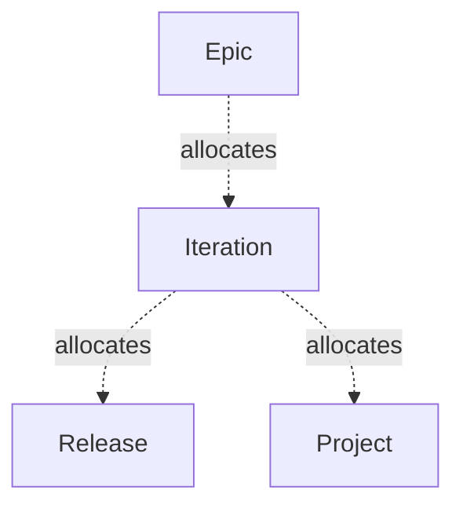

*Created: 2026-03-17 · Modified: 2026-03-26 · Creator: @rcasteran*

---

### Exchange - 3SE


> Output made of one or more flows that is produced by an activity and consumed by another activity.

| Relation | Terms |
|---|---|
| Related | [activity-3se-069b48ef5cd47253](https://www.3se.info/3se-onto/terms/activity-3se-069b48ef5cd47253), [situation-3se-069c1b6f06b27ce9](https://www.3se.info/3se-onto/terms/situation-3se-069c1b6f06b27ce9) |
| Superclass of | [information-3se-069bc4ea53337e0e](https://www.3se.info/3se-onto/terms/information-3se-069bc4ea53337e0e) |
| Close match | [operational-interaction-arcadia-2023-069bc4ea533d7044](https://www.3se.info/3se-onto/terms/operational-interaction-arcadia-2023-069bc4ea533d7044) |
| Composed of | [system-element-3se-069b85f238fb79eb](https://www.3se.info/3se-onto/terms/system-element-3se-069b85f238fb79eb) |
| Allocated by | [flow-3se-069bc4ea53207933](https://www.3se.info/3se-onto/terms/flow-3se-069bc4ea53207933) |

*Created: 2026-03-19 · Modified: 2026-04-01 · Creator: @rcasteran*

---

### Failure - 3SE


> Termination of the ability of a system to perform a function as specified due to a fault.

| Relation | Terms |
|---|---|
| Related | [fault-3se-069bb0f6e7f77cb3](https://www.3se.info/3se-onto/terms/fault-3se-069bb0f6e7f77cb3), [function-3se-069b48ef5d187435](https://www.3se.info/3se-onto/terms/function-3se-069b48ef5d187435), [hazard-3se-069bb0a752de7917](https://www.3se.info/3se-onto/terms/hazard-3se-069bb0a752de7917), [safety-system-function-3se-069b85f238b97282](https://www.3se.info/3se-onto/terms/safety-system-function-3se-069b85f238b97282), [system-3se-069b85f238f3792d](https://www.3se.info/3se-onto/terms/system-3se-069b85f238f3792d), [safety-hardware-function-3se-069bdc8804d574d2](https://www.3se.info/3se-onto/terms/safety-hardware-function-3se-069bdc8804d574d2), [safety-software-function-3se-069bdc8804ed70bf](https://www.3se.info/3se-onto/terms/safety-software-function-3se-069bdc8804ed70bf) |
| Close match | [failure-26262-1-2018-069bb0f6e7d079d7](https://www.3se.info/3se-onto/terms/failure-26262-1-2018-069bb0f6e7d079d7) |

*Created: 2026-03-18 · Modified: 2026-04-13 · Creator: @rcasteran*

---

### Fault - 3SE


> Abnormal condition of a physical element that can cause a system to fail.

| Relation | Terms |
|---|---|
| Related | [failure-3se-069bb0f6e7e675e8](https://www.3se.info/3se-onto/terms/failure-3se-069bb0f6e7e675e8), [system-3se-069b85f238f3792d](https://www.3se.info/3se-onto/terms/system-3se-069b85f238f3792d), [physical-element-3se-069b9d2c8dce7f9b](https://www.3se.info/3se-onto/terms/physical-element-3se-069b9d2c8dce7f9b) |
| Narrow match | [fault-26262-1-2018-069bb0f6e7ef785b](https://www.3se.info/3se-onto/terms/fault-26262-1-2018-069bb0f6e7ef785b) |

*Created: 2026-03-18 · Modified: 2026-04-03 · Creator: @rcasteran*

---

### Feature - 3SE


> A Feature represents a set of cohesive functions that delivers value by achieving a stakeholder's goal, is evaluated against some acceptance criteria, and is delivered in a release.

| Relation | Terms |
|---|---|
| Related | [acceptance-3se-069b5a9129b27d3e](https://www.3se.info/3se-onto/terms/acceptance-3se-069b5a9129b27d3e), [feature-analysis-3se-069b9d2c8d747c84](https://www.3se.info/3se-onto/terms/feature-analysis-3se-069b9d2c8d747c84), [functional-req-3se-069b88438050789a](https://www.3se.info/3se-onto/terms/functional-req-3se-069b88438050789a), [goal-analysis-3se-069b9d2c8da575a4](https://www.3se.info/3se-onto/terms/goal-analysis-3se-069b9d2c8da575a4), [operational-analysis-3se-069b9d2c8dbe721c](https://www.3se.info/3se-onto/terms/operational-analysis-3se-069b9d2c8dbe721c), [product-analysis-3se-069b9d2c8dd77a8d](https://www.3se.info/3se-onto/terms/product-analysis-3se-069b9d2c8dd77a8d), [release-analysis-3se-069b9d2c8de871b3](https://www.3se.info/3se-onto/terms/release-analysis-3se-069b9d2c8de871b3), [release-3se-069b48ef5d6a7595](https://www.3se.info/3se-onto/terms/release-3se-069b48ef5d6a7595), [stakeholder-3se-069bc40b97d97d03](https://www.3se.info/3se-onto/terms/stakeholder-3se-069bc40b97d97d03), [product-breakdown-structure-3se-069c01ba91ef747d](https://www.3se.info/3se-onto/terms/product-breakdown-structure-3se-069c01ba91ef747d), [holism-3se-069c316c19067fbe](https://www.3se.info/3se-onto/terms/holism-3se-069c316c19067fbe), [interdependence-analysis-3se-069c316c191c7780](https://www.3se.info/3se-onto/terms/interdependence-analysis-3se-069c316c191c7780), [service-analysis-3se-069c5aee69fd7eeb](https://www.3se.info/3se-onto/terms/service-analysis-3se-069c5aee69fd7eeb), [service-breakdown-structure-3se-069c5aee6a067e93](https://www.3se.info/3se-onto/terms/service-breakdown-structure-3se-069c5aee6a067e93), [service-level-agreement-3se-069c5aee6a2a7ae1](https://www.3se.info/3se-onto/terms/service-level-agreement-3se-069c5aee6a2a7ae1), [feature-breakdown-structure-3se-069c96f861447442](https://www.3se.info/3se-onto/terms/feature-breakdown-structure-3se-069c96f861447442), [goal-breakdown-structure-3se-069c96f8615f7b6a](https://www.3se.info/3se-onto/terms/goal-breakdown-structure-3se-069c96f8615f7b6a), [safety-hardware-feature-3se-069c058ef4e6774e](https://www.3se.info/3se-onto/terms/safety-hardware-feature-3se-069c058ef4e6774e), [safety-software-feature-3se-069c058ef4f372bc](https://www.3se.info/3se-onto/terms/safety-software-feature-3se-069c058ef4f372bc), [security-hardware-feature-3se-069c058ef5007083](https://www.3se.info/3se-onto/terms/security-hardware-feature-3se-069c058ef5007083), [conceptual-model-3se-069d3d5560bf7635](https://www.3se.info/3se-onto/terms/conceptual-model-3se-069d3d5560bf7635), [model-3se-069d3d5560f07cc9](https://www.3se.info/3se-onto/terms/model-3se-069d3d5560f07cc9), [value-3se-069d52ba2c5171d4](https://www.3se.info/3se-onto/terms/value-3se-069d52ba2c5171d4), [stakeholder-req-breakdown-structure-3se-069da425d0607787](https://www.3se.info/3se-onto/terms/stakeholder-req-breakdown-structure-3se-069da425d0607787), [function-3se-069b48ef5d187435](https://www.3se.info/3se-onto/terms/function-3se-069b48ef5d187435), [safety-system-feature-3se-069ab4192b867336](https://www.3se.info/3se-onto/terms/safety-system-feature-3se-069ab4192b867336), [security-software-feature-3se-069c058ef50c77bb](https://www.3se.info/3se-onto/terms/security-software-feature-3se-069c058ef50c77bb), [security-system-feature-3se-069ab4192b977269](https://www.3se.info/3se-onto/terms/security-system-feature-3se-069ab4192b977269), [stakeholder-req-analysis-3se-069b9d2c8df07af5](https://www.3se.info/3se-onto/terms/stakeholder-req-analysis-3se-069b9d2c8df07af5) |
| Superclass of | [hardware-feature-3se-069c058ef4b77346](https://www.3se.info/3se-onto/terms/hardware-feature-3se-069c058ef4b77346), [software-feature-3se-069c058ef5187d78](https://www.3se.info/3se-onto/terms/software-feature-3se-069c058ef5187d78), [system-feature-3se-069da52308aa7bcf](https://www.3se.info/3se-onto/terms/system-feature-3se-069da52308aa7bcf) |
| Close match | [feature-safe-6-0-069a9f3e92177c2b](https://www.3se.info/3se-onto/terms/feature-safe-6-0-069a9f3e92177c2b) |
| Allocates | [goal-3se-069b48ef5d2171ed](https://www.3se.info/3se-onto/terms/goal-3se-069b48ef5d2171ed), [stakeholder-functional-req-3se-069bdc88051177e5](https://www.3se.info/3se-onto/terms/stakeholder-functional-req-3se-069bdc88051177e5), [stakeholder-non-functional-req-3se-069bdc88051a751e](https://www.3se.info/3se-onto/terms/stakeholder-non-functional-req-3se-069bdc88051a751e), [stakeholder-constraint-3se-069bdc8805087d03](https://www.3se.info/3se-onto/terms/stakeholder-constraint-3se-069bdc8805087d03) |
| Can be | [high-level-feature-3se-069c96f861687327](https://www.3se.info/3se-onto/terms/high-level-feature-3se-069c96f861687327) |

*Created: 2026-03-13 · Modified: 2026-04-13 · Creator: @rcasteran*

---

### Feature analysis - 3SE


> Analysis of the goal to determine what feature is contributing to it.

| Relation | Terms |
|---|---|
| Related | [feature-3se-069b48ef5d0f7505](https://www.3se.info/3se-onto/terms/feature-3se-069b48ef5d0f7505), [goal-3se-069b48ef5d2171ed](https://www.3se.info/3se-onto/terms/goal-3se-069b48ef5d2171ed), [feature-breakdown-structure-3se-069c96f861447442](https://www.3se.info/3se-onto/terms/feature-breakdown-structure-3se-069c96f861447442), [feature-model-3se-069d3f26ae067509](https://www.3se.info/3se-onto/terms/feature-model-3se-069d3f26ae067509) |
| Subclass of | [analysis-3se-069b5a9129c37ebe](https://www.3se.info/3se-onto/terms/analysis-3se-069b5a9129c37ebe) |

**Allocations**

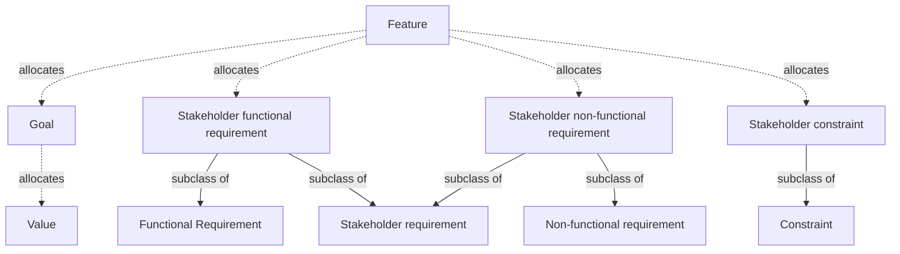

*Created: 2026-03-17 · Modified: 2026-04-06 · Creator: @rcasteran*

---

### Feature breakdown structure - 3SE


> Breakdown structure of the feature that supports the feature analysis by following the principles below:
(1) A high level feature is composed of at least two features.
(2) A feature can be an high level feature.
(3) A feature allocates a goal.
Note: principle (3) excludes principle (2)

| Relation | Terms |
|---|---|
| Related | [feature-3se-069b48ef5d0f7505](https://www.3se.info/3se-onto/terms/feature-3se-069b48ef5d0f7505), [goal-3se-069b48ef5d2171ed](https://www.3se.info/3se-onto/terms/goal-3se-069b48ef5d2171ed), [high-level-feature-3se-069c96f861687327](https://www.3se.info/3se-onto/terms/high-level-feature-3se-069c96f861687327), [feature-analysis-3se-069b9d2c8d747c84](https://www.3se.info/3se-onto/terms/feature-analysis-3se-069b9d2c8d747c84), [feature-model-3se-069d3f26ae067509](https://www.3se.info/3se-onto/terms/feature-model-3se-069d3f26ae067509) |
| Subclass of | [breakdown-structure-3se-069d166fa9037b67](https://www.3se.info/3se-onto/terms/breakdown-structure-3se-069d166fa9037b67) |

**Structure**

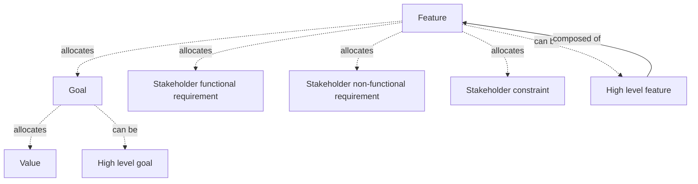

*Created: 2026-03-29 · Modified: 2026-04-06 · Creator: @rcasteran*

---

### Feature model - 3SE


> Conceptual model which represents the feature analysis based on the feature breakdown structure.

| Relation | Terms |
|---|---|
| Related | [feature-analysis-3se-069b9d2c8d747c84](https://www.3se.info/3se-onto/terms/feature-analysis-3se-069b9d2c8d747c84), [feature-breakdown-structure-3se-069c96f861447442](https://www.3se.info/3se-onto/terms/feature-breakdown-structure-3se-069c96f861447442) |
| Subclass of | [conceptual-model-3se-069d3d5560bf7635](https://www.3se.info/3se-onto/terms/conceptual-model-3se-069d3d5560bf7635) |

*Created: 2026-04-06 · Modified: 2026-04-06 · Creator: @rcasteran*

---

### Flow - 3SE


> Output produced by a function and consumed by another function.

| Relation | Terms |
|---|---|
| Related | [function-3se-069b48ef5d187435](https://www.3se.info/3se-onto/terms/function-3se-069b48ef5d187435), [hardware-interface-3se-069bd66fb6017920](https://www.3se.info/3se-onto/terms/hardware-interface-3se-069bd66fb6017920), [physical-interface-3se-069bd66fb639714a](https://www.3se.info/3se-onto/terms/physical-interface-3se-069bd66fb639714a), [software-interface-3se-069bd66fb64b7c7c](https://www.3se.info/3se-onto/terms/software-interface-3se-069bd66fb64b7c7c), [system-interface-3se-069bd66fb6547971](https://www.3se.info/3se-onto/terms/system-interface-3se-069bd66fb6547971), [system-element-interface-3se-069cd5b860d1741a](https://www.3se.info/3se-onto/terms/system-element-interface-3se-069cd5b860d1741a), [software-component-interface-3se-069dc11872d97b8a](https://www.3se.info/3se-onto/terms/software-component-interface-3se-069dc11872d97b8a), [hardware-block-interface-3se-069dc15cd0dc7340](https://www.3se.info/3se-onto/terms/hardware-block-interface-3se-069dc15cd0dc7340), [functional-architecture-3se-069b9d2c8d957426](https://www.3se.info/3se-onto/terms/functional-architecture-3se-069b9d2c8d957426) |
| Superclass of | [data-3se-069bc4ea52e671c7](https://www.3se.info/3se-onto/terms/data-3se-069bc4ea52e671c7) |
| Close match | [functional-exchange-arcadia-2023-069bc4ea532a72d7](https://www.3se.info/3se-onto/terms/functional-exchange-arcadia-2023-069bc4ea532a72d7) |
| Allocates | [exchange-3se-069bc4ea5316749f](https://www.3se.info/3se-onto/terms/exchange-3se-069bc4ea5316749f), [flow-attribute-3se-069dcf9369937bc7](https://www.3se.info/3se-onto/terms/flow-attribute-3se-069dcf9369937bc7) |
| Allocated by | [functional-interface-3se-069bc53af258726b](https://www.3se.info/3se-onto/terms/functional-interface-3se-069bc53af258726b) |

*Created: 2026-03-19 · Modified: 2026-04-14 · Creator: @rcasteran*

---

### Flow attribute - 3SE


> Attribute of a flow.

| Relation | Terms |
|---|---|
| Related | [stakeholder-req-breakdown-structure-3se-069da425d0607787](https://www.3se.info/3se-onto/terms/stakeholder-req-breakdown-structure-3se-069da425d0607787) |
| Subclass of | [attribute-3se-069b72bee1327dcf](https://www.3se.info/3se-onto/terms/attribute-3se-069b72bee1327dcf) |
| Allocates | [system-non-functional-req-3se-069be64e18a67d6e](https://www.3se.info/3se-onto/terms/system-non-functional-req-3se-069be64e18a67d6e) |
| Allocated by | [flow-3se-069bc4ea53207933](https://www.3se.info/3se-onto/terms/flow-3se-069bc4ea53207933) |

*Created: 2026-04-13 · Modified: 2026-04-13 · Creator: @rcasteran*

---

### Function - 3SE


> A transformation of incoming flows to outgoing flows, by means of some mechanisms, and subject to certain controls.

| Relation | Terms |
|---|---|
| Related | [failure-3se-069bb0f6e7e675e8](https://www.3se.info/3se-onto/terms/failure-3se-069bb0f6e7e675e8), [flow-3se-069bc4ea53207933](https://www.3se.info/3se-onto/terms/flow-3se-069bc4ea53207933), [software-3se-069bb0a752e7712e](https://www.3se.info/3se-onto/terms/software-3se-069bb0a752e7712e), [mechanism-3se-069c316c1925769b](https://www.3se.info/3se-onto/terms/mechanism-3se-069c316c1925769b), [feature-3se-069b48ef5d0f7505](https://www.3se.info/3se-onto/terms/feature-3se-069b48ef5d0f7505) |
| Superclass of | [enabling-function-3se-069c06710282799a](https://www.3se.info/3se-onto/terms/enabling-function-3se-069c06710282799a), [hardware-block-function-3se-069dc0c1181373be](https://www.3se.info/3se-onto/terms/hardware-block-function-3se-069dc0c1181373be), [hardware-component-function-3se-069dc0c118257eea](https://www.3se.info/3se-onto/terms/hardware-component-function-3se-069dc0c118257eea), [hardware-function-3se-069be64e184f7488](https://www.3se.info/3se-onto/terms/hardware-function-3se-069be64e184f7488), [software-component-function-3se-069dc076d3e579da](https://www.3se.info/3se-onto/terms/software-component-function-3se-069dc076d3e579da), [software-function-3se-069be64e18717acd](https://www.3se.info/3se-onto/terms/software-function-3se-069be64e18717acd), [software-unit-function-3se-069dc076d3ee71b8](https://www.3se.info/3se-onto/terms/software-unit-function-3se-069dc076d3ee71b8), [system-element-function-3se-069c995b151972b2](https://www.3se.info/3se-onto/terms/system-element-function-3se-069c995b151972b2), [system-function-3se-069be64e18947ea8](https://www.3se.info/3se-onto/terms/system-function-3se-069be64e18947ea8) |
| Close match | [function-24765-2017-069ab4000af473aa](https://www.3se.info/3se-onto/terms/function-24765-2017-069ab4000af473aa) |
| Allocated by | [state-3se-069b48ef5d787fea](https://www.3se.info/3se-onto/terms/state-3se-069b48ef5d787fea) |

*Created: 2026-03-13 · Modified: 2026-04-16 · Creator: @rcasteran*

---

### Functional architecture - 3SE


> Analysis of the system function to determine:
(1) what system states of a functional element are activating it.
(2) what functional interface of a functional element is allocating its consumed flows and its produced flows.

| Relation | Terms |
|---|---|
| Related | [functional-element-3se-069b9d2c8d9d7504](https://www.3se.info/3se-onto/terms/functional-element-3se-069b9d2c8d9d7504), [system-state-breakdown-structure-3se-069c062b365f7e5d](https://www.3se.info/3se-onto/terms/system-state-breakdown-structure-3se-069c062b365f7e5d), [functional-architecture-model-3se-069d3f26ae167abc](https://www.3se.info/3se-onto/terms/functional-architecture-model-3se-069d3f26ae167abc), [functional-element-breakdown-structure-3se-069c03f8a40b7253](https://www.3se.info/3se-onto/terms/functional-element-breakdown-structure-3se-069c03f8a40b7253), [system-state-3se-069c98e0564a72af](https://www.3se.info/3se-onto/terms/system-state-3se-069c98e0564a72af), [system-function-3se-069be64e18947ea8](https://www.3se.info/3se-onto/terms/system-function-3se-069be64e18947ea8), [flow-3se-069bc4ea53207933](https://www.3se.info/3se-onto/terms/flow-3se-069bc4ea53207933), [functional-interface-3se-069bc53af258726b](https://www.3se.info/3se-onto/terms/functional-interface-3se-069bc53af258726b) |
| Subclass of | [analysis-3se-069b5a9129c37ebe](https://www.3se.info/3se-onto/terms/analysis-3se-069b5a9129c37ebe) |
| Related match | [functional-architecture-24765-2017-069b9d2c8d8d723e](https://www.3se.info/3se-onto/terms/functional-architecture-24765-2017-069b9d2c8d8d723e) |

**Allocations**

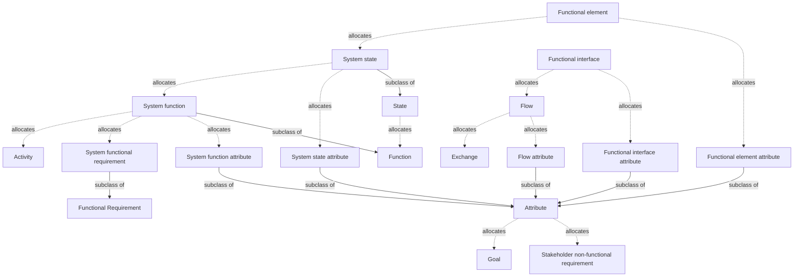

*Created: 2026-03-17 · Modified: 2026-04-14 · Creator: @rcasteran*

---

### Functional architecture model - 3SE


> Conceptual model which represents the functional architecture based on the functional element breakdown structure and the system state breakdown structure.

| Relation | Terms |
|---|---|
| Related | [functional-architecture-3se-069b9d2c8d957426](https://www.3se.info/3se-onto/terms/functional-architecture-3se-069b9d2c8d957426), [functional-element-breakdown-structure-3se-069c03f8a40b7253](https://www.3se.info/3se-onto/terms/functional-element-breakdown-structure-3se-069c03f8a40b7253), [system-state-breakdown-structure-3se-069c062b365f7e5d](https://www.3se.info/3se-onto/terms/system-state-breakdown-structure-3se-069c062b365f7e5d) |
| Subclass of | [conceptual-model-3se-069d3d5560bf7635](https://www.3se.info/3se-onto/terms/conceptual-model-3se-069d3d5560bf7635) |

*Created: 2026-04-06 · Modified: 2026-04-12 · Creator: @rcasteran*

---

### Functional element - 3SE


> Part of a system element responsible for carrying out some of the system functions, by interacting with other functional elements of the system and/or enabling functional elements and/or actors.

| Relation | Terms |
|---|---|
| Related | [enabling-functional-element-3se-069b9d2c8d4a7d97](https://www.3se.info/3se-onto/terms/enabling-functional-element-3se-069b9d2c8d4a7d97), [functional-architecture-3se-069b9d2c8d957426](https://www.3se.info/3se-onto/terms/functional-architecture-3se-069b9d2c8d957426), [physical-architecture-3se-069b9d2c8dc67374](https://www.3se.info/3se-onto/terms/physical-architecture-3se-069b9d2c8dc67374), [system-3se-069b85f238f3792d](https://www.3se.info/3se-onto/terms/system-3se-069b85f238f3792d), [system-element-3se-069b85f238fb79eb](https://www.3se.info/3se-onto/terms/system-element-3se-069b85f238fb79eb), [functional-element-breakdown-structure-3se-069c03f8a40b7253](https://www.3se.info/3se-onto/terms/functional-element-breakdown-structure-3se-069c03f8a40b7253), [physical-element-breakdown-structure-3se-069c03464b5670d2](https://www.3se.info/3se-onto/terms/physical-element-breakdown-structure-3se-069c03464b5670d2), [actor-3se-069c1a2fb8cb746f](https://www.3se.info/3se-onto/terms/actor-3se-069c1a2fb8cb746f), [system-function-3se-069be64e18947ea8](https://www.3se.info/3se-onto/terms/system-function-3se-069be64e18947ea8) |
| Superclass of | [safety-functional-element-3se-069d95f51fa47c45](https://www.3se.info/3se-onto/terms/safety-functional-element-3se-069d95f51fa47c45), [security-functional-element-3se-069d95f51fc374c7](https://www.3se.info/3se-onto/terms/security-functional-element-3se-069d95f51fc374c7) |
| Close match | [behavioral-component-arcadia-2023-069b9d2c8d277fda](https://www.3se.info/3se-onto/terms/behavioral-component-arcadia-2023-069b9d2c8d277fda) |
| Allocates | [system-state-3se-069c98e0564a72af](https://www.3se.info/3se-onto/terms/system-state-3se-069c98e0564a72af), [functional-element-attribute-3se-069dcf93699c7864](https://www.3se.info/3se-onto/terms/functional-element-attribute-3se-069dcf93699c7864) |
| Can be | [high-level-functional-element-3se-069c03f8a41e7206](https://www.3se.info/3se-onto/terms/high-level-functional-element-3se-069c03f8a41e7206) |
| Exposes | [functional-interface-3se-069bc53af258726b](https://www.3se.info/3se-onto/terms/functional-interface-3se-069bc53af258726b) |
| Allocated by | [physical-element-3se-069b9d2c8dce7f9b](https://www.3se.info/3se-onto/terms/physical-element-3se-069b9d2c8dce7f9b) |

*Created: 2026-03-17 · Modified: 2026-04-13 · Creator: @rcasteran*

---

### Functional element attribute - 3SE


> Attribute of a functional element.

| Relation | Terms |
|---|---|
| Related | [stakeholder-req-breakdown-structure-3se-069da425d0607787](https://www.3se.info/3se-onto/terms/stakeholder-req-breakdown-structure-3se-069da425d0607787), [system-attribute-breakdown-structure-3se-069dcf9368c6750e](https://www.3se.info/3se-onto/terms/system-attribute-breakdown-structure-3se-069dcf9368c6750e) |
| Subclass of | [attribute-3se-069b72bee1327dcf](https://www.3se.info/3se-onto/terms/attribute-3se-069b72bee1327dcf) |
| Allocates | [system-state-attribute-3se-069dcf9369d1703c](https://www.3se.info/3se-onto/terms/system-state-attribute-3se-069dcf9369d1703c), [system-non-functional-req-3se-069be64e18a67d6e](https://www.3se.info/3se-onto/terms/system-non-functional-req-3se-069be64e18a67d6e) |
| Allocated by | [functional-element-3se-069b9d2c8d9d7504](https://www.3se.info/3se-onto/terms/functional-element-3se-069b9d2c8d9d7504), [physical-element-attribute-3se-069e3c5af9167fb3](https://www.3se.info/3se-onto/terms/physical-element-attribute-3se-069e3c5af9167fb3) |

*Created: 2026-04-13 · Modified: 2026-04-18 · Creator: @rcasteran*

---

### Functional element breakdown structure - 3SE


> Breakdown structure of the functional element that supports the functional architecture by following the principles below:
(1) A high level functional element is composed of at least two functional elements.
(2) A high level functional element allocates at least one high level system state.
(3) A functional element allocates at least one system state.
(4) A functional element can be a high level functional element.

| Relation | Terms |
|---|---|
| Related | [functional-element-3se-069b9d2c8d9d7504](https://www.3se.info/3se-onto/terms/functional-element-3se-069b9d2c8d9d7504), [high-level-functional-element-3se-069c03f8a41e7206](https://www.3se.info/3se-onto/terms/high-level-functional-element-3se-069c03f8a41e7206), [high-level-system-state-3se-069c062b3637735e](https://www.3se.info/3se-onto/terms/high-level-system-state-3se-069c062b3637735e), [functional-architecture-3se-069b9d2c8d957426](https://www.3se.info/3se-onto/terms/functional-architecture-3se-069b9d2c8d957426), [functional-architecture-model-3se-069d3f26ae167abc](https://www.3se.info/3se-onto/terms/functional-architecture-model-3se-069d3f26ae167abc), [system-state-3se-069c98e0564a72af](https://www.3se.info/3se-onto/terms/system-state-3se-069c98e0564a72af) |
| Subclass of | [breakdown-structure-3se-069d166fa9037b67](https://www.3se.info/3se-onto/terms/breakdown-structure-3se-069d166fa9037b67) |

**Structure**

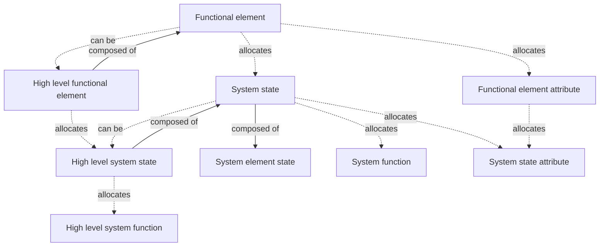

*Created: 2026-03-22 · Modified: 2026-04-12 · Creator: @rcasteran*

---

### Functional interface - 3SE


> Part of a system element interface responsible for carrying out some of the flows that are exchanged with other functional elements of the system and/or enabling functional elements and/or actors.

| Relation | Terms |
|---|---|
| Related | [system-3se-069b85f238f3792d](https://www.3se.info/3se-onto/terms/system-3se-069b85f238f3792d), [system-element-interface-3se-069cd5b860d1741a](https://www.3se.info/3se-onto/terms/system-element-interface-3se-069cd5b860d1741a), [functional-architecture-3se-069b9d2c8d957426](https://www.3se.info/3se-onto/terms/functional-architecture-3se-069b9d2c8d957426), [physical-architecture-3se-069b9d2c8dc67374](https://www.3se.info/3se-onto/terms/physical-architecture-3se-069b9d2c8dc67374) |
| Related match | [behavioral-port-arcadia-2023-069bc53af24b724a](https://www.3se.info/3se-onto/terms/behavioral-port-arcadia-2023-069bc53af24b724a) |
| Allocates | [flow-3se-069bc4ea53207933](https://www.3se.info/3se-onto/terms/flow-3se-069bc4ea53207933), [functional-interface-attribute-3se-069dcf9369a571e6](https://www.3se.info/3se-onto/terms/functional-interface-attribute-3se-069dcf9369a571e6) |
| Allocated by | [physical-interface-3se-069bd66fb639714a](https://www.3se.info/3se-onto/terms/physical-interface-3se-069bd66fb639714a) |

*Created: 2026-03-19 · Modified: 2026-04-14 · Creator: @rcasteran*

---

### Functional interface attribute - 3SE


> Attribute of a functional interface.

| Relation | Terms |
|---|---|
| Related | [stakeholder-req-breakdown-structure-3se-069da425d0607787](https://www.3se.info/3se-onto/terms/stakeholder-req-breakdown-structure-3se-069da425d0607787) |
| Subclass of | [attribute-3se-069b72bee1327dcf](https://www.3se.info/3se-onto/terms/attribute-3se-069b72bee1327dcf) |
| Allocates | [system-non-functional-req-3se-069be64e18a67d6e](https://www.3se.info/3se-onto/terms/system-non-functional-req-3se-069be64e18a67d6e) |
| Allocated by | [functional-interface-3se-069bc53af258726b](https://www.3se.info/3se-onto/terms/functional-interface-3se-069bc53af258726b) |

*Created: 2026-04-13 · Modified: 2026-04-13 · Creator: @rcasteran*

---

### Functional Requirement - 3SE


> Requirement concerning the feature that shall be realized by the solution.

| Relation | Terms |
|---|---|
| Related | [feature-3se-069b48ef5d0f7505](https://www.3se.info/3se-onto/terms/feature-3se-069b48ef5d0f7505), [constraint-3se-069b8843802f7569](https://www.3se.info/3se-onto/terms/constraint-3se-069b8843802f7569), [solution-3se-069bc40b97cf7f18](https://www.3se.info/3se-onto/terms/solution-3se-069bc40b97cf7f18), [safety-hardware-non-functional-req-3se-069bdc3120bb78da](https://www.3se.info/3se-onto/terms/safety-hardware-non-functional-req-3se-069bdc3120bb78da), [safety-software-non-functional-req-3se-069bdc3120d47249](https://www.3se.info/3se-onto/terms/safety-software-non-functional-req-3se-069bdc3120d47249), [safety-system-non-functional-req-3se-069bdc3120ee7a1c](https://www.3se.info/3se-onto/terms/safety-system-non-functional-req-3se-069bdc3120ee7a1c), [security-hardware-non-functional-req-3se-069bdc3121117d6c](https://www.3se.info/3se-onto/terms/security-hardware-non-functional-req-3se-069bdc3121117d6c), [security-software-non-functional-req-3se-069bdc31212b77bd](https://www.3se.info/3se-onto/terms/security-software-non-functional-req-3se-069bdc31212b77bd), [security-system-non-functional-req-3se-069bdc31214573e2](https://www.3se.info/3se-onto/terms/security-system-non-functional-req-3se-069bdc31214573e2), [stakeholder-non-functional-req-3se-069bdc88051a751e](https://www.3se.info/3se-onto/terms/stakeholder-non-functional-req-3se-069bdc88051a751e), [hardware-non-functional-req-3se-069be64e186075ed](https://www.3se.info/3se-onto/terms/hardware-non-functional-req-3se-069be64e186075ed), [software-non-functional-req-3se-069be64e18827c2c](https://www.3se.info/3se-onto/terms/software-non-functional-req-3se-069be64e18827c2c), [system-non-functional-req-3se-069be64e18a67d6e](https://www.3se.info/3se-onto/terms/system-non-functional-req-3se-069be64e18a67d6e), [stakeholder-req-breakdown-structure-3se-069da425d0607787](https://www.3se.info/3se-onto/terms/stakeholder-req-breakdown-structure-3se-069da425d0607787) |
| Subclass of | [requirement-3se-069b48ef5d727ceb](https://www.3se.info/3se-onto/terms/requirement-3se-069b48ef5d727ceb) |
| Superclass of | [hardware-functional-req-3se-069be64e18587020](https://www.3se.info/3se-onto/terms/hardware-functional-req-3se-069be64e18587020), [safety-hardware-functional-req-3se-069bdc3120b37468](https://www.3se.info/3se-onto/terms/safety-hardware-functional-req-3se-069bdc3120b37468), [safety-software-functional-req-3se-069bdc3120cb7dbe](https://www.3se.info/3se-onto/terms/safety-software-functional-req-3se-069bdc3120cb7dbe), [safety-system-functional-req-3se-069bdc3120e57dc8](https://www.3se.info/3se-onto/terms/safety-system-functional-req-3se-069bdc3120e57dc8), [security-hardware-functional-req-3se-069bdc312109712d](https://www.3se.info/3se-onto/terms/security-hardware-functional-req-3se-069bdc312109712d), [security-software-functional-req-3se-069bdc3121227d90](https://www.3se.info/3se-onto/terms/security-software-functional-req-3se-069bdc3121227d90), [security-system-functional-req-3se-069bdc31213c7b04](https://www.3se.info/3se-onto/terms/security-system-functional-req-3se-069bdc31213c7b04), [software-functional-req-3se-069be64e18797e1b](https://www.3se.info/3se-onto/terms/software-functional-req-3se-069be64e18797e1b), [stakeholder-functional-req-3se-069bdc88051177e5](https://www.3se.info/3se-onto/terms/stakeholder-functional-req-3se-069bdc88051177e5), [system-functional-req-3se-069be64e189d7ee9](https://www.3se.info/3se-onto/terms/system-functional-req-3se-069be64e189d7ee9) |
| Related match | [functional-req-cpre-069a9faf2c977232](https://www.3se.info/3se-onto/terms/functional-req-cpre-069a9faf2c977232) |

*Created: 2026-03-16 · Modified: 2026-04-13 · Creator: @rcasteran*

---

### Goal - 3SE


> Stakeholder’s description of a situation he wants to achieve thanks to a solution to be developed or the development project.

| Relation | Terms |
|---|---|
| Related | [acceptance-3se-069b5a9129b27d3e](https://www.3se.info/3se-onto/terms/acceptance-3se-069b5a9129b27d3e), [activity-3se-069b48ef5cd47253](https://www.3se.info/3se-onto/terms/activity-3se-069b48ef5cd47253), [enabling-system-3se-069b9d2c8d64720e](https://www.3se.info/3se-onto/terms/enabling-system-3se-069b9d2c8d64720e), [feature-analysis-3se-069b9d2c8d747c84](https://www.3se.info/3se-onto/terms/feature-analysis-3se-069b9d2c8d747c84), [goal-analysis-3se-069b9d2c8da575a4](https://www.3se.info/3se-onto/terms/goal-analysis-3se-069b9d2c8da575a4), [project-3se-069b48ef5d5877bf](https://www.3se.info/3se-onto/terms/project-3se-069b48ef5d5877bf), [requirement-3se-069b48ef5d727ceb](https://www.3se.info/3se-onto/terms/requirement-3se-069b48ef5d727ceb), [validation-3se-069b5a912a1a7945](https://www.3se.info/3se-onto/terms/validation-3se-069b5a912a1a7945), [solution-3se-069bc40b97cf7f18](https://www.3se.info/3se-onto/terms/solution-3se-069bc40b97cf7f18), [stakeholder-3se-069bc40b97d97d03](https://www.3se.info/3se-onto/terms/stakeholder-3se-069bc40b97d97d03), [system-3se-069b85f238f3792d](https://www.3se.info/3se-onto/terms/system-3se-069b85f238f3792d), [situation-3se-069c1b6f06b27ce9](https://www.3se.info/3se-onto/terms/situation-3se-069c1b6f06b27ce9), [teleology-3se-069c316c19527b40](https://www.3se.info/3se-onto/terms/teleology-3se-069c316c19527b40), [service-3se-069c5aee69f47c9d](https://www.3se.info/3se-onto/terms/service-3se-069c5aee69f47c9d), [feature-breakdown-structure-3se-069c96f861447442](https://www.3se.info/3se-onto/terms/feature-breakdown-structure-3se-069c96f861447442), [goal-breakdown-structure-3se-069c96f8615f7b6a](https://www.3se.info/3se-onto/terms/goal-breakdown-structure-3se-069c96f8615f7b6a), [value-analysis-3se-069d52ba2c597844](https://www.3se.info/3se-onto/terms/value-analysis-3se-069d52ba2c597844), [value-breakdown-structure-3se-069d6aadc05c7722](https://www.3se.info/3se-onto/terms/value-breakdown-structure-3se-069d6aadc05c7722), [system-attribute-analysis-3se-069dcf9368b37c5a](https://www.3se.info/3se-onto/terms/system-attribute-analysis-3se-069dcf9368b37c5a) |
| Superclass of | [safety-goal-3se-069bdc3120a277c9](https://www.3se.info/3se-onto/terms/safety-goal-3se-069bdc3120a277c9), [security-goal-3se-069bdc3120f77833](https://www.3se.info/3se-onto/terms/security-goal-3se-069bdc3120f77833) |
| Broad match | [goal-req-eng-fundamentals-2nd-ed-069a9faf2ca170d4](https://www.3se.info/3se-onto/terms/goal-req-eng-fundamentals-2nd-ed-069a9faf2ca170d4) |
| Allocates | [value-3se-069d52ba2c5171d4](https://www.3se.info/3se-onto/terms/value-3se-069d52ba2c5171d4) |
| Can be | [high-level-goal-3se-069c96f8617073e0](https://www.3se.info/3se-onto/terms/high-level-goal-3se-069c96f8617073e0) |
| Allocated by | [attribute-3se-069b72bee1327dcf](https://www.3se.info/3se-onto/terms/attribute-3se-069b72bee1327dcf), [feature-3se-069b48ef5d0f7505](https://www.3se.info/3se-onto/terms/feature-3se-069b48ef5d0f7505) |

*Created: 2026-03-13 · Modified: 2026-04-13 · Creator: @rcasteran*

---

### Goal analysis - 3SE


> Analysis of the goals to determine if they can be further decomposed into goals or allocated to a feature.

| Relation | Terms |
|---|---|
| Related | [feature-3se-069b48ef5d0f7505](https://www.3se.info/3se-onto/terms/feature-3se-069b48ef5d0f7505), [goal-3se-069b48ef5d2171ed](https://www.3se.info/3se-onto/terms/goal-3se-069b48ef5d2171ed), [systems-principles-3se-069b85f2390b7e20](https://www.3se.info/3se-onto/terms/systems-principles-3se-069b85f2390b7e20), [goal-breakdown-structure-3se-069c96f8615f7b6a](https://www.3se.info/3se-onto/terms/goal-breakdown-structure-3se-069c96f8615f7b6a), [goal-model-3se-069d3f26ae1e7e10](https://www.3se.info/3se-onto/terms/goal-model-3se-069d3f26ae1e7e10) |
| Subclass of | [analysis-3se-069b5a9129c37ebe](https://www.3se.info/3se-onto/terms/analysis-3se-069b5a9129c37ebe) |

**Allocations**


*Created: 2026-03-17 · Modified: 2026-04-06 · Creator: @rcasteran*

---

### Goal breakdown structure - 3SE


> Breakdown structure of the goal that supports the goal analysis by following the principles below:
(1) A high level goal is composed of at least two goals.
(2) A goal can be an high level goal.
(3) A goal is allocated to a feature.
Note: principle (3) excludes principle (2)

| Relation | Terms |
|---|---|
| Related | [feature-3se-069b48ef5d0f7505](https://www.3se.info/3se-onto/terms/feature-3se-069b48ef5d0f7505), [goal-3se-069b48ef5d2171ed](https://www.3se.info/3se-onto/terms/goal-3se-069b48ef5d2171ed), [high-level-goal-3se-069c96f8617073e0](https://www.3se.info/3se-onto/terms/high-level-goal-3se-069c96f8617073e0), [goal-analysis-3se-069b9d2c8da575a4](https://www.3se.info/3se-onto/terms/goal-analysis-3se-069b9d2c8da575a4), [goal-model-3se-069d3f26ae1e7e10](https://www.3se.info/3se-onto/terms/goal-model-3se-069d3f26ae1e7e10) |
| Subclass of | [breakdown-structure-3se-069d166fa9037b67](https://www.3se.info/3se-onto/terms/breakdown-structure-3se-069d166fa9037b67) |

**Structure**

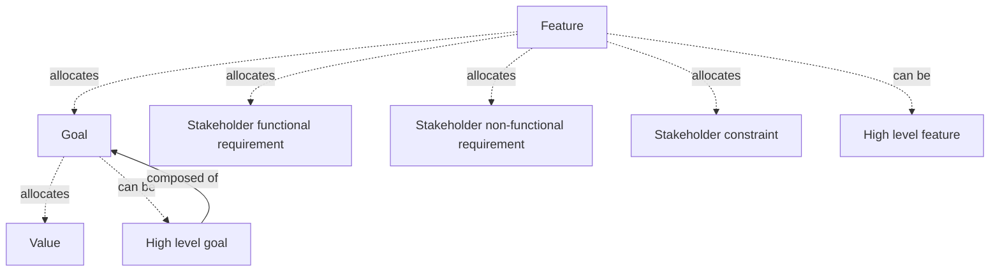

*Created: 2026-03-29 · Modified: 2026-04-06 · Creator: @rcasteran*

---

### Goal model - 3SE


> Conceptual model which represents the goal analysis based on the goal breakdown structure.

| Relation | Terms |
|---|---|
| Related | [goal-breakdown-structure-3se-069c96f8615f7b6a](https://www.3se.info/3se-onto/terms/goal-breakdown-structure-3se-069c96f8615f7b6a), [goal-analysis-3se-069b9d2c8da575a4](https://www.3se.info/3se-onto/terms/goal-analysis-3se-069b9d2c8da575a4) |
| Subclass of | [conceptual-model-3se-069d3d5560bf7635](https://www.3se.info/3se-onto/terms/conceptual-model-3se-069d3d5560bf7635) |

*Created: 2026-04-06 · Modified: 2026-04-06 · Creator: @rcasteran*

---

### Hardware - 3SE


> Physical element that is used to process, store, or transmit software or data, and that exposes hardware interfaces.

| Relation | Terms |
|---|---|
| Related | [software-3se-069bb0a752e7712e](https://www.3se.info/3se-onto/terms/software-3se-069bb0a752e7712e), [safety-hardware-constraint-3se-069bdc3120aa7eff](https://www.3se.info/3se-onto/terms/safety-hardware-constraint-3se-069bdc3120aa7eff), [safety-hardware-functional-req-3se-069bdc3120b37468](https://www.3se.info/3se-onto/terms/safety-hardware-functional-req-3se-069bdc3120b37468), [safety-hardware-non-functional-req-3se-069bdc3120bb78da](https://www.3se.info/3se-onto/terms/safety-hardware-non-functional-req-3se-069bdc3120bb78da), [security-hardware-constraint-3se-069bdc3121007939](https://www.3se.info/3se-onto/terms/security-hardware-constraint-3se-069bdc3121007939), [security-hardware-functional-req-3se-069bdc312109712d](https://www.3se.info/3se-onto/terms/security-hardware-functional-req-3se-069bdc312109712d), [security-hardware-non-functional-req-3se-069bdc3121117d6c](https://www.3se.info/3se-onto/terms/security-hardware-non-functional-req-3se-069bdc3121117d6c), [hardware-constraint-3se-069be64e18377cf1](https://www.3se.info/3se-onto/terms/hardware-constraint-3se-069be64e18377cf1), [hardware-function-3se-069be64e184f7488](https://www.3se.info/3se-onto/terms/hardware-function-3se-069be64e184f7488), [hardware-functional-req-3se-069be64e18587020](https://www.3se.info/3se-onto/terms/hardware-functional-req-3se-069be64e18587020), [hardware-non-functional-req-3se-069be64e186075ed](https://www.3se.info/3se-onto/terms/hardware-non-functional-req-3se-069be64e186075ed), [hardware-breakdown-structure-3se-069dc0c1181c7f71](https://www.3se.info/3se-onto/terms/hardware-breakdown-structure-3se-069dc0c1181c7f71), [software-interface-3se-069bd66fb64b7c7c](https://www.3se.info/3se-onto/terms/software-interface-3se-069bd66fb64b7c7c), [hardware-interface-breakdown-structure-3se-069dc15cd1067235](https://www.3se.info/3se-onto/terms/hardware-interface-breakdown-structure-3se-069dc15cd1067235), [hardware-architecture-3se-069cfeb60f3b7516](https://www.3se.info/3se-onto/terms/hardware-architecture-3se-069cfeb60f3b7516) |
| Subclass of | [physical-element-3se-069b9d2c8dce7f9b](https://www.3se.info/3se-onto/terms/physical-element-3se-069b9d2c8dce7f9b) |
| Superclass of | [safety-hardware-3se-069d96aa1e8a705d](https://www.3se.info/3se-onto/terms/safety-hardware-3se-069d96aa1e8a705d), [security-hardware-3se-069d96aa1eb3758d](https://www.3se.info/3se-onto/terms/security-hardware-3se-069d96aa1eb3758d) |
| Narrow match | [hardware-24765-2017-069a9bc4a30f7367](https://www.3se.info/3se-onto/terms/hardware-24765-2017-069a9bc4a30f7367) |
| Composed of | [hardware-block-3se-069a9bc4a33c79b5](https://www.3se.info/3se-onto/terms/hardware-block-3se-069a9bc4a33c79b5) |
| Allocates | [hardware-state-3se-069c98e055d57d9c](https://www.3se.info/3se-onto/terms/hardware-state-3se-069c98e055d57d9c) |
| Exposes | [hardware-interface-3se-069bd66fb6017920](https://www.3se.info/3se-onto/terms/hardware-interface-3se-069bd66fb6017920) |

*Created: 2026-03-18 · Modified: 2026-04-12 · Creator: @rcasteran*

---

### Hardware architecture - 3SE


> Analysis of the hardware and its hardware state to determine what hardware blocks are realizing it.

| Relation | Terms |
|---|---|
| Related | [hardware-block-3se-069a9bc4a33c79b5](https://www.3se.info/3se-onto/terms/hardware-block-3se-069a9bc4a33c79b5), [hardware-block-breakdown-structure-3se-069dc0c117f07144](https://www.3se.info/3se-onto/terms/hardware-block-breakdown-structure-3se-069dc0c117f07144), [hardware-breakdown-structure-3se-069dc0c1181c7f71](https://www.3se.info/3se-onto/terms/hardware-breakdown-structure-3se-069dc0c1181c7f71), [hardware-state-3se-069c98e055d57d9c](https://www.3se.info/3se-onto/terms/hardware-state-3se-069c98e055d57d9c), [hardware-interface-breakdown-structure-3se-069dc15cd1067235](https://www.3se.info/3se-onto/terms/hardware-interface-breakdown-structure-3se-069dc15cd1067235), [hardware-state-breakdown-structure-3se-069dc15cd10e7f98](https://www.3se.info/3se-onto/terms/hardware-state-breakdown-structure-3se-069dc15cd10e7f98), [hardware-3se-069bb0a752d57cb1](https://www.3se.info/3se-onto/terms/hardware-3se-069bb0a752d57cb1) |
| Subclass of | [analysis-3se-069b5a9129c37ebe](https://www.3se.info/3se-onto/terms/analysis-3se-069b5a9129c37ebe) |
| Related match | [architecture-42010-2022-069cff8d0ac17a44](https://www.3se.info/3se-onto/terms/architecture-42010-2022-069cff8d0ac17a44), [architecture-26262-1-2018-069cff8d0aa87a16](https://www.3se.info/3se-onto/terms/architecture-26262-1-2018-069cff8d0aa87a16) |

**Allocations**

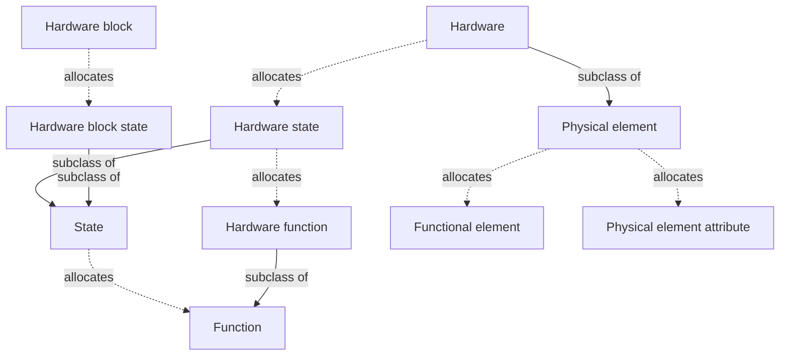

*Created: 2026-04-03 · Modified: 2026-04-12 · Creator: @rcasteran*

---

### Hardware attribute - 3SE


> Attribute of a hardware product.

| Relation | Terms |
|---|---|
| Subclass of | [attribute-3se-069b72bee1327dcf](https://www.3se.info/3se-onto/terms/attribute-3se-069b72bee1327dcf) |
| Allocated by | [hardware-product-3se-069c058ef4de7a0a](https://www.3se.info/3se-onto/terms/hardware-product-3se-069c058ef4de7a0a) |

*Created: 2026-04-13 · Modified: 2026-04-13 · Creator: @rcasteran*

---

### Hardware block - 3SE


> Functionally distinct part of a hardware, composed of at least one hardware component, and which exposes hardware block interfaces.

| Relation | Terms |
|---|---|
| Related | [hardware-architecture-3se-069cfeb60f3b7516](https://www.3se.info/3se-onto/terms/hardware-architecture-3se-069cfeb60f3b7516), [hardware-block-breakdown-structure-3se-069dc0c117f07144](https://www.3se.info/3se-onto/terms/hardware-block-breakdown-structure-3se-069dc0c117f07144), [hardware-breakdown-structure-3se-069dc0c1181c7f71](https://www.3se.info/3se-onto/terms/hardware-breakdown-structure-3se-069dc0c1181c7f71), [hardware-block-function-3se-069dc0c1181373be](https://www.3se.info/3se-onto/terms/hardware-block-function-3se-069dc0c1181373be), [hardware-interface-breakdown-structure-3se-069dc15cd1067235](https://www.3se.info/3se-onto/terms/hardware-interface-breakdown-structure-3se-069dc15cd1067235) |
| Composed of | [hardware-component-3se-069a9bc4a34678c2](https://www.3se.info/3se-onto/terms/hardware-component-3se-069a9bc4a34678c2) |
| Allocates | [hardware-block-state-3se-069dc15cd0fc7d86](https://www.3se.info/3se-onto/terms/hardware-block-state-3se-069dc15cd0fc7d86) |
| Exposes | [hardware-block-interface-3se-069dc15cd0dc7340](https://www.3se.info/3se-onto/terms/hardware-block-interface-3se-069dc15cd0dc7340) |

*Created: 2026-03-05 · Modified: 2026-04-12 · Creator: @rcasteran*

---

### Hardware block breakdown structure - 3SE


> Breakdown structure of the hardware block that supports the hardware architecture by following the principles below:
(1) A hardware block is composed of at least two hardware components.
(2) A hardware component allocates a hardware component function.

| Relation | Terms |
|---|---|
| Related | [hardware-architecture-3se-069cfeb60f3b7516](https://www.3se.info/3se-onto/terms/hardware-architecture-3se-069cfeb60f3b7516), [hardware-block-3se-069a9bc4a33c79b5](https://www.3se.info/3se-onto/terms/hardware-block-3se-069a9bc4a33c79b5), [hardware-component-3se-069a9bc4a34678c2](https://www.3se.info/3se-onto/terms/hardware-component-3se-069a9bc4a34678c2), [hardware-component-function-3se-069dc0c118257eea](https://www.3se.info/3se-onto/terms/hardware-component-function-3se-069dc0c118257eea) |
| Subclass of | [breakdown-structure-3se-069d166fa9037b67](https://www.3se.info/3se-onto/terms/breakdown-structure-3se-069d166fa9037b67) |

**Structure**

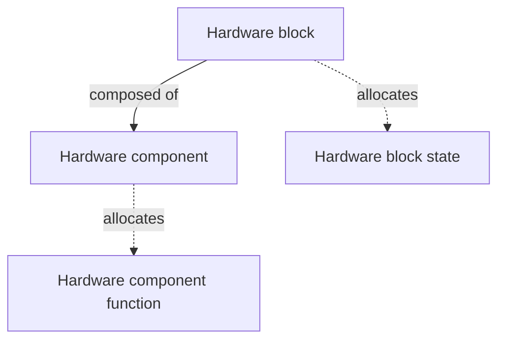

*Created: 2026-04-12 · Modified: 2026-04-12 · Creator: @rcasteran*

---

### Hardware block function - 3SE


> Function of a hardware block.

| Relation | Terms |
|---|---|
| Related | [hardware-breakdown-structure-3se-069dc0c1181c7f71](https://www.3se.info/3se-onto/terms/hardware-breakdown-structure-3se-069dc0c1181c7f71), [hardware-block-3se-069a9bc4a33c79b5](https://www.3se.info/3se-onto/terms/hardware-block-3se-069a9bc4a33c79b5), [hardware-state-breakdown-structure-3se-069dc15cd10e7f98](https://www.3se.info/3se-onto/terms/hardware-state-breakdown-structure-3se-069dc15cd10e7f98) |
| Subclass of | [function-3se-069b48ef5d187435](https://www.3se.info/3se-onto/terms/function-3se-069b48ef5d187435) |
| Composed of | [hardware-component-function-3se-069dc0c118257eea](https://www.3se.info/3se-onto/terms/hardware-component-function-3se-069dc0c118257eea) |
| Allocated by | [hardware-block-state-3se-069dc15cd0fc7d86](https://www.3se.info/3se-onto/terms/hardware-block-state-3se-069dc15cd0fc7d86) |

*Created: 2026-04-12 · Modified: 2026-04-12 · Creator: @rcasteran*

---

### Hardware block interface - 3SE


> Boundary across which two hardware blocks meet and exchange flows.

| Relation | Terms |
|---|---|
| Related | [flow-3se-069bc4ea53207933](https://www.3se.info/3se-onto/terms/flow-3se-069bc4ea53207933), [hardware-interface-breakdown-structure-3se-069dc15cd1067235](https://www.3se.info/3se-onto/terms/hardware-interface-breakdown-structure-3se-069dc15cd1067235) |
| Subclass of | [physical-interface-3se-069bd66fb639714a](https://www.3se.info/3se-onto/terms/physical-interface-3se-069bd66fb639714a) |

*Created: 2026-04-12 · Modified: 2026-04-12 · Creator: @rcasteran*

---

### Hardware block state - 3SE


> State of a hardware block.

| Relation | Terms |
|---|---|
| Related | [hardware-state-breakdown-structure-3se-069dc15cd10e7f98](https://www.3se.info/3se-onto/terms/hardware-state-breakdown-structure-3se-069dc15cd10e7f98) |
| Subclass of | [state-3se-069b48ef5d787fea](https://www.3se.info/3se-onto/terms/state-3se-069b48ef5d787fea) |
| Allocates | [hardware-block-function-3se-069dc0c1181373be](https://www.3se.info/3se-onto/terms/hardware-block-function-3se-069dc0c1181373be) |
| Allocated by | [hardware-block-3se-069a9bc4a33c79b5](https://www.3se.info/3se-onto/terms/hardware-block-3se-069a9bc4a33c79b5) |

*Created: 2026-04-12 · Modified: 2026-04-12 · Creator: @rcasteran*

---

### Hardware breakdown structure - 3SE


> Breakdown structure of the hardware that supports the hardware architecture by following the principles below:
(1) A hardware is composed of at least two hardware blocks.
(2) A hardware allocates a hardware function.
(3) A hardware block allocates a hardware block function.

| Relation | Terms |
|---|---|
| Related | [hardware-3se-069bb0a752d57cb1](https://www.3se.info/3se-onto/terms/hardware-3se-069bb0a752d57cb1), [hardware-architecture-3se-069cfeb60f3b7516](https://www.3se.info/3se-onto/terms/hardware-architecture-3se-069cfeb60f3b7516), [hardware-block-3se-069a9bc4a33c79b5](https://www.3se.info/3se-onto/terms/hardware-block-3se-069a9bc4a33c79b5), [hardware-block-function-3se-069dc0c1181373be](https://www.3se.info/3se-onto/terms/hardware-block-function-3se-069dc0c1181373be), [hardware-function-3se-069be64e184f7488](https://www.3se.info/3se-onto/terms/hardware-function-3se-069be64e184f7488) |
| Subclass of | [breakdown-structure-3se-069d166fa9037b67](https://www.3se.info/3se-onto/terms/breakdown-structure-3se-069d166fa9037b67) |

**Structure**

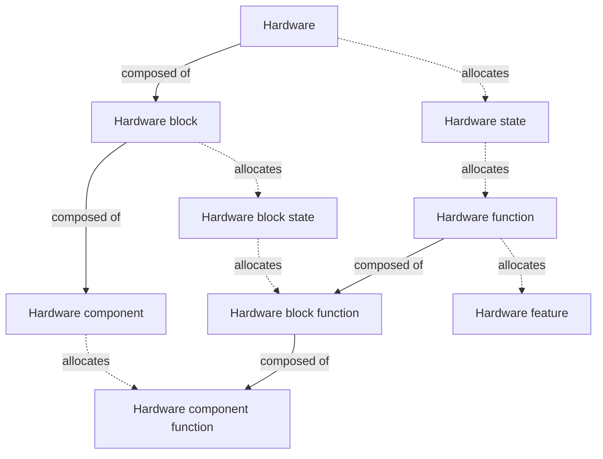

*Created: 2026-04-12 · Modified: 2026-04-12 · Creator: @rcasteran*

---

### Hardware component - 3SE


> Atomic level part of a hardware block that is subjected to electrical characterization testing.

| Relation | Terms |
|---|---|
| Related | [hardware-block-breakdown-structure-3se-069dc0c117f07144](https://www.3se.info/3se-onto/terms/hardware-block-breakdown-structure-3se-069dc0c117f07144) |
| Allocates | [hardware-component-function-3se-069dc0c118257eea](https://www.3se.info/3se-onto/terms/hardware-component-function-3se-069dc0c118257eea) |

*Created: 2026-03-05 · Modified: 2026-04-12 · Creator: @rcasteran*

---

### Hardware component function - 3SE


> Function of a hardware component.

| Relation | Terms |
|---|---|
| Related | [hardware-block-breakdown-structure-3se-069dc0c117f07144](https://www.3se.info/3se-onto/terms/hardware-block-breakdown-structure-3se-069dc0c117f07144) |
| Subclass of | [function-3se-069b48ef5d187435](https://www.3se.info/3se-onto/terms/function-3se-069b48ef5d187435) |
| Allocated by | [hardware-component-3se-069a9bc4a34678c2](https://www.3se.info/3se-onto/terms/hardware-component-3se-069a9bc4a34678c2) |

*Created: 2026-04-12 · Modified: 2026-04-12 · Creator: @rcasteran*

---

### Hardware constraint - 3SE


> Constraint about a hardware.

| Relation | Terms |
|---|---|
| Related | [hardware-3se-069bb0a752d57cb1](https://www.3se.info/3se-onto/terms/hardware-3se-069bb0a752d57cb1) |
| Subclass of | [constraint-3se-069b8843802f7569](https://www.3se.info/3se-onto/terms/constraint-3se-069b8843802f7569) |
| Superclass of | [safety-hardware-constraint-3se-069bdc3120aa7eff](https://www.3se.info/3se-onto/terms/safety-hardware-constraint-3se-069bdc3120aa7eff), [security-hardware-constraint-3se-069bdc3121007939](https://www.3se.info/3se-onto/terms/security-hardware-constraint-3se-069bdc3121007939) |

*Created: 2026-03-21 · Modified: 2026-03-21 · Creator: @rcasteran*

---

### Hardware feature - 3SE


> A feature about a hardware product.

| Relation | Terms |
|---|---|
| Subclass of | [feature-3se-069b48ef5d0f7505](https://www.3se.info/3se-onto/terms/feature-3se-069b48ef5d0f7505) |
| Superclass of | [safety-hardware-feature-3se-069c058ef4e6774e](https://www.3se.info/3se-onto/terms/safety-hardware-feature-3se-069c058ef4e6774e), [security-hardware-feature-3se-069c058ef5007083](https://www.3se.info/3se-onto/terms/security-hardware-feature-3se-069c058ef5007083) |
| Allocated by | [hardware-function-3se-069be64e184f7488](https://www.3se.info/3se-onto/terms/hardware-function-3se-069be64e184f7488), [hardware-product-3se-069c058ef4de7a0a](https://www.3se.info/3se-onto/terms/hardware-product-3se-069c058ef4de7a0a) |

*Created: 2026-03-22 · Modified: 2026-04-12 · Creator: @rcasteran*

---

### Hardware function - 3SE


> Function of a hardware.

| Relation | Terms |
|---|---|
| Related | [hardware-3se-069bb0a752d57cb1](https://www.3se.info/3se-onto/terms/hardware-3se-069bb0a752d57cb1), [hardware-breakdown-structure-3se-069dc0c1181c7f71](https://www.3se.info/3se-onto/terms/hardware-breakdown-structure-3se-069dc0c1181c7f71), [hardware-state-breakdown-structure-3se-069dc15cd10e7f98](https://www.3se.info/3se-onto/terms/hardware-state-breakdown-structure-3se-069dc15cd10e7f98) |
| Subclass of | [function-3se-069b48ef5d187435](https://www.3se.info/3se-onto/terms/function-3se-069b48ef5d187435) |
| Superclass of | [safety-hardware-function-3se-069bdc8804d574d2](https://www.3se.info/3se-onto/terms/safety-hardware-function-3se-069bdc8804d574d2), [security-hardware-function-3se-069bdc8804f67cf8](https://www.3se.info/3se-onto/terms/security-hardware-function-3se-069bdc8804f67cf8) |
| Composed of | [hardware-block-function-3se-069dc0c1181373be](https://www.3se.info/3se-onto/terms/hardware-block-function-3se-069dc0c1181373be) |
| Allocates | [hardware-feature-3se-069c058ef4b77346](https://www.3se.info/3se-onto/terms/hardware-feature-3se-069c058ef4b77346) |
| Allocated by | [hardware-state-3se-069c98e055d57d9c](https://www.3se.info/3se-onto/terms/hardware-state-3se-069c98e055d57d9c), [system-element-function-3se-069c995b151972b2](https://www.3se.info/3se-onto/terms/system-element-function-3se-069c995b151972b2) |

*Created: 2026-03-21 · Modified: 2026-04-13 · Creator: @rcasteran*

---

### Hardware functional requirement - 3SE


> Functional requirement about a hardware.

| Relation | Terms |
|---|---|
| Related | [hardware-3se-069bb0a752d57cb1](https://www.3se.info/3se-onto/terms/hardware-3se-069bb0a752d57cb1) |
| Subclass of | [functional-req-3se-069b88438050789a](https://www.3se.info/3se-onto/terms/functional-req-3se-069b88438050789a) |

*Created: 2026-03-21 · Modified: 2026-03-21 · Creator: @rcasteran*

---

### Hardware interface - 3SE


> Boundary across which two hardwares meet and exchange flows.

| Relation | Terms |
|---|---|
| Related | [flow-3se-069bc4ea53207933](https://www.3se.info/3se-onto/terms/flow-3se-069bc4ea53207933), [hardware-interface-breakdown-structure-3se-069dc15cd1067235](https://www.3se.info/3se-onto/terms/hardware-interface-breakdown-structure-3se-069dc15cd1067235) |
| Subclass of | [physical-interface-3se-069bd66fb639714a](https://www.3se.info/3se-onto/terms/physical-interface-3se-069bd66fb639714a) |
| Composed of | [hardware-block-interface-3se-069dc15cd0dc7340](https://www.3se.info/3se-onto/terms/hardware-block-interface-3se-069dc15cd0dc7340) |

*Created: 2026-03-20 · Modified: 2026-04-12 · Creator: @rcasteran*

---

### Hardware interface breakdown structure - 3SE


> Breakdown structure of the hardware interface that supports the hardware architecture by following the principles below:
(1) A hardware interface is composed of at least one hardware block interface.
(2) A hardware exposes at least one hardware interface.
(3) A hardware block exposes at least one hardware block interface.

| Relation | Terms |
|---|---|
| Related | [hardware-3se-069bb0a752d57cb1](https://www.3se.info/3se-onto/terms/hardware-3se-069bb0a752d57cb1), [hardware-architecture-3se-069cfeb60f3b7516](https://www.3se.info/3se-onto/terms/hardware-architecture-3se-069cfeb60f3b7516), [hardware-block-3se-069a9bc4a33c79b5](https://www.3se.info/3se-onto/terms/hardware-block-3se-069a9bc4a33c79b5), [hardware-block-interface-3se-069dc15cd0dc7340](https://www.3se.info/3se-onto/terms/hardware-block-interface-3se-069dc15cd0dc7340), [hardware-interface-3se-069bd66fb6017920](https://www.3se.info/3se-onto/terms/hardware-interface-3se-069bd66fb6017920) |
| Subclass of | [breakdown-structure-3se-069d166fa9037b67](https://www.3se.info/3se-onto/terms/breakdown-structure-3se-069d166fa9037b67) |

**Structure**

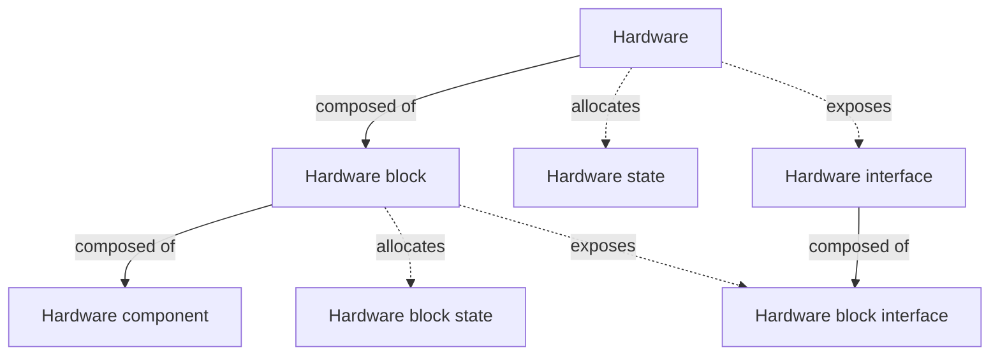

*Created: 2026-04-12 · Modified: 2026-04-12 · Creator: @rcasteran*

---

### Hardware non-functional requirement - 3SE


> Non-functional requirement about a hardware.

| Relation | Terms |
|---|---|
| Related | [functional-req-3se-069b88438050789a](https://www.3se.info/3se-onto/terms/functional-req-3se-069b88438050789a), [hardware-3se-069bb0a752d57cb1](https://www.3se.info/3se-onto/terms/hardware-3se-069bb0a752d57cb1) |
| Subclass of | [non-functional-req-3se-069b88438059727d](https://www.3se.info/3se-onto/terms/non-functional-req-3se-069b88438059727d) |

*Created: 2026-03-21 · Modified: 2026-03-21 · Creator: @rcasteran*

---

### Hardware product - 3SE


> Product that is composed of hardware only.

| Relation | Terms |
|---|---|
| Related | [safety-hardware-feature-3se-069c058ef4e6774e](https://www.3se.info/3se-onto/terms/safety-hardware-feature-3se-069c058ef4e6774e), [security-hardware-feature-3se-069c058ef5007083](https://www.3se.info/3se-onto/terms/security-hardware-feature-3se-069c058ef5007083) |
| Subclass of | [product-3se-069b48ef5d4e7ef8](https://www.3se.info/3se-onto/terms/product-3se-069b48ef5d4e7ef8) |
| Superclass of | [safety-hardware-product-3se-069c058ef4ec7f65](https://www.3se.info/3se-onto/terms/safety-hardware-product-3se-069c058ef4ec7f65), [security-hardware-product-3se-069c058ef506753d](https://www.3se.info/3se-onto/terms/security-hardware-product-3se-069c058ef506753d) |
| Composed of | [hardware-3se-069bb0a752d57cb1](https://www.3se.info/3se-onto/terms/hardware-3se-069bb0a752d57cb1) |
| Allocates | [hardware-feature-3se-069c058ef4b77346](https://www.3se.info/3se-onto/terms/hardware-feature-3se-069c058ef4b77346), [hardware-attribute-3se-069dcf9369ad79dd](https://www.3se.info/3se-onto/terms/hardware-attribute-3se-069dcf9369ad79dd) |

*Created: 2026-03-22 · Modified: 2026-04-13 · Creator: @rcasteran*

---

### Hardware state - 3SE


> State of a hardware.

| Relation | Terms |
|---|---|
| Related | [hardware-architecture-3se-069cfeb60f3b7516](https://www.3se.info/3se-onto/terms/hardware-architecture-3se-069cfeb60f3b7516), [hardware-state-breakdown-structure-3se-069dc15cd10e7f98](https://www.3se.info/3se-onto/terms/hardware-state-breakdown-structure-3se-069dc15cd10e7f98) |
| Subclass of | [state-3se-069b48ef5d787fea](https://www.3se.info/3se-onto/terms/state-3se-069b48ef5d787fea) |
| Composed of | [hardware-block-state-3se-069dc15cd0fc7d86](https://www.3se.info/3se-onto/terms/hardware-block-state-3se-069dc15cd0fc7d86) |
| Allocates | [hardware-function-3se-069be64e184f7488](https://www.3se.info/3se-onto/terms/hardware-function-3se-069be64e184f7488) |
| Allocated by | [hardware-3se-069bb0a752d57cb1](https://www.3se.info/3se-onto/terms/hardware-3se-069bb0a752d57cb1), [system-element-state-3se-069c995b153b7534](https://www.3se.info/3se-onto/terms/system-element-state-3se-069c995b153b7534) |

*Created: 2026-03-29 · Modified: 2026-04-13 · Creator: @rcasteran*

---

### Hardware state breakdown structure - 3SE


> Breakdown structure of the hardware state that supports the hardware architecture by following the principles below:
(1) A hardware state is composed of at least two hardware block states.
(2) A hardware state allocates at least one hardware function.
(3) A hardware block state allocates at least one hardware block function.

| Relation | Terms |
|---|---|
| Related | [hardware-architecture-3se-069cfeb60f3b7516](https://www.3se.info/3se-onto/terms/hardware-architecture-3se-069cfeb60f3b7516), [hardware-block-function-3se-069dc0c1181373be](https://www.3se.info/3se-onto/terms/hardware-block-function-3se-069dc0c1181373be), [hardware-block-state-3se-069dc15cd0fc7d86](https://www.3se.info/3se-onto/terms/hardware-block-state-3se-069dc15cd0fc7d86), [hardware-function-3se-069be64e184f7488](https://www.3se.info/3se-onto/terms/hardware-function-3se-069be64e184f7488), [hardware-state-3se-069c98e055d57d9c](https://www.3se.info/3se-onto/terms/hardware-state-3se-069c98e055d57d9c) |
| Subclass of | [breakdown-structure-3se-069d166fa9037b67](https://www.3se.info/3se-onto/terms/breakdown-structure-3se-069d166fa9037b67) |

**Structure**

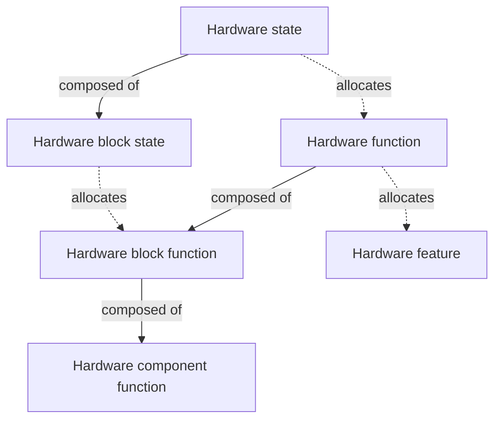

*Created: 2026-04-12 · Modified: 2026-04-12 · Creator: @rcasteran*

---

### Hazard - 3SE


> Potential source of physical injury or damage to the health of persons caused by a failure of the system of interest.

| Relation | Terms |
|---|---|
| Related | [system-3se-069b85f238f3792d](https://www.3se.info/3se-onto/terms/system-3se-069b85f238f3792d), [failure-3se-069bb0f6e7e675e8](https://www.3se.info/3se-onto/terms/failure-3se-069bb0f6e7e675e8), [safety-risk-3se-069bdd80b5e478a0](https://www.3se.info/3se-onto/terms/safety-risk-3se-069bdd80b5e478a0), [safety-risk-analysis-3se-069c1ab34ba5783e](https://www.3se.info/3se-onto/terms/safety-risk-analysis-3se-069c1ab34ba5783e), [hazardous-situation-3se-069c1b6f069e7ff8](https://www.3se.info/3se-onto/terms/hazardous-situation-3se-069c1b6f069e7ff8) |
| Close match | [hazard-26262-1-2018-069ab4192b747d7d](https://www.3se.info/3se-onto/terms/hazard-26262-1-2018-069ab4192b747d7d) |

*Created: 2026-03-18 · Modified: 2026-04-03 · Creator: @rcasteran*

---

### Hazardous situation - 3SE


> Situation in which the system of interest generates a hazard.

| Relation | Terms |
|---|---|
| Related | [hazard-3se-069bb0a752de7917](https://www.3se.info/3se-onto/terms/hazard-3se-069bb0a752de7917), [safety-risk-analysis-3se-069c1ab34ba5783e](https://www.3se.info/3se-onto/terms/safety-risk-analysis-3se-069c1ab34ba5783e), [security-risk-analysis-3se-069c1ab34bae7b50](https://www.3se.info/3se-onto/terms/security-risk-analysis-3se-069c1ab34bae7b50), [system-3se-069b85f238f3792d](https://www.3se.info/3se-onto/terms/system-3se-069b85f238f3792d) |
| Subclass of | [situation-3se-069c1b6f06b27ce9](https://www.3se.info/3se-onto/terms/situation-3se-069c1b6f06b27ce9) |
| Close match | [hazardous-event-26262-1-2018-069c1b6f069670f5](https://www.3se.info/3se-onto/terms/hazardous-event-26262-1-2018-069c1b6f069670f5) |

*Created: 2026-03-23 · Modified: 2026-04-03 · Creator: @rcasteran*

---

### High level feature - 3SE


> Combination of interacting features.

| Relation | Terms |
|---|---|
| Related | [feature-breakdown-structure-3se-069c96f861447442](https://www.3se.info/3se-onto/terms/feature-breakdown-structure-3se-069c96f861447442) |
| Composed of | [feature-3se-069b48ef5d0f7505](https://www.3se.info/3se-onto/terms/feature-3se-069b48ef5d0f7505) |

*Created: 2026-03-29 · Modified: 2026-03-29 · Creator: @rcasteran*

---

### High level functional element - 3SE


> Combination of interacting functional elements.

| Relation | Terms |
|---|---|
| Related | [functional-element-breakdown-structure-3se-069c03f8a40b7253](https://www.3se.info/3se-onto/terms/functional-element-breakdown-structure-3se-069c03f8a40b7253), [physical-element-breakdown-structure-3se-069c03464b5670d2](https://www.3se.info/3se-onto/terms/physical-element-breakdown-structure-3se-069c03464b5670d2) |
| Composed of | [functional-element-3se-069b9d2c8d9d7504](https://www.3se.info/3se-onto/terms/functional-element-3se-069b9d2c8d9d7504) |
| Allocates | [high-level-system-state-3se-069c062b3637735e](https://www.3se.info/3se-onto/terms/high-level-system-state-3se-069c062b3637735e) |
| Allocated by | [high-level-physical-element-3se-069c03464ae07399](https://www.3se.info/3se-onto/terms/high-level-physical-element-3se-069c03464ae07399) |

*Created: 2026-03-22 · Modified: 2026-04-12 · Creator: @rcasteran*

---

### High level goal - 3SE


> Combination of interacting goals.

| Relation | Terms |
|---|---|
| Related | [goal-breakdown-structure-3se-069c96f8615f7b6a](https://www.3se.info/3se-onto/terms/goal-breakdown-structure-3se-069c96f8615f7b6a) |
| Composed of | [goal-3se-069b48ef5d2171ed](https://www.3se.info/3se-onto/terms/goal-3se-069b48ef5d2171ed) |

*Created: 2026-03-29 · Modified: 2026-03-29 · Creator: @rcasteran*

---

### High level physical element - 3SE


> Combination of interacting physical elements.

| Relation | Terms |
|---|---|
| Related | [physical-element-breakdown-structure-3se-069c03464b5670d2](https://www.3se.info/3se-onto/terms/physical-element-breakdown-structure-3se-069c03464b5670d2), [system-breakdown-structure-3se-069bee1cdb507cf6](https://www.3se.info/3se-onto/terms/system-breakdown-structure-3se-069bee1cdb507cf6) |
| Composed of | [physical-element-3se-069b9d2c8dce7f9b](https://www.3se.info/3se-onto/terms/physical-element-3se-069b9d2c8dce7f9b) |
| Allocates | [high-level-functional-element-3se-069c03f8a41e7206](https://www.3se.info/3se-onto/terms/high-level-functional-element-3se-069c03f8a41e7206) |
| Allocated by | [system-3se-069b85f238f3792d](https://www.3se.info/3se-onto/terms/system-3se-069b85f238f3792d) |

*Created: 2026-03-22 · Modified: 2026-03-22 · Creator: @rcasteran*

---

### High level system function - 3SE


> Combination of interacting system functions.

| Relation | Terms |
|---|---|
| Related | [system-function-breakdown-structure-3se-069c03f8a3ee7e9d](https://www.3se.info/3se-onto/terms/system-function-breakdown-structure-3se-069c03f8a3ee7e9d), [system-state-breakdown-structure-3se-069c062b365f7e5d](https://www.3se.info/3se-onto/terms/system-state-breakdown-structure-3se-069c062b365f7e5d) |
| Composed of | [system-function-3se-069be64e18947ea8](https://www.3se.info/3se-onto/terms/system-function-3se-069be64e18947ea8) |
| Allocated by | [high-level-system-state-3se-069c062b3637735e](https://www.3se.info/3se-onto/terms/high-level-system-state-3se-069c062b3637735e) |

*Created: 2026-03-22 · Modified: 2026-04-12 · Creator: @rcasteran*

---

### High level system state - 3SE


> Combination of interacting system states.

| Relation | Terms |
|---|---|
| Related | [functional-element-breakdown-structure-3se-069c03f8a40b7253](https://www.3se.info/3se-onto/terms/functional-element-breakdown-structure-3se-069c03f8a40b7253), [system-state-breakdown-structure-3se-069c062b365f7e5d](https://www.3se.info/3se-onto/terms/system-state-breakdown-structure-3se-069c062b365f7e5d) |
| Composed of | [system-state-3se-069c98e0564a72af](https://www.3se.info/3se-onto/terms/system-state-3se-069c98e0564a72af) |
| Allocates | [high-level-system-function-3se-069c03f8a415717a](https://www.3se.info/3se-onto/terms/high-level-system-function-3se-069c03f8a415717a) |
| Allocated by | [high-level-functional-element-3se-069c03f8a41e7206](https://www.3se.info/3se-onto/terms/high-level-functional-element-3se-069c03f8a41e7206) |

*Created: 2026-03-22 · Modified: 2026-04-12 · Creator: @rcasteran*

---

### High level value - 3SE


> Combination of values.

| Relation | Terms |
|---|---|
| Related | [value-breakdown-structure-3se-069d6aadc05c7722](https://www.3se.info/3se-onto/terms/value-breakdown-structure-3se-069d6aadc05c7722) |
| Composed of | [value-3se-069d52ba2c5171d4](https://www.3se.info/3se-onto/terms/value-3se-069d52ba2c5171d4) |

*Created: 2026-04-08 · Modified: 2026-04-08 · Creator: @rcasteran*

---

### Holism - 3SE


> A system possesses emergent attributes of features that cannot be explained solely by its system elements and their interactions

| Relation | Terms |
|---|---|
| Related | [attribute-3se-069b72bee1327dcf](https://www.3se.info/3se-onto/terms/attribute-3se-069b72bee1327dcf), [feature-3se-069b48ef5d0f7505](https://www.3se.info/3se-onto/terms/feature-3se-069b48ef5d0f7505), [system-3se-069b85f238f3792d](https://www.3se.info/3se-onto/terms/system-3se-069b85f238f3792d), [system-element-3se-069b85f238fb79eb](https://www.3se.info/3se-onto/terms/system-element-3se-069b85f238fb79eb), [systems-principles-3se-069b85f2390b7e20](https://www.3se.info/3se-onto/terms/systems-principles-3se-069b85f2390b7e20) |
| Narrow match | [holism-general-system-theory-revised-1973-069c316c1913736d](https://www.3se.info/3se-onto/terms/holism-general-system-theory-revised-1973-069c316c1913736d) |

*Created: 2026-03-24 · Modified: 2026-03-24 · Creator: @rcasteran*

---

### Information - 3SE


> Functional exchange made of structured data.

| Relation | Terms |
|---|---|
| Subclass of | [exchange-3se-069bc4ea5316749f](https://www.3se.info/3se-onto/terms/exchange-3se-069bc4ea5316749f) |
| Composed of | [data-3se-069bc4ea52e671c7](https://www.3se.info/3se-onto/terms/data-3se-069bc4ea52e671c7) |

*Created: 2026-03-19 · Modified: 2026-03-24 · Creator: @rcasteran*

---

### Inspection - 3SE


> Evaluation method of an entity using one or more of the human senses.

| Relation | Terms |
|---|---|
| Related match | [inspection-24765-2017-069b5a9129de776f](https://www.3se.info/3se-onto/terms/inspection-24765-2017-069b5a9129de776f) |

*Created: 2026-03-14 · Modified: 2026-03-15 · Creator: @rcasteran*

---

### Integration testing - 3SE


> Evaluation of the interactions between parts of an entity which aims at ensuring that the entity is built right.

| Relation | Terms |
|---|---|
| Superclass of | [system-architecture-validation-3se-069c957ec9dd7473](https://www.3se.info/3se-onto/terms/system-architecture-validation-3se-069c957ec9dd7473) |
| Close match | [integration-istqb-069b5a9129f872b2](https://www.3se.info/3se-onto/terms/integration-istqb-069b5a9129f872b2) |

*Created: 2026-03-14 · Modified: 2026-03-15 · Creator: @rcasteran*

---

### Interdependence analysis - 3SE


> Analysis of the milieu of the system of interest to identify the interdependent systems and/or interdependent actors, characterize their dependence with the system of interest, evaluate the emergent attributes and features as well as the resulting opportunities and risks, and determine the appropriate response strategies.

| Relation | Terms |
|---|---|
| Related | [attribute-3se-069b72bee1327dcf](https://www.3se.info/3se-onto/terms/attribute-3se-069b72bee1327dcf), [feature-3se-069b48ef5d0f7505](https://www.3se.info/3se-onto/terms/feature-3se-069b48ef5d0f7505), [milieu-3se-069c1b6f06a77b34](https://www.3se.info/3se-onto/terms/milieu-3se-069c1b6f06a77b34), [risk-3se-069b5b3d9eda7fcf](https://www.3se.info/3se-onto/terms/risk-3se-069b5b3d9eda7fcf), [system-3se-069b85f238f3792d](https://www.3se.info/3se-onto/terms/system-3se-069b85f238f3792d), [systems-principles-3se-069b85f2390b7e20](https://www.3se.info/3se-onto/terms/systems-principles-3se-069b85f2390b7e20), [interdependent-actor-3se-069c2e3021be796f](https://www.3se.info/3se-onto/terms/interdependent-actor-3se-069c2e3021be796f), [interdependent-system-3se-069c2e3021d47617](https://www.3se.info/3se-onto/terms/interdependent-system-3se-069c2e3021d47617) |
| Subclass of | [analysis-3se-069b5a9129c37ebe](https://www.3se.info/3se-onto/terms/analysis-3se-069b5a9129c37ebe) |

**Allocations**

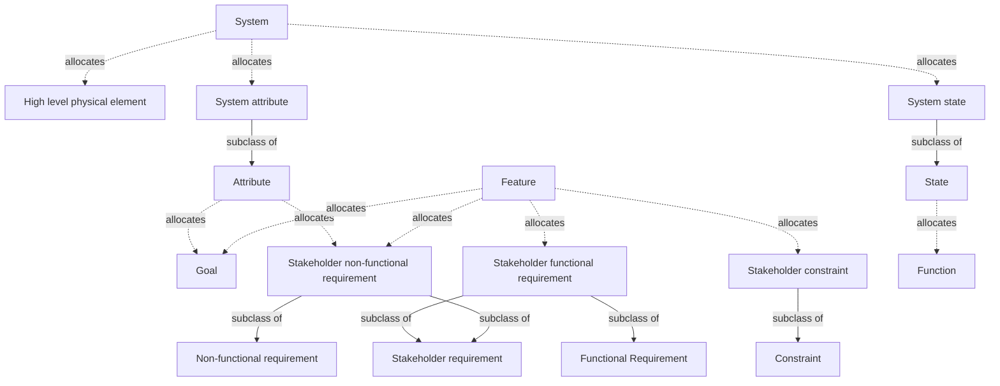

*Created: 2026-03-24 · Modified: 2026-04-12 · Creator: @rcasteran*

---

### Interdependent actor - 3SE


> Human being whose own activities within the milieu of the system of interest mutually and durably shape those of the system of interest over time.

| Relation | Terms |
|---|---|
| Related | [activity-3se-069b48ef5cd47253](https://www.3se.info/3se-onto/terms/activity-3se-069b48ef5cd47253), [context-3se-069c1b6f066d7c1e](https://www.3se.info/3se-onto/terms/context-3se-069c1b6f066d7c1e), [milieu-3se-069c1b6f06a77b34](https://www.3se.info/3se-onto/terms/milieu-3se-069c1b6f06a77b34), [system-3se-069b85f238f3792d](https://www.3se.info/3se-onto/terms/system-3se-069b85f238f3792d), [interdependence-analysis-3se-069c316c191c7780](https://www.3se.info/3se-onto/terms/interdependence-analysis-3se-069c316c191c7780) |

*Created: 2026-03-24 · Modified: 2026-04-12 · Creator: @rcasteran*

---

### Interdependent system - 3SE


> System whose own activities within the milieu of the system of interest mutually and durably shape those of the system of interest over time.

| Relation | Terms |
|---|---|
| Related | [activity-3se-069b48ef5cd47253](https://www.3se.info/3se-onto/terms/activity-3se-069b48ef5cd47253), [context-3se-069c1b6f066d7c1e](https://www.3se.info/3se-onto/terms/context-3se-069c1b6f066d7c1e), [milieu-3se-069c1b6f06a77b34](https://www.3se.info/3se-onto/terms/milieu-3se-069c1b6f06a77b34), [interdependence-analysis-3se-069c316c191c7780](https://www.3se.info/3se-onto/terms/interdependence-analysis-3se-069c316c191c7780) |
| Subclass of | [system-3se-069b85f238f3792d](https://www.3se.info/3se-onto/terms/system-3se-069b85f238f3792d) |

*Created: 2026-03-24 · Modified: 2026-04-12 · Creator: @rcasteran*

---

### Iteration - 3SE


> Time frame of a project in which a set of epics and/or tasks is developed to produce a release.

| Relation | Terms |
|---|---|
| Related | [assessment-gate-3se-069b48ef5cf37878](https://www.3se.info/3se-onto/terms/assessment-gate-3se-069b48ef5cf37878), [epic-analysis-3se-069b9d2c8d6c7640](https://www.3se.info/3se-onto/terms/epic-analysis-3se-069b9d2c8d6c7640), [iteration-analysis-3se-069b9d2c8db57db4](https://www.3se.info/3se-onto/terms/iteration-analysis-3se-069b9d2c8db57db4), [task-analysis-3se-069b9d2c8df9750e](https://www.3se.info/3se-onto/terms/task-analysis-3se-069b9d2c8df9750e) |
| Broad match | [iteration-24765-2017-069b48ef5d2a723b](https://www.3se.info/3se-onto/terms/iteration-24765-2017-069b48ef5d2a723b) |
| Allocates | [release-3se-069b48ef5d6a7595](https://www.3se.info/3se-onto/terms/release-3se-069b48ef5d6a7595), [project-3se-069b48ef5d5877bf](https://www.3se.info/3se-onto/terms/project-3se-069b48ef5d5877bf) |
| Allocated by | [epic-3se-069b48ef5cfd71ab](https://www.3se.info/3se-onto/terms/epic-3se-069b48ef5cfd71ab), [task-3se-069b48ef5d8579f8](https://www.3se.info/3se-onto/terms/task-3se-069b48ef5d8579f8) |

*Created: 2026-03-13 · Modified: 2026-04-08 · Creator: @rcasteran*

---

### Iteration analysis - 3SE


> Analysis of the project to determine what iterations are completing it.

| Relation | Terms |
|---|---|
| Related | [iteration-3se-069b48ef5d347061](https://www.3se.info/3se-onto/terms/iteration-3se-069b48ef5d347061), [project-3se-069b48ef5d5877bf](https://www.3se.info/3se-onto/terms/project-3se-069b48ef5d5877bf) |
| Subclass of | [analysis-3se-069b5a9129c37ebe](https://www.3se.info/3se-onto/terms/analysis-3se-069b5a9129c37ebe) |

**Allocations**

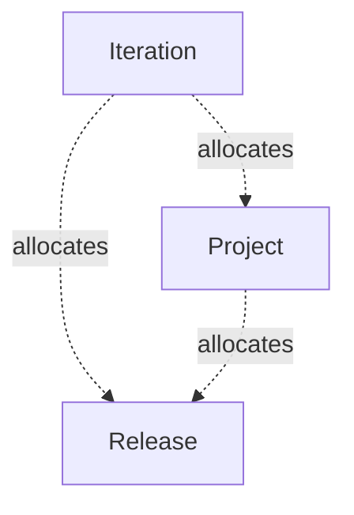

*Created: 2026-03-17 · Modified: 2026-03-20 · Creator: @rcasteran*

---

### Mathematical model - 3SE


> Abstract model that describes an entity using mathematical language.

| Relation | Terms |
|---|---|
| Subclass of | [abstract-model-3se-069d3d55609a75e1](https://www.3se.info/3se-onto/terms/abstract-model-3se-069d3d55609a75e1) |
| Close match | [analytical-model-24641-2023-069d3f26adf376a4](https://www.3se.info/3se-onto/terms/analytical-model-24641-2023-069d3f26adf376a4) |

*Created: 2026-04-06 · Modified: 2026-04-06 · Creator: @rcasteran*

---

### Maturity gate - 3SE


> Verification of a candidate release for a development phase where a decision is made to continue to the next phase (with or without modifications) or to redefine it. 

| Relation | Terms |
|---|---|
| Related | [release-3se-069b48ef5d6a7595](https://www.3se.info/3se-onto/terms/release-3se-069b48ef5d6a7595), [verification-3se-069b5a912a2372d7](https://www.3se.info/3se-onto/terms/verification-3se-069b5a912a2372d7), [project-risk-3se-069bda7c99c176e4](https://www.3se.info/3se-onto/terms/project-risk-3se-069bda7c99c176e4) |
| Narrow match | [phase-gate-24765-2017-069b48ef5d46720a](https://www.3se.info/3se-onto/terms/phase-gate-24765-2017-069b48ef5d46720a) |

*Created: 2026-03-13 · Modified: 2026-04-08 · Creator: @rcasteran*

---

### Mechanism - 3SE


> A mechanism is one of the activity of a system that makes it what it is.

| Relation | Terms |
|---|---|
| Related | [activity-3se-069b48ef5cd47253](https://www.3se.info/3se-onto/terms/activity-3se-069b48ef5cd47253), [function-3se-069b48ef5d187435](https://www.3se.info/3se-onto/terms/function-3se-069b48ef5d187435), [system-3se-069b85f238f3792d](https://www.3se.info/3se-onto/terms/system-3se-069b85f238f3792d), [systems-principles-3se-069b85f2390b7e20](https://www.3se.info/3se-onto/terms/systems-principles-3se-069b85f2390b7e20) |
| Narrow match | [mechanism-how-does-it-work-2004-069c316c192e7512](https://www.3se.info/3se-onto/terms/mechanism-how-does-it-work-2004-069c316c192e7512) |

*Created: 2026-03-24 · Modified: 2026-03-24 · Creator: @rcasteran*

---

### Meta model - 3SE


> Model that specifies the rules that govern a model.

| Relation | Terms |
|---|---|
| Subclass of | [model-3se-069d3d5560f07cc9](https://www.3se.info/3se-onto/terms/model-3se-069d3d5560f07cc9) |
| Narrow match | [meta-model-24641-2023-069d3d5560d87b30](https://www.3se.info/3se-onto/terms/meta-model-24641-2023-069d3d5560d87b30) |

*Created: 2026-04-06 · Modified: 2026-04-06 · Creator: @rcasteran*

---

### Milieu - 3SE


> The broader operational environment surrounding the system of interest, populated by interdependent systems and/or interdependent actors that are neither subordinate to nor in a defined relationship with the system of interest, but whose existence and behavior are consequential to it.

| Relation | Terms |
|---|---|
| Related | [context-3se-069c1b6f066d7c1e](https://www.3se.info/3se-onto/terms/context-3se-069c1b6f066d7c1e), [environment-3se-069c1b6f0688798a](https://www.3se.info/3se-onto/terms/environment-3se-069c1b6f0688798a), [system-3se-069b85f238f3792d](https://www.3se.info/3se-onto/terms/system-3se-069b85f238f3792d), [interdependent-actor-3se-069c2e3021be796f](https://www.3se.info/3se-onto/terms/interdependent-actor-3se-069c2e3021be796f), [interdependent-system-3se-069c2e3021d47617](https://www.3se.info/3se-onto/terms/interdependent-system-3se-069c2e3021d47617), [interdependence-analysis-3se-069c316c191c7780](https://www.3se.info/3se-onto/terms/interdependence-analysis-3se-069c316c191c7780) |

*Created: 2026-03-23 · Modified: 2026-04-12 · Creator: @rcasteran*

---

### Model - 3SE


> Representation of an entity or collection of entities that provides the ability to portray, understand or predict the attributes or features of the entity or collection under situations of interest.

| Relation | Terms |
|---|---|
| Related | [analysis-3se-069b5a9129c37ebe](https://www.3se.info/3se-onto/terms/analysis-3se-069b5a9129c37ebe), [attribute-3se-069b72bee1327dcf](https://www.3se.info/3se-onto/terms/attribute-3se-069b72bee1327dcf), [feature-3se-069b48ef5d0f7505](https://www.3se.info/3se-onto/terms/feature-3se-069b48ef5d0f7505), [situation-3se-069c1b6f06b27ce9](https://www.3se.info/3se-onto/terms/situation-3se-069c1b6f06b27ce9) |
| Superclass of | [abstract-model-3se-069d3d55609a75e1](https://www.3se.info/3se-onto/terms/abstract-model-3se-069d3d55609a75e1), [concrete-model-3se-069d3d5560c77d97](https://www.3se.info/3se-onto/terms/concrete-model-3se-069d3d5560c77d97), [meta-model-3se-069d3d5560e07840](https://www.3se.info/3se-onto/terms/meta-model-3se-069d3d5560e07840) |
| Close match | [model-24641-2023-069d3d5560e87cde](https://www.3se.info/3se-onto/terms/model-24641-2023-069d3d5560e87cde) |

*Created: 2026-04-06 · Modified: 2026-04-06 · Creator: @rcasteran*

---

### Non-functional requirement - 3SE


> Requirement that pertains to an attribute of the solution.

| Relation | Terms |
|---|---|
| Related | [attribute-3se-069b72bee1327dcf](https://www.3se.info/3se-onto/terms/attribute-3se-069b72bee1327dcf), [constraint-3se-069b8843802f7569](https://www.3se.info/3se-onto/terms/constraint-3se-069b8843802f7569), [solution-3se-069bc40b97cf7f18](https://www.3se.info/3se-onto/terms/solution-3se-069bc40b97cf7f18) |
| Subclass of | [requirement-3se-069b48ef5d727ceb](https://www.3se.info/3se-onto/terms/requirement-3se-069b48ef5d727ceb) |
| Superclass of | [hardware-non-functional-req-3se-069be64e186075ed](https://www.3se.info/3se-onto/terms/hardware-non-functional-req-3se-069be64e186075ed), [safety-hardware-non-functional-req-3se-069bdc3120bb78da](https://www.3se.info/3se-onto/terms/safety-hardware-non-functional-req-3se-069bdc3120bb78da), [safety-software-non-functional-req-3se-069bdc3120d47249](https://www.3se.info/3se-onto/terms/safety-software-non-functional-req-3se-069bdc3120d47249), [safety-system-non-functional-req-3se-069bdc3120ee7a1c](https://www.3se.info/3se-onto/terms/safety-system-non-functional-req-3se-069bdc3120ee7a1c), [security-hardware-non-functional-req-3se-069bdc3121117d6c](https://www.3se.info/3se-onto/terms/security-hardware-non-functional-req-3se-069bdc3121117d6c), [security-software-non-functional-req-3se-069bdc31212b77bd](https://www.3se.info/3se-onto/terms/security-software-non-functional-req-3se-069bdc31212b77bd), [security-system-non-functional-req-3se-069bdc31214573e2](https://www.3se.info/3se-onto/terms/security-system-non-functional-req-3se-069bdc31214573e2), [software-non-functional-req-3se-069be64e18827c2c](https://www.3se.info/3se-onto/terms/software-non-functional-req-3se-069be64e18827c2c), [stakeholder-non-functional-req-3se-069bdc88051a751e](https://www.3se.info/3se-onto/terms/stakeholder-non-functional-req-3se-069bdc88051a751e), [system-non-functional-req-3se-069be64e18a67d6e](https://www.3se.info/3se-onto/terms/system-non-functional-req-3se-069be64e18a67d6e) |
| Close match | [quality-req-cpre-069a9faf2cb177af](https://www.3se.info/3se-onto/terms/quality-req-cpre-069a9faf2cb177af) |
| Broad match | [non-functional-req-cpre-069a9faf2ca97723](https://www.3se.info/3se-onto/terms/non-functional-req-cpre-069a9faf2ca97723) |

*Created: 2026-03-16 · Modified: 2026-03-19 · Creator: @rcasteran*

---

### Operating model - 3SE


> Conceptual model which represents the operational analysis.

| Relation | Terms |
|---|---|
| Related | [operational-analysis-3se-069b9d2c8dbe721c](https://www.3se.info/3se-onto/terms/operational-analysis-3se-069b9d2c8dbe721c) |
| Subclass of | [conceptual-model-3se-069d3d5560bf7635](https://www.3se.info/3se-onto/terms/conceptual-model-3se-069d3d5560bf7635) |

*Created: 2026-04-06 · Modified: 2026-04-06 · Creator: @rcasteran*

---

### Operational analysis - 3SE


> Analysis of a feature to determine what activities are contributing to it and their relation.

| Relation | Terms |
|---|---|
| Related | [feature-3se-069b48ef5d0f7505](https://www.3se.info/3se-onto/terms/feature-3se-069b48ef5d0f7505), [activity-3se-069b48ef5cd47253](https://www.3se.info/3se-onto/terms/activity-3se-069b48ef5cd47253), [operating-model-3se-069d3f26ae27722b](https://www.3se.info/3se-onto/terms/operating-model-3se-069d3f26ae27722b) |
| Subclass of | [analysis-3se-069b5a9129c37ebe](https://www.3se.info/3se-onto/terms/analysis-3se-069b5a9129c37ebe) |

**Allocations**

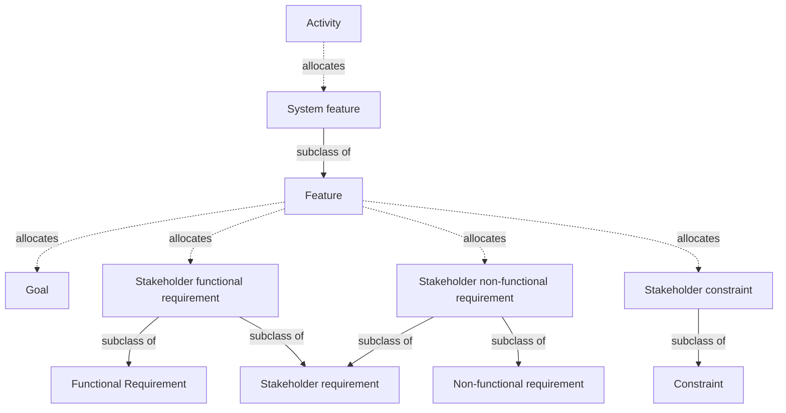

*Created: 2026-03-17 · Modified: 2026-04-06 · Creator: @rcasteran*

---

### Organization risk - 3SE


> Risk related to an uncertainty about the organization governance and mission (funding, legal...).

| Relation | Terms |
|---|---|
| Subclass of | [risk-3se-069b5b3d9eda7fcf](https://www.3se.info/3se-onto/terms/risk-3se-069b5b3d9eda7fcf) |

*Created: 2026-03-20 · Modified: 2026-03-20 · Creator: @rcasteran*

---

### Physical architecture - 3SE


> Analysis of the functional element to determine:
(1) what physical element is realizing it.
(2) what physical interface is allocating its functional interfaces.

| Relation | Terms |
|---|---|
| Related | [functional-element-3se-069b9d2c8d9d7504](https://www.3se.info/3se-onto/terms/functional-element-3se-069b9d2c8d9d7504), [physical-element-3se-069b9d2c8dce7f9b](https://www.3se.info/3se-onto/terms/physical-element-3se-069b9d2c8dce7f9b), [systems-principles-3se-069b85f2390b7e20](https://www.3se.info/3se-onto/terms/systems-principles-3se-069b85f2390b7e20), [physical-element-breakdown-structure-3se-069c03464b5670d2](https://www.3se.info/3se-onto/terms/physical-element-breakdown-structure-3se-069c03464b5670d2), [physical-architecture-model-3se-069d3f26ae2f7408](https://www.3se.info/3se-onto/terms/physical-architecture-model-3se-069d3f26ae2f7408), [functional-interface-3se-069bc53af258726b](https://www.3se.info/3se-onto/terms/functional-interface-3se-069bc53af258726b), [physical-interface-3se-069bd66fb639714a](https://www.3se.info/3se-onto/terms/physical-interface-3se-069bd66fb639714a) |
| Subclass of | [analysis-3se-069b5a9129c37ebe](https://www.3se.info/3se-onto/terms/analysis-3se-069b5a9129c37ebe) |

**Allocations**

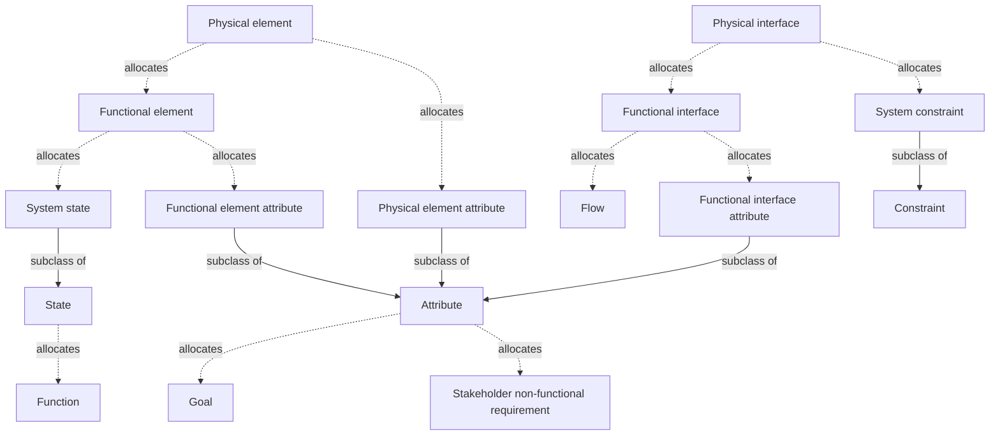

*Created: 2026-03-17 · Modified: 2026-04-14 · Creator: @rcasteran*

---

### Physical architecture model - 3SE


> Conceptual model which represents the physical architecture based on the physical element breakdown structure.

| Relation | Terms |
|---|---|
| Related | [physical-architecture-3se-069b9d2c8dc67374](https://www.3se.info/3se-onto/terms/physical-architecture-3se-069b9d2c8dc67374), [physical-element-breakdown-structure-3se-069c03464b5670d2](https://www.3se.info/3se-onto/terms/physical-element-breakdown-structure-3se-069c03464b5670d2) |
| Subclass of | [conceptual-model-3se-069d3d5560bf7635](https://www.3se.info/3se-onto/terms/conceptual-model-3se-069d3d5560bf7635) |

*Created: 2026-04-06 · Modified: 2026-04-06 · Creator: @rcasteran*

---

### Physical element - 3SE


> Part of a system element responsible for defining the resources to carrying out the functional element of the system, by interacting with other physical elements of the system and/or enabling physical elements and/or actors.

| Relation | Terms |
|---|---|
| Related | [enabling-physical-element-3se-069b9d2c8d5375f6](https://www.3se.info/3se-onto/terms/enabling-physical-element-3se-069b9d2c8d5375f6), [physical-architecture-3se-069b9d2c8dc67374](https://www.3se.info/3se-onto/terms/physical-architecture-3se-069b9d2c8dc67374), [system-3se-069b85f238f3792d](https://www.3se.info/3se-onto/terms/system-3se-069b85f238f3792d), [fault-3se-069bb0f6e7f77cb3](https://www.3se.info/3se-onto/terms/fault-3se-069bb0f6e7f77cb3), [physical-element-breakdown-structure-3se-069c03464b5670d2](https://www.3se.info/3se-onto/terms/physical-element-breakdown-structure-3se-069c03464b5670d2), [system-breakdown-structure-3se-069bee1cdb507cf6](https://www.3se.info/3se-onto/terms/system-breakdown-structure-3se-069bee1cdb507cf6), [actor-3se-069c1a2fb8cb746f](https://www.3se.info/3se-onto/terms/actor-3se-069c1a2fb8cb746f), [vulnerability-3se-069c1a2fb8f177a4](https://www.3se.info/3se-onto/terms/vulnerability-3se-069c1a2fb8f177a4), [stakeholder-req-breakdown-structure-3se-069da425d0607787](https://www.3se.info/3se-onto/terms/stakeholder-req-breakdown-structure-3se-069da425d0607787) |
| Superclass of | [hardware-3se-069bb0a752d57cb1](https://www.3se.info/3se-onto/terms/hardware-3se-069bb0a752d57cb1), [software-3se-069bb0a752e7712e](https://www.3se.info/3se-onto/terms/software-3se-069bb0a752e7712e) |
| Close match | [hosting-physical-component-arcadia-2023-069b9d2c8dad7934](https://www.3se.info/3se-onto/terms/hosting-physical-component-arcadia-2023-069b9d2c8dad7934) |
| Allocates | [functional-element-3se-069b9d2c8d9d7504](https://www.3se.info/3se-onto/terms/functional-element-3se-069b9d2c8d9d7504), [physical-element-attribute-3se-069e3c5af9167fb3](https://www.3se.info/3se-onto/terms/physical-element-attribute-3se-069e3c5af9167fb3) |
| Can be | [high-level-physical-element-3se-069c03464ae07399](https://www.3se.info/3se-onto/terms/high-level-physical-element-3se-069c03464ae07399) |
| Exposes | [physical-interface-3se-069bd66fb639714a](https://www.3se.info/3se-onto/terms/physical-interface-3se-069bd66fb639714a) |
| Allocated by | [system-element-3se-069b85f238fb79eb](https://www.3se.info/3se-onto/terms/system-element-3se-069b85f238fb79eb) |

*Created: 2026-03-17 · Modified: 2026-04-18 · Creator: @rcasteran*

---

### Physical element attribute - 3SE


> Attribute of a physical element.

| Relation | Terms |
|---|---|
| Subclass of | [attribute-3se-069b72bee1327dcf](https://www.3se.info/3se-onto/terms/attribute-3se-069b72bee1327dcf) |
| Allocates | [functional-element-attribute-3se-069dcf93699c7864](https://www.3se.info/3se-onto/terms/functional-element-attribute-3se-069dcf93699c7864), [system-non-functional-req-3se-069be64e18a67d6e](https://www.3se.info/3se-onto/terms/system-non-functional-req-3se-069be64e18a67d6e) |
| Allocated by | [physical-element-3se-069b9d2c8dce7f9b](https://www.3se.info/3se-onto/terms/physical-element-3se-069b9d2c8dce7f9b), [system-element-attribute-3se-069dd064716473a4](https://www.3se.info/3se-onto/terms/system-element-attribute-3se-069dd064716473a4) |

*Created: 2026-04-13 · Modified: 2026-04-18 · Creator: @rcasteran*

---

### Physical element breakdown structure - 3SE


> Breakdown structure of the physical element that supports the physical architecture by following the principles below:
(1) A high level physical element is composed of at least two physical elements.
(2) A high level physical element allocates at least one high level functional element.
(3) A physical element allocates at least one functional element.
(4) A physical element can be a high level physical element.

| Relation | Terms |
|---|---|
| Related | [high-level-physical-element-3se-069c03464ae07399](https://www.3se.info/3se-onto/terms/high-level-physical-element-3se-069c03464ae07399), [physical-element-3se-069b9d2c8dce7f9b](https://www.3se.info/3se-onto/terms/physical-element-3se-069b9d2c8dce7f9b), [functional-element-3se-069b9d2c8d9d7504](https://www.3se.info/3se-onto/terms/functional-element-3se-069b9d2c8d9d7504), [high-level-functional-element-3se-069c03f8a41e7206](https://www.3se.info/3se-onto/terms/high-level-functional-element-3se-069c03f8a41e7206), [physical-architecture-3se-069b9d2c8dc67374](https://www.3se.info/3se-onto/terms/physical-architecture-3se-069b9d2c8dc67374), [physical-architecture-model-3se-069d3f26ae2f7408](https://www.3se.info/3se-onto/terms/physical-architecture-model-3se-069d3f26ae2f7408), [system-architecture-model-3se-069d3f26ae587442](https://www.3se.info/3se-onto/terms/system-architecture-model-3se-069d3f26ae587442) |
| Subclass of | [breakdown-structure-3se-069d166fa9037b67](https://www.3se.info/3se-onto/terms/breakdown-structure-3se-069d166fa9037b67) |

**Structure**

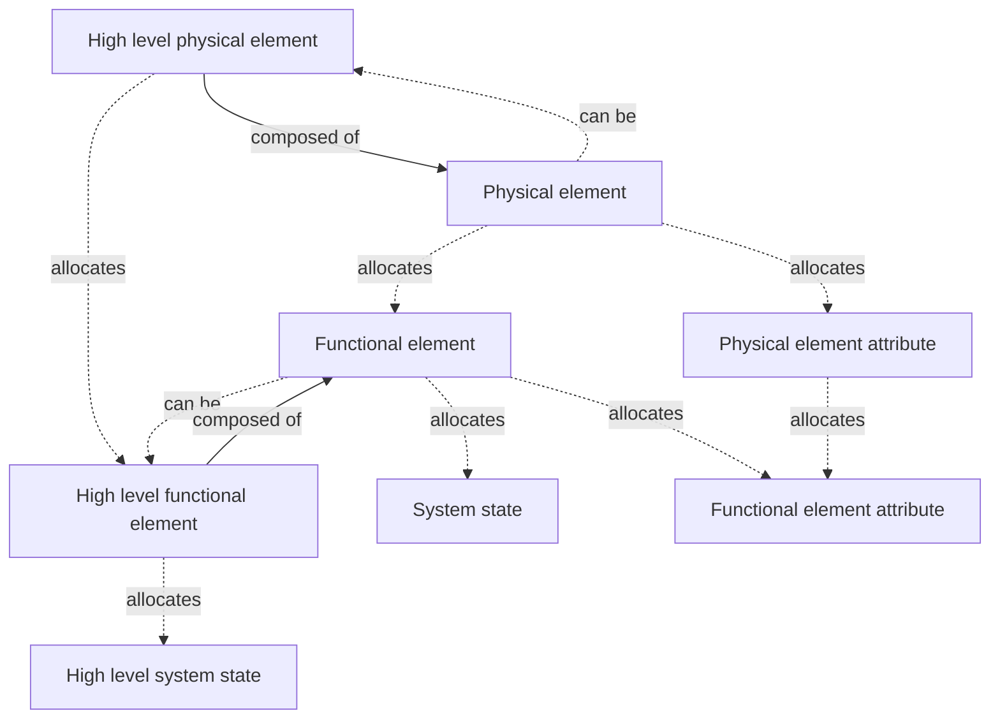

*Created: 2026-03-22 · Modified: 2026-04-12 · Creator: @rcasteran*

---

### Physical interface - 3SE


> Part of a system element interface responsible for defining the resources to carrying out the functional interface of the system element, by exchanging flows with other physical elements of the system and/or enabling physical elements and/or actors.

| Relation | Terms |
|---|---|
| Related | [flow-3se-069bc4ea53207933](https://www.3se.info/3se-onto/terms/flow-3se-069bc4ea53207933), [system-interface-breakdown-structure-3se-069cd5b860b47815](https://www.3se.info/3se-onto/terms/system-interface-breakdown-structure-3se-069cd5b860b47815), [system-3se-069b85f238f3792d](https://www.3se.info/3se-onto/terms/system-3se-069b85f238f3792d), [system-element-3se-069b85f238fb79eb](https://www.3se.info/3se-onto/terms/system-element-3se-069b85f238fb79eb), [stakeholder-req-breakdown-structure-3se-069da425d0607787](https://www.3se.info/3se-onto/terms/stakeholder-req-breakdown-structure-3se-069da425d0607787), [physical-architecture-3se-069b9d2c8dc67374](https://www.3se.info/3se-onto/terms/physical-architecture-3se-069b9d2c8dc67374) |
| Superclass of | [hardware-block-interface-3se-069dc15cd0dc7340](https://www.3se.info/3se-onto/terms/hardware-block-interface-3se-069dc15cd0dc7340), [hardware-interface-3se-069bd66fb6017920](https://www.3se.info/3se-onto/terms/hardware-interface-3se-069bd66fb6017920), [software-component-interface-3se-069dc11872d97b8a](https://www.3se.info/3se-onto/terms/software-component-interface-3se-069dc11872d97b8a), [software-interface-3se-069bd66fb64b7c7c](https://www.3se.info/3se-onto/terms/software-interface-3se-069bd66fb64b7c7c) |
| Related match | [physical-port-arcadia-2023-069bd66fb642700a](https://www.3se.info/3se-onto/terms/physical-port-arcadia-2023-069bd66fb642700a) |
| Allocates | [functional-interface-3se-069bc53af258726b](https://www.3se.info/3se-onto/terms/functional-interface-3se-069bc53af258726b), [system-constraint-3se-069be64e188b7d26](https://www.3se.info/3se-onto/terms/system-constraint-3se-069be64e188b7d26) |
| Allocated by | [system-element-interface-3se-069cd5b860d1741a](https://www.3se.info/3se-onto/terms/system-element-interface-3se-069cd5b860d1741a) |

*Created: 2026-03-20 · Modified: 2026-04-14 · Creator: @rcasteran*

---

### Problem - 3SE


> Incident or undesirable situation concerning the content of a release and/or the way it has been built and/or delivered, which demands a resolution.

| Relation | Terms |
|---|---|
| Related | [release-3se-069b48ef5d6a7595](https://www.3se.info/3se-onto/terms/release-3se-069b48ef5d6a7595), [situation-3se-069c1b6f06b27ce9](https://www.3se.info/3se-onto/terms/situation-3se-069c1b6f06b27ce9) |
| Narrow match | [problem-24765-2017-069b5b3d9ec87ba9](https://www.3se.info/3se-onto/terms/problem-24765-2017-069b5b3d9ec87ba9) |

*Created: 2026-03-14 · Modified: 2026-04-08 · Creator: @rcasteran*

---

### Product - 3SE


> Implementation of a system that is based on a release, produced in a quantifiable manner and delivered to a stakeholder as either an end product in itself or a component of an end product.

| Relation | Terms |
|---|---|
| Related | [product-analysis-3se-069b9d2c8dd77a8d](https://www.3se.info/3se-onto/terms/product-analysis-3se-069b9d2c8dd77a8d), [project-3se-069b48ef5d5877bf](https://www.3se.info/3se-onto/terms/project-3se-069b48ef5d5877bf), [release-analysis-3se-069b9d2c8de871b3](https://www.3se.info/3se-onto/terms/release-analysis-3se-069b9d2c8de871b3), [stakeholder-3se-069bc40b97d97d03](https://www.3se.info/3se-onto/terms/stakeholder-3se-069bc40b97d97d03), [product-breakdown-structure-3se-069c01ba91ef747d](https://www.3se.info/3se-onto/terms/product-breakdown-structure-3se-069c01ba91ef747d), [product-architecture-3se-069d3f26ae3773b9](https://www.3se.info/3se-onto/terms/product-architecture-3se-069d3f26ae3773b9) |
| Superclass of | [hardware-product-3se-069c058ef4de7a0a](https://www.3se.info/3se-onto/terms/hardware-product-3se-069c058ef4de7a0a), [software-product-3se-069c058ef51e7f93](https://www.3se.info/3se-onto/terms/software-product-3se-069c058ef51e7f93) |
| Narrow match | [product-24765-2017-069ad94e896d75d2](https://www.3se.info/3se-onto/terms/product-24765-2017-069ad94e896d75d2) |
| Composed of | [product-element-3se-069c01ba91f77631](https://www.3se.info/3se-onto/terms/product-element-3se-069c01ba91f77631) |
| Represented by | [system-3se-069b85f238f3792d](https://www.3se.info/3se-onto/terms/system-3se-069b85f238f3792d) |
| Allocates | [system-feature-3se-069da52308aa7bcf](https://www.3se.info/3se-onto/terms/system-feature-3se-069da52308aa7bcf) |
| Can be | [asset-3se-069c16c95ac27b16](https://www.3se.info/3se-onto/terms/asset-3se-069c16c95ac27b16), [service-mean-3se-069c5aee6a337c05](https://www.3se.info/3se-onto/terms/service-mean-3se-069c5aee6a337c05) |
| Allocated by | [release-3se-069b48ef5d6a7595](https://www.3se.info/3se-onto/terms/release-3se-069b48ef5d6a7595) |

*Created: 2026-03-13 · Modified: 2026-04-12 · Creator: @rcasteran*

---

### Product analysis - 3SE


> Analysis of the features to determine what product is realizing it.

| Relation | Terms |
|---|---|
| Related | [feature-3se-069b48ef5d0f7505](https://www.3se.info/3se-onto/terms/feature-3se-069b48ef5d0f7505), [product-3se-069b48ef5d4e7ef8](https://www.3se.info/3se-onto/terms/product-3se-069b48ef5d4e7ef8), [product-breakdown-structure-3se-069c01ba91ef747d](https://www.3se.info/3se-onto/terms/product-breakdown-structure-3se-069c01ba91ef747d) |
| Subclass of | [analysis-3se-069b5a9129c37ebe](https://www.3se.info/3se-onto/terms/analysis-3se-069b5a9129c37ebe) |
| Related match | [product-analysis-24765-2017-069b5a912a007ad2](https://www.3se.info/3se-onto/terms/product-analysis-24765-2017-069b5a912a007ad2) |

**Allocations**


*Created: 2026-03-17 · Modified: 2026-04-06 · Creator: @rcasteran*

---

### Product architecture - 3SE


> Analysis of the product to determine what system products are realizing it.

| Relation | Terms |
|---|---|
| Related | [product-3se-069b48ef5d4e7ef8](https://www.3se.info/3se-onto/terms/product-3se-069b48ef5d4e7ef8), [product-architecture-model-3se-069d3f26ae3f7580](https://www.3se.info/3se-onto/terms/product-architecture-model-3se-069d3f26ae3f7580) |
| Subclass of | [analysis-3se-069b5a9129c37ebe](https://www.3se.info/3se-onto/terms/analysis-3se-069b5a9129c37ebe) |
| Related match | [architecture-42010-2022-069cff8d0ac17a44](https://www.3se.info/3se-onto/terms/architecture-42010-2022-069cff8d0ac17a44), [architecture-26262-1-2018-069cff8d0aa87a16](https://www.3se.info/3se-onto/terms/architecture-26262-1-2018-069cff8d0aa87a16) |

**Allocations**

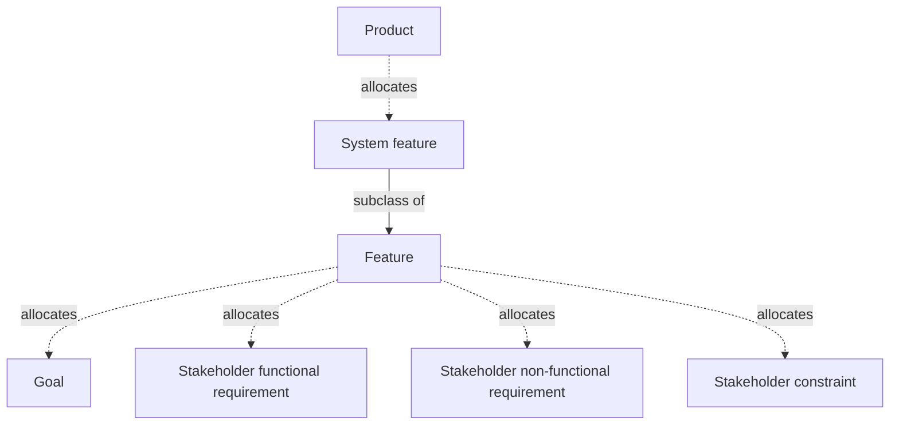

*Created: 2026-04-06 · Modified: 2026-04-06 · Creator: @rcasteran*

---

### Product architecture model - 3SE


> Conceptual model which represents the product architecture based on the product breakdown structure.

| Relation | Terms |
|---|---|
| Related | [product-architecture-3se-069d3f26ae3773b9](https://www.3se.info/3se-onto/terms/product-architecture-3se-069d3f26ae3773b9), [product-breakdown-structure-3se-069c01ba91ef747d](https://www.3se.info/3se-onto/terms/product-breakdown-structure-3se-069c01ba91ef747d) |
| Subclass of | [conceptual-model-3se-069d3d5560bf7635](https://www.3se.info/3se-onto/terms/conceptual-model-3se-069d3d5560bf7635) |

*Created: 2026-04-06 · Modified: 2026-04-06 · Creator: @rcasteran*

---

### Product breakdown structure - 3SE


> Breakdown structure of the product that supports the product analysis by following the principles below:
(1) A product is composed of at least two product elements.
(2) A product allocates at least one feature.
(3) A product is represented by a system.
(4) A product can be an asset
(5) A product element can be a product.

| Relation | Terms |
|---|---|
| Related | [feature-3se-069b48ef5d0f7505](https://www.3se.info/3se-onto/terms/feature-3se-069b48ef5d0f7505), [product-3se-069b48ef5d4e7ef8](https://www.3se.info/3se-onto/terms/product-3se-069b48ef5d4e7ef8), [product-element-3se-069c01ba91f77631](https://www.3se.info/3se-onto/terms/product-element-3se-069c01ba91f77631), [system-3se-069b85f238f3792d](https://www.3se.info/3se-onto/terms/system-3se-069b85f238f3792d), [asset-3se-069c16c95ac27b16](https://www.3se.info/3se-onto/terms/asset-3se-069c16c95ac27b16), [product-analysis-3se-069b9d2c8dd77a8d](https://www.3se.info/3se-onto/terms/product-analysis-3se-069b9d2c8dd77a8d), [product-architecture-model-3se-069d3f26ae3f7580](https://www.3se.info/3se-onto/terms/product-architecture-model-3se-069d3f26ae3f7580) |
| Subclass of | [breakdown-structure-3se-069d166fa9037b67](https://www.3se.info/3se-onto/terms/breakdown-structure-3se-069d166fa9037b67) |
| Narrow match | [product-breakdown-structure-24765-2017-069c01ba91c37ce8](https://www.3se.info/3se-onto/terms/product-breakdown-structure-24765-2017-069c01ba91c37ce8) |

**Structure**

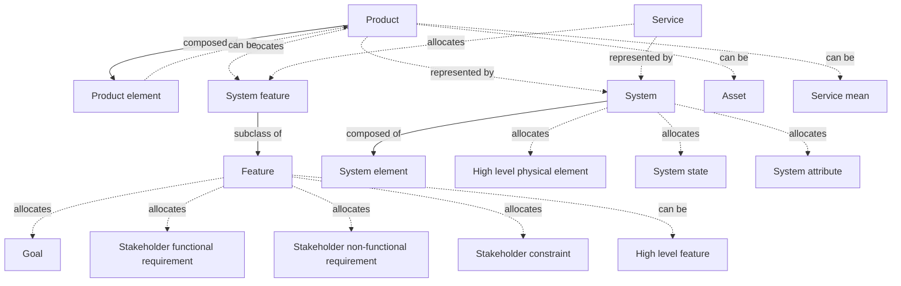

*Created: 2026-03-22 · Modified: 2026-04-06 · Creator: @rcasteran*

---

### Product element - 3SE


> Constituent of a product.

| Relation | Terms |
|---|---|
| Related | [product-breakdown-structure-3se-069c01ba91ef747d](https://www.3se.info/3se-onto/terms/product-breakdown-structure-3se-069c01ba91ef747d) |
| Can be | [product-3se-069b48ef5d4e7ef8](https://www.3se.info/3se-onto/terms/product-3se-069b48ef5d4e7ef8) |

*Created: 2026-03-22 · Modified: 2026-03-22 · Creator: @rcasteran*

---

### Product owner - 3SE


> Role that is accountable for the feature analysis, the product analysis and the release analysis.
It contributes to the value analysis, the goal analysis, the operational analysis and to the variability analysis.
Note: when the product is an asset, the product owner is also called asset owner

| Relation | Terms |
|---|---|
| Related | [analysis-3se-069b5a9129c37ebe](https://www.3se.info/3se-onto/terms/analysis-3se-069b5a9129c37ebe) |
| Subclass of | [role-3se-069c451bef157773](https://www.3se.info/3se-onto/terms/role-3se-069c451bef157773) |

*Created: 2026-03-25 · Modified: 2026-04-14 · Creator: @rcasteran*

---

### Project - 3SE


> Endeavor with defined start and finish criteria undertaken to create or to modify a product or a service in accordance with resources, goals and requirements allocated to planned releases.

| Relation | Terms |
|---|---|
| Related | [goal-3se-069b48ef5d2171ed](https://www.3se.info/3se-onto/terms/goal-3se-069b48ef5d2171ed), [product-3se-069b48ef5d4e7ef8](https://www.3se.info/3se-onto/terms/product-3se-069b48ef5d4e7ef8), [iteration-analysis-3se-069b9d2c8db57db4](https://www.3se.info/3se-onto/terms/iteration-analysis-3se-069b9d2c8db57db4), [project-analysis-3se-069b9d2c8ddf7fa8](https://www.3se.info/3se-onto/terms/project-analysis-3se-069b9d2c8ddf7fa8), [project-risk-3se-069bda7c99c176e4](https://www.3se.info/3se-onto/terms/project-risk-3se-069bda7c99c176e4), [requirement-3se-069b48ef5d727ceb](https://www.3se.info/3se-onto/terms/requirement-3se-069b48ef5d727ceb), [service-3se-069c5aee69f47c9d](https://www.3se.info/3se-onto/terms/service-3se-069c5aee69f47c9d) |
| Close match | [project-24765-2017-069ad94e897e7a8f](https://www.3se.info/3se-onto/terms/project-24765-2017-069ad94e897e7a8f) |
| Allocates | [release-3se-069b48ef5d6a7595](https://www.3se.info/3se-onto/terms/release-3se-069b48ef5d6a7595) |
| Allocated by | [iteration-3se-069b48ef5d347061](https://www.3se.info/3se-onto/terms/iteration-3se-069b48ef5d347061) |

*Created: 2026-03-13 · Modified: 2026-03-28 · Creator: @rcasteran*

---

### Project analysis - 3SE


> Analysis of the release to determine what project is delivering it.

| Relation | Terms |
|---|---|
| Related | [project-3se-069b48ef5d5877bf](https://www.3se.info/3se-onto/terms/project-3se-069b48ef5d5877bf), [release-3se-069b48ef5d6a7595](https://www.3se.info/3se-onto/terms/release-3se-069b48ef5d6a7595) |
| Subclass of | [analysis-3se-069b5a9129c37ebe](https://www.3se.info/3se-onto/terms/analysis-3se-069b5a9129c37ebe) |

**Allocations**

```mermaid
graph TD
    N1["Project"]
    N2["Release"]
    N3["Product"]

    N1 -.->|allocates| N2
    N2 -.->|allocates| N3
```

*Created: 2026-03-17 · Modified: 2026-03-26 · Creator: @rcasteran*

---

### Project owner - 3SE


> Role that is accountable for the project analysis, the iteration analysis, the epic analysis and the task analysis.
It contributes to the release analysis.

| Relation | Terms |
|---|---|
| Subclass of | [role-3se-069c451bef157773](https://www.3se.info/3se-onto/terms/role-3se-069c451bef157773) |

*Created: 2026-03-25 · Modified: 2026-04-14 · Creator: @rcasteran*

---

### Project risk - 3SE


> Risk related to a project uncertainty (customer satisfaction, project quality, project cost, project schedule, project resources, project expertise...) about a maturity gate or an assessment gate.

| Relation | Terms |
|---|---|
| Related | [assessment-gate-3se-069b48ef5cf37878](https://www.3se.info/3se-onto/terms/assessment-gate-3se-069b48ef5cf37878), [maturity-gate-3se-069b48ef5d3d71e1](https://www.3se.info/3se-onto/terms/maturity-gate-3se-069b48ef5d3d71e1), [project-3se-069b48ef5d5877bf](https://www.3se.info/3se-onto/terms/project-3se-069b48ef5d5877bf) |
| Subclass of | [risk-3se-069b5b3d9eda7fcf](https://www.3se.info/3se-onto/terms/risk-3se-069b5b3d9eda7fcf) |
| Broad match | [project-risk-24765-2017-069bda7c99b971fb](https://www.3se.info/3se-onto/terms/project-risk-24765-2017-069bda7c99b971fb) |

*Created: 2026-03-20 · Modified: 2026-04-08 · Creator: @rcasteran*

---

### Reductionism - 3SE


> Principle of understanding a system by decomposing it into its system elements and their interactions.

| Relation | Terms |
|---|---|
| Related | [system-3se-069b85f238f3792d](https://www.3se.info/3se-onto/terms/system-3se-069b85f238f3792d), [system-element-3se-069b85f238fb79eb](https://www.3se.info/3se-onto/terms/system-element-3se-069b85f238fb79eb), [systems-principles-3se-069b85f2390b7e20](https://www.3se.info/3se-onto/terms/systems-principles-3se-069b85f2390b7e20) |
| Narrow match | [reductionism-perspective-systems-science-1974-069c316c1940757e](https://www.3se.info/3se-onto/terms/reductionism-perspective-systems-science-1974-069c316c1940757e) |

*Created: 2026-03-24 · Modified: 2026-03-25 · Creator: @rcasteran*

---

### Release - 3SE


> Collection of one or more new or changed configuration items that are made available to a wider community.

| Relation | Terms |
|---|---|
| Related | [change-3se-069b5b3d9ec17ed7](https://www.3se.info/3se-onto/terms/change-3se-069b5b3d9ec17ed7), [assessment-gate-3se-069b48ef5cf37878](https://www.3se.info/3se-onto/terms/assessment-gate-3se-069b48ef5cf37878), [epic-3se-069b48ef5cfd71ab](https://www.3se.info/3se-onto/terms/epic-3se-069b48ef5cfd71ab), [feature-3se-069b48ef5d0f7505](https://www.3se.info/3se-onto/terms/feature-3se-069b48ef5d0f7505), [maturity-gate-3se-069b48ef5d3d71e1](https://www.3se.info/3se-onto/terms/maturity-gate-3se-069b48ef5d3d71e1), [problem-3se-069b5b3d9ece7ec8](https://www.3se.info/3se-onto/terms/problem-3se-069b5b3d9ece7ec8), [project-analysis-3se-069b9d2c8ddf7fa8](https://www.3se.info/3se-onto/terms/project-analysis-3se-069b9d2c8ddf7fa8), [release-analysis-3se-069b9d2c8de871b3](https://www.3se.info/3se-onto/terms/release-analysis-3se-069b9d2c8de871b3), [engineering-risk-3se-069bda7c99867fd5](https://www.3se.info/3se-onto/terms/engineering-risk-3se-069bda7c99867fd5), [service-3se-069c5aee69f47c9d](https://www.3se.info/3se-onto/terms/service-3se-069c5aee69f47c9d) |
| Broad match | [release-24765-2017-069b48ef5d6173d8](https://www.3se.info/3se-onto/terms/release-24765-2017-069b48ef5d6173d8) |
| Allocates | [product-3se-069b48ef5d4e7ef8](https://www.3se.info/3se-onto/terms/product-3se-069b48ef5d4e7ef8) |
| Allocated by | [iteration-3se-069b48ef5d347061](https://www.3se.info/3se-onto/terms/iteration-3se-069b48ef5d347061), [project-3se-069b48ef5d5877bf](https://www.3se.info/3se-onto/terms/project-3se-069b48ef5d5877bf) |

*Created: 2026-03-13 · Modified: 2026-04-08 · Creator: @rcasteran*

---

### Release analysis - 3SE


> Analysis of the feature and its realizing product to determine what release is delivering it.

| Relation | Terms |
|---|---|
| Related | [feature-3se-069b48ef5d0f7505](https://www.3se.info/3se-onto/terms/feature-3se-069b48ef5d0f7505), [product-3se-069b48ef5d4e7ef8](https://www.3se.info/3se-onto/terms/product-3se-069b48ef5d4e7ef8), [release-3se-069b48ef5d6a7595](https://www.3se.info/3se-onto/terms/release-3se-069b48ef5d6a7595) |
| Subclass of | [analysis-3se-069b5a9129c37ebe](https://www.3se.info/3se-onto/terms/analysis-3se-069b5a9129c37ebe) |

**Allocations**

```mermaid
graph TD
    N1["Feature"]
    N2["Goal"]
    N3["Stakeholder functional requirement"]
    N4["Stakeholder non-functional requirement"]
    N5["Stakeholder constraint"]
    N6["Product"]
    N7["System feature"]
    N8["Release"]
    N9["Constraint"]
    N10["Functional Requirement"]
    N11["Stakeholder requirement"]
    N12["Non-functional requirement"]

    N1 -.->|allocates| N2
    N1 -.->|allocates| N3
    N1 -.->|allocates| N4
    N1 -.->|allocates| N5
    N6 -.->|allocates| N7
    N8 -.->|allocates| N6
    N5 -->|subclass of| N9
    N7 -->|subclass of| N1
    N3 -->|subclass of| N10
    N3 -->|subclass of| N11
    N4 -->|subclass of| N12
    N4 -->|subclass of| N11
```

*Created: 2026-03-17 · Modified: 2026-03-26 · Creator: @rcasteran*

---

### Requirement - 3SE


> (1) An attribute or feature needed by a stakeholder to achieve a goal.
(2) An attribute or feature that must be met or possessed by an entity to satisfy an agreement, standard, specification, or other formally imposed documents.
(3) A documented representation of an attribute or feature as in (1) or (2).

| Relation | Terms |
|---|---|
| Related | [attribute-3se-069b72bee1327dcf](https://www.3se.info/3se-onto/terms/attribute-3se-069b72bee1327dcf), [goal-3se-069b48ef5d2171ed](https://www.3se.info/3se-onto/terms/goal-3se-069b48ef5d2171ed), [acceptance-3se-069b5a9129b27d3e](https://www.3se.info/3se-onto/terms/acceptance-3se-069b5a9129b27d3e), [system-element-3se-069b85f238fb79eb](https://www.3se.info/3se-onto/terms/system-element-3se-069b85f238fb79eb), [validation-3se-069b5a912a1a7945](https://www.3se.info/3se-onto/terms/validation-3se-069b5a912a1a7945), [stakeholder-3se-069bc40b97d97d03](https://www.3se.info/3se-onto/terms/stakeholder-3se-069bc40b97d97d03), [project-3se-069b48ef5d5877bf](https://www.3se.info/3se-onto/terms/project-3se-069b48ef5d5877bf), [validation-analysis-3se-069c957ec9f072de](https://www.3se.info/3se-onto/terms/validation-analysis-3se-069c957ec9f072de), [validation-case-3se-069b5b3d9ee67de5](https://www.3se.info/3se-onto/terms/validation-case-3se-069b5b3d9ee67de5) |
| Superclass of | [constraint-3se-069b8843802f7569](https://www.3se.info/3se-onto/terms/constraint-3se-069b8843802f7569), [functional-req-3se-069b88438050789a](https://www.3se.info/3se-onto/terms/functional-req-3se-069b88438050789a), [non-functional-req-3se-069b88438059727d](https://www.3se.info/3se-onto/terms/non-functional-req-3se-069b88438059727d), [software-component-req-3se-069c3bf770d271d6](https://www.3se.info/3se-onto/terms/software-component-req-3se-069c3bf770d271d6), [software-req-3se-069c3bf770ff7fa3](https://www.3se.info/3se-onto/terms/software-req-3se-069c3bf770ff7fa3), [software-unit-req-3se-069c3bf7710a78a9](https://www.3se.info/3se-onto/terms/software-unit-req-3se-069c3bf7710a78a9), [stakeholder-req-3se-069da425d07f73e2](https://www.3se.info/3se-onto/terms/stakeholder-req-3se-069da425d07f73e2), [system-element-req-3se-069c3bf771277d2d](https://www.3se.info/3se-onto/terms/system-element-req-3se-069c3bf771277d2d), [system-req-3se-069c3bf7714e7351](https://www.3se.info/3se-onto/terms/system-req-3se-069c3bf7714e7351) |
| Close match | [requirement-cpre-069a95b4863072f6](https://www.3se.info/3se-onto/terms/requirement-cpre-069a95b4863072f6) |

*Created: 2026-03-13 · Modified: 2026-04-14 · Creator: @rcasteran*

---

### Residual risk - 3SE


> Risk remaining after risk treatment.

| Relation | Terms |
|---|---|
| Related | [risk-analysis-3se-069bda7c99d17d32](https://www.3se.info/3se-onto/terms/risk-analysis-3se-069bda7c99d17d32) |
| Subclass of | [risk-3se-069b5b3d9eda7fcf](https://www.3se.info/3se-onto/terms/risk-3se-069b5b3d9eda7fcf) |
| Exact match | [residual-risk-24765-2017-069c1469f43474c4](https://www.3se.info/3se-onto/terms/residual-risk-24765-2017-069c1469f43474c4) |

*Created: 2026-03-23 · Modified: 2026-03-23 · Creator: @rcasteran*

---

### Risk - 3SE


> The combination of the likelihood of occurrence and the severity of consequences of an undesirable event under a given situation:
(1) Likelihood of occurrence: Rare, Unlikely, Possible, Likely, Almost certain.
(2) Severity of consequences: Insignificant, Minor, Moderate, Major, Blocker.
(3) Combination: Acceptable, Tolerable, Undesirable, Unacceptable.

| Relation | Terms |
|---|---|
| Related | [risk-analysis-3se-069bda7c99d17d32](https://www.3se.info/3se-onto/terms/risk-analysis-3se-069bda7c99d17d32), [situation-3se-069c1b6f06b27ce9](https://www.3se.info/3se-onto/terms/situation-3se-069c1b6f06b27ce9), [interdependence-analysis-3se-069c316c191c7780](https://www.3se.info/3se-onto/terms/interdependence-analysis-3se-069c316c191c7780) |
| Superclass of | [engineering-risk-3se-069bda7c99867fd5](https://www.3se.info/3se-onto/terms/engineering-risk-3se-069bda7c99867fd5), [organization-risk-3se-069bda7c99af78ee](https://www.3se.info/3se-onto/terms/organization-risk-3se-069bda7c99af78ee), [project-risk-3se-069bda7c99c176e4](https://www.3se.info/3se-onto/terms/project-risk-3se-069bda7c99c176e4), [residual-risk-3se-069c1469f45f7770](https://www.3se.info/3se-onto/terms/residual-risk-3se-069c1469f45f7770), [safety-risk-3se-069bdd80b5e478a0](https://www.3se.info/3se-onto/terms/safety-risk-3se-069bdd80b5e478a0), [security-risk-3se-069bdd80b61570ed](https://www.3se.info/3se-onto/terms/security-risk-3se-069bdd80b61570ed) |
| Close match | [risk-1012-2016-069b5b3d9ed57036](https://www.3se.info/3se-onto/terms/risk-1012-2016-069b5b3d9ed57036) |

*Created: 2026-03-14 · Modified: 2026-03-24 · Creator: @rcasteran*

---

### Risk analysis - 3SE


> Analysis of an entity to determine what risk it can encounter, how to treat it, and what is the residual risk after treatment.

| Relation | Terms |
|---|---|
| Related | [residual-risk-3se-069c1469f45f7770](https://www.3se.info/3se-onto/terms/residual-risk-3se-069c1469f45f7770), [risk-3se-069b5b3d9eda7fcf](https://www.3se.info/3se-onto/terms/risk-3se-069b5b3d9eda7fcf) |
| Subclass of | [analysis-3se-069b5a9129c37ebe](https://www.3se.info/3se-onto/terms/analysis-3se-069b5a9129c37ebe) |
| Superclass of | [safety-risk-analysis-3se-069c1ab34ba5783e](https://www.3se.info/3se-onto/terms/safety-risk-analysis-3se-069c1ab34ba5783e), [security-risk-analysis-3se-069c1ab34bae7b50](https://www.3se.info/3se-onto/terms/security-risk-analysis-3se-069c1ab34bae7b50) |
| Close match | [risk-analysis-24765-2017-069bda7c99c97bad](https://www.3se.info/3se-onto/terms/risk-analysis-24765-2017-069bda7c99c97bad) |

*Created: 2026-03-20 · Modified: 2026-03-23 · Creator: @rcasteran*

---

### Role - 3SE


> Set of responsibilities that a Person or other Agent can take in an organization.

| Relation | Terms |
|---|---|
| Superclass of | [business-owner-3se-069c451beeec7a44](https://www.3se.info/3se-onto/terms/business-owner-3se-069c451beeec7a44), [product-owner-3se-069c451bef057221](https://www.3se.info/3se-onto/terms/product-owner-3se-069c451bef057221), [project-owner-3se-069c451bef0d7f06](https://www.3se.info/3se-onto/terms/project-owner-3se-069c451bef0d7f06), [service-owner-3se-069c5aee6a3d714d](https://www.3se.info/3se-onto/terms/service-owner-3se-069c5aee6a3d714d), [system-architect-3se-069c451bef267e68](https://www.3se.info/3se-onto/terms/system-architect-3se-069c451bef267e68), [system-configuration-engineer-3se-069c451bef2e74e7](https://www.3se.info/3se-onto/terms/system-configuration-engineer-3se-069c451bef2e74e7), [system-engineer-3se-069c451bef3578a3](https://www.3se.info/3se-onto/terms/system-engineer-3se-069c451bef3578a3), [system-risk-engineer-3se-069cd88d518b7cdc](https://www.3se.info/3se-onto/terms/system-risk-engineer-3se-069cd88d518b7cdc), [system-validation-engineer-3se-069c451bef3c7b63](https://www.3se.info/3se-onto/terms/system-validation-engineer-3se-069c451bef3c7b63) |
| Narrow match | [role-w3c-vocab-org-2014-069c451bef1c79f0](https://www.3se.info/3se-onto/terms/role-w3c-vocab-org-2014-069c451bef1c79f0) |

*Created: 2026-03-25 · Modified: 2026-03-25 · Creator: @rcasteran*

---

### Safety activity - 3SE


> An activity which is relevant for safety engineering

| Relation | Terms |
|---|---|
| Subclass of | [activity-3se-069b48ef5cd47253](https://www.3se.info/3se-onto/terms/activity-3se-069b48ef5cd47253) |
| Allocates | [safety-system-feature-3se-069ab4192b867336](https://www.3se.info/3se-onto/terms/safety-system-feature-3se-069ab4192b867336) |
| Allocated by | [safety-system-function-3se-069b85f238b97282](https://www.3se.info/3se-onto/terms/safety-system-function-3se-069b85f238b97282) |

*Created: 2026-03-06 · Modified: 2026-04-11 · Creator: @rcasteran*

---

### Safety functional element - 3SE


> Functional element responsible for carrying out some of the safety system functions.

| Relation | Terms |
|---|---|
| Related | [safety-system-function-3se-069b85f238b97282](https://www.3se.info/3se-onto/terms/safety-system-function-3se-069b85f238b97282) |
| Subclass of | [functional-element-3se-069b9d2c8d9d7504](https://www.3se.info/3se-onto/terms/functional-element-3se-069b9d2c8d9d7504) |

*Created: 2026-04-10 · Modified: 2026-04-10 · Creator: @rcasteran*

---

### Safety goal - 3SE


> Goal which is relevant for safety engineering.

| Relation | Terms |
|---|---|
| Related | [safety-service-3se-069da08be5747c58](https://www.3se.info/3se-onto/terms/safety-service-3se-069da08be5747c58) |
| Subclass of | [goal-3se-069b48ef5d2171ed](https://www.3se.info/3se-onto/terms/goal-3se-069b48ef5d2171ed) |
| Related match | [safety-goal-26262-1-2018-069bdc31209a70e3](https://www.3se.info/3se-onto/terms/safety-goal-26262-1-2018-069bdc31209a70e3) |
| Allocated by | [safety-system-feature-3se-069ab4192b867336](https://www.3se.info/3se-onto/terms/safety-system-feature-3se-069ab4192b867336) |

*Created: 2026-03-20 · Modified: 2026-04-11 · Creator: @rcasteran*

---

### Safety hardware - 3SE


> Hardware that performs some safety hardware functions.

| Relation | Terms |
|---|---|
| Related | [safety-hardware-function-3se-069bdc8804d574d2](https://www.3se.info/3se-onto/terms/safety-hardware-function-3se-069bdc8804d574d2), [safety-hardware-product-3se-069c058ef4ec7f65](https://www.3se.info/3se-onto/terms/safety-hardware-product-3se-069c058ef4ec7f65) |
| Subclass of | [hardware-3se-069bb0a752d57cb1](https://www.3se.info/3se-onto/terms/hardware-3se-069bb0a752d57cb1) |

*Created: 2026-04-10 · Modified: 2026-04-10 · Creator: @rcasteran*

---

### Safety hardware constraint - 3SE


> Constraint about a hardware which is relevant for safety engineering.

| Relation | Terms |
|---|---|
| Related | [hardware-3se-069bb0a752d57cb1](https://www.3se.info/3se-onto/terms/hardware-3se-069bb0a752d57cb1), [constraint-3se-069b8843802f7569](https://www.3se.info/3se-onto/terms/constraint-3se-069b8843802f7569) |
| Subclass of | [hardware-constraint-3se-069be64e18377cf1](https://www.3se.info/3se-onto/terms/hardware-constraint-3se-069be64e18377cf1) |

*Created: 2026-03-20 · Modified: 2026-04-11 · Creator: @rcasteran*

---

### Safety hardware feature - 3SE


> A feature about a hardware product which is relevant for safety engineering

| Relation | Terms |
|---|---|
| Related | [feature-3se-069b48ef5d0f7505](https://www.3se.info/3se-onto/terms/feature-3se-069b48ef5d0f7505), [hardware-product-3se-069c058ef4de7a0a](https://www.3se.info/3se-onto/terms/hardware-product-3se-069c058ef4de7a0a) |
| Subclass of | [hardware-feature-3se-069c058ef4b77346](https://www.3se.info/3se-onto/terms/hardware-feature-3se-069c058ef4b77346) |

*Created: 2026-03-22 · Modified: 2026-04-13 · Creator: @rcasteran*

---

### Safety hardware function - 3SE


> Hardware function to control failures in order to achieve or maintain a safe state.

| Relation | Terms |
|---|---|
| Related | [failure-3se-069bb0f6e7e675e8](https://www.3se.info/3se-onto/terms/failure-3se-069bb0f6e7e675e8), [state-3se-069b48ef5d787fea](https://www.3se.info/3se-onto/terms/state-3se-069b48ef5d787fea), [safety-hardware-3se-069d96aa1e8a705d](https://www.3se.info/3se-onto/terms/safety-hardware-3se-069d96aa1e8a705d) |
| Subclass of | [hardware-function-3se-069be64e184f7488](https://www.3se.info/3se-onto/terms/hardware-function-3se-069be64e184f7488) |
| Related match | [safety-mechanism-26262-1-2018-069ab4000b1a78eb](https://www.3se.info/3se-onto/terms/safety-mechanism-26262-1-2018-069ab4000b1a78eb) |

*Created: 2026-03-20 · Modified: 2026-04-10 · Creator: @rcasteran*

---

### Safety hardware functional requirement - 3SE


> Functional requirement about a hardware which is relevant for safety engineering.

| Relation | Terms |
|---|---|
| Related | [hardware-3se-069bb0a752d57cb1](https://www.3se.info/3se-onto/terms/hardware-3se-069bb0a752d57cb1) |
| Subclass of | [functional-req-3se-069b88438050789a](https://www.3se.info/3se-onto/terms/functional-req-3se-069b88438050789a) |
| Broad match | [technical-safety-requirement-26262-1-2018-069bdc31214e72c2](https://www.3se.info/3se-onto/terms/technical-safety-requirement-26262-1-2018-069bdc31214e72c2) |

*Created: 2026-03-20 · Modified: 2026-03-20 · Creator: @rcasteran*

---

### Safety hardware non-functional requirement - 3SE


> Non-functional requirement about a hardware which is relevant for safety engineering.

| Relation | Terms |
|---|---|
| Related | [functional-req-3se-069b88438050789a](https://www.3se.info/3se-onto/terms/functional-req-3se-069b88438050789a), [hardware-3se-069bb0a752d57cb1](https://www.3se.info/3se-onto/terms/hardware-3se-069bb0a752d57cb1) |
| Subclass of | [non-functional-req-3se-069b88438059727d](https://www.3se.info/3se-onto/terms/non-functional-req-3se-069b88438059727d) |
| Broad match | [technical-safety-requirement-26262-1-2018-069bdc31214e72c2](https://www.3se.info/3se-onto/terms/technical-safety-requirement-26262-1-2018-069bdc31214e72c2) |

*Created: 2026-03-20 · Modified: 2026-03-20 · Creator: @rcasteran*

---

### Safety hardware product - 3SE


> Implementation of a system composed of some safety hardware.

| Relation | Terms |
|---|---|
| Related | [system-3se-069b85f238f3792d](https://www.3se.info/3se-onto/terms/system-3se-069b85f238f3792d), [safety-hardware-3se-069d96aa1e8a705d](https://www.3se.info/3se-onto/terms/safety-hardware-3se-069d96aa1e8a705d) |
| Subclass of | [hardware-product-3se-069c058ef4de7a0a](https://www.3se.info/3se-onto/terms/hardware-product-3se-069c058ef4de7a0a) |

*Created: 2026-03-22 · Modified: 2026-04-10 · Creator: @rcasteran*

---

### Safety risk - 3SE


> Risk related to an hazard.

| Relation | Terms |
|---|---|
| Related | [hazard-3se-069bb0a752de7917](https://www.3se.info/3se-onto/terms/hazard-3se-069bb0a752de7917), [safety-risk-analysis-3se-069c1ab34ba5783e](https://www.3se.info/3se-onto/terms/safety-risk-analysis-3se-069c1ab34ba5783e) |
| Subclass of | [risk-3se-069b5b3d9eda7fcf](https://www.3se.info/3se-onto/terms/risk-3se-069b5b3d9eda7fcf) |

*Created: 2026-03-21 · Modified: 2026-03-23 · Creator: @rcasteran*

---

### Safety risk analysis - 3SE


> Risk analysis which is relevant for safety engineering.
It includes the following steps:
(1) Identify the hazards.
(2) For each hazard, evaluate its severity level.
(3) Identify the hazardous situations.
(4) For each hazardous situation, determine the different operating conditions and the generated hazard.
(5) For each hazardous situation, evaluate the likelihood of its occurrence.
(6) For each hazardous situation, evaluate the targeted safety risk level based on its hazard severity and the likelihood of its occurrence.
(7) For each hazardous situation, decide the safety risk treatment: avoid, reduce, retain or share.
(8) For each hazardous situation, evaluate the residual safety risk level after treatment.
(9) For each hazardous situation, determine if the safety risk treatment leads to a threatening situation in the same context.


| Relation | Terms |
|---|---|
| Related | [hazard-3se-069bb0a752de7917](https://www.3se.info/3se-onto/terms/hazard-3se-069bb0a752de7917), [safety-risk-3se-069bdd80b5e478a0](https://www.3se.info/3se-onto/terms/safety-risk-3se-069bdd80b5e478a0), [threatening-situation-3se-069c1784758674a5](https://www.3se.info/3se-onto/terms/threatening-situation-3se-069c1784758674a5), [context-3se-069c1b6f066d7c1e](https://www.3se.info/3se-onto/terms/context-3se-069c1b6f066d7c1e), [hazardous-situation-3se-069c1b6f069e7ff8](https://www.3se.info/3se-onto/terms/hazardous-situation-3se-069c1b6f069e7ff8) |
| Subclass of | [risk-analysis-3se-069bda7c99d17d32](https://www.3se.info/3se-onto/terms/risk-analysis-3se-069bda7c99d17d32) |
| Close match | [hazard-analysis-and-risk-assessment-26262-1-2018-069c1ab34b617437](https://www.3se.info/3se-onto/terms/hazard-analysis-and-risk-assessment-26262-1-2018-069c1ab34b617437) |

*Created: 2026-03-23 · Modified: 2026-04-03 · Creator: @rcasteran*

---

### Safety service - 3SE


> Service which adds value for the service user by helping him to achieve some safety goals.

| Relation | Terms |
|---|---|
| Related | [safety-goal-3se-069bdc3120a277c9](https://www.3se.info/3se-onto/terms/safety-goal-3se-069bdc3120a277c9), [value-3se-069d52ba2c5171d4](https://www.3se.info/3se-onto/terms/value-3se-069d52ba2c5171d4) |
| Subclass of | [service-3se-069c5aee69f47c9d](https://www.3se.info/3se-onto/terms/service-3se-069c5aee69f47c9d) |

*Created: 2026-04-11 · Modified: 2026-04-11 · Creator: @rcasteran*

---

### Safety software - 3SE


> Software that performs some safety software functions.

| Relation | Terms |
|---|---|
| Related | [safety-software-function-3se-069bdc8804ed70bf](https://www.3se.info/3se-onto/terms/safety-software-function-3se-069bdc8804ed70bf), [safety-software-product-3se-069c058ef4f97b55](https://www.3se.info/3se-onto/terms/safety-software-product-3se-069c058ef4f97b55) |
| Subclass of | [software-3se-069bb0a752e7712e](https://www.3se.info/3se-onto/terms/software-3se-069bb0a752e7712e) |

*Created: 2026-04-10 · Modified: 2026-04-10 · Creator: @rcasteran*

---

### Safety software constraint - 3SE


> Constraint about a software which is relevant for safety engineering.

| Relation | Terms |
|---|---|
| Related | [software-3se-069bb0a752e7712e](https://www.3se.info/3se-onto/terms/software-3se-069bb0a752e7712e), [constraint-3se-069b8843802f7569](https://www.3se.info/3se-onto/terms/constraint-3se-069b8843802f7569) |
| Subclass of | [software-constraint-3se-069be64e18697419](https://www.3se.info/3se-onto/terms/software-constraint-3se-069be64e18697419) |

*Created: 2026-03-20 · Modified: 2026-04-11 · Creator: @rcasteran*

---

### Safety software feature - 3SE


> A feature about a software product which is relevant for safety engineering

| Relation | Terms |
|---|---|
| Related | [feature-3se-069b48ef5d0f7505](https://www.3se.info/3se-onto/terms/feature-3se-069b48ef5d0f7505), [software-product-3se-069c058ef51e7f93](https://www.3se.info/3se-onto/terms/software-product-3se-069c058ef51e7f93) |
| Subclass of | [software-feature-3se-069c058ef5187d78](https://www.3se.info/3se-onto/terms/software-feature-3se-069c058ef5187d78) |

*Created: 2026-03-22 · Modified: 2026-04-13 · Creator: @rcasteran*

---

### Safety software function - 3SE


> Software function to control failures in order to achieve or maintain a safe state.

| Relation | Terms |
|---|---|
| Related | [failure-3se-069bb0f6e7e675e8](https://www.3se.info/3se-onto/terms/failure-3se-069bb0f6e7e675e8), [state-3se-069b48ef5d787fea](https://www.3se.info/3se-onto/terms/state-3se-069b48ef5d787fea), [safety-software-3se-069d96aa1ea97bd9](https://www.3se.info/3se-onto/terms/safety-software-3se-069d96aa1ea97bd9) |
| Subclass of | [software-function-3se-069be64e18717acd](https://www.3se.info/3se-onto/terms/software-function-3se-069be64e18717acd) |
| Related match | [safety-mechanism-26262-1-2018-069ab4000b1a78eb](https://www.3se.info/3se-onto/terms/safety-mechanism-26262-1-2018-069ab4000b1a78eb) |

*Created: 2026-03-20 · Modified: 2026-04-10 · Creator: @rcasteran*

---

### Safety software functional requirement - 3SE


> Functional requirement about a software which is relevant for safety engineering.

| Relation | Terms |
|---|---|
| Related | [software-3se-069bb0a752e7712e](https://www.3se.info/3se-onto/terms/software-3se-069bb0a752e7712e) |
| Subclass of | [functional-req-3se-069b88438050789a](https://www.3se.info/3se-onto/terms/functional-req-3se-069b88438050789a) |
| Broad match | [technical-safety-requirement-26262-1-2018-069bdc31214e72c2](https://www.3se.info/3se-onto/terms/technical-safety-requirement-26262-1-2018-069bdc31214e72c2) |

*Created: 2026-03-20 · Modified: 2026-03-20 · Creator: @rcasteran*

---

### Safety software non-functional requirement - 3SE


> Non-functional requirement about a software which is relevant for safety engineering.

| Relation | Terms |
|---|---|
| Related | [functional-req-3se-069b88438050789a](https://www.3se.info/3se-onto/terms/functional-req-3se-069b88438050789a), [software-3se-069bb0a752e7712e](https://www.3se.info/3se-onto/terms/software-3se-069bb0a752e7712e) |
| Subclass of | [non-functional-req-3se-069b88438059727d](https://www.3se.info/3se-onto/terms/non-functional-req-3se-069b88438059727d) |
| Broad match | [technical-safety-requirement-26262-1-2018-069bdc31214e72c2](https://www.3se.info/3se-onto/terms/technical-safety-requirement-26262-1-2018-069bdc31214e72c2) |

*Created: 2026-03-20 · Modified: 2026-03-20 · Creator: @rcasteran*

---

### Safety software product - 3SE


> Implementation of a system composed of some safety software.

| Relation | Terms |
|---|---|
| Related | [system-3se-069b85f238f3792d](https://www.3se.info/3se-onto/terms/system-3se-069b85f238f3792d), [safety-software-3se-069d96aa1ea97bd9](https://www.3se.info/3se-onto/terms/safety-software-3se-069d96aa1ea97bd9) |
| Subclass of | [software-product-3se-069c058ef51e7f93](https://www.3se.info/3se-onto/terms/software-product-3se-069c058ef51e7f93) |

*Created: 2026-03-22 · Modified: 2026-04-10 · Creator: @rcasteran*

---

### Safety system constraint - 3SE


> Constraint about a system which is relevant for safety engineering.

| Relation | Terms |
|---|---|
| Related | [system-3se-069b85f238f3792d](https://www.3se.info/3se-onto/terms/system-3se-069b85f238f3792d), [constraint-3se-069b8843802f7569](https://www.3se.info/3se-onto/terms/constraint-3se-069b8843802f7569) |
| Subclass of | [system-constraint-3se-069be64e188b7d26](https://www.3se.info/3se-onto/terms/system-constraint-3se-069be64e188b7d26) |

*Created: 2026-03-20 · Modified: 2026-04-11 · Creator: @rcasteran*

---

### Safety system feature - 3SE


> A feature about a system which is relevant for safety engineering

| Relation | Terms |
|---|---|
| Related | [feature-3se-069b48ef5d0f7505](https://www.3se.info/3se-onto/terms/feature-3se-069b48ef5d0f7505), [system-3se-069b85f238f3792d](https://www.3se.info/3se-onto/terms/system-3se-069b85f238f3792d) |
| Subclass of | [system-feature-3se-069da52308aa7bcf](https://www.3se.info/3se-onto/terms/system-feature-3se-069da52308aa7bcf) |
| Allocates | [safety-goal-3se-069bdc3120a277c9](https://www.3se.info/3se-onto/terms/safety-goal-3se-069bdc3120a277c9) |
| Allocated by | [safety-activity-3se-069ab4192b7d7c00](https://www.3se.info/3se-onto/terms/safety-activity-3se-069ab4192b7d7c00) |

*Created: 2026-03-06 · Modified: 2026-04-11 · Creator: @rcasteran*

---

### Safety system function - 3SE


> System function to control failures in order to achieve or maintain a safe system state.

| Relation | Terms |
|---|---|
| Related | [failure-3se-069bb0f6e7e675e8](https://www.3se.info/3se-onto/terms/failure-3se-069bb0f6e7e675e8), [safety-functional-element-3se-069d95f51fa47c45](https://www.3se.info/3se-onto/terms/safety-functional-element-3se-069d95f51fa47c45), [system-state-3se-069c98e0564a72af](https://www.3se.info/3se-onto/terms/system-state-3se-069c98e0564a72af) |
| Subclass of | [system-function-3se-069be64e18947ea8](https://www.3se.info/3se-onto/terms/system-function-3se-069be64e18947ea8) |
| Related match | [safety-mechanism-26262-1-2018-069ab4000b1a78eb](https://www.3se.info/3se-onto/terms/safety-mechanism-26262-1-2018-069ab4000b1a78eb) |
| Allocates | [safety-activity-3se-069ab4192b7d7c00](https://www.3se.info/3se-onto/terms/safety-activity-3se-069ab4192b7d7c00) |

*Created: 2026-03-16 · Modified: 2026-04-12 · Creator: @rcasteran*

---

### Safety system functional requirement - 3SE


> Functional requirement about a system which is relevant for safety engineering.

| Relation | Terms |
|---|---|
| Related | [system-3se-069b85f238f3792d](https://www.3se.info/3se-onto/terms/system-3se-069b85f238f3792d) |
| Subclass of | [functional-req-3se-069b88438050789a](https://www.3se.info/3se-onto/terms/functional-req-3se-069b88438050789a) |
| Broad match | [functional-safety-requirement-26262-1-2018-069bdc3120907798](https://www.3se.info/3se-onto/terms/functional-safety-requirement-26262-1-2018-069bdc3120907798) |

*Created: 2026-03-20 · Modified: 2026-03-20 · Creator: @rcasteran*

---

### Safety system non-functional requirement - 3SE


> Non-functional requirement about a system which is relevant for safety engineering.

| Relation | Terms |
|---|---|
| Related | [functional-req-3se-069b88438050789a](https://www.3se.info/3se-onto/terms/functional-req-3se-069b88438050789a), [system-3se-069b85f238f3792d](https://www.3se.info/3se-onto/terms/system-3se-069b85f238f3792d) |
| Subclass of | [non-functional-req-3se-069b88438059727d](https://www.3se.info/3se-onto/terms/non-functional-req-3se-069b88438059727d) |

*Created: 2026-03-20 · Modified: 2026-03-20 · Creator: @rcasteran*

---

### Security activity - 3SE


> An activity which is relevant for security engineering

| Relation | Terms |
|---|---|
| Subclass of | [activity-3se-069b48ef5cd47253](https://www.3se.info/3se-onto/terms/activity-3se-069b48ef5cd47253) |
| Allocates | [security-system-feature-3se-069ab4192b977269](https://www.3se.info/3se-onto/terms/security-system-feature-3se-069ab4192b977269) |
| Allocated by | [security-system-function-3se-069b85f238da748f](https://www.3se.info/3se-onto/terms/security-system-function-3se-069b85f238da748f) |

*Created: 2026-03-06 · Modified: 2026-04-11 · Creator: @rcasteran*

---

### Security functional element - 3SE


> Functional element responsible for carrying out some of the security system functions.

| Relation | Terms |
|---|---|
| Related | [security-system-function-3se-069b85f238da748f](https://www.3se.info/3se-onto/terms/security-system-function-3se-069b85f238da748f) |
| Subclass of | [functional-element-3se-069b9d2c8d9d7504](https://www.3se.info/3se-onto/terms/functional-element-3se-069b9d2c8d9d7504) |

*Created: 2026-04-10 · Modified: 2026-04-10 · Creator: @rcasteran*

---

### Security goal - 3SE


> Goal which is relevant for security engineering.

| Relation | Terms |
|---|---|
| Related | [security-service-3se-069da08be5957ee2](https://www.3se.info/3se-onto/terms/security-service-3se-069da08be5957ee2) |
| Subclass of | [goal-3se-069b48ef5d2171ed](https://www.3se.info/3se-onto/terms/goal-3se-069b48ef5d2171ed) |
| Related match | [cybersecurity-goal-21434-2021-069bdc311ff97c0b](https://www.3se.info/3se-onto/terms/cybersecurity-goal-21434-2021-069bdc311ff97c0b) |
| Allocated by | [security-system-feature-3se-069ab4192b977269](https://www.3se.info/3se-onto/terms/security-system-feature-3se-069ab4192b977269) |

*Created: 2026-03-20 · Modified: 2026-04-11 · Creator: @rcasteran*

---

### Security hardware - 3SE


> Hardware that performs some security hardware functions.

| Relation | Terms |
|---|---|
| Related | [security-hardware-function-3se-069bdc8804f67cf8](https://www.3se.info/3se-onto/terms/security-hardware-function-3se-069bdc8804f67cf8), [security-hardware-product-3se-069c058ef506753d](https://www.3se.info/3se-onto/terms/security-hardware-product-3se-069c058ef506753d) |
| Subclass of | [hardware-3se-069bb0a752d57cb1](https://www.3se.info/3se-onto/terms/hardware-3se-069bb0a752d57cb1) |

*Created: 2026-04-10 · Modified: 2026-04-10 · Creator: @rcasteran*

---

### Security hardware constraint - 3SE


> Constraint about a hardware which is relevant for security engineering.

| Relation | Terms |
|---|---|
| Related | [hardware-3se-069bb0a752d57cb1](https://www.3se.info/3se-onto/terms/hardware-3se-069bb0a752d57cb1), [constraint-3se-069b8843802f7569](https://www.3se.info/3se-onto/terms/constraint-3se-069b8843802f7569) |
| Subclass of | [hardware-constraint-3se-069be64e18377cf1](https://www.3se.info/3se-onto/terms/hardware-constraint-3se-069be64e18377cf1) |

*Created: 2026-03-20 · Modified: 2026-04-11 · Creator: @rcasteran*

---

### Security hardware feature - 3SE


> A feature about a hardware product which is relevant for security engineering

| Relation | Terms |
|---|---|
| Related | [feature-3se-069b48ef5d0f7505](https://www.3se.info/3se-onto/terms/feature-3se-069b48ef5d0f7505), [hardware-product-3se-069c058ef4de7a0a](https://www.3se.info/3se-onto/terms/hardware-product-3se-069c058ef4de7a0a) |
| Subclass of | [hardware-feature-3se-069c058ef4b77346](https://www.3se.info/3se-onto/terms/hardware-feature-3se-069c058ef4b77346) |

*Created: 2026-03-22 · Modified: 2026-04-13 · Creator: @rcasteran*

---

### Security hardware function - 3SE


> Hardware function to control weaknesses in order to achieve or maintain a secure state.

| Relation | Terms |
|---|---|
| Related | [state-3se-069b48ef5d787fea](https://www.3se.info/3se-onto/terms/state-3se-069b48ef5d787fea), [security-hardware-3se-069d96aa1eb3758d](https://www.3se.info/3se-onto/terms/security-hardware-3se-069d96aa1eb3758d), [weakness-3se-069c1a2fb90073ea](https://www.3se.info/3se-onto/terms/weakness-3se-069c1a2fb90073ea) |
| Subclass of | [hardware-function-3se-069be64e184f7488](https://www.3se.info/3se-onto/terms/hardware-function-3se-069be64e184f7488) |
| Related match | [cybersecurity-control-21434-2021-069ab4000ae67939](https://www.3se.info/3se-onto/terms/cybersecurity-control-21434-2021-069ab4000ae67939) |

*Created: 2026-03-20 · Modified: 2026-04-13 · Creator: @rcasteran*

---

### Security hardware functional requirement - 3SE


> Functional requirement about a hardware which is relevant for security engineering.

| Relation | Terms |
|---|---|
| Related | [hardware-3se-069bb0a752d57cb1](https://www.3se.info/3se-onto/terms/hardware-3se-069bb0a752d57cb1) |
| Subclass of | [functional-req-3se-069b88438050789a](https://www.3se.info/3se-onto/terms/functional-req-3se-069b88438050789a) |

*Created: 2026-03-20 · Modified: 2026-03-20 · Creator: @rcasteran*

---

### Security hardware non-functional requirement - 3SE


> Non-functional requirement about a hardware which is relevant for security engineering.

| Relation | Terms |
|---|---|
| Related | [functional-req-3se-069b88438050789a](https://www.3se.info/3se-onto/terms/functional-req-3se-069b88438050789a), [hardware-3se-069bb0a752d57cb1](https://www.3se.info/3se-onto/terms/hardware-3se-069bb0a752d57cb1) |
| Subclass of | [non-functional-req-3se-069b88438059727d](https://www.3se.info/3se-onto/terms/non-functional-req-3se-069b88438059727d) |

*Created: 2026-03-20 · Modified: 2026-03-20 · Creator: @rcasteran*

---

### Security hardware product - 3SE


> Implementation of a system composed of some security hardware.

| Relation | Terms |
|---|---|
| Related | [system-3se-069b85f238f3792d](https://www.3se.info/3se-onto/terms/system-3se-069b85f238f3792d), [security-hardware-3se-069d96aa1eb3758d](https://www.3se.info/3se-onto/terms/security-hardware-3se-069d96aa1eb3758d) |
| Subclass of | [hardware-product-3se-069c058ef4de7a0a](https://www.3se.info/3se-onto/terms/hardware-product-3se-069c058ef4de7a0a) |

*Created: 2026-03-22 · Modified: 2026-04-10 · Creator: @rcasteran*

---

### Security risk - 3SE


> Risk related to an attack.

| Relation | Terms |
|---|---|
| Related | [attack-3se-069bb0a752ae71a6](https://www.3se.info/3se-onto/terms/attack-3se-069bb0a752ae71a6), [security-risk-analysis-3se-069c1ab34bae7b50](https://www.3se.info/3se-onto/terms/security-risk-analysis-3se-069c1ab34bae7b50) |
| Subclass of | [risk-3se-069b5b3d9eda7fcf](https://www.3se.info/3se-onto/terms/risk-3se-069b5b3d9eda7fcf) |

*Created: 2026-03-21 · Modified: 2026-03-23 · Creator: @rcasteran*

---

### Security risk analysis - 3SE


> Risk analysis which is relevant for security engineering.
It includes the following steps:
(1) Identify the assets.
(2) For each asset, evaluate its severity level.
(3) Identify the threatening situations.
(4) For each threatening situation, determine the modus operandi, the threat type, the threat group and the impacted asset.
(5) For each threatening situation, evaluate the likelihood of its occurrence.
(6) For each threatening situation, evaluate the targeted security risk level based on its asset severity and the likelihood of its occurrence.
(7) For each threatening situation, decide the security risk treatment: avoid, reduce, retain or share.
(8) For each threatening situation, evaluate the residual security risk level after treatment.
(9) For each threatening situation, determine if the security risk treatment leads to a hazardous situation in the same context.


| Relation | Terms |
|---|---|
| Related | [asset-3se-069c16c95ac27b16](https://www.3se.info/3se-onto/terms/asset-3se-069c16c95ac27b16), [security-risk-3se-069bdd80b61570ed](https://www.3se.info/3se-onto/terms/security-risk-3se-069bdd80b61570ed), [threatening-situation-3se-069c1784758674a5](https://www.3se.info/3se-onto/terms/threatening-situation-3se-069c1784758674a5), [context-3se-069c1b6f066d7c1e](https://www.3se.info/3se-onto/terms/context-3se-069c1b6f066d7c1e), [hazardous-situation-3se-069c1b6f069e7ff8](https://www.3se.info/3se-onto/terms/hazardous-situation-3se-069c1b6f069e7ff8) |
| Subclass of | [risk-analysis-3se-069bda7c99d17d32](https://www.3se.info/3se-onto/terms/risk-analysis-3se-069bda7c99d17d32) |
| Close match | [threat-analysis-and-risk-assessment-21434-2021-069c1ab34bb77d01](https://www.3se.info/3se-onto/terms/threat-analysis-and-risk-assessment-21434-2021-069c1ab34bb77d01) |

*Created: 2026-03-23 · Modified: 2026-03-23 · Creator: @rcasteran*

---

### Security service - 3SE


> Service which adds value for the service user by helping him to achieve some security goals.

| Relation | Terms |
|---|---|
| Related | [security-goal-3se-069bdc3120f77833](https://www.3se.info/3se-onto/terms/security-goal-3se-069bdc3120f77833), [value-3se-069d52ba2c5171d4](https://www.3se.info/3se-onto/terms/value-3se-069d52ba2c5171d4) |
| Subclass of | [service-3se-069c5aee69f47c9d](https://www.3se.info/3se-onto/terms/service-3se-069c5aee69f47c9d) |

*Created: 2026-04-11 · Modified: 2026-04-11 · Creator: @rcasteran*

---

### Security software - 3SE


> Software that performs some security software functions.

| Relation | Terms |
|---|---|
| Related | [security-software-function-3se-069bdc8804ff7f51](https://www.3se.info/3se-onto/terms/security-software-function-3se-069bdc8804ff7f51), [security-software-product-3se-069c058ef5127ddb](https://www.3se.info/3se-onto/terms/security-software-product-3se-069c058ef5127ddb) |
| Subclass of | [software-3se-069bb0a752e7712e](https://www.3se.info/3se-onto/terms/software-3se-069bb0a752e7712e) |

*Created: 2026-04-10 · Modified: 2026-04-10 · Creator: @rcasteran*

---

### Security software constraint - 3SE


> Constraint about a software which is relevant for security engineering.

| Relation | Terms |
|---|---|
| Related | [software-3se-069bb0a752e7712e](https://www.3se.info/3se-onto/terms/software-3se-069bb0a752e7712e), [constraint-3se-069b8843802f7569](https://www.3se.info/3se-onto/terms/constraint-3se-069b8843802f7569) |
| Subclass of | [software-constraint-3se-069be64e18697419](https://www.3se.info/3se-onto/terms/software-constraint-3se-069be64e18697419) |

*Created: 2026-03-20 · Modified: 2026-04-11 · Creator: @rcasteran*

---

### Security software feature - 3SE


> A feature about a software product which is relevant for security engineering

| Relation | Terms |
|---|---|
| Related | [feature-3se-069b48ef5d0f7505](https://www.3se.info/3se-onto/terms/feature-3se-069b48ef5d0f7505), [software-product-3se-069c058ef51e7f93](https://www.3se.info/3se-onto/terms/software-product-3se-069c058ef51e7f93) |
| Subclass of | [software-feature-3se-069c058ef5187d78](https://www.3se.info/3se-onto/terms/software-feature-3se-069c058ef5187d78) |

*Created: 2026-03-22 · Modified: 2026-04-13 · Creator: @rcasteran*

---

### Security software function - 3SE


> Software function to control weaknesses in order to achieve or maintain a secure state.

| Relation | Terms |
|---|---|
| Related | [state-3se-069b48ef5d787fea](https://www.3se.info/3se-onto/terms/state-3se-069b48ef5d787fea), [security-software-3se-069d96aa1ebb7e7b](https://www.3se.info/3se-onto/terms/security-software-3se-069d96aa1ebb7e7b), [weakness-3se-069c1a2fb90073ea](https://www.3se.info/3se-onto/terms/weakness-3se-069c1a2fb90073ea) |
| Subclass of | [software-function-3se-069be64e18717acd](https://www.3se.info/3se-onto/terms/software-function-3se-069be64e18717acd) |
| Related match | [cybersecurity-control-21434-2021-069ab4000ae67939](https://www.3se.info/3se-onto/terms/cybersecurity-control-21434-2021-069ab4000ae67939) |

*Created: 2026-03-20 · Modified: 2026-04-13 · Creator: @rcasteran*

---

### Security software functional requirement - 3SE


> Functional requirement about a software which is relevant for security engineering.

| Relation | Terms |
|---|---|
| Related | [software-3se-069bb0a752e7712e](https://www.3se.info/3se-onto/terms/software-3se-069bb0a752e7712e) |
| Subclass of | [functional-req-3se-069b88438050789a](https://www.3se.info/3se-onto/terms/functional-req-3se-069b88438050789a) |

*Created: 2026-03-20 · Modified: 2026-03-20 · Creator: @rcasteran*

---

### Security software non-functional requirement - 3SE


> Non-functional requirement about a software which is relevant for security engineering.

| Relation | Terms |
|---|---|
| Related | [functional-req-3se-069b88438050789a](https://www.3se.info/3se-onto/terms/functional-req-3se-069b88438050789a), [software-3se-069bb0a752e7712e](https://www.3se.info/3se-onto/terms/software-3se-069bb0a752e7712e) |
| Subclass of | [non-functional-req-3se-069b88438059727d](https://www.3se.info/3se-onto/terms/non-functional-req-3se-069b88438059727d) |

*Created: 2026-03-20 · Modified: 2026-03-20 · Creator: @rcasteran*

---

### Security software product - 3SE


> Implementation of a system composed of some security software.

| Relation | Terms |
|---|---|
| Related | [system-3se-069b85f238f3792d](https://www.3se.info/3se-onto/terms/system-3se-069b85f238f3792d), [security-software-3se-069d96aa1ebb7e7b](https://www.3se.info/3se-onto/terms/security-software-3se-069d96aa1ebb7e7b) |
| Subclass of | [software-product-3se-069c058ef51e7f93](https://www.3se.info/3se-onto/terms/software-product-3se-069c058ef51e7f93) |

*Created: 2026-03-22 · Modified: 2026-04-10 · Creator: @rcasteran*

---

### Security system constraint - 3SE


> Constraint about a system which is relevant for security engineering.

| Relation | Terms |
|---|---|
| Related | [system-3se-069b85f238f3792d](https://www.3se.info/3se-onto/terms/system-3se-069b85f238f3792d), [constraint-3se-069b8843802f7569](https://www.3se.info/3se-onto/terms/constraint-3se-069b8843802f7569) |
| Subclass of | [system-constraint-3se-069be64e188b7d26](https://www.3se.info/3se-onto/terms/system-constraint-3se-069be64e188b7d26) |

*Created: 2026-03-20 · Modified: 2026-04-11 · Creator: @rcasteran*

---

### Security system feature - 3SE


> A feature about a system which is relevant for security engineering

| Relation | Terms |
|---|---|
| Related | [feature-3se-069b48ef5d0f7505](https://www.3se.info/3se-onto/terms/feature-3se-069b48ef5d0f7505), [system-3se-069b85f238f3792d](https://www.3se.info/3se-onto/terms/system-3se-069b85f238f3792d) |
| Subclass of | [system-feature-3se-069da52308aa7bcf](https://www.3se.info/3se-onto/terms/system-feature-3se-069da52308aa7bcf) |
| Allocates | [security-goal-3se-069bdc3120f77833](https://www.3se.info/3se-onto/terms/security-goal-3se-069bdc3120f77833) |
| Allocated by | [security-activity-3se-069ab4192b8e7951](https://www.3se.info/3se-onto/terms/security-activity-3se-069ab4192b8e7951) |

*Created: 2026-03-06 · Modified: 2026-04-11 · Creator: @rcasteran*

---

### Security system function - 3SE


> System function to control weaknesses in order to achieve or maintain a secure system state.

| Relation | Terms |
|---|---|
| Related | [security-functional-element-3se-069d95f51fc374c7](https://www.3se.info/3se-onto/terms/security-functional-element-3se-069d95f51fc374c7), [system-state-3se-069c98e0564a72af](https://www.3se.info/3se-onto/terms/system-state-3se-069c98e0564a72af), [weakness-3se-069c1a2fb90073ea](https://www.3se.info/3se-onto/terms/weakness-3se-069c1a2fb90073ea) |
| Subclass of | [system-function-3se-069be64e18947ea8](https://www.3se.info/3se-onto/terms/system-function-3se-069be64e18947ea8) |
| Related match | [cybersecurity-control-21434-2021-069ab4000ae67939](https://www.3se.info/3se-onto/terms/cybersecurity-control-21434-2021-069ab4000ae67939) |
| Allocates | [security-activity-3se-069ab4192b8e7951](https://www.3se.info/3se-onto/terms/security-activity-3se-069ab4192b8e7951) |

*Created: 2026-03-16 · Modified: 2026-04-13 · Creator: @rcasteran*

---

### Security system functional requirement - 3SE


> Functional requirement about a system which is relevant for security engineering.

| Relation | Terms |
|---|---|
| Related | [system-3se-069b85f238f3792d](https://www.3se.info/3se-onto/terms/system-3se-069b85f238f3792d) |
| Subclass of | [functional-req-3se-069b88438050789a](https://www.3se.info/3se-onto/terms/functional-req-3se-069b88438050789a) |

*Created: 2026-03-20 · Modified: 2026-03-20 · Creator: @rcasteran*

---

### Security system non-functional requirement - 3SE


> Non-functional requirement about a system which is relevant for security engineering.

| Relation | Terms |
|---|---|
| Related | [functional-req-3se-069b88438050789a](https://www.3se.info/3se-onto/terms/functional-req-3se-069b88438050789a), [system-3se-069b85f238f3792d](https://www.3se.info/3se-onto/terms/system-3se-069b85f238f3792d) |
| Subclass of | [non-functional-req-3se-069b88438059727d](https://www.3se.info/3se-onto/terms/non-functional-req-3se-069b88438059727d) |

*Created: 2026-03-20 · Modified: 2026-03-20 · Creator: @rcasteran*

---

### Service - 3SE


> Set of service mean which is provided by a contract between the service provider and the service consumer, is based on a release, and adds value for the service user by helping him to achieve its goal under a service level agreement.

| Relation | Terms |
|---|---|
| Related | [goal-3se-069b48ef5d2171ed](https://www.3se.info/3se-onto/terms/goal-3se-069b48ef5d2171ed), [project-3se-069b48ef5d5877bf](https://www.3se.info/3se-onto/terms/project-3se-069b48ef5d5877bf), [service-analysis-3se-069c5aee69fd7eeb](https://www.3se.info/3se-onto/terms/service-analysis-3se-069c5aee69fd7eeb), [service-breakdown-structure-3se-069c5aee6a067e93](https://www.3se.info/3se-onto/terms/service-breakdown-structure-3se-069c5aee6a067e93), [release-3se-069b48ef5d6a7595](https://www.3se.info/3se-onto/terms/release-3se-069b48ef5d6a7595), [service-architecture-3se-069d3f26ae477c53](https://www.3se.info/3se-onto/terms/service-architecture-3se-069d3f26ae477c53), [value-3se-069d52ba2c5171d4](https://www.3se.info/3se-onto/terms/value-3se-069d52ba2c5171d4) |
| Superclass of | [safety-service-3se-069da08be5747c58](https://www.3se.info/3se-onto/terms/safety-service-3se-069da08be5747c58), [security-service-3se-069da08be5957ee2](https://www.3se.info/3se-onto/terms/security-service-3se-069da08be5957ee2) |
| Narrow match | [service-24765-2017-069c5aee69ea7f49](https://www.3se.info/3se-onto/terms/service-24765-2017-069c5aee69ea7f49) |
| Composed of | [service-mean-3se-069c5aee6a337c05](https://www.3se.info/3se-onto/terms/service-mean-3se-069c5aee6a337c05), [service-contract-3se-069c5aee6a10702a](https://www.3se.info/3se-onto/terms/service-contract-3se-069c5aee6a10702a), [service-level-agreement-3se-069c5aee6a2a7ae1](https://www.3se.info/3se-onto/terms/service-level-agreement-3se-069c5aee6a2a7ae1) |
| Represented by | [system-3se-069b85f238f3792d](https://www.3se.info/3se-onto/terms/system-3se-069b85f238f3792d) |
| Allocates | [system-feature-3se-069da52308aa7bcf](https://www.3se.info/3se-onto/terms/system-feature-3se-069da52308aa7bcf) |
| Can be | [asset-3se-069c16c95ac27b16](https://www.3se.info/3se-onto/terms/asset-3se-069c16c95ac27b16) |

*Created: 2026-03-26 · Modified: 2026-04-12 · Creator: @rcasteran*

---

### Service analysis - 3SE


> Analysis of the features to determine what service is realizing it.

| Relation | Terms |
|---|---|
| Related | [feature-3se-069b48ef5d0f7505](https://www.3se.info/3se-onto/terms/feature-3se-069b48ef5d0f7505), [service-3se-069c5aee69f47c9d](https://www.3se.info/3se-onto/terms/service-3se-069c5aee69f47c9d), [service-breakdown-structure-3se-069c5aee6a067e93](https://www.3se.info/3se-onto/terms/service-breakdown-structure-3se-069c5aee6a067e93) |
| Subclass of | [analysis-3se-069b5a9129c37ebe](https://www.3se.info/3se-onto/terms/analysis-3se-069b5a9129c37ebe) |

**Allocations**

```mermaid
graph TD
    N1["Feature"]
    N2["Goal"]
    N3["Stakeholder functional requirement"]
    N4["Stakeholder non-functional requirement"]
    N5["Stakeholder constraint"]
    N6["Service"]
    N7["System feature"]
    N8["Constraint"]
    N9["Functional Requirement"]
    N10["Stakeholder requirement"]
    N11["Non-functional requirement"]

    N1 -.->|allocates| N2
    N1 -.->|allocates| N3
    N1 -.->|allocates| N4
    N1 -.->|allocates| N5
    N6 -.->|allocates| N7
    N5 -->|subclass of| N8
    N7 -->|subclass of| N1
    N3 -->|subclass of| N9
    N3 -->|subclass of| N10
    N4 -->|subclass of| N11
    N4 -->|subclass of| N10
```

*Created: 2026-03-26 · Modified: 2026-04-06 · Creator: @rcasteran*

---

### Service architecture - 3SE


> Analysis of the service to determine what service means are realizing it.

| Relation | Terms |
|---|---|
| Related | [service-3se-069c5aee69f47c9d](https://www.3se.info/3se-onto/terms/service-3se-069c5aee69f47c9d), [service-architecture-model-3se-069d3f26ae4f7f1c](https://www.3se.info/3se-onto/terms/service-architecture-model-3se-069d3f26ae4f7f1c), [service-mean-3se-069c5aee6a337c05](https://www.3se.info/3se-onto/terms/service-mean-3se-069c5aee6a337c05) |
| Subclass of | [analysis-3se-069b5a9129c37ebe](https://www.3se.info/3se-onto/terms/analysis-3se-069b5a9129c37ebe) |
| Related match | [architecture-42010-2022-069cff8d0ac17a44](https://www.3se.info/3se-onto/terms/architecture-42010-2022-069cff8d0ac17a44), [architecture-26262-1-2018-069cff8d0aa87a16](https://www.3se.info/3se-onto/terms/architecture-26262-1-2018-069cff8d0aa87a16) |

**Allocations**

```mermaid
graph TD
    N1["Service"]
    N2["System feature"]
    N3["Feature"]
    N4["Goal"]
    N5["Stakeholder functional requirement"]
    N6["Stakeholder non-functional requirement"]
    N7["Stakeholder constraint"]

    N1 -.->|allocates| N2
    N3 -.->|allocates| N4
    N3 -.->|allocates| N5
    N3 -.->|allocates| N6
    N3 -.->|allocates| N7
    N2 -->|subclass of| N3
```

*Created: 2026-04-06 · Modified: 2026-04-06 · Creator: @rcasteran*

---

### Service architecture model - 3SE


> Conceptual model which represents the service architecture based on the service breakdown structure.

| Relation | Terms |
|---|---|
| Related | [service-architecture-3se-069d3f26ae477c53](https://www.3se.info/3se-onto/terms/service-architecture-3se-069d3f26ae477c53), [service-breakdown-structure-3se-069c5aee6a067e93](https://www.3se.info/3se-onto/terms/service-breakdown-structure-3se-069c5aee6a067e93) |
| Subclass of | [conceptual-model-3se-069d3d5560bf7635](https://www.3se.info/3se-onto/terms/conceptual-model-3se-069d3d5560bf7635) |

*Created: 2026-04-06 · Modified: 2026-04-06 · Creator: @rcasteran*

---

### Service breakdown structure - 3SE


> Breakdown structure of the service that supports the service analysis by following the principles below:
(1) A service is composed of one or more service means, a service contract and a service level agreement.
(2) A service allocates at least one feature.
(3) A service is represented by a system.
(4) A service can be an asset
(5) A service mean can be a service.

| Relation | Terms |
|---|---|
| Related | [asset-3se-069c16c95ac27b16](https://www.3se.info/3se-onto/terms/asset-3se-069c16c95ac27b16), [feature-3se-069b48ef5d0f7505](https://www.3se.info/3se-onto/terms/feature-3se-069b48ef5d0f7505), [service-3se-069c5aee69f47c9d](https://www.3se.info/3se-onto/terms/service-3se-069c5aee69f47c9d), [service-contract-3se-069c5aee6a10702a](https://www.3se.info/3se-onto/terms/service-contract-3se-069c5aee6a10702a), [service-level-agreement-3se-069c5aee6a2a7ae1](https://www.3se.info/3se-onto/terms/service-level-agreement-3se-069c5aee6a2a7ae1), [service-mean-3se-069c5aee6a337c05](https://www.3se.info/3se-onto/terms/service-mean-3se-069c5aee6a337c05), [system-3se-069b85f238f3792d](https://www.3se.info/3se-onto/terms/system-3se-069b85f238f3792d), [service-analysis-3se-069c5aee69fd7eeb](https://www.3se.info/3se-onto/terms/service-analysis-3se-069c5aee69fd7eeb), [service-architecture-model-3se-069d3f26ae4f7f1c](https://www.3se.info/3se-onto/terms/service-architecture-model-3se-069d3f26ae4f7f1c) |
| Subclass of | [breakdown-structure-3se-069d166fa9037b67](https://www.3se.info/3se-onto/terms/breakdown-structure-3se-069d166fa9037b67) |

**Structure**

```mermaid
graph TD
    N1["Feature"]
    N2["Goal"]
    N3["Stakeholder functional requirement"]
    N4["Stakeholder non-functional requirement"]
    N5["Stakeholder constraint"]
    N6["High level feature"]
    N7["Service"]
    N8["Service mean"]
    N9["Service contract"]
    N10["Service level agreement"]
    N11["System"]
    N12["System feature"]
    N13["Asset"]
    N14["System element"]
    N15["High level physical element"]
    N16["System state"]
    N17["System attribute"]
    N18["Product"]

    N1 -.->|allocates| N2
    N1 -.->|allocates| N3
    N1 -.->|allocates| N4
    N1 -.->|allocates| N5
    N1 -.->|can be| N6
    N7 -->|composed of| N8
    N7 -->|composed of| N9
    N7 -->|composed of| N10
    N7 -.->|represented by| N11
    N7 -.->|allocates| N12
    N7 -.->|can be| N13
    N8 -.->|can be| N7
    N11 -->|composed of| N14
    N11 -.->|allocates| N15
    N11 -.->|allocates| N16
    N11 -.->|allocates| N17
    N18 -.->|represented by| N11
    N18 -.->|allocates| N12
    N12 -->|subclass of| N1
```

*Created: 2026-03-26 · Modified: 2026-04-06 · Creator: @rcasteran*

---

### Service contract - 3SE


> A service contract defines the terms, conditions, and interaction rules that a service provider and a service consumer must agree to (directly or indirectly). A service contract is binding them in the interaction, including the service itself and the service means that provides it for the particular interaction in question.

| Relation | Terms |
|---|---|
| Related | [service-breakdown-structure-3se-069c5aee6a067e93](https://www.3se.info/3se-onto/terms/service-breakdown-structure-3se-069c5aee6a067e93), [service-mean-3se-069c5aee6a337c05](https://www.3se.info/3se-onto/terms/service-mean-3se-069c5aee6a337c05) |
| Narrow match | [service-contract-soa-ontology-2-0-069c5aee6a187dc8](https://www.3se.info/3se-onto/terms/service-contract-soa-ontology-2-0-069c5aee6a187dc8) |

*Created: 2026-03-26 · Modified: 2026-03-26 · Creator: @rcasteran*

---

### Service level agreement - 3SE


> Documented agreement between the service provider and the service user, setting out the conditions under which the service user can use the service's features and attributes.

| Relation | Terms |
|---|---|
| Related | [attribute-3se-069b72bee1327dcf](https://www.3se.info/3se-onto/terms/attribute-3se-069b72bee1327dcf), [feature-3se-069b48ef5d0f7505](https://www.3se.info/3se-onto/terms/feature-3se-069b48ef5d0f7505), [service-breakdown-structure-3se-069c5aee6a067e93](https://www.3se.info/3se-onto/terms/service-breakdown-structure-3se-069c5aee6a067e93) |
| Close match | [service-level-agreement-24765-2017-069c5aee6a217e60](https://www.3se.info/3se-onto/terms/service-level-agreement-24765-2017-069c5aee6a217e60) |

*Created: 2026-03-26 · Modified: 2026-03-26 · Creator: @rcasteran*

---

### Service mean - 3SE


> Entity that performs a service.

| Relation | Terms |
|---|---|
| Related | [service-breakdown-structure-3se-069c5aee6a067e93](https://www.3se.info/3se-onto/terms/service-breakdown-structure-3se-069c5aee6a067e93), [service-contract-3se-069c5aee6a10702a](https://www.3se.info/3se-onto/terms/service-contract-3se-069c5aee6a10702a), [service-architecture-3se-069d3f26ae477c53](https://www.3se.info/3se-onto/terms/service-architecture-3se-069d3f26ae477c53) |
| Can be | [service-3se-069c5aee69f47c9d](https://www.3se.info/3se-onto/terms/service-3se-069c5aee69f47c9d) |

*Created: 2026-03-26 · Modified: 2026-04-06 · Creator: @rcasteran*

---

### Service owner - 3SE


> Role that is accountable for the feature analysis, the service analysis and the release analysis.
It contributes to the value analysis, the goal analysis, the operational analysis and to the variability analysis.
Note: when the service is an asset, the service owner is also called asset owner

| Relation | Terms |
|---|---|
| Related | [analysis-3se-069b5a9129c37ebe](https://www.3se.info/3se-onto/terms/analysis-3se-069b5a9129c37ebe) |
| Subclass of | [role-3se-069c451bef157773](https://www.3se.info/3se-onto/terms/role-3se-069c451bef157773) |

*Created: 2026-03-25 · Modified: 2026-04-14 · Creator: @rcasteran*

---

### Situation - 3SE


> A transient state that arises within a context in response to one or more events, capturing a set of exchanges from actors and/or enabling systems that the system of interest must interpret and respond to.
Multiple situations may be active concurrently within the same context and may combine into a compound situation.

| Relation | Terms |
|---|---|
| Related | [context-3se-069c1b6f066d7c1e](https://www.3se.info/3se-onto/terms/context-3se-069c1b6f066d7c1e), [goal-3se-069b48ef5d2171ed](https://www.3se.info/3se-onto/terms/goal-3se-069b48ef5d2171ed), [problem-3se-069b5b3d9ece7ec8](https://www.3se.info/3se-onto/terms/problem-3se-069b5b3d9ece7ec8), [risk-3se-069b5b3d9eda7fcf](https://www.3se.info/3se-onto/terms/risk-3se-069b5b3d9eda7fcf), [state-3se-069b48ef5d787fea](https://www.3se.info/3se-onto/terms/state-3se-069b48ef5d787fea), [system-3se-069b85f238f3792d](https://www.3se.info/3se-onto/terms/system-3se-069b85f238f3792d), [actor-3se-069c1a2fb8cb746f](https://www.3se.info/3se-onto/terms/actor-3se-069c1a2fb8cb746f), [enabling-system-3se-069b9d2c8d64720e](https://www.3se.info/3se-onto/terms/enabling-system-3se-069b9d2c8d64720e), [exchange-3se-069bc4ea5316749f](https://www.3se.info/3se-onto/terms/exchange-3se-069bc4ea5316749f), [model-3se-069d3d5560f07cc9](https://www.3se.info/3se-onto/terms/model-3se-069d3d5560f07cc9) |
| Superclass of | [hazardous-situation-3se-069c1b6f069e7ff8](https://www.3se.info/3se-onto/terms/hazardous-situation-3se-069c1b6f069e7ff8), [threatening-situation-3se-069c1784758674a5](https://www.3se.info/3se-onto/terms/threatening-situation-3se-069c1784758674a5) |

*Created: 2026-03-23 · Modified: 2026-04-06 · Creator: @rcasteran*

---

### Software - 3SE


> Physical element that is the combination of computer instructions that enables hardware to perform computational or control functions, and that exposes software interfaces.

| Relation | Terms |
|---|---|
| Related | [hardware-3se-069bb0a752d57cb1](https://www.3se.info/3se-onto/terms/hardware-3se-069bb0a752d57cb1), [function-3se-069b48ef5d187435](https://www.3se.info/3se-onto/terms/function-3se-069b48ef5d187435), [safety-software-constraint-3se-069bdc3120c37bc8](https://www.3se.info/3se-onto/terms/safety-software-constraint-3se-069bdc3120c37bc8), [safety-software-functional-req-3se-069bdc3120cb7dbe](https://www.3se.info/3se-onto/terms/safety-software-functional-req-3se-069bdc3120cb7dbe), [safety-software-non-functional-req-3se-069bdc3120d47249](https://www.3se.info/3se-onto/terms/safety-software-non-functional-req-3se-069bdc3120d47249), [security-software-constraint-3se-069bdc31211a740f](https://www.3se.info/3se-onto/terms/security-software-constraint-3se-069bdc31211a740f), [security-software-functional-req-3se-069bdc3121227d90](https://www.3se.info/3se-onto/terms/security-software-functional-req-3se-069bdc3121227d90), [security-software-non-functional-req-3se-069bdc31212b77bd](https://www.3se.info/3se-onto/terms/security-software-non-functional-req-3se-069bdc31212b77bd), [software-constraint-3se-069be64e18697419](https://www.3se.info/3se-onto/terms/software-constraint-3se-069be64e18697419), [software-function-3se-069be64e18717acd](https://www.3se.info/3se-onto/terms/software-function-3se-069be64e18717acd), [software-functional-req-3se-069be64e18797e1b](https://www.3se.info/3se-onto/terms/software-functional-req-3se-069be64e18797e1b), [software-non-functional-req-3se-069be64e18827c2c](https://www.3se.info/3se-onto/terms/software-non-functional-req-3se-069be64e18827c2c), [software-req-3se-069c3bf770ff7fa3](https://www.3se.info/3se-onto/terms/software-req-3se-069c3bf770ff7fa3), [software-validation-3se-069c3bf7711e71db](https://www.3se.info/3se-onto/terms/software-validation-3se-069c3bf7711e71db), [computational-model-3se-069d3d5560b67ed6](https://www.3se.info/3se-onto/terms/computational-model-3se-069d3d5560b67ed6), [software-breakdown-structure-3se-069dc076d3b77fa1](https://www.3se.info/3se-onto/terms/software-breakdown-structure-3se-069dc076d3b77fa1), [software-interface-breakdown-structure-3se-069dc11873027025](https://www.3se.info/3se-onto/terms/software-interface-breakdown-structure-3se-069dc11873027025), [software-architecture-3se-069cfeb60f46731b](https://www.3se.info/3se-onto/terms/software-architecture-3se-069cfeb60f46731b) |
| Subclass of | [physical-element-3se-069b9d2c8dce7f9b](https://www.3se.info/3se-onto/terms/physical-element-3se-069b9d2c8dce7f9b) |
| Superclass of | [safety-software-3se-069d96aa1ea97bd9](https://www.3se.info/3se-onto/terms/safety-software-3se-069d96aa1ea97bd9), [security-software-3se-069d96aa1ebb7e7b](https://www.3se.info/3se-onto/terms/security-software-3se-069d96aa1ebb7e7b) |
| Close match | [computer-program-24765-2017-069a99c8f70a783f](https://www.3se.info/3se-onto/terms/computer-program-24765-2017-069a99c8f70a783f) |
| Composed of | [software-component-3se-069b85f238e370c5](https://www.3se.info/3se-onto/terms/software-component-3se-069b85f238e370c5) |
| Allocates | [software-state-3se-069c98e056107597](https://www.3se.info/3se-onto/terms/software-state-3se-069c98e056107597) |
| Exposes | [software-interface-3se-069bd66fb64b7c7c](https://www.3se.info/3se-onto/terms/software-interface-3se-069bd66fb64b7c7c) |

*Created: 2026-03-18 · Modified: 2026-04-12 · Creator: @rcasteran*

---

### Software architecture - 3SE


> Analysis of the software and its software state to determine what software components are realizing it.

| Relation | Terms |
|---|---|
| Related | [software-component-3se-069b85f238e370c5](https://www.3se.info/3se-onto/terms/software-component-3se-069b85f238e370c5), [software-breakdown-structure-3se-069dc076d3b77fa1](https://www.3se.info/3se-onto/terms/software-breakdown-structure-3se-069dc076d3b77fa1), [software-component-breakdown-structure-3se-069dc076d3dc7c81](https://www.3se.info/3se-onto/terms/software-component-breakdown-structure-3se-069dc076d3dc7c81), [software-state-3se-069c98e056107597](https://www.3se.info/3se-onto/terms/software-state-3se-069c98e056107597), [software-interface-breakdown-structure-3se-069dc11873027025](https://www.3se.info/3se-onto/terms/software-interface-breakdown-structure-3se-069dc11873027025), [software-state-breakdown-structure-3se-069dc118730a787a](https://www.3se.info/3se-onto/terms/software-state-breakdown-structure-3se-069dc118730a787a), [software-3se-069bb0a752e7712e](https://www.3se.info/3se-onto/terms/software-3se-069bb0a752e7712e) |
| Subclass of | [analysis-3se-069b5a9129c37ebe](https://www.3se.info/3se-onto/terms/analysis-3se-069b5a9129c37ebe) |
| Related match | [architecture-42010-2022-069cff8d0ac17a44](https://www.3se.info/3se-onto/terms/architecture-42010-2022-069cff8d0ac17a44), [architecture-26262-1-2018-069cff8d0aa87a16](https://www.3se.info/3se-onto/terms/architecture-26262-1-2018-069cff8d0aa87a16) |

**Allocations**

```mermaid
graph TD
    N1["Software component"]
    N2["Software component state"]
    N3["Software state"]
    N4["Software function"]
    N5["Software"]
    N6["State"]
    N7["Function"]
    N8["Physical element"]
    N9["Functional element"]
    N10["Physical element attribute"]

    N1 -.->|allocates| N2
    N3 -.->|allocates| N4
    N5 -.->|allocates| N3
    N8 -.->|allocates| N9
    N8 -.->|allocates| N10
    N6 -.->|allocates| N7
    N3 -->|subclass of| N6
    N4 -->|subclass of| N7
    N5 -->|subclass of| N8
    N2 -->|subclass of| N6
```

*Created: 2026-04-03 · Modified: 2026-04-12 · Creator: @rcasteran*

---

### Software attribute - 3SE


> Attribute of a software product.

| Relation | Terms |
|---|---|
| Subclass of | [attribute-3se-069b72bee1327dcf](https://www.3se.info/3se-onto/terms/attribute-3se-069b72bee1327dcf) |
| Allocated by | [software-product-3se-069c058ef51e7f93](https://www.3se.info/3se-onto/terms/software-product-3se-069c058ef51e7f93) |

*Created: 2026-04-13 · Modified: 2026-04-13 · Creator: @rcasteran*

---

### Software breakdown structure - 3SE


> Breakdown structure of the software that supports the software architecture by following the principles below:
(1) A software is composed of at least two software components.
(2) A software allocates a software function.
(3) A software component allocates a software component function.

| Relation | Terms |
|---|---|
| Related | [software-3se-069bb0a752e7712e](https://www.3se.info/3se-onto/terms/software-3se-069bb0a752e7712e), [software-architecture-3se-069cfeb60f46731b](https://www.3se.info/3se-onto/terms/software-architecture-3se-069cfeb60f46731b), [software-component-3se-069b85f238e370c5](https://www.3se.info/3se-onto/terms/software-component-3se-069b85f238e370c5), [software-component-function-3se-069dc076d3e579da](https://www.3se.info/3se-onto/terms/software-component-function-3se-069dc076d3e579da), [software-function-3se-069be64e18717acd](https://www.3se.info/3se-onto/terms/software-function-3se-069be64e18717acd) |
| Subclass of | [breakdown-structure-3se-069d166fa9037b67](https://www.3se.info/3se-onto/terms/breakdown-structure-3se-069d166fa9037b67) |

**Structure**

```mermaid
graph TD
    N1["Software"]
    N2["Software component"]
    N3["Software state"]
    N4["Software unit"]
    N5["Software component state"]
    N6["Software component function"]
    N7["Software unit function"]
    N8["Software function"]
    N9["Software feature"]

    N1 -->|composed of| N2
    N1 -.->|allocates| N3
    N2 -->|composed of| N4
    N2 -.->|allocates| N5
    N6 -->|composed of| N7
    N8 -->|composed of| N6
    N8 -.->|allocates| N9
    N3 -.->|allocates| N8
    N4 -.->|allocates| N7
    N5 -.->|allocates| N6
```

*Created: 2026-04-12 · Modified: 2026-04-12 · Creator: @rcasteran*

---

### Software component - 3SE


> Functionally distinct part of a software, composed of at least one software unit, and which exposes at least one software component interface.

| Relation | Terms |
|---|---|
| Related | [software-component-req-3se-069c3bf770d271d6](https://www.3se.info/3se-onto/terms/software-component-req-3se-069c3bf770d271d6), [software-component-validation-3se-069c3bf770f17c85](https://www.3se.info/3se-onto/terms/software-component-validation-3se-069c3bf770f17c85), [software-architecture-3se-069cfeb60f46731b](https://www.3se.info/3se-onto/terms/software-architecture-3se-069cfeb60f46731b), [software-breakdown-structure-3se-069dc076d3b77fa1](https://www.3se.info/3se-onto/terms/software-breakdown-structure-3se-069dc076d3b77fa1), [software-component-breakdown-structure-3se-069dc076d3dc7c81](https://www.3se.info/3se-onto/terms/software-component-breakdown-structure-3se-069dc076d3dc7c81), [software-component-function-3se-069dc076d3e579da](https://www.3se.info/3se-onto/terms/software-component-function-3se-069dc076d3e579da), [software-interface-breakdown-structure-3se-069dc11873027025](https://www.3se.info/3se-onto/terms/software-interface-breakdown-structure-3se-069dc11873027025) |
| Narrow match | [software-component-24765-2017-069a99c8f72b7271](https://www.3se.info/3se-onto/terms/software-component-24765-2017-069a99c8f72b7271) |
| Composed of | [software-unit-3se-069b85f238eb7572](https://www.3se.info/3se-onto/terms/software-unit-3se-069b85f238eb7572) |
| Allocates | [software-component-state-3se-069dc11872f97625](https://www.3se.info/3se-onto/terms/software-component-state-3se-069dc11872f97625) |
| Exposes | [software-component-interface-3se-069dc11872d97b8a](https://www.3se.info/3se-onto/terms/software-component-interface-3se-069dc11872d97b8a) |

*Created: 2026-03-16 · Modified: 2026-04-12 · Creator: @rcasteran*

---

### Software component breakdown structure - 3SE


> Breakdown structure of the software component that supports the software architecture by following the principles below:
(1) A software component is composed of at least one software unit.
(2) A software unit allocates a software unit function.

| Relation | Terms |
|---|---|
| Related | [software-architecture-3se-069cfeb60f46731b](https://www.3se.info/3se-onto/terms/software-architecture-3se-069cfeb60f46731b), [software-component-3se-069b85f238e370c5](https://www.3se.info/3se-onto/terms/software-component-3se-069b85f238e370c5), [software-unit-3se-069b85f238eb7572](https://www.3se.info/3se-onto/terms/software-unit-3se-069b85f238eb7572), [software-unit-function-3se-069dc076d3ee71b8](https://www.3se.info/3se-onto/terms/software-unit-function-3se-069dc076d3ee71b8) |
| Subclass of | [breakdown-structure-3se-069d166fa9037b67](https://www.3se.info/3se-onto/terms/breakdown-structure-3se-069d166fa9037b67) |

**Structure**

```mermaid
graph TD
    N1["Software component"]
    N2["Software unit"]
    N3["Software component state"]
    N4["Software unit function"]

    N1 -->|composed of| N2
    N1 -.->|allocates| N3
    N2 -.->|allocates| N4
```

*Created: 2026-04-12 · Modified: 2026-04-12 · Creator: @rcasteran*

---

### Software component function - 3SE


> Function of a software component.

| Relation | Terms |
|---|---|
| Related | [software-breakdown-structure-3se-069dc076d3b77fa1](https://www.3se.info/3se-onto/terms/software-breakdown-structure-3se-069dc076d3b77fa1), [software-component-3se-069b85f238e370c5](https://www.3se.info/3se-onto/terms/software-component-3se-069b85f238e370c5), [software-state-breakdown-structure-3se-069dc118730a787a](https://www.3se.info/3se-onto/terms/software-state-breakdown-structure-3se-069dc118730a787a) |
| Subclass of | [function-3se-069b48ef5d187435](https://www.3se.info/3se-onto/terms/function-3se-069b48ef5d187435) |
| Composed of | [software-unit-function-3se-069dc076d3ee71b8](https://www.3se.info/3se-onto/terms/software-unit-function-3se-069dc076d3ee71b8) |
| Allocated by | [software-component-state-3se-069dc11872f97625](https://www.3se.info/3se-onto/terms/software-component-state-3se-069dc11872f97625) |

*Created: 2026-03-21 · Modified: 2026-04-12 · Creator: @rcasteran*

---

### Software component interface - 3SE


> Boundary across which a software component and a hardware element or two software components meet and exchange flows.

| Relation | Terms |
|---|---|
| Related | [flow-3se-069bc4ea53207933](https://www.3se.info/3se-onto/terms/flow-3se-069bc4ea53207933), [software-interface-breakdown-structure-3se-069dc11873027025](https://www.3se.info/3se-onto/terms/software-interface-breakdown-structure-3se-069dc11873027025) |
| Subclass of | [physical-interface-3se-069bd66fb639714a](https://www.3se.info/3se-onto/terms/physical-interface-3se-069bd66fb639714a) |

*Created: 2026-04-12 · Modified: 2026-04-12 · Creator: @rcasteran*

---

### Software component requirement - 3SE


> Requirement about a software component.

| Relation | Terms |
|---|---|
| Related | [software-component-3se-069b85f238e370c5](https://www.3se.info/3se-onto/terms/software-component-3se-069b85f238e370c5), [software-component-validation-3se-069c3bf770f17c85](https://www.3se.info/3se-onto/terms/software-component-validation-3se-069c3bf770f17c85) |
| Subclass of | [requirement-3se-069b48ef5d727ceb](https://www.3se.info/3se-onto/terms/requirement-3se-069b48ef5d727ceb) |

*Created: 2026-03-25 · Modified: 2026-03-29 · Creator: @rcasteran*

---

### Software component state - 3SE


> State of a software component.

| Relation | Terms |
|---|---|
| Related | [software-state-breakdown-structure-3se-069dc118730a787a](https://www.3se.info/3se-onto/terms/software-state-breakdown-structure-3se-069dc118730a787a) |
| Subclass of | [state-3se-069b48ef5d787fea](https://www.3se.info/3se-onto/terms/state-3se-069b48ef5d787fea) |
| Allocates | [software-component-function-3se-069dc076d3e579da](https://www.3se.info/3se-onto/terms/software-component-function-3se-069dc076d3e579da) |
| Allocated by | [software-component-3se-069b85f238e370c5](https://www.3se.info/3se-onto/terms/software-component-3se-069b85f238e370c5) |

*Created: 2026-04-12 · Modified: 2026-04-12 · Creator: @rcasteran*

---

### Software component validation - 3SE


> Evaluation of a software component to determine whether it satisfies the software component requirements allocated to it at the end of a development phase.

| Relation | Terms |
|---|---|
| Related | [software-component-3se-069b85f238e370c5](https://www.3se.info/3se-onto/terms/software-component-3se-069b85f238e370c5), [software-component-req-3se-069c3bf770d271d6](https://www.3se.info/3se-onto/terms/software-component-req-3se-069c3bf770d271d6) |
| Subclass of | [validation-3se-069b5a912a1a7945](https://www.3se.info/3se-onto/terms/validation-3se-069b5a912a1a7945) |

*Created: 2026-03-25 · Modified: 2026-03-29 · Creator: @rcasteran*

---

### Software constraint - 3SE


> Constraint about a software.

| Relation | Terms |
|---|---|
| Related | [software-3se-069bb0a752e7712e](https://www.3se.info/3se-onto/terms/software-3se-069bb0a752e7712e) |
| Subclass of | [constraint-3se-069b8843802f7569](https://www.3se.info/3se-onto/terms/constraint-3se-069b8843802f7569) |
| Superclass of | [safety-software-constraint-3se-069bdc3120c37bc8](https://www.3se.info/3se-onto/terms/safety-software-constraint-3se-069bdc3120c37bc8), [security-software-constraint-3se-069bdc31211a740f](https://www.3se.info/3se-onto/terms/security-software-constraint-3se-069bdc31211a740f) |

*Created: 2026-03-21 · Modified: 2026-03-21 · Creator: @rcasteran*

---

### Software feature - 3SE


> A feature about a software product.

| Relation | Terms |
|---|---|
| Subclass of | [feature-3se-069b48ef5d0f7505](https://www.3se.info/3se-onto/terms/feature-3se-069b48ef5d0f7505) |
| Superclass of | [safety-software-feature-3se-069c058ef4f372bc](https://www.3se.info/3se-onto/terms/safety-software-feature-3se-069c058ef4f372bc), [security-software-feature-3se-069c058ef50c77bb](https://www.3se.info/3se-onto/terms/security-software-feature-3se-069c058ef50c77bb) |
| Allocated by | [software-function-3se-069be64e18717acd](https://www.3se.info/3se-onto/terms/software-function-3se-069be64e18717acd), [software-product-3se-069c058ef51e7f93](https://www.3se.info/3se-onto/terms/software-product-3se-069c058ef51e7f93) |

*Created: 2026-03-22 · Modified: 2026-04-11 · Creator: @rcasteran*

---

### Software function - 3SE


> Function of a software.

| Relation | Terms |
|---|---|
| Related | [software-3se-069bb0a752e7712e](https://www.3se.info/3se-onto/terms/software-3se-069bb0a752e7712e), [software-breakdown-structure-3se-069dc076d3b77fa1](https://www.3se.info/3se-onto/terms/software-breakdown-structure-3se-069dc076d3b77fa1), [software-state-breakdown-structure-3se-069dc118730a787a](https://www.3se.info/3se-onto/terms/software-state-breakdown-structure-3se-069dc118730a787a) |
| Subclass of | [function-3se-069b48ef5d187435](https://www.3se.info/3se-onto/terms/function-3se-069b48ef5d187435) |
| Superclass of | [safety-software-function-3se-069bdc8804ed70bf](https://www.3se.info/3se-onto/terms/safety-software-function-3se-069bdc8804ed70bf), [security-software-function-3se-069bdc8804ff7f51](https://www.3se.info/3se-onto/terms/security-software-function-3se-069bdc8804ff7f51) |
| Related match | [safety-mechanism-26262-1-2018-069ab4000b1a78eb](https://www.3se.info/3se-onto/terms/safety-mechanism-26262-1-2018-069ab4000b1a78eb) |
| Composed of | [software-component-function-3se-069dc076d3e579da](https://www.3se.info/3se-onto/terms/software-component-function-3se-069dc076d3e579da) |
| Allocates | [software-feature-3se-069c058ef5187d78](https://www.3se.info/3se-onto/terms/software-feature-3se-069c058ef5187d78) |
| Allocated by | [software-state-3se-069c98e056107597](https://www.3se.info/3se-onto/terms/software-state-3se-069c98e056107597), [system-element-function-3se-069c995b151972b2](https://www.3se.info/3se-onto/terms/system-element-function-3se-069c995b151972b2) |

*Created: 2026-03-21 · Modified: 2026-04-13 · Creator: @rcasteran*

---

### Software functional requirement - 3SE


> Functional requirement about a software.

| Relation | Terms |
|---|---|
| Related | [software-3se-069bb0a752e7712e](https://www.3se.info/3se-onto/terms/software-3se-069bb0a752e7712e) |
| Subclass of | [functional-req-3se-069b88438050789a](https://www.3se.info/3se-onto/terms/functional-req-3se-069b88438050789a) |

*Created: 2026-03-21 · Modified: 2026-03-21 · Creator: @rcasteran*

---

### Software interface - 3SE


> Boundary across which a software and a hardware meet and exchange flows.

| Relation | Terms |
|---|---|
| Related | [flow-3se-069bc4ea53207933](https://www.3se.info/3se-onto/terms/flow-3se-069bc4ea53207933), [hardware-3se-069bb0a752d57cb1](https://www.3se.info/3se-onto/terms/hardware-3se-069bb0a752d57cb1), [software-interface-breakdown-structure-3se-069dc11873027025](https://www.3se.info/3se-onto/terms/software-interface-breakdown-structure-3se-069dc11873027025) |
| Subclass of | [physical-interface-3se-069bd66fb639714a](https://www.3se.info/3se-onto/terms/physical-interface-3se-069bd66fb639714a) |
| Composed of | [software-component-interface-3se-069dc11872d97b8a](https://www.3se.info/3se-onto/terms/software-component-interface-3se-069dc11872d97b8a) |

*Created: 2026-03-20 · Modified: 2026-04-12 · Creator: @rcasteran*

---

### Software interface breakdown structure - 3SE


> Breakdown structure of the software interface that supports the software architecture by following the principles below:
(1) A software interface is composed of at least one software component interface.
(2) A software exposes at least one software interface.
(3) A software component exposes at least one software component interface.

| Relation | Terms |
|---|---|
| Related | [software-architecture-3se-069cfeb60f46731b](https://www.3se.info/3se-onto/terms/software-architecture-3se-069cfeb60f46731b), [software-component-interface-3se-069dc11872d97b8a](https://www.3se.info/3se-onto/terms/software-component-interface-3se-069dc11872d97b8a), [software-interface-3se-069bd66fb64b7c7c](https://www.3se.info/3se-onto/terms/software-interface-3se-069bd66fb64b7c7c), [software-3se-069bb0a752e7712e](https://www.3se.info/3se-onto/terms/software-3se-069bb0a752e7712e), [software-component-3se-069b85f238e370c5](https://www.3se.info/3se-onto/terms/software-component-3se-069b85f238e370c5) |
| Subclass of | [breakdown-structure-3se-069d166fa9037b67](https://www.3se.info/3se-onto/terms/breakdown-structure-3se-069d166fa9037b67) |

**Structure**

```mermaid
graph TD
    N1["Software interface"]
    N2["Software component interface"]
    N3["Software"]
    N4["Software component"]
    N5["Software state"]
    N6["Software unit"]
    N7["Software component state"]

    N1 -->|composed of| N2
    N3 -->|composed of| N4
    N3 -.->|allocates| N5
    N4 -->|composed of| N6
    N4 -.->|allocates| N7
    N3 -.->|exposes| N1
    N4 -.->|exposes| N2
```

*Created: 2026-04-12 · Modified: 2026-04-12 · Creator: @rcasteran*

---

### Software non-functional requirement - 3SE


> Non-functional requirement about a software.

| Relation | Terms |
|---|---|
| Related | [functional-req-3se-069b88438050789a](https://www.3se.info/3se-onto/terms/functional-req-3se-069b88438050789a), [software-3se-069bb0a752e7712e](https://www.3se.info/3se-onto/terms/software-3se-069bb0a752e7712e) |
| Subclass of | [non-functional-req-3se-069b88438059727d](https://www.3se.info/3se-onto/terms/non-functional-req-3se-069b88438059727d) |

*Created: 2026-03-21 · Modified: 2026-03-21 · Creator: @rcasteran*

---

### Software product - 3SE


> Product that is composed of software only.

| Relation | Terms |
|---|---|
| Related | [safety-software-feature-3se-069c058ef4f372bc](https://www.3se.info/3se-onto/terms/safety-software-feature-3se-069c058ef4f372bc), [security-software-feature-3se-069c058ef50c77bb](https://www.3se.info/3se-onto/terms/security-software-feature-3se-069c058ef50c77bb) |
| Subclass of | [product-3se-069b48ef5d4e7ef8](https://www.3se.info/3se-onto/terms/product-3se-069b48ef5d4e7ef8) |
| Superclass of | [safety-software-product-3se-069c058ef4f97b55](https://www.3se.info/3se-onto/terms/safety-software-product-3se-069c058ef4f97b55), [security-software-product-3se-069c058ef5127ddb](https://www.3se.info/3se-onto/terms/security-software-product-3se-069c058ef5127ddb) |
| Close match | [software-product-24765-2017-069c062b36567951](https://www.3se.info/3se-onto/terms/software-product-24765-2017-069c062b36567951) |
| Composed of | [software-3se-069bb0a752e7712e](https://www.3se.info/3se-onto/terms/software-3se-069bb0a752e7712e) |
| Allocates | [software-feature-3se-069c058ef5187d78](https://www.3se.info/3se-onto/terms/software-feature-3se-069c058ef5187d78), [software-attribute-3se-069dcf9369bf7d0b](https://www.3se.info/3se-onto/terms/software-attribute-3se-069dcf9369bf7d0b) |

*Created: 2026-03-22 · Modified: 2026-04-13 · Creator: @rcasteran*

---

### Software requirement - 3SE


> Requirement about a software.

| Relation | Terms |
|---|---|
| Related | [software-3se-069bb0a752e7712e](https://www.3se.info/3se-onto/terms/software-3se-069bb0a752e7712e), [software-validation-3se-069c3bf7711e71db](https://www.3se.info/3se-onto/terms/software-validation-3se-069c3bf7711e71db) |
| Subclass of | [requirement-3se-069b48ef5d727ceb](https://www.3se.info/3se-onto/terms/requirement-3se-069b48ef5d727ceb) |

*Created: 2026-03-25 · Modified: 2026-03-25 · Creator: @rcasteran*

---

### Software state - 3SE


> State of a software.

| Relation | Terms |
|---|---|
| Related | [software-architecture-3se-069cfeb60f46731b](https://www.3se.info/3se-onto/terms/software-architecture-3se-069cfeb60f46731b), [software-state-breakdown-structure-3se-069dc118730a787a](https://www.3se.info/3se-onto/terms/software-state-breakdown-structure-3se-069dc118730a787a) |
| Subclass of | [state-3se-069b48ef5d787fea](https://www.3se.info/3se-onto/terms/state-3se-069b48ef5d787fea) |
| Composed of | [software-component-state-3se-069dc11872f97625](https://www.3se.info/3se-onto/terms/software-component-state-3se-069dc11872f97625) |
| Allocates | [software-function-3se-069be64e18717acd](https://www.3se.info/3se-onto/terms/software-function-3se-069be64e18717acd) |
| Allocated by | [software-3se-069bb0a752e7712e](https://www.3se.info/3se-onto/terms/software-3se-069bb0a752e7712e), [system-element-state-3se-069c995b153b7534](https://www.3se.info/3se-onto/terms/system-element-state-3se-069c995b153b7534) |

*Created: 2026-03-29 · Modified: 2026-04-13 · Creator: @rcasteran*

---

### Software state breakdown structure - 3SE


> Breakdown structure of the software state that supports the software architecture by following the principles below:
(1) A software state is composed of at least two software component states.
(2) A software state allocates at least one software function.
(3) A software component state allocates at least one software component function.

| Relation | Terms |
|---|---|
| Related | [software-architecture-3se-069cfeb60f46731b](https://www.3se.info/3se-onto/terms/software-architecture-3se-069cfeb60f46731b), [software-component-function-3se-069dc076d3e579da](https://www.3se.info/3se-onto/terms/software-component-function-3se-069dc076d3e579da), [software-component-state-3se-069dc11872f97625](https://www.3se.info/3se-onto/terms/software-component-state-3se-069dc11872f97625), [software-function-3se-069be64e18717acd](https://www.3se.info/3se-onto/terms/software-function-3se-069be64e18717acd), [software-state-3se-069c98e056107597](https://www.3se.info/3se-onto/terms/software-state-3se-069c98e056107597) |
| Subclass of | [breakdown-structure-3se-069d166fa9037b67](https://www.3se.info/3se-onto/terms/breakdown-structure-3se-069d166fa9037b67) |

**Structure**

```mermaid
graph TD
    N1["Software component function"]
    N2["Software unit function"]
    N3["Software component state"]
    N4["Software function"]
    N5["Software feature"]
    N6["Software state"]

    N1 -->|composed of| N2
    N3 -.->|allocates| N1
    N4 -->|composed of| N1
    N4 -.->|allocates| N5
    N6 -->|composed of| N3
    N6 -.->|allocates| N4
```

*Created: 2026-04-12 · Modified: 2026-04-12 · Creator: @rcasteran*

---

### Software unit - 3SE


> Atomic level part of a software component that is subjected to software unit validation.

| Relation | Terms |
|---|---|
| Related | [software-unit-req-3se-069c3bf7710a78a9](https://www.3se.info/3se-onto/terms/software-unit-req-3se-069c3bf7710a78a9), [software-unit-validation-3se-069c3bf77114763f](https://www.3se.info/3se-onto/terms/software-unit-validation-3se-069c3bf77114763f), [software-component-breakdown-structure-3se-069dc076d3dc7c81](https://www.3se.info/3se-onto/terms/software-component-breakdown-structure-3se-069dc076d3dc7c81) |
| Narrow match | [software-unit-24765-2017-069a99c8f73472f6](https://www.3se.info/3se-onto/terms/software-unit-24765-2017-069a99c8f73472f6) |
| Allocates | [software-unit-function-3se-069dc076d3ee71b8](https://www.3se.info/3se-onto/terms/software-unit-function-3se-069dc076d3ee71b8) |

*Created: 2026-03-16 · Modified: 2026-04-12 · Creator: @rcasteran*

---

### Software unit function - 3SE


> Function of a software unit.

| Relation | Terms |
|---|---|
| Related | [software-component-breakdown-structure-3se-069dc076d3dc7c81](https://www.3se.info/3se-onto/terms/software-component-breakdown-structure-3se-069dc076d3dc7c81) |
| Subclass of | [function-3se-069b48ef5d187435](https://www.3se.info/3se-onto/terms/function-3se-069b48ef5d187435) |
| Allocated by | [software-unit-3se-069b85f238eb7572](https://www.3se.info/3se-onto/terms/software-unit-3se-069b85f238eb7572) |

*Created: 2026-03-21 · Modified: 2026-04-12 · Creator: @rcasteran*

---

### Software unit requirement - 3SE


> Requirement about a software unit.

| Relation | Terms |
|---|---|
| Related | [software-unit-3se-069b85f238eb7572](https://www.3se.info/3se-onto/terms/software-unit-3se-069b85f238eb7572), [software-unit-validation-3se-069c3bf77114763f](https://www.3se.info/3se-onto/terms/software-unit-validation-3se-069c3bf77114763f) |
| Subclass of | [requirement-3se-069b48ef5d727ceb](https://www.3se.info/3se-onto/terms/requirement-3se-069b48ef5d727ceb) |

*Created: 2026-03-25 · Modified: 2026-03-29 · Creator: @rcasteran*

---

### Software unit validation - 3SE


> Evaluation of a software unit to determine whether it satisfies the software unit requirements allocated to it at the end of a development phase.

| Relation | Terms |
|---|---|
| Related | [software-unit-3se-069b85f238eb7572](https://www.3se.info/3se-onto/terms/software-unit-3se-069b85f238eb7572), [software-unit-req-3se-069c3bf7710a78a9](https://www.3se.info/3se-onto/terms/software-unit-req-3se-069c3bf7710a78a9) |
| Subclass of | [validation-3se-069b5a912a1a7945](https://www.3se.info/3se-onto/terms/validation-3se-069b5a912a1a7945) |

*Created: 2026-03-25 · Modified: 2026-03-29 · Creator: @rcasteran*

---

### Software validation - 3SE


> Evaluation of a software to determine whether it satisfies the software requirements allocated to it at the end of a development phase.

| Relation | Terms |
|---|---|
| Related | [software-3se-069bb0a752e7712e](https://www.3se.info/3se-onto/terms/software-3se-069bb0a752e7712e), [software-req-3se-069c3bf770ff7fa3](https://www.3se.info/3se-onto/terms/software-req-3se-069c3bf770ff7fa3) |
| Subclass of | [validation-3se-069b5a912a1a7945](https://www.3se.info/3se-onto/terms/validation-3se-069b5a912a1a7945) |

*Created: 2026-03-25 · Modified: 2026-03-25 · Creator: @rcasteran*

---

### Solution - 3SE


> Combination of people, processes, and technologies to implement a system.

| Relation | Terms |
|---|---|
| Related | [constraint-3se-069b8843802f7569](https://www.3se.info/3se-onto/terms/constraint-3se-069b8843802f7569), [epic-3se-069b48ef5cfd71ab](https://www.3se.info/3se-onto/terms/epic-3se-069b48ef5cfd71ab), [functional-req-3se-069b88438050789a](https://www.3se.info/3se-onto/terms/functional-req-3se-069b88438050789a), [goal-3se-069b48ef5d2171ed](https://www.3se.info/3se-onto/terms/goal-3se-069b48ef5d2171ed), [non-functional-req-3se-069b88438059727d](https://www.3se.info/3se-onto/terms/non-functional-req-3se-069b88438059727d), [system-3se-069b85f238f3792d](https://www.3se.info/3se-onto/terms/system-3se-069b85f238f3792d), [value-3se-069d52ba2c5171d4](https://www.3se.info/3se-onto/terms/value-3se-069d52ba2c5171d4) |
| Narrow match | [solution-24765-2017-069bc40b97a0730b](https://www.3se.info/3se-onto/terms/solution-24765-2017-069bc40b97a0730b) |

*Created: 2026-03-19 · Modified: 2026-04-07 · Creator: @rcasteran*

---

### Stakeholder - 3SE


> A person or organization who influences a system attribute, or a system feature, or who is impacted by one of them.

| Relation | Terms |
|---|---|
| Related | [acceptance-3se-069b5a9129b27d3e](https://www.3se.info/3se-onto/terms/acceptance-3se-069b5a9129b27d3e), [activity-3se-069b48ef5cd47253](https://www.3se.info/3se-onto/terms/activity-3se-069b48ef5cd47253), [feature-3se-069b48ef5d0f7505](https://www.3se.info/3se-onto/terms/feature-3se-069b48ef5d0f7505), [goal-3se-069b48ef5d2171ed](https://www.3se.info/3se-onto/terms/goal-3se-069b48ef5d2171ed), [product-3se-069b48ef5d4e7ef8](https://www.3se.info/3se-onto/terms/product-3se-069b48ef5d4e7ef8), [requirement-3se-069b48ef5d727ceb](https://www.3se.info/3se-onto/terms/requirement-3se-069b48ef5d727ceb), [validation-3se-069b5a912a1a7945](https://www.3se.info/3se-onto/terms/validation-3se-069b5a912a1a7945), [stakeholder-constraint-3se-069bdc8805087d03](https://www.3se.info/3se-onto/terms/stakeholder-constraint-3se-069bdc8805087d03), [stakeholder-functional-req-3se-069bdc88051177e5](https://www.3se.info/3se-onto/terms/stakeholder-functional-req-3se-069bdc88051177e5), [stakeholder-non-functional-req-3se-069bdc88051a751e](https://www.3se.info/3se-onto/terms/stakeholder-non-functional-req-3se-069bdc88051a751e), [value-3se-069d52ba2c5171d4](https://www.3se.info/3se-onto/terms/value-3se-069d52ba2c5171d4), [value-analysis-3se-069d52ba2c597844](https://www.3se.info/3se-onto/terms/value-analysis-3se-069d52ba2c597844), [stakeholder-req-3se-069da425d07f73e2](https://www.3se.info/3se-onto/terms/stakeholder-req-3se-069da425d07f73e2), [system-feature-3se-069da52308aa7bcf](https://www.3se.info/3se-onto/terms/system-feature-3se-069da52308aa7bcf), [system-attribute-3se-069dcf9369b672e3](https://www.3se.info/3se-onto/terms/system-attribute-3se-069dcf9369b672e3) |
| Close match | [stakeholder-cpre-069bc40b97e27a5f](https://www.3se.info/3se-onto/terms/stakeholder-cpre-069bc40b97e27a5f) |

*Created: 2026-03-19 · Modified: 2026-04-14 · Creator: @rcasteran*

---

### Stakeholder constraint - 3SE


> Stakeholder's constraint.

| Relation | Terms |
|---|---|
| Related | [stakeholder-3se-069bc40b97d97d03](https://www.3se.info/3se-onto/terms/stakeholder-3se-069bc40b97d97d03), [stakeholder-req-breakdown-structure-3se-069da425d0607787](https://www.3se.info/3se-onto/terms/stakeholder-req-breakdown-structure-3se-069da425d0607787) |
| Subclass of | [constraint-3se-069b8843802f7569](https://www.3se.info/3se-onto/terms/constraint-3se-069b8843802f7569) |
| Composed of | [system-constraint-3se-069be64e188b7d26](https://www.3se.info/3se-onto/terms/system-constraint-3se-069be64e188b7d26) |
| Allocated by | [feature-3se-069b48ef5d0f7505](https://www.3se.info/3se-onto/terms/feature-3se-069b48ef5d0f7505) |

*Created: 2026-03-20 · Modified: 2026-04-13 · Creator: @rcasteran*

---

### Stakeholder functional requirement - 3SE


> Stakeholder's functional requirement.

| Relation | Terms |
|---|---|
| Related | [stakeholder-3se-069bc40b97d97d03](https://www.3se.info/3se-onto/terms/stakeholder-3se-069bc40b97d97d03), [stakeholder-req-breakdown-structure-3se-069da425d0607787](https://www.3se.info/3se-onto/terms/stakeholder-req-breakdown-structure-3se-069da425d0607787) |
| Subclass of | [functional-req-3se-069b88438050789a](https://www.3se.info/3se-onto/terms/functional-req-3se-069b88438050789a), [stakeholder-req-3se-069da425d07f73e2](https://www.3se.info/3se-onto/terms/stakeholder-req-3se-069da425d07f73e2) |
| Composed of | [system-functional-req-3se-069be64e189d7ee9](https://www.3se.info/3se-onto/terms/system-functional-req-3se-069be64e189d7ee9) |
| Allocated by | [feature-3se-069b48ef5d0f7505](https://www.3se.info/3se-onto/terms/feature-3se-069b48ef5d0f7505) |

*Created: 2026-03-20 · Modified: 2026-04-13 · Creator: @rcasteran*

---

### Stakeholder non-functional requirement - 3SE


> Stakeholder's non-functional requirement.

| Relation | Terms |
|---|---|
| Related | [functional-req-3se-069b88438050789a](https://www.3se.info/3se-onto/terms/functional-req-3se-069b88438050789a), [stakeholder-3se-069bc40b97d97d03](https://www.3se.info/3se-onto/terms/stakeholder-3se-069bc40b97d97d03), [stakeholder-req-breakdown-structure-3se-069da425d0607787](https://www.3se.info/3se-onto/terms/stakeholder-req-breakdown-structure-3se-069da425d0607787) |
| Subclass of | [non-functional-req-3se-069b88438059727d](https://www.3se.info/3se-onto/terms/non-functional-req-3se-069b88438059727d), [stakeholder-req-3se-069da425d07f73e2](https://www.3se.info/3se-onto/terms/stakeholder-req-3se-069da425d07f73e2) |
| Composed of | [system-non-functional-req-3se-069be64e18a67d6e](https://www.3se.info/3se-onto/terms/system-non-functional-req-3se-069be64e18a67d6e) |
| Allocated by | [attribute-3se-069b72bee1327dcf](https://www.3se.info/3se-onto/terms/attribute-3se-069b72bee1327dcf), [feature-3se-069b48ef5d0f7505](https://www.3se.info/3se-onto/terms/feature-3se-069b48ef5d0f7505) |

*Created: 2026-03-20 · Modified: 2026-04-13 · Creator: @rcasteran*

---

### Stakeholder requirement - 3SE


> Stakeholder's requirement.

| Relation | Terms |
|---|---|
| Related | [stakeholder-3se-069bc40b97d97d03](https://www.3se.info/3se-onto/terms/stakeholder-3se-069bc40b97d97d03), [stakeholder-req-breakdown-structure-3se-069da425d0607787](https://www.3se.info/3se-onto/terms/stakeholder-req-breakdown-structure-3se-069da425d0607787), [stakeholder-req-analysis-3se-069b9d2c8df07af5](https://www.3se.info/3se-onto/terms/stakeholder-req-analysis-3se-069b9d2c8df07af5) |
| Subclass of | [requirement-3se-069b48ef5d727ceb](https://www.3se.info/3se-onto/terms/requirement-3se-069b48ef5d727ceb) |
| Superclass of | [stakeholder-functional-req-3se-069bdc88051177e5](https://www.3se.info/3se-onto/terms/stakeholder-functional-req-3se-069bdc88051177e5), [stakeholder-non-functional-req-3se-069bdc88051a751e](https://www.3se.info/3se-onto/terms/stakeholder-non-functional-req-3se-069bdc88051a751e) |
| Allocated by | [system-req-3se-069c3bf7714e7351](https://www.3se.info/3se-onto/terms/system-req-3se-069c3bf7714e7351) |

*Created: 2026-04-11 · Modified: 2026-04-13 · Creator: @rcasteran*

---

### Stakeholder requirement analysis - 3SE


> Analysis of a feature or an attribute to decide what stakeholder requirements are specifying it.

| Relation | Terms |
|---|---|
| Related | [stakeholder-req-breakdown-structure-3se-069da425d0607787](https://www.3se.info/3se-onto/terms/stakeholder-req-breakdown-structure-3se-069da425d0607787), [attribute-3se-069b72bee1327dcf](https://www.3se.info/3se-onto/terms/attribute-3se-069b72bee1327dcf), [feature-3se-069b48ef5d0f7505](https://www.3se.info/3se-onto/terms/feature-3se-069b48ef5d0f7505), [stakeholder-req-3se-069da425d07f73e2](https://www.3se.info/3se-onto/terms/stakeholder-req-3se-069da425d07f73e2), [stakeholder-req-model-3se-069dce2d73c47476](https://www.3se.info/3se-onto/terms/stakeholder-req-model-3se-069dce2d73c47476) |
| Subclass of | [analysis-3se-069b5a9129c37ebe](https://www.3se.info/3se-onto/terms/analysis-3se-069b5a9129c37ebe) |

**Allocations**

```mermaid
graph TD
    N1["Attribute"]
    N2["Goal"]
    N3["Stakeholder non-functional requirement"]
    N4["Feature"]
    N5["Stakeholder functional requirement"]
    N6["Stakeholder constraint"]
    N7["Constraint"]
    N8["Functional Requirement"]
    N9["Stakeholder requirement"]
    N10["Non-functional requirement"]

    N1 -.->|allocates| N2
    N1 -.->|allocates| N3
    N4 -.->|allocates| N2
    N4 -.->|allocates| N5
    N4 -.->|allocates| N3
    N4 -.->|allocates| N6
    N6 -->|subclass of| N7
    N5 -->|subclass of| N8
    N5 -->|subclass of| N9
    N3 -->|subclass of| N10
    N3 -->|subclass of| N9
```

*Created: 2026-03-17 · Modified: 2026-04-13 · Creator: @rcasteran*

---

### Stakeholder requirement breakdown structure - 3SE


> Breakdown structure of the stakeholder requirement that supports the stakeholder requirement analysis by following the principles below:
(1) A stakeholder functional requirement is composed of at least one system functional requirement.
(2) A stakeholder non-functional requirement is composed of at least one system non-functional requirement.
(3) A stakeholder constraint is composed of at least one system constraint.
(4) A stakeholder functional requirement is allocated to a feature.
(5) A stakeholder non-functional requirement or a stakeholder constraint is allocated to a feature or an attribute.
(6) A system functional requirement is allocated to a system function.
(7) A system non-functional requirement is allocated to a flow attribute, a system state attribute, a functional interface attribute or a functional element attribute.
(8) A system constraint is allocated to a physical interface or a physical element.

| Relation | Terms |
|---|---|
| Related | [feature-3se-069b48ef5d0f7505](https://www.3se.info/3se-onto/terms/feature-3se-069b48ef5d0f7505), [functional-req-3se-069b88438050789a](https://www.3se.info/3se-onto/terms/functional-req-3se-069b88438050789a), [physical-element-3se-069b9d2c8dce7f9b](https://www.3se.info/3se-onto/terms/physical-element-3se-069b9d2c8dce7f9b), [physical-interface-3se-069bd66fb639714a](https://www.3se.info/3se-onto/terms/physical-interface-3se-069bd66fb639714a), [stakeholder-constraint-3se-069bdc8805087d03](https://www.3se.info/3se-onto/terms/stakeholder-constraint-3se-069bdc8805087d03), [stakeholder-functional-req-3se-069bdc88051177e5](https://www.3se.info/3se-onto/terms/stakeholder-functional-req-3se-069bdc88051177e5), [stakeholder-non-functional-req-3se-069bdc88051a751e](https://www.3se.info/3se-onto/terms/stakeholder-non-functional-req-3se-069bdc88051a751e), [stakeholder-req-3se-069da425d07f73e2](https://www.3se.info/3se-onto/terms/stakeholder-req-3se-069da425d07f73e2), [system-constraint-3se-069be64e188b7d26](https://www.3se.info/3se-onto/terms/system-constraint-3se-069be64e188b7d26), [system-functional-req-3se-069be64e189d7ee9](https://www.3se.info/3se-onto/terms/system-functional-req-3se-069be64e189d7ee9), [system-non-functional-req-3se-069be64e18a67d6e](https://www.3se.info/3se-onto/terms/system-non-functional-req-3se-069be64e18a67d6e), [system-function-3se-069be64e18947ea8](https://www.3se.info/3se-onto/terms/system-function-3se-069be64e18947ea8), [stakeholder-req-analysis-3se-069b9d2c8df07af5](https://www.3se.info/3se-onto/terms/stakeholder-req-analysis-3se-069b9d2c8df07af5), [stakeholder-req-model-3se-069dce2d73c47476](https://www.3se.info/3se-onto/terms/stakeholder-req-model-3se-069dce2d73c47476), [attribute-3se-069b72bee1327dcf](https://www.3se.info/3se-onto/terms/attribute-3se-069b72bee1327dcf), [flow-attribute-3se-069dcf9369937bc7](https://www.3se.info/3se-onto/terms/flow-attribute-3se-069dcf9369937bc7), [functional-element-attribute-3se-069dcf93699c7864](https://www.3se.info/3se-onto/terms/functional-element-attribute-3se-069dcf93699c7864), [functional-interface-attribute-3se-069dcf9369a571e6](https://www.3se.info/3se-onto/terms/functional-interface-attribute-3se-069dcf9369a571e6), [system-state-attribute-3se-069dcf9369d1703c](https://www.3se.info/3se-onto/terms/system-state-attribute-3se-069dcf9369d1703c) |
| Subclass of | [breakdown-structure-3se-069d166fa9037b67](https://www.3se.info/3se-onto/terms/breakdown-structure-3se-069d166fa9037b67) |

**Structure**

```mermaid
graph TD
    N1["Feature"]
    N2["Goal"]
    N3["Stakeholder functional requirement"]
    N4["Stakeholder non-functional requirement"]
    N5["Stakeholder constraint"]
    N6["High level feature"]
    N7["Physical element"]
    N8["Functional element"]
    N9["Physical element attribute"]
    N10["High level physical element"]
    N11["Physical interface"]
    N12["Functional interface"]
    N13["System constraint"]
    N14["System functional requirement"]
    N15["System non-functional requirement"]
    N16["System function"]
    N17["System element function"]
    N18["Activity"]
    N19["System function attribute"]
    N20["High level system function"]
    N21["Attribute"]
    N22["Asset"]
    N23["Flow attribute"]
    N24["Functional element attribute"]
    N25["System state attribute"]
    N26["Functional interface attribute"]

    N1 -.->|allocates| N2
    N1 -.->|allocates| N3
    N1 -.->|allocates| N4
    N1 -.->|allocates| N5
    N1 -.->|can be| N6
    N7 -.->|allocates| N8
    N7 -.->|allocates| N9
    N7 -.->|can be| N10
    N11 -.->|allocates| N12
    N11 -.->|allocates| N13
    N5 -->|composed of| N13
    N3 -->|composed of| N14
    N4 -->|composed of| N15
    N16 -->|composed of| N17
    N16 -.->|allocates| N18
    N16 -.->|allocates| N14
    N16 -.->|allocates| N19
    N16 -.->|can be| N20
    N21 -.->|allocates| N2
    N21 -.->|allocates| N4
    N21 -.->|can be| N22
    N23 -.->|allocates| N15
    N24 -.->|allocates| N25
    N24 -.->|allocates| N15
    N26 -.->|allocates| N15
    N25 -.->|allocates| N19
    N25 -.->|allocates| N15
    N7 -.->|exposes| N11
    N23 -->|subclass of| N21
    N24 -->|subclass of| N21
    N26 -->|subclass of| N21
    N25 -->|subclass of| N21
    N8 -.->|exposes| N12
    N8 -.->|allocates| N24
    N12 -.->|allocates| N26
    N19 -->|subclass of| N21
    N19 -.->|allocates| N15
    N9 -->|subclass of| N21
    N9 -.->|allocates| N24
    N9 -.->|allocates| N15
```

*Created: 2026-04-11 · Modified: 2026-04-13 · Creator: @rcasteran*

---

### Stakeholder requirement model - 3SE


> Conceptual model which represents the stakeholder requirement analysis based on the stakeholder requirement breakdown structure.

| Relation | Terms |
|---|---|
| Related | [stakeholder-req-analysis-3se-069b9d2c8df07af5](https://www.3se.info/3se-onto/terms/stakeholder-req-analysis-3se-069b9d2c8df07af5), [stakeholder-req-breakdown-structure-3se-069da425d0607787](https://www.3se.info/3se-onto/terms/stakeholder-req-breakdown-structure-3se-069da425d0607787) |
| Subclass of | [conceptual-model-3se-069d3d5560bf7635](https://www.3se.info/3se-onto/terms/conceptual-model-3se-069d3d5560bf7635) |

*Created: 2026-04-13 · Modified: 2026-04-13 · Creator: @rcasteran*

---

### State - 3SE


> A situation in which the behavior of an entity is characterized by its active functions.

| Relation | Terms |
|---|---|
| Related | [safety-hardware-function-3se-069bdc8804d574d2](https://www.3se.info/3se-onto/terms/safety-hardware-function-3se-069bdc8804d574d2), [safety-software-function-3se-069bdc8804ed70bf](https://www.3se.info/3se-onto/terms/safety-software-function-3se-069bdc8804ed70bf), [security-hardware-function-3se-069bdc8804f67cf8](https://www.3se.info/3se-onto/terms/security-hardware-function-3se-069bdc8804f67cf8), [security-software-function-3se-069bdc8804ff7f51](https://www.3se.info/3se-onto/terms/security-software-function-3se-069bdc8804ff7f51), [situation-3se-069c1b6f06b27ce9](https://www.3se.info/3se-onto/terms/situation-3se-069c1b6f06b27ce9) |
| Superclass of | [enabling-state-3se-069e1512f37a7612](https://www.3se.info/3se-onto/terms/enabling-state-3se-069e1512f37a7612), [hardware-block-state-3se-069dc15cd0fc7d86](https://www.3se.info/3se-onto/terms/hardware-block-state-3se-069dc15cd0fc7d86), [hardware-state-3se-069c98e055d57d9c](https://www.3se.info/3se-onto/terms/hardware-state-3se-069c98e055d57d9c), [software-component-state-3se-069dc11872f97625](https://www.3se.info/3se-onto/terms/software-component-state-3se-069dc11872f97625), [software-state-3se-069c98e056107597](https://www.3se.info/3se-onto/terms/software-state-3se-069c98e056107597), [system-element-state-3se-069c995b153b7534](https://www.3se.info/3se-onto/terms/system-element-state-3se-069c995b153b7534), [system-state-3se-069c98e0564a72af](https://www.3se.info/3se-onto/terms/system-state-3se-069c98e0564a72af) |
| Broad match | [operational-mode-sys-opportunities-and-req-2012-069ab5fbcfa67677](https://www.3se.info/3se-onto/terms/operational-mode-sys-opportunities-and-req-2012-069ab5fbcfa67677) |
| Allocates | [function-3se-069b48ef5d187435](https://www.3se.info/3se-onto/terms/function-3se-069b48ef5d187435) |

*Created: 2026-03-13 · Modified: 2026-04-12 · Creator: @rcasteran*

---

### System - 3SE


> Combination of interacting system elements organized to achieve one or more goals.

| Relation | Terms |
|---|---|
| Related | [enabling-functional-element-3se-069b9d2c8d4a7d97](https://www.3se.info/3se-onto/terms/enabling-functional-element-3se-069b9d2c8d4a7d97), [enabling-physical-element-3se-069b9d2c8d5375f6](https://www.3se.info/3se-onto/terms/enabling-physical-element-3se-069b9d2c8d5375f6), [functional-element-3se-069b9d2c8d9d7504](https://www.3se.info/3se-onto/terms/functional-element-3se-069b9d2c8d9d7504), [physical-element-3se-069b9d2c8dce7f9b](https://www.3se.info/3se-onto/terms/physical-element-3se-069b9d2c8dce7f9b), [systems-engineering-3se-069b85f239037c11](https://www.3se.info/3se-onto/terms/systems-engineering-3se-069b85f239037c11), [hazard-3se-069bb0a752de7917](https://www.3se.info/3se-onto/terms/hazard-3se-069bb0a752de7917), [failure-3se-069bb0f6e7e675e8](https://www.3se.info/3se-onto/terms/failure-3se-069bb0f6e7e675e8), [fault-3se-069bb0f6e7f77cb3](https://www.3se.info/3se-onto/terms/fault-3se-069bb0f6e7f77cb3), [solution-3se-069bc40b97cf7f18](https://www.3se.info/3se-onto/terms/solution-3se-069bc40b97cf7f18), [goal-3se-069b48ef5d2171ed](https://www.3se.info/3se-onto/terms/goal-3se-069b48ef5d2171ed), [safety-system-constraint-3se-069bdc3120dd749a](https://www.3se.info/3se-onto/terms/safety-system-constraint-3se-069bdc3120dd749a), [safety-system-functional-req-3se-069bdc3120e57dc8](https://www.3se.info/3se-onto/terms/safety-system-functional-req-3se-069bdc3120e57dc8), [safety-system-non-functional-req-3se-069bdc3120ee7a1c](https://www.3se.info/3se-onto/terms/safety-system-non-functional-req-3se-069bdc3120ee7a1c), [security-system-constraint-3se-069bdc3121337fbd](https://www.3se.info/3se-onto/terms/security-system-constraint-3se-069bdc3121337fbd), [security-system-functional-req-3se-069bdc31213c7b04](https://www.3se.info/3se-onto/terms/security-system-functional-req-3se-069bdc31213c7b04), [security-system-non-functional-req-3se-069bdc31214573e2](https://www.3se.info/3se-onto/terms/security-system-non-functional-req-3se-069bdc31214573e2), [system-constraint-3se-069be64e188b7d26](https://www.3se.info/3se-onto/terms/system-constraint-3se-069be64e188b7d26), [system-function-3se-069be64e18947ea8](https://www.3se.info/3se-onto/terms/system-function-3se-069be64e18947ea8), [system-functional-req-3se-069be64e189d7ee9](https://www.3se.info/3se-onto/terms/system-functional-req-3se-069be64e189d7ee9), [system-non-functional-req-3se-069be64e18a67d6e](https://www.3se.info/3se-onto/terms/system-non-functional-req-3se-069be64e18a67d6e), [system-breakdown-structure-3se-069bee1cdb507cf6](https://www.3se.info/3se-onto/terms/system-breakdown-structure-3se-069bee1cdb507cf6), [product-breakdown-structure-3se-069c01ba91ef747d](https://www.3se.info/3se-onto/terms/product-breakdown-structure-3se-069c01ba91ef747d), [safety-hardware-product-3se-069c058ef4ec7f65](https://www.3se.info/3se-onto/terms/safety-hardware-product-3se-069c058ef4ec7f65), [safety-software-product-3se-069c058ef4f97b55](https://www.3se.info/3se-onto/terms/safety-software-product-3se-069c058ef4f97b55), [security-hardware-product-3se-069c058ef506753d](https://www.3se.info/3se-onto/terms/security-hardware-product-3se-069c058ef506753d), [security-software-product-3se-069c058ef5127ddb](https://www.3se.info/3se-onto/terms/security-software-product-3se-069c058ef5127ddb), [asset-3se-069c16c95ac27b16](https://www.3se.info/3se-onto/terms/asset-3se-069c16c95ac27b16), [threatening-situation-3se-069c1784758674a5](https://www.3se.info/3se-onto/terms/threatening-situation-3se-069c1784758674a5), [actor-3se-069c1a2fb8cb746f](https://www.3se.info/3se-onto/terms/actor-3se-069c1a2fb8cb746f), [weakness-3se-069c1a2fb90073ea](https://www.3se.info/3se-onto/terms/weakness-3se-069c1a2fb90073ea), [context-3se-069c1b6f066d7c1e](https://www.3se.info/3se-onto/terms/context-3se-069c1b6f066d7c1e), [environment-3se-069c1b6f0688798a](https://www.3se.info/3se-onto/terms/environment-3se-069c1b6f0688798a), [hazardous-situation-3se-069c1b6f069e7ff8](https://www.3se.info/3se-onto/terms/hazardous-situation-3se-069c1b6f069e7ff8), [milieu-3se-069c1b6f06a77b34](https://www.3se.info/3se-onto/terms/milieu-3se-069c1b6f06a77b34), [situation-3se-069c1b6f06b27ce9](https://www.3se.info/3se-onto/terms/situation-3se-069c1b6f06b27ce9), [interdependent-actor-3se-069c2e3021be796f](https://www.3se.info/3se-onto/terms/interdependent-actor-3se-069c2e3021be796f), [holism-3se-069c316c19067fbe](https://www.3se.info/3se-onto/terms/holism-3se-069c316c19067fbe), [interdependence-analysis-3se-069c316c191c7780](https://www.3se.info/3se-onto/terms/interdependence-analysis-3se-069c316c191c7780), [mechanism-3se-069c316c1925769b](https://www.3se.info/3se-onto/terms/mechanism-3se-069c316c1925769b), [reductionism-3se-069c316c193771cc](https://www.3se.info/3se-onto/terms/reductionism-3se-069c316c193771cc), [teleology-3se-069c316c19527b40](https://www.3se.info/3se-onto/terms/teleology-3se-069c316c19527b40), [system-req-3se-069c3bf7714e7351](https://www.3se.info/3se-onto/terms/system-req-3se-069c3bf7714e7351), [system-validation-3se-069c3bf77159739b](https://www.3se.info/3se-onto/terms/system-validation-3se-069c3bf77159739b), [service-breakdown-structure-3se-069c5aee6a067e93](https://www.3se.info/3se-onto/terms/service-breakdown-structure-3se-069c5aee6a067e93), [functional-interface-3se-069bc53af258726b](https://www.3se.info/3se-onto/terms/functional-interface-3se-069bc53af258726b), [physical-interface-3se-069bd66fb639714a](https://www.3se.info/3se-onto/terms/physical-interface-3se-069bd66fb639714a), [safety-system-feature-3se-069ab4192b867336](https://www.3se.info/3se-onto/terms/safety-system-feature-3se-069ab4192b867336), [security-system-feature-3se-069ab4192b977269](https://www.3se.info/3se-onto/terms/security-system-feature-3se-069ab4192b977269), [system-interface-breakdown-structure-3se-069cd5b860b47815](https://www.3se.info/3se-onto/terms/system-interface-breakdown-structure-3se-069cd5b860b47815), [system-architecture-3se-069cfe7e566773ac](https://www.3se.info/3se-onto/terms/system-architecture-3se-069cfe7e566773ac) |
| Superclass of | [enabling-system-3se-069b9d2c8d64720e](https://www.3se.info/3se-onto/terms/enabling-system-3se-069b9d2c8d64720e), [interdependent-system-3se-069c2e3021d47617](https://www.3se.info/3se-onto/terms/interdependent-system-3se-069c2e3021d47617) |
| Represents | [product-3se-069b48ef5d4e7ef8](https://www.3se.info/3se-onto/terms/product-3se-069b48ef5d4e7ef8), [service-3se-069c5aee69f47c9d](https://www.3se.info/3se-onto/terms/service-3se-069c5aee69f47c9d) |
| Narrow match | [system-15288-2015-069a98bf0f617409](https://www.3se.info/3se-onto/terms/system-15288-2015-069a98bf0f617409) |
| Composed of | [system-element-3se-069b85f238fb79eb](https://www.3se.info/3se-onto/terms/system-element-3se-069b85f238fb79eb) |
| Allocates | [high-level-physical-element-3se-069c03464ae07399](https://www.3se.info/3se-onto/terms/high-level-physical-element-3se-069c03464ae07399), [system-state-3se-069c98e0564a72af](https://www.3se.info/3se-onto/terms/system-state-3se-069c98e0564a72af), [system-attribute-3se-069dcf9369b672e3](https://www.3se.info/3se-onto/terms/system-attribute-3se-069dcf9369b672e3) |
| Exposes | [system-interface-3se-069bd66fb6547971](https://www.3se.info/3se-onto/terms/system-interface-3se-069bd66fb6547971) |

*Created: 2026-03-16 · Modified: 2026-04-13 · Creator: @rcasteran*

---

### System architect - 3SE


> Role that is accountable for the functional architecture, the physical architecture, the system architecture, the system attribute analysis, the product architecture and the service architecture.
It contributes to the stakeholder requirement analysis, the operational analysis, the system functional analysis, the validation analysis, the iteration analysis, the epic analysis, the product analysis, and the service analysis.

| Relation | Terms |
|---|---|
| Subclass of | [role-3se-069c451bef157773](https://www.3se.info/3se-onto/terms/role-3se-069c451bef157773) |

*Created: 2026-03-25 · Modified: 2026-04-14 · Creator: @rcasteran*

---

### System architecture - 3SE


> Analysis of the system and its system state to determine what system elements are realizing it.

| Relation | Terms |
|---|---|
| Related | [system-architecture-constraint-3se-069c957ec9bf7e49](https://www.3se.info/3se-onto/terms/system-architecture-constraint-3se-069c957ec9bf7e49), [system-element-3se-069b85f238fb79eb](https://www.3se.info/3se-onto/terms/system-element-3se-069b85f238fb79eb), [system-interface-breakdown-structure-3se-069cd5b860b47815](https://www.3se.info/3se-onto/terms/system-interface-breakdown-structure-3se-069cd5b860b47815), [system-breakdown-structure-3se-069bee1cdb507cf6](https://www.3se.info/3se-onto/terms/system-breakdown-structure-3se-069bee1cdb507cf6), [system-architecture-model-3se-069d3f26ae587442](https://www.3se.info/3se-onto/terms/system-architecture-model-3se-069d3f26ae587442), [system-state-3se-069c98e0564a72af](https://www.3se.info/3se-onto/terms/system-state-3se-069c98e0564a72af), [system-3se-069b85f238f3792d](https://www.3se.info/3se-onto/terms/system-3se-069b85f238f3792d) |
| Subclass of | [analysis-3se-069b5a9129c37ebe](https://www.3se.info/3se-onto/terms/analysis-3se-069b5a9129c37ebe) |
| Related match | [system-architecture-15288-2023-069cfe7e564b70ef](https://www.3se.info/3se-onto/terms/system-architecture-15288-2023-069cfe7e564b70ef), [architecture-42010-2022-069cff8d0ac17a44](https://www.3se.info/3se-onto/terms/architecture-42010-2022-069cff8d0ac17a44), [architecture-26262-1-2018-069cff8d0aa87a16](https://www.3se.info/3se-onto/terms/architecture-26262-1-2018-069cff8d0aa87a16) |

**Allocations**

```mermaid
graph TD
    N1["System element"]
    N2["Physical element"]
    N3["System element state"]
    N4["System element attribute"]
    N5["System state"]
    N6["System function"]
    N7["System state attribute"]
    N8["System"]
    N9["High level physical element"]
    N10["System attribute"]
    N11["Attribute"]
    N12["State"]
    N13["Function"]
    N14["Goal"]
    N15["Stakeholder non-functional requirement"]

    N1 -.->|allocates| N2
    N1 -.->|allocates| N3
    N1 -.->|allocates| N4
    N5 -.->|allocates| N6
    N5 -.->|allocates| N7
    N8 -.->|allocates| N9
    N8 -.->|allocates| N5
    N8 -.->|allocates| N10
    N11 -.->|allocates| N14
    N11 -.->|allocates| N15
    N12 -.->|allocates| N13
    N7 -->|subclass of| N11
    N3 -->|subclass of| N12
    N5 -->|subclass of| N12
    N10 -->|subclass of| N11
    N6 -->|subclass of| N13
    N4 -->|subclass of| N11
```

*Created: 2026-04-03 · Modified: 2026-04-12 · Creator: @rcasteran*

---

### System architecture constraint - 3SE


> Constraint about a system element interface, a system element function or a system element state, that specifies or restricts the system architecture.

| Relation | Terms |
|---|---|
| Related | [system-architecture-3se-069cfe7e566773ac](https://www.3se.info/3se-onto/terms/system-architecture-3se-069cfe7e566773ac) |
| Subclass of | [constraint-3se-069b8843802f7569](https://www.3se.info/3se-onto/terms/constraint-3se-069b8843802f7569) |
| Allocated by | [system-architecture-validation-case-3se-069b5b3d9ee67de5](https://www.3se.info/3se-onto/terms/system-architecture-validation-case-3se-069b5b3d9ee67de5), [system-element-function-3se-069c995b151972b2](https://www.3se.info/3se-onto/terms/system-element-function-3se-069c995b151972b2), [system-element-interface-3se-069cd5b860d1741a](https://www.3se.info/3se-onto/terms/system-element-interface-3se-069cd5b860d1741a), [system-element-req-3se-069c3bf771277d2d](https://www.3se.info/3se-onto/terms/system-element-req-3se-069c3bf771277d2d), [system-element-state-3se-069c995b153b7534](https://www.3se.info/3se-onto/terms/system-element-state-3se-069c995b153b7534) |

*Created: 2026-03-29 · Modified: 2026-04-18 · Creator: @rcasteran*

---

### System architecture model - 3SE


> Conceptual model which represents the system architecture based on the physical element breakdown structure and the system interface breakdown structure.

| Relation | Terms |
|---|---|
| Related | [system-architecture-3se-069cfe7e566773ac](https://www.3se.info/3se-onto/terms/system-architecture-3se-069cfe7e566773ac), [physical-element-breakdown-structure-3se-069c03464b5670d2](https://www.3se.info/3se-onto/terms/physical-element-breakdown-structure-3se-069c03464b5670d2), [system-interface-breakdown-structure-3se-069cd5b860b47815](https://www.3se.info/3se-onto/terms/system-interface-breakdown-structure-3se-069cd5b860b47815) |
| Subclass of | [conceptual-model-3se-069d3d5560bf7635](https://www.3se.info/3se-onto/terms/conceptual-model-3se-069d3d5560bf7635) |

*Created: 2026-04-06 · Modified: 2026-04-12 · Creator: @rcasteran*

---

### System architecture validation - 3SE


> Evaluation of the interactions between the system elements, based on some system architecture validation cases, to determine whether it satisfies the system architecture requirements at the end of a development phase.

| Relation | Terms |
|---|---|
| Related | [system-architecture-validation-case-3se-069b5b3d9ee67de5](https://www.3se.info/3se-onto/terms/system-architecture-validation-case-3se-069b5b3d9ee67de5), [system-element-3se-069b85f238fb79eb](https://www.3se.info/3se-onto/terms/system-element-3se-069b85f238fb79eb) |
| Subclass of | [integration-3se-069b5a9129ef793b](https://www.3se.info/3se-onto/terms/integration-3se-069b5a9129ef793b) |

*Created: 2026-03-29 · Modified: 2026-03-29 · Creator: @rcasteran*

---

### System architecture validation case - 3SE


> A set of preconditions, inputs, steps, expected results and post-conditions, developed based on a validation objective and according to an evaluation method, to validate a system architecture constraint.

| Relation | Terms |
|---|---|
| Related | [system-architecture-validation-3se-069c957ec9dd7473](https://www.3se.info/3se-onto/terms/system-architecture-validation-3se-069c957ec9dd7473), [validation-3se-069b5a912a1a7945](https://www.3se.info/3se-onto/terms/validation-3se-069b5a912a1a7945) |
| Subclass of | [validation-case-3se-069b5b3d9ee67de5](https://www.3se.info/3se-onto/terms/validation-case-3se-069b5b3d9ee67de5) |
| Allocates | [system-architecture-constraint-3se-069c957ec9bf7e49](https://www.3se.info/3se-onto/terms/system-architecture-constraint-3se-069c957ec9bf7e49) |

*Created: 2026-03-29 · Modified: 2026-03-29 · Creator: @rcasteran*

---

### System attribute - 3SE


> Attribute of a system.

| Relation | Terms |
|---|---|
| Related | [system-attribute-breakdown-structure-3se-069dcf9368c6750e](https://www.3se.info/3se-onto/terms/system-attribute-breakdown-structure-3se-069dcf9368c6750e), [stakeholder-3se-069bc40b97d97d03](https://www.3se.info/3se-onto/terms/stakeholder-3se-069bc40b97d97d03), [system-attribute-analysis-3se-069dcf9368b37c5a](https://www.3se.info/3se-onto/terms/system-attribute-analysis-3se-069dcf9368b37c5a) |
| Subclass of | [attribute-3se-069b72bee1327dcf](https://www.3se.info/3se-onto/terms/attribute-3se-069b72bee1327dcf) |
| Composed of | [system-element-attribute-3se-069dd064716473a4](https://www.3se.info/3se-onto/terms/system-element-attribute-3se-069dd064716473a4) |
| Allocated by | [system-3se-069b85f238f3792d](https://www.3se.info/3se-onto/terms/system-3se-069b85f238f3792d) |

*Created: 2026-04-13 · Modified: 2026-04-18 · Creator: @rcasteran*

---

### System attribute analysis - 3SE


> Analysis of the goal to determine what system attribute is contributing to it.

| Relation | Terms |
|---|---|
| Related | [system-attribute-3se-069dcf9369b672e3](https://www.3se.info/3se-onto/terms/system-attribute-3se-069dcf9369b672e3), [system-attribute-breakdown-structure-3se-069dcf9368c6750e](https://www.3se.info/3se-onto/terms/system-attribute-breakdown-structure-3se-069dcf9368c6750e), [system-attribute-model-3se-069dcf9369887f72](https://www.3se.info/3se-onto/terms/system-attribute-model-3se-069dcf9369887f72), [goal-3se-069b48ef5d2171ed](https://www.3se.info/3se-onto/terms/goal-3se-069b48ef5d2171ed) |
| Subclass of | [analysis-3se-069b5a9129c37ebe](https://www.3se.info/3se-onto/terms/analysis-3se-069b5a9129c37ebe) |

**Allocations**

```mermaid
graph TD
    N1["Goal"]
    N2["Value"]

    N1 -.->|allocates| N2
```

*Created: 2026-04-13 · Modified: 2026-04-13 · Creator: @rcasteran*

---

### System attribute breakdown structure - 3SE


> Breakdown structure of the system attribute that supports the system attribute analysis by following the principles below:
(1) A system attribute is composed of at least two system element attributes.
(2) A system element attribute can be a system attribute.
(3) A system attribute allocates a system function attribute and/or a system state attribute and/or a functional element attribute.
Note 1: principle (3) excludes principle (2)

| Relation | Terms |
|---|---|
| Related | [system-attribute-3se-069dcf9369b672e3](https://www.3se.info/3se-onto/terms/system-attribute-3se-069dcf9369b672e3), [system-element-attribute-3se-069dd064716473a4](https://www.3se.info/3se-onto/terms/system-element-attribute-3se-069dd064716473a4), [system-attribute-analysis-3se-069dcf9368b37c5a](https://www.3se.info/3se-onto/terms/system-attribute-analysis-3se-069dcf9368b37c5a), [system-attribute-model-3se-069dcf9369887f72](https://www.3se.info/3se-onto/terms/system-attribute-model-3se-069dcf9369887f72), [functional-element-attribute-3se-069dcf93699c7864](https://www.3se.info/3se-onto/terms/functional-element-attribute-3se-069dcf93699c7864), [system-function-attribute-3se-069dcf9369c8775d](https://www.3se.info/3se-onto/terms/system-function-attribute-3se-069dcf9369c8775d), [system-state-attribute-3se-069dcf9369d1703c](https://www.3se.info/3se-onto/terms/system-state-attribute-3se-069dcf9369d1703c) |
| Subclass of | [breakdown-structure-3se-069d166fa9037b67](https://www.3se.info/3se-onto/terms/breakdown-structure-3se-069d166fa9037b67) |

**Structure**

```mermaid
graph TD
    N1["System attribute"]
    N2["System element attribute"]
    N3["Physical element attribute"]
    N4["Functional element attribute"]
    N5["System state attribute"]
    N6["System non-functional requirement"]
    N7["System function attribute"]

    N1 -->|composed of| N2
    N2 -.->|allocates| N3
    N2 -.->|can be| N1
    N4 -.->|allocates| N5
    N4 -.->|allocates| N6
    N7 -.->|allocates| N6
    N5 -.->|allocates| N7
    N5 -.->|allocates| N6
    N3 -.->|allocates| N4
    N3 -.->|allocates| N6
```

*Created: 2026-04-13 · Modified: 2026-04-13 · Creator: @rcasteran*

---

### System attribute model - 3SE


> Conceptual model which represents the system attribute analysis based on the system attribute breakdown structure.

| Relation | Terms |
|---|---|
| Related | [system-attribute-analysis-3se-069dcf9368b37c5a](https://www.3se.info/3se-onto/terms/system-attribute-analysis-3se-069dcf9368b37c5a), [system-attribute-breakdown-structure-3se-069dcf9368c6750e](https://www.3se.info/3se-onto/terms/system-attribute-breakdown-structure-3se-069dcf9368c6750e) |
| Subclass of | [conceptual-model-3se-069d3d5560bf7635](https://www.3se.info/3se-onto/terms/conceptual-model-3se-069d3d5560bf7635) |

*Created: 2026-04-13 · Modified: 2026-04-13 · Creator: @rcasteran*

---

### System breakdown structure - 3SE


> Breakdown structure of the system that supports the system architecture by following the principles below:
(1) A system is composed of at least two system elements.
(2) A system allocates a high level physical element.
(3) A system element allocates a physical element.
(4) A system element can be a system.

| Relation | Terms |
|---|---|
| Related | [system-3se-069b85f238f3792d](https://www.3se.info/3se-onto/terms/system-3se-069b85f238f3792d), [system-element-3se-069b85f238fb79eb](https://www.3se.info/3se-onto/terms/system-element-3se-069b85f238fb79eb), [high-level-physical-element-3se-069c03464ae07399](https://www.3se.info/3se-onto/terms/high-level-physical-element-3se-069c03464ae07399), [physical-element-3se-069b9d2c8dce7f9b](https://www.3se.info/3se-onto/terms/physical-element-3se-069b9d2c8dce7f9b), [system-architecture-3se-069cfe7e566773ac](https://www.3se.info/3se-onto/terms/system-architecture-3se-069cfe7e566773ac) |
| Subclass of | [breakdown-structure-3se-069d166fa9037b67](https://www.3se.info/3se-onto/terms/breakdown-structure-3se-069d166fa9037b67) |
| Close match | [system-breakdown-structure-24765-2017-069bee1cdb487189](https://www.3se.info/3se-onto/terms/system-breakdown-structure-24765-2017-069bee1cdb487189) |

**Structure**

```mermaid
graph TD
    N1["System"]
    N2["System element"]
    N3["High level physical element"]
    N4["System state"]
    N5["System attribute"]
    N6["Product"]
    N7["Service"]
    N8["Physical element"]
    N9["System element state"]
    N10["System element attribute"]
    N11["High level functional element"]
    N12["Functional element"]
    N13["Physical element attribute"]

    N1 -->|composed of| N2
    N1 -.->|allocates| N3
    N1 -.->|allocates| N4
    N1 -.->|allocates| N5
    N6 -.->|represented by| N1
    N7 -.->|represented by| N1
    N2 -.->|allocates| N8
    N2 -.->|allocates| N9
    N2 -.->|allocates| N10
    N2 -.->|can be| N1
    N3 -->|composed of| N8
    N3 -.->|allocates| N11
    N8 -.->|allocates| N12
    N8 -.->|allocates| N13
    N8 -.->|can be| N3
    N10 -.->|allocates| N13
    N12 -.->|allocates| N4
```

*Created: 2026-03-21 · Modified: 2026-04-04 · Creator: @rcasteran*

---

### System configuration engineer - 3SE


> Role that is accountable for the variability analysis.
It contributes to the iteration analysis, the epic analysis, the feature analysis, the system functional analysis, the operational analysis, the functional architecture, the physical architecture, the system architecture, the product architecture, the service architecture, the system attribute analysis, the product analysis, the project analysis, the release analysis, the stakeholder requirement analysis, the risk analysis, the service analysis, the task analysis and the validation analysis.

| Relation | Terms |
|---|---|
| Related | [analysis-3se-069b5a9129c37ebe](https://www.3se.info/3se-onto/terms/analysis-3se-069b5a9129c37ebe) |
| Subclass of | [role-3se-069c451bef157773](https://www.3se.info/3se-onto/terms/role-3se-069c451bef157773) |

*Created: 2026-03-25 · Modified: 2026-04-14 · Creator: @rcasteran*

---

### System constraint - 3SE


> Constraint about a system.

| Relation | Terms |
|---|---|
| Related | [system-3se-069b85f238f3792d](https://www.3se.info/3se-onto/terms/system-3se-069b85f238f3792d), [stakeholder-req-breakdown-structure-3se-069da425d0607787](https://www.3se.info/3se-onto/terms/stakeholder-req-breakdown-structure-3se-069da425d0607787) |
| Subclass of | [constraint-3se-069b8843802f7569](https://www.3se.info/3se-onto/terms/constraint-3se-069b8843802f7569) |
| Superclass of | [safety-system-constraint-3se-069bdc3120dd749a](https://www.3se.info/3se-onto/terms/safety-system-constraint-3se-069bdc3120dd749a), [security-system-constraint-3se-069bdc3121337fbd](https://www.3se.info/3se-onto/terms/security-system-constraint-3se-069bdc3121337fbd) |
| Allocated by | [physical-interface-3se-069bd66fb639714a](https://www.3se.info/3se-onto/terms/physical-interface-3se-069bd66fb639714a) |

*Created: 2026-03-21 · Modified: 2026-04-13 · Creator: @rcasteran*

---

### System element - 3SE


> Discrete part of a system that can be implemented to fulfil specified requirements.

| Relation | Terms |
|---|---|
| Related | [requirement-3se-069b48ef5d727ceb](https://www.3se.info/3se-onto/terms/requirement-3se-069b48ef5d727ceb), [functional-element-3se-069b9d2c8d9d7504](https://www.3se.info/3se-onto/terms/functional-element-3se-069b9d2c8d9d7504), [system-breakdown-structure-3se-069bee1cdb507cf6](https://www.3se.info/3se-onto/terms/system-breakdown-structure-3se-069bee1cdb507cf6), [holism-3se-069c316c19067fbe](https://www.3se.info/3se-onto/terms/holism-3se-069c316c19067fbe), [reductionism-3se-069c316c193771cc](https://www.3se.info/3se-onto/terms/reductionism-3se-069c316c193771cc), [system-element-validation-3se-069c3bf771427f12](https://www.3se.info/3se-onto/terms/system-element-validation-3se-069c3bf771427f12), [system-architecture-validation-3se-069c957ec9dd7473](https://www.3se.info/3se-onto/terms/system-architecture-validation-3se-069c957ec9dd7473), [system-element-function-3se-069c995b151972b2](https://www.3se.info/3se-onto/terms/system-element-function-3se-069c995b151972b2), [physical-interface-3se-069bd66fb639714a](https://www.3se.info/3se-onto/terms/physical-interface-3se-069bd66fb639714a), [system-architecture-3se-069cfe7e566773ac](https://www.3se.info/3se-onto/terms/system-architecture-3se-069cfe7e566773ac), [system-interface-breakdown-structure-3se-069cd5b860b47815](https://www.3se.info/3se-onto/terms/system-interface-breakdown-structure-3se-069cd5b860b47815) |
| Exact match | [system-element-15288-2023-069a98bf0f7e7b8e](https://www.3se.info/3se-onto/terms/system-element-15288-2023-069a98bf0f7e7b8e) |
| Allocates | [physical-element-3se-069b9d2c8dce7f9b](https://www.3se.info/3se-onto/terms/physical-element-3se-069b9d2c8dce7f9b), [system-element-state-3se-069c995b153b7534](https://www.3se.info/3se-onto/terms/system-element-state-3se-069c995b153b7534), [system-element-attribute-3se-069dd064716473a4](https://www.3se.info/3se-onto/terms/system-element-attribute-3se-069dd064716473a4) |
| Can be | [system-3se-069b85f238f3792d](https://www.3se.info/3se-onto/terms/system-3se-069b85f238f3792d) |
| Exposes | [system-element-interface-3se-069cd5b860d1741a](https://www.3se.info/3se-onto/terms/system-element-interface-3se-069cd5b860d1741a) |

*Created: 2026-03-16 · Modified: 2026-04-13 · Creator: @rcasteran*

---

### System element attribute - 3SE


> Attribute of a system element.

| Relation | Terms |
|---|---|
| Related | [system-attribute-breakdown-structure-3se-069dcf9368c6750e](https://www.3se.info/3se-onto/terms/system-attribute-breakdown-structure-3se-069dcf9368c6750e), [system-element-req-3se-069c3bf771277d2d](https://www.3se.info/3se-onto/terms/system-element-req-3se-069c3bf771277d2d) |
| Subclass of | [attribute-3se-069b72bee1327dcf](https://www.3se.info/3se-onto/terms/attribute-3se-069b72bee1327dcf) |
| Allocates | [physical-element-attribute-3se-069e3c5af9167fb3](https://www.3se.info/3se-onto/terms/physical-element-attribute-3se-069e3c5af9167fb3) |
| Can be | [system-attribute-3se-069dcf9369b672e3](https://www.3se.info/3se-onto/terms/system-attribute-3se-069dcf9369b672e3) |
| Allocated by | [system-element-3se-069b85f238fb79eb](https://www.3se.info/3se-onto/terms/system-element-3se-069b85f238fb79eb) |

*Created: 2026-04-13 · Modified: 2026-04-18 · Creator: @rcasteran*

---

### System element function - 3SE


> Function of a system element.

| Relation | Terms |
|---|---|
| Related | [system-element-3se-069b85f238fb79eb](https://www.3se.info/3se-onto/terms/system-element-3se-069b85f238fb79eb), [system-element-req-3se-069c3bf771277d2d](https://www.3se.info/3se-onto/terms/system-element-req-3se-069c3bf771277d2d), [system-function-breakdown-structure-3se-069c03f8a3ee7e9d](https://www.3se.info/3se-onto/terms/system-function-breakdown-structure-3se-069c03f8a3ee7e9d), [system-state-breakdown-structure-3se-069c062b365f7e5d](https://www.3se.info/3se-onto/terms/system-state-breakdown-structure-3se-069c062b365f7e5d) |
| Subclass of | [function-3se-069b48ef5d187435](https://www.3se.info/3se-onto/terms/function-3se-069b48ef5d187435) |
| Allocates | [software-function-3se-069be64e18717acd](https://www.3se.info/3se-onto/terms/software-function-3se-069be64e18717acd), [hardware-function-3se-069be64e184f7488](https://www.3se.info/3se-onto/terms/hardware-function-3se-069be64e184f7488), [system-architecture-constraint-3se-069c957ec9bf7e49](https://www.3se.info/3se-onto/terms/system-architecture-constraint-3se-069c957ec9bf7e49) |
| Allocated by | [system-element-state-3se-069c995b153b7534](https://www.3se.info/3se-onto/terms/system-element-state-3se-069c995b153b7534) |

*Created: 2026-03-29 · Modified: 2026-04-18 · Creator: @rcasteran*

---

### System element interface - 3SE


> Boundary across which two system elements and/or enabling systems and/or actors meet and exchange flows.

| Relation | Terms |
|---|---|
| Related | [flow-3se-069bc4ea53207933](https://www.3se.info/3se-onto/terms/flow-3se-069bc4ea53207933), [functional-interface-3se-069bc53af258726b](https://www.3se.info/3se-onto/terms/functional-interface-3se-069bc53af258726b), [system-interface-breakdown-structure-3se-069cd5b860b47815](https://www.3se.info/3se-onto/terms/system-interface-breakdown-structure-3se-069cd5b860b47815), [system-element-req-3se-069c3bf771277d2d](https://www.3se.info/3se-onto/terms/system-element-req-3se-069c3bf771277d2d) |
| Allocates | [physical-interface-3se-069bd66fb639714a](https://www.3se.info/3se-onto/terms/physical-interface-3se-069bd66fb639714a), [system-architecture-constraint-3se-069c957ec9bf7e49](https://www.3se.info/3se-onto/terms/system-architecture-constraint-3se-069c957ec9bf7e49) |
| Can be | [system-interface-3se-069bd66fb6547971](https://www.3se.info/3se-onto/terms/system-interface-3se-069bd66fb6547971) |

*Created: 2026-04-01 · Modified: 2026-04-18 · Creator: @rcasteran*

---

### System element requirement - 3SE


> Requirement about a system element interface, a system element function, a system element attribute or a system element state.

| Relation | Terms |
|---|---|
| Related | [system-element-validation-3se-069c3bf771427f12](https://www.3se.info/3se-onto/terms/system-element-validation-3se-069c3bf771427f12), [system-element-function-3se-069c995b151972b2](https://www.3se.info/3se-onto/terms/system-element-function-3se-069c995b151972b2), [system-element-state-3se-069c995b153b7534](https://www.3se.info/3se-onto/terms/system-element-state-3se-069c995b153b7534), [system-element-interface-3se-069cd5b860d1741a](https://www.3se.info/3se-onto/terms/system-element-interface-3se-069cd5b860d1741a), [system-element-attribute-3se-069dd064716473a4](https://www.3se.info/3se-onto/terms/system-element-attribute-3se-069dd064716473a4) |
| Subclass of | [requirement-3se-069b48ef5d727ceb](https://www.3se.info/3se-onto/terms/requirement-3se-069b48ef5d727ceb) |
| Allocates | [system-req-3se-069c3bf7714e7351](https://www.3se.info/3se-onto/terms/system-req-3se-069c3bf7714e7351), [system-architecture-constraint-3se-069c957ec9bf7e49](https://www.3se.info/3se-onto/terms/system-architecture-constraint-3se-069c957ec9bf7e49) |
| Allocated by | [system-element-validation-case-3se-069c957ec9e77311](https://www.3se.info/3se-onto/terms/system-element-validation-case-3se-069c957ec9e77311) |

*Created: 2026-03-25 · Modified: 2026-04-13 · Creator: @rcasteran*

---

### System element state - 3SE


> State of a system element.

| Relation | Terms |
|---|---|
| Related | [system-element-req-3se-069c3bf771277d2d](https://www.3se.info/3se-onto/terms/system-element-req-3se-069c3bf771277d2d), [system-state-breakdown-structure-3se-069c062b365f7e5d](https://www.3se.info/3se-onto/terms/system-state-breakdown-structure-3se-069c062b365f7e5d) |
| Subclass of | [state-3se-069b48ef5d787fea](https://www.3se.info/3se-onto/terms/state-3se-069b48ef5d787fea) |
| Allocates | [system-element-function-3se-069c995b151972b2](https://www.3se.info/3se-onto/terms/system-element-function-3se-069c995b151972b2), [hardware-state-3se-069c98e055d57d9c](https://www.3se.info/3se-onto/terms/hardware-state-3se-069c98e055d57d9c), [software-state-3se-069c98e056107597](https://www.3se.info/3se-onto/terms/software-state-3se-069c98e056107597), [system-architecture-constraint-3se-069c957ec9bf7e49](https://www.3se.info/3se-onto/terms/system-architecture-constraint-3se-069c957ec9bf7e49) |
| Allocated by | [system-element-3se-069b85f238fb79eb](https://www.3se.info/3se-onto/terms/system-element-3se-069b85f238fb79eb) |

*Created: 2026-03-29 · Modified: 2026-04-18 · Creator: @rcasteran*

---

### System element validation - 3SE


> Evaluation of a system element, based on some system element validation cases, to determine whether it satisfies the system element requirements allocated to it at the end of a development phase.

| Relation | Terms |
|---|---|
| Related | [system-element-3se-069b85f238fb79eb](https://www.3se.info/3se-onto/terms/system-element-3se-069b85f238fb79eb), [system-element-req-3se-069c3bf771277d2d](https://www.3se.info/3se-onto/terms/system-element-req-3se-069c3bf771277d2d), [system-element-validation-case-3se-069c957ec9e77311](https://www.3se.info/3se-onto/terms/system-element-validation-case-3se-069c957ec9e77311) |
| Subclass of | [validation-3se-069b5a912a1a7945](https://www.3se.info/3se-onto/terms/validation-3se-069b5a912a1a7945) |

*Created: 2026-03-25 · Modified: 2026-03-29 · Creator: @rcasteran*

---

### System element validation case - 3SE


> A set of preconditions, inputs, steps, expected results and post-conditions, developed based on a validation objective and according to an evaluation method, to validate a system element requirement.

| Relation | Terms |
|---|---|
| Related | [system-element-validation-3se-069c3bf771427f12](https://www.3se.info/3se-onto/terms/system-element-validation-3se-069c3bf771427f12), [validation-3se-069b5a912a1a7945](https://www.3se.info/3se-onto/terms/validation-3se-069b5a912a1a7945) |
| Subclass of | [validation-case-3se-069b5b3d9ee67de5](https://www.3se.info/3se-onto/terms/validation-case-3se-069b5b3d9ee67de5) |
| Allocates | [system-element-req-3se-069c3bf771277d2d](https://www.3se.info/3se-onto/terms/system-element-req-3se-069c3bf771277d2d) |

*Created: 2026-03-29 · Modified: 2026-03-29 · Creator: @rcasteran*

---

### System engineer - 3SE


> Role that is accountable for the operational analysis, the system functional analysis and the stakeholder requirement analysis.
It contributes to the functional architecture, the physical architecture, the system architecture, the product architecture, the service architecture, the system attribute analysis, the validation analysis, the iteration analysis and the epic analysis.

| Relation | Terms |
|---|---|
| Subclass of | [role-3se-069c451bef157773](https://www.3se.info/3se-onto/terms/role-3se-069c451bef157773) |

*Created: 2026-03-25 · Modified: 2026-04-14 · Creator: @rcasteran*

---

### System feature - 3SE


> A Feature about a product or a service.

| Relation | Terms |
|---|---|
| Related | [stakeholder-3se-069bc40b97d97d03](https://www.3se.info/3se-onto/terms/stakeholder-3se-069bc40b97d97d03) |
| Subclass of | [feature-3se-069b48ef5d0f7505](https://www.3se.info/3se-onto/terms/feature-3se-069b48ef5d0f7505) |
| Superclass of | [safety-system-feature-3se-069ab4192b867336](https://www.3se.info/3se-onto/terms/safety-system-feature-3se-069ab4192b867336), [security-system-feature-3se-069ab4192b977269](https://www.3se.info/3se-onto/terms/security-system-feature-3se-069ab4192b977269) |
| Allocated by | [activity-3se-069b48ef5cd47253](https://www.3se.info/3se-onto/terms/activity-3se-069b48ef5cd47253), [product-3se-069b48ef5d4e7ef8](https://www.3se.info/3se-onto/terms/product-3se-069b48ef5d4e7ef8), [service-3se-069c5aee69f47c9d](https://www.3se.info/3se-onto/terms/service-3se-069c5aee69f47c9d) |

*Created: 2026-04-11 · Modified: 2026-04-13 · Creator: @rcasteran*

---

### System function - 3SE


> Function of a system.

| Relation | Terms |
|---|---|
| Related | [system-3se-069b85f238f3792d](https://www.3se.info/3se-onto/terms/system-3se-069b85f238f3792d), [functional-element-3se-069b9d2c8d9d7504](https://www.3se.info/3se-onto/terms/functional-element-3se-069b9d2c8d9d7504), [system-function-breakdown-structure-3se-069c03f8a3ee7e9d](https://www.3se.info/3se-onto/terms/system-function-breakdown-structure-3se-069c03f8a3ee7e9d), [stakeholder-req-breakdown-structure-3se-069da425d0607787](https://www.3se.info/3se-onto/terms/stakeholder-req-breakdown-structure-3se-069da425d0607787), [system-functional-analysis-3se-069b9d2c8d85724b](https://www.3se.info/3se-onto/terms/system-functional-analysis-3se-069b9d2c8d85724b), [system-state-breakdown-structure-3se-069c062b365f7e5d](https://www.3se.info/3se-onto/terms/system-state-breakdown-structure-3se-069c062b365f7e5d), [functional-architecture-3se-069b9d2c8d957426](https://www.3se.info/3se-onto/terms/functional-architecture-3se-069b9d2c8d957426) |
| Subclass of | [function-3se-069b48ef5d187435](https://www.3se.info/3se-onto/terms/function-3se-069b48ef5d187435) |
| Superclass of | [safety-system-function-3se-069b85f238b97282](https://www.3se.info/3se-onto/terms/safety-system-function-3se-069b85f238b97282), [security-system-function-3se-069b85f238da748f](https://www.3se.info/3se-onto/terms/security-system-function-3se-069b85f238da748f) |
| Composed of | [system-element-function-3se-069c995b151972b2](https://www.3se.info/3se-onto/terms/system-element-function-3se-069c995b151972b2) |
| Allocates | [activity-3se-069b48ef5cd47253](https://www.3se.info/3se-onto/terms/activity-3se-069b48ef5cd47253), [system-functional-req-3se-069be64e189d7ee9](https://www.3se.info/3se-onto/terms/system-functional-req-3se-069be64e189d7ee9), [system-function-attribute-3se-069dcf9369c8775d](https://www.3se.info/3se-onto/terms/system-function-attribute-3se-069dcf9369c8775d) |
| Can be | [high-level-system-function-3se-069c03f8a415717a](https://www.3se.info/3se-onto/terms/high-level-system-function-3se-069c03f8a415717a) |
| Allocated by | [system-state-3se-069c98e0564a72af](https://www.3se.info/3se-onto/terms/system-state-3se-069c98e0564a72af) |

*Created: 2026-03-21 · Modified: 2026-04-13 · Creator: @rcasteran*

---

### System function attribute - 3SE


> Attribute of a system function.

| Relation | Terms |
|---|---|
| Related | [system-attribute-breakdown-structure-3se-069dcf9368c6750e](https://www.3se.info/3se-onto/terms/system-attribute-breakdown-structure-3se-069dcf9368c6750e) |
| Subclass of | [attribute-3se-069b72bee1327dcf](https://www.3se.info/3se-onto/terms/attribute-3se-069b72bee1327dcf) |
| Allocates | [system-non-functional-req-3se-069be64e18a67d6e](https://www.3se.info/3se-onto/terms/system-non-functional-req-3se-069be64e18a67d6e) |
| Allocated by | [system-function-3se-069be64e18947ea8](https://www.3se.info/3se-onto/terms/system-function-3se-069be64e18947ea8), [system-state-attribute-3se-069dcf9369d1703c](https://www.3se.info/3se-onto/terms/system-state-attribute-3se-069dcf9369d1703c) |

*Created: 2026-04-13 · Modified: 2026-04-13 · Creator: @rcasteran*

---

### System function breakdown structure - 3SE


> Breakdown structure of the system function that supports the system functional analysis by following the principles below:
(1) A high level system function is composed of at least two system functions.
(2) A system function is composed of at least two system element functions.
(3) A system function allocates an activity.
(4) A system function can be a high level system function.
Note : principle (4) excludes principle (2)

| Relation | Terms |
|---|---|
| Related | [activity-3se-069b48ef5cd47253](https://www.3se.info/3se-onto/terms/activity-3se-069b48ef5cd47253), [high-level-system-function-3se-069c03f8a415717a](https://www.3se.info/3se-onto/terms/high-level-system-function-3se-069c03f8a415717a), [system-function-model-3se-069d3f26ae0e7b05](https://www.3se.info/3se-onto/terms/system-function-model-3se-069d3f26ae0e7b05), [system-functional-analysis-3se-069b9d2c8d85724b](https://www.3se.info/3se-onto/terms/system-functional-analysis-3se-069b9d2c8d85724b), [system-function-3se-069be64e18947ea8](https://www.3se.info/3se-onto/terms/system-function-3se-069be64e18947ea8), [system-element-function-3se-069c995b151972b2](https://www.3se.info/3se-onto/terms/system-element-function-3se-069c995b151972b2) |
| Subclass of | [breakdown-structure-3se-069d166fa9037b67](https://www.3se.info/3se-onto/terms/breakdown-structure-3se-069d166fa9037b67) |

**Structure**

```mermaid
graph TD
    N1["Activity"]
    N2["System feature"]
    N3["High level system function"]
    N4["System function"]
    N5["System element function"]
    N6["System functional requirement"]
    N7["System function attribute"]
    N8["Software function"]
    N9["Hardware function"]
    N10["System architecture constraint"]

    N1 -.->|allocates| N2
    N3 -->|composed of| N4
    N4 -->|composed of| N5
    N4 -.->|allocates| N1
    N4 -.->|allocates| N6
    N4 -.->|allocates| N7
    N4 -.->|can be| N3
    N5 -.->|allocates| N8
    N5 -.->|allocates| N9
    N5 -.->|allocates| N10
```

*Created: 2026-03-22 · Modified: 2026-04-12 · Creator: @rcasteran*

---

### System function model - 3SE


> Conceptual model which represents the system functional analysis based on the system function breakdown structure.

| Relation | Terms |
|---|---|
| Related | [system-function-breakdown-structure-3se-069c03f8a3ee7e9d](https://www.3se.info/3se-onto/terms/system-function-breakdown-structure-3se-069c03f8a3ee7e9d), [system-functional-analysis-3se-069b9d2c8d85724b](https://www.3se.info/3se-onto/terms/system-functional-analysis-3se-069b9d2c8d85724b) |
| Subclass of | [conceptual-model-3se-069d3d5560bf7635](https://www.3se.info/3se-onto/terms/conceptual-model-3se-069d3d5560bf7635) |

*Created: 2026-04-06 · Modified: 2026-04-12 · Creator: @rcasteran*

---

### System functional analysis - 3SE


> Analysis of an activity to determine what system functions are contributing to it and their relation.

| Relation | Terms |
|---|---|
| Related | [activity-3se-069b48ef5cd47253](https://www.3se.info/3se-onto/terms/activity-3se-069b48ef5cd47253), [systems-principles-3se-069b85f2390b7e20](https://www.3se.info/3se-onto/terms/systems-principles-3se-069b85f2390b7e20), [system-function-3se-069be64e18947ea8](https://www.3se.info/3se-onto/terms/system-function-3se-069be64e18947ea8), [system-function-breakdown-structure-3se-069c03f8a3ee7e9d](https://www.3se.info/3se-onto/terms/system-function-breakdown-structure-3se-069c03f8a3ee7e9d), [system-function-model-3se-069d3f26ae0e7b05](https://www.3se.info/3se-onto/terms/system-function-model-3se-069d3f26ae0e7b05) |
| Subclass of | [analysis-3se-069b5a9129c37ebe](https://www.3se.info/3se-onto/terms/analysis-3se-069b5a9129c37ebe) |
| Related match | [functional-analysis-24765-2017-069b9d2c8d7d712f](https://www.3se.info/3se-onto/terms/functional-analysis-24765-2017-069b9d2c8d7d712f) |

**Allocations**

```mermaid
graph TD
    N1["Activity"]
    N2["System feature"]
    N3["System function"]
    N4["System functional requirement"]
    N5["System function attribute"]
    N6["Functional Requirement"]
    N7["Attribute"]
    N8["Function"]
    N9["Feature"]
    N10["Goal"]
    N11["Stakeholder non-functional requirement"]
    N12["Stakeholder functional requirement"]
    N13["Stakeholder constraint"]

    N1 -.->|allocates| N2
    N3 -.->|allocates| N1
    N3 -.->|allocates| N4
    N3 -.->|allocates| N5
    N7 -.->|allocates| N10
    N7 -.->|allocates| N11
    N9 -.->|allocates| N10
    N9 -.->|allocates| N12
    N9 -.->|allocates| N11
    N9 -.->|allocates| N13
    N4 -->|subclass of| N6
    N5 -->|subclass of| N7
    N3 -->|subclass of| N8
    N2 -->|subclass of| N9
```

*Created: 2026-03-17 · Modified: 2026-04-12 · Creator: @rcasteran*

---

### System functional requirement - 3SE


> Functional requirement about a system.

| Relation | Terms |
|---|---|
| Related | [system-3se-069b85f238f3792d](https://www.3se.info/3se-onto/terms/system-3se-069b85f238f3792d), [stakeholder-req-breakdown-structure-3se-069da425d0607787](https://www.3se.info/3se-onto/terms/stakeholder-req-breakdown-structure-3se-069da425d0607787) |
| Subclass of | [functional-req-3se-069b88438050789a](https://www.3se.info/3se-onto/terms/functional-req-3se-069b88438050789a) |
| Allocated by | [system-function-3se-069be64e18947ea8](https://www.3se.info/3se-onto/terms/system-function-3se-069be64e18947ea8) |

*Created: 2026-03-21 · Modified: 2026-04-13 · Creator: @rcasteran*

---

### System interface - 3SE


> Boundary across which two systems and/or enabling systems and/or actors meet and exchange flows.

| Relation | Terms |
|---|---|
| Related | [flow-3se-069bc4ea53207933](https://www.3se.info/3se-onto/terms/flow-3se-069bc4ea53207933), [system-interface-breakdown-structure-3se-069cd5b860b47815](https://www.3se.info/3se-onto/terms/system-interface-breakdown-structure-3se-069cd5b860b47815) |
| Narrow match | [interface-24765-2017-069bd66fb62f7f5f](https://www.3se.info/3se-onto/terms/interface-24765-2017-069bd66fb62f7f5f) |
| Composed of | [system-element-interface-3se-069cd5b860d1741a](https://www.3se.info/3se-onto/terms/system-element-interface-3se-069cd5b860d1741a) |

*Created: 2026-03-20 · Modified: 2026-04-12 · Creator: @rcasteran*

---

### System interface breakdown structure - 3SE


> Breakdown structure of the system interface that supports the system architecture by following the principles below:
(1) A system interface is composed of at least one system element interface.
(2) A system exposes at least one system interface.
(3) A system element exposes at least one system element interface.
(4) A system element interface allocates a physical interface.
(5) A system element interface can be a system interface.

| Relation | Terms |
|---|---|
| Related | [physical-interface-3se-069bd66fb639714a](https://www.3se.info/3se-onto/terms/physical-interface-3se-069bd66fb639714a), [system-element-interface-3se-069cd5b860d1741a](https://www.3se.info/3se-onto/terms/system-element-interface-3se-069cd5b860d1741a), [system-interface-3se-069bd66fb6547971](https://www.3se.info/3se-onto/terms/system-interface-3se-069bd66fb6547971), [system-architecture-3se-069cfe7e566773ac](https://www.3se.info/3se-onto/terms/system-architecture-3se-069cfe7e566773ac), [system-3se-069b85f238f3792d](https://www.3se.info/3se-onto/terms/system-3se-069b85f238f3792d), [system-architecture-model-3se-069d3f26ae587442](https://www.3se.info/3se-onto/terms/system-architecture-model-3se-069d3f26ae587442), [system-element-3se-069b85f238fb79eb](https://www.3se.info/3se-onto/terms/system-element-3se-069b85f238fb79eb) |
| Subclass of | [breakdown-structure-3se-069d166fa9037b67](https://www.3se.info/3se-onto/terms/breakdown-structure-3se-069d166fa9037b67) |

**Structure**

```mermaid
graph TD
    N1["Physical interface"]
    N2["Functional interface"]
    N3["System constraint"]
    N4["System element interface"]
    N5["System architecture constraint"]
    N6["System interface"]
    N7["System"]
    N8["System element"]
    N9["High level physical element"]
    N10["System state"]
    N11["System attribute"]
    N12["Product"]
    N13["Service"]
    N14["Physical element"]
    N15["System element state"]
    N16["System element attribute"]

    N1 -.->|allocates| N2
    N1 -.->|allocates| N3
    N4 -.->|allocates| N1
    N4 -.->|allocates| N5
    N4 -.->|can be| N6
    N6 -->|composed of| N4
    N7 -->|composed of| N8
    N7 -.->|allocates| N9
    N7 -.->|allocates| N10
    N7 -.->|allocates| N11
    N12 -.->|represented by| N7
    N13 -.->|represented by| N7
    N8 -.->|allocates| N14
    N8 -.->|allocates| N15
    N8 -.->|allocates| N16
    N8 -.->|can be| N7
    N7 -.->|exposes| N6
    N8 -.->|exposes| N4
    N15 -.->|allocates| N5
    N14 -.->|exposes| N1
```

*Created: 2026-04-01 · Modified: 2026-04-12 · Creator: @rcasteran*

---

### System non-functional requirement - 3SE


> Non-functional requirement about a system.

| Relation | Terms |
|---|---|
| Related | [functional-req-3se-069b88438050789a](https://www.3se.info/3se-onto/terms/functional-req-3se-069b88438050789a), [system-3se-069b85f238f3792d](https://www.3se.info/3se-onto/terms/system-3se-069b85f238f3792d), [stakeholder-req-breakdown-structure-3se-069da425d0607787](https://www.3se.info/3se-onto/terms/stakeholder-req-breakdown-structure-3se-069da425d0607787) |
| Subclass of | [non-functional-req-3se-069b88438059727d](https://www.3se.info/3se-onto/terms/non-functional-req-3se-069b88438059727d) |
| Allocated by | [flow-attribute-3se-069dcf9369937bc7](https://www.3se.info/3se-onto/terms/flow-attribute-3se-069dcf9369937bc7), [functional-element-attribute-3se-069dcf93699c7864](https://www.3se.info/3se-onto/terms/functional-element-attribute-3se-069dcf93699c7864), [functional-interface-attribute-3se-069dcf9369a571e6](https://www.3se.info/3se-onto/terms/functional-interface-attribute-3se-069dcf9369a571e6), [physical-element-attribute-3se-069e3c5af9167fb3](https://www.3se.info/3se-onto/terms/physical-element-attribute-3se-069e3c5af9167fb3), [system-function-attribute-3se-069dcf9369c8775d](https://www.3se.info/3se-onto/terms/system-function-attribute-3se-069dcf9369c8775d), [system-state-attribute-3se-069dcf9369d1703c](https://www.3se.info/3se-onto/terms/system-state-attribute-3se-069dcf9369d1703c) |

*Created: 2026-03-21 · Modified: 2026-04-13 · Creator: @rcasteran*

---

### System requirement - 3SE


> Requirement about a system.

| Relation | Terms |
|---|---|
| Related | [system-3se-069b85f238f3792d](https://www.3se.info/3se-onto/terms/system-3se-069b85f238f3792d), [system-validation-3se-069c3bf77159739b](https://www.3se.info/3se-onto/terms/system-validation-3se-069c3bf77159739b) |
| Subclass of | [requirement-3se-069b48ef5d727ceb](https://www.3se.info/3se-onto/terms/requirement-3se-069b48ef5d727ceb) |
| Allocates | [stakeholder-req-3se-069da425d07f73e2](https://www.3se.info/3se-onto/terms/stakeholder-req-3se-069da425d07f73e2) |
| Allocated by | [system-element-req-3se-069c3bf771277d2d](https://www.3se.info/3se-onto/terms/system-element-req-3se-069c3bf771277d2d), [system-validation-case-3se-069b5b3d9ee67de5](https://www.3se.info/3se-onto/terms/system-validation-case-3se-069b5b3d9ee67de5) |

*Created: 2026-03-25 · Modified: 2026-04-11 · Creator: @rcasteran*

---

### System risk engineer - 3SE


> Role that is accountable for the risk analysis.
It contributes to the interdependence analysis, the operational analysis, the system functional analysis, the functional architecture, the physical architecture, the system architecture, the product architecture, the service architecture, the system attribute analysis, the stakeholder requirement analysis and the validation analysis.

| Relation | Terms |
|---|---|
| Subclass of | [role-3se-069c451bef157773](https://www.3se.info/3se-onto/terms/role-3se-069c451bef157773) |

*Created: 2026-04-01 · Modified: 2026-04-14 · Creator: @rcasteran*

---

### System state - 3SE


> State of a system.

| Relation | Terms |
|---|---|
| Related | [functional-architecture-3se-069b9d2c8d957426](https://www.3se.info/3se-onto/terms/functional-architecture-3se-069b9d2c8d957426), [functional-element-breakdown-structure-3se-069c03f8a40b7253](https://www.3se.info/3se-onto/terms/functional-element-breakdown-structure-3se-069c03f8a40b7253), [safety-system-function-3se-069b85f238b97282](https://www.3se.info/3se-onto/terms/safety-system-function-3se-069b85f238b97282), [security-system-function-3se-069b85f238da748f](https://www.3se.info/3se-onto/terms/security-system-function-3se-069b85f238da748f), [system-state-breakdown-structure-3se-069c062b365f7e5d](https://www.3se.info/3se-onto/terms/system-state-breakdown-structure-3se-069c062b365f7e5d), [system-architecture-3se-069cfe7e566773ac](https://www.3se.info/3se-onto/terms/system-architecture-3se-069cfe7e566773ac) |
| Subclass of | [state-3se-069b48ef5d787fea](https://www.3se.info/3se-onto/terms/state-3se-069b48ef5d787fea) |
| Composed of | [system-element-state-3se-069c995b153b7534](https://www.3se.info/3se-onto/terms/system-element-state-3se-069c995b153b7534) |
| Allocates | [system-function-3se-069be64e18947ea8](https://www.3se.info/3se-onto/terms/system-function-3se-069be64e18947ea8), [system-state-attribute-3se-069dcf9369d1703c](https://www.3se.info/3se-onto/terms/system-state-attribute-3se-069dcf9369d1703c) |
| Can be | [high-level-system-state-3se-069c062b3637735e](https://www.3se.info/3se-onto/terms/high-level-system-state-3se-069c062b3637735e) |
| Allocated by | [functional-element-3se-069b9d2c8d9d7504](https://www.3se.info/3se-onto/terms/functional-element-3se-069b9d2c8d9d7504), [system-3se-069b85f238f3792d](https://www.3se.info/3se-onto/terms/system-3se-069b85f238f3792d) |

*Created: 2026-03-29 · Modified: 2026-04-14 · Creator: @rcasteran*

---

### System state attribute - 3SE


> Attribute of a system state.

| Relation | Terms |
|---|---|
| Related | [stakeholder-req-breakdown-structure-3se-069da425d0607787](https://www.3se.info/3se-onto/terms/stakeholder-req-breakdown-structure-3se-069da425d0607787), [system-attribute-breakdown-structure-3se-069dcf9368c6750e](https://www.3se.info/3se-onto/terms/system-attribute-breakdown-structure-3se-069dcf9368c6750e) |
| Subclass of | [attribute-3se-069b72bee1327dcf](https://www.3se.info/3se-onto/terms/attribute-3se-069b72bee1327dcf) |
| Allocates | [system-function-attribute-3se-069dcf9369c8775d](https://www.3se.info/3se-onto/terms/system-function-attribute-3se-069dcf9369c8775d), [system-non-functional-req-3se-069be64e18a67d6e](https://www.3se.info/3se-onto/terms/system-non-functional-req-3se-069be64e18a67d6e) |
| Allocated by | [functional-element-attribute-3se-069dcf93699c7864](https://www.3se.info/3se-onto/terms/functional-element-attribute-3se-069dcf93699c7864), [system-state-3se-069c98e0564a72af](https://www.3se.info/3se-onto/terms/system-state-3se-069c98e0564a72af) |

*Created: 2026-04-13 · Modified: 2026-04-18 · Creator: @rcasteran*

---

### System state breakdown structure - 3SE


> Breakdown structure of the system state that supports the functional architecture by following the principles below:
(1) A high level system state is composed of at least two system states.
(2) A system state is composed of at least two system element states.
(3) A high level system state allocates at least one high level system function.
(4) A system state allocates at least one system function.
(5) A system element state allocates at least one system element function.
(6) A system state can be a high level system state.
Note: principle (6) excludes principe (2)

| Relation | Terms |
|---|---|
| Related | [system-state-3se-069c98e0564a72af](https://www.3se.info/3se-onto/terms/system-state-3se-069c98e0564a72af), [system-function-3se-069be64e18947ea8](https://www.3se.info/3se-onto/terms/system-function-3se-069be64e18947ea8), [high-level-system-function-3se-069c03f8a415717a](https://www.3se.info/3se-onto/terms/high-level-system-function-3se-069c03f8a415717a), [functional-architecture-3se-069b9d2c8d957426](https://www.3se.info/3se-onto/terms/functional-architecture-3se-069b9d2c8d957426), [functional-architecture-model-3se-069d3f26ae167abc](https://www.3se.info/3se-onto/terms/functional-architecture-model-3se-069d3f26ae167abc), [high-level-system-state-3se-069c062b3637735e](https://www.3se.info/3se-onto/terms/high-level-system-state-3se-069c062b3637735e), [system-element-function-3se-069c995b151972b2](https://www.3se.info/3se-onto/terms/system-element-function-3se-069c995b151972b2), [system-element-state-3se-069c995b153b7534](https://www.3se.info/3se-onto/terms/system-element-state-3se-069c995b153b7534) |
| Subclass of | [breakdown-structure-3se-069d166fa9037b67](https://www.3se.info/3se-onto/terms/breakdown-structure-3se-069d166fa9037b67) |

**Structure**

```mermaid
graph TD
    N1["System state"]
    N2["System element state"]
    N3["System function"]
    N4["System state attribute"]
    N5["High level system state"]
    N6["System element function"]
    N7["Activity"]
    N8["System functional requirement"]
    N9["System function attribute"]
    N10["High level system function"]
    N11["Software function"]
    N12["Hardware function"]
    N13["System architecture constraint"]
    N14["Hardware state"]
    N15["Software state"]

    N1 -->|composed of| N2
    N1 -.->|allocates| N3
    N1 -.->|allocates| N4
    N1 -.->|can be| N5
    N3 -->|composed of| N6
    N3 -.->|allocates| N7
    N3 -.->|allocates| N8
    N3 -.->|allocates| N9
    N3 -.->|can be| N10
    N10 -->|composed of| N3
    N5 -->|composed of| N1
    N5 -.->|allocates| N10
    N6 -.->|allocates| N11
    N6 -.->|allocates| N12
    N6 -.->|allocates| N13
    N2 -.->|allocates| N6
    N2 -.->|allocates| N14
    N2 -.->|allocates| N15
    N2 -.->|allocates| N13
    N4 -.->|allocates| N9
    N14 -.->|allocates| N12
    N15 -.->|allocates| N11
```

*Created: 2026-03-22 · Modified: 2026-04-12 · Creator: @rcasteran*

---

### System validation - 3SE


> Evaluation of a system, based on some system validation cases, to determine whether it satisfies the system requirements allocated to it at the end of a development phase.

| Relation | Terms |
|---|---|
| Related | [system-3se-069b85f238f3792d](https://www.3se.info/3se-onto/terms/system-3se-069b85f238f3792d), [system-req-3se-069c3bf7714e7351](https://www.3se.info/3se-onto/terms/system-req-3se-069c3bf7714e7351), [system-validation-case-3se-069b5b3d9ee67de5](https://www.3se.info/3se-onto/terms/system-validation-case-3se-069b5b3d9ee67de5) |
| Subclass of | [validation-3se-069b5a912a1a7945](https://www.3se.info/3se-onto/terms/validation-3se-069b5a912a1a7945) |

*Created: 2026-03-25 · Modified: 2026-03-29 · Creator: @rcasteran*

---

### System validation case - 3SE


> A set of preconditions, inputs, steps, expected results and post-conditions, developed based on a validation objective and according to an evaluation method, to validate a system requirement.

| Relation | Terms |
|---|---|
| Related | [system-validation-3se-069c3bf77159739b](https://www.3se.info/3se-onto/terms/system-validation-3se-069c3bf77159739b), [validation-3se-069b5a912a1a7945](https://www.3se.info/3se-onto/terms/validation-3se-069b5a912a1a7945) |
| Subclass of | [validation-case-3se-069b5b3d9ee67de5](https://www.3se.info/3se-onto/terms/validation-case-3se-069b5b3d9ee67de5) |
| Allocates | [system-req-3se-069c3bf7714e7351](https://www.3se.info/3se-onto/terms/system-req-3se-069c3bf7714e7351) |

*Created: 2026-03-29 · Modified: 2026-03-29 · Creator: @rcasteran*

---

### System validation engineer - 3SE


> Role that is accountable for the validation analysis.
It contributes to the operational analysis, the system functional analysis, the functional architecture, the physical architecture, the system architecture, the product architecture, the service architecture, the system attribute analysis, the epic analysis and the stakeholder requirement analysis.

| Relation | Terms |
|---|---|
| Subclass of | [role-3se-069c451bef157773](https://www.3se.info/3se-onto/terms/role-3se-069c451bef157773) |

*Created: 2026-03-25 · Modified: 2026-04-14 · Creator: @rcasteran*

---

### Systems engineering - 3SE


> Transdisciplinary and integrative approach to enable the successful realization, use and retirement of systems using systems principles.

| Relation | Terms |
|---|---|
| Related | [system-3se-069b85f238f3792d](https://www.3se.info/3se-onto/terms/system-3se-069b85f238f3792d), [systems-principles-3se-069b85f2390b7e20](https://www.3se.info/3se-onto/terms/systems-principles-3se-069b85f2390b7e20) |
| Broad match | [systems-engineering-15288-2023-069a75d7674878ce](https://www.3se.info/3se-onto/terms/systems-engineering-15288-2023-069a75d7674878ce) |

*Created: 2026-03-16 · Modified: 2026-03-17 · Creator: @rcasteran*

---

### Systems principles - 3SE


> Systems principles represent the foundations of systems engineering and are the following:
(1) Holism, covered by the interdependence analysis.
(2) Reductionism, covered by the physical architecture.
(3) Mechanism, covered by system functional analysis.
(4) Teleology, covered by the goal analysis.

| Relation | Terms |
|---|---|
| Related | [systems-engineering-3se-069b85f239037c11](https://www.3se.info/3se-onto/terms/systems-engineering-3se-069b85f239037c11), [system-functional-analysis-3se-069b9d2c8d85724b](https://www.3se.info/3se-onto/terms/system-functional-analysis-3se-069b9d2c8d85724b), [goal-analysis-3se-069b9d2c8da575a4](https://www.3se.info/3se-onto/terms/goal-analysis-3se-069b9d2c8da575a4), [holism-3se-069c316c19067fbe](https://www.3se.info/3se-onto/terms/holism-3se-069c316c19067fbe), [interdependence-analysis-3se-069c316c191c7780](https://www.3se.info/3se-onto/terms/interdependence-analysis-3se-069c316c191c7780), [mechanism-3se-069c316c1925769b](https://www.3se.info/3se-onto/terms/mechanism-3se-069c316c1925769b), [physical-architecture-3se-069b9d2c8dc67374](https://www.3se.info/3se-onto/terms/physical-architecture-3se-069b9d2c8dc67374), [reductionism-3se-069c316c193771cc](https://www.3se.info/3se-onto/terms/reductionism-3se-069c316c193771cc), [teleology-3se-069c316c19527b40](https://www.3se.info/3se-onto/terms/teleology-3se-069c316c19527b40) |

*Created: 2026-03-16 · Modified: 2026-04-12 · Creator: @rcasteran*

---

### Task - 3SE


> Required action intended to contribute to the achievement of one Epic or one iteration.

| Relation | Terms |
|---|---|
| Related | [task-analysis-3se-069b9d2c8df9750e](https://www.3se.info/3se-onto/terms/task-analysis-3se-069b9d2c8df9750e) |
| Narrow match | [task-24765-2017-069b48ef5d7f72ee](https://www.3se.info/3se-onto/terms/task-24765-2017-069b48ef5d7f72ee) |
| Allocates | [epic-3se-069b48ef5cfd71ab](https://www.3se.info/3se-onto/terms/epic-3se-069b48ef5cfd71ab), [iteration-3se-069b48ef5d347061](https://www.3se.info/3se-onto/terms/iteration-3se-069b48ef5d347061) |

*Created: 2026-03-13 · Modified: 2026-03-28 · Creator: @rcasteran*

---

### Task analysis - 3SE


> Analysis of the iteration and its assigned Epic to determine what tasks are realizing it.

| Relation | Terms |
|---|---|
| Related | [epic-3se-069b48ef5cfd71ab](https://www.3se.info/3se-onto/terms/epic-3se-069b48ef5cfd71ab), [iteration-3se-069b48ef5d347061](https://www.3se.info/3se-onto/terms/iteration-3se-069b48ef5d347061), [task-3se-069b48ef5d8579f8](https://www.3se.info/3se-onto/terms/task-3se-069b48ef5d8579f8) |
| Subclass of | [analysis-3se-069b5a9129c37ebe](https://www.3se.info/3se-onto/terms/analysis-3se-069b5a9129c37ebe) |

**Allocations**

```mermaid
graph TD
    N1["Epic"]
    N2["Iteration"]
    N3["Release"]
    N4["Project"]
    N5["Task"]

    N1 -.->|allocates| N2
    N2 -.->|allocates| N3
    N2 -.->|allocates| N4
    N5 -.->|allocates| N1
    N5 -.->|allocates| N2
```

*Created: 2026-03-17 · Modified: 2026-03-26 · Creator: @rcasteran*

---

### Teleology - 3SE


> Teleology is the property of a system to be oriented toward a goal.

| Relation | Terms |
|---|---|
| Related | [goal-3se-069b48ef5d2171ed](https://www.3se.info/3se-onto/terms/goal-3se-069b48ef5d2171ed), [system-3se-069b85f238f3792d](https://www.3se.info/3se-onto/terms/system-3se-069b85f238f3792d), [systems-principles-3se-069b85f2390b7e20](https://www.3se.info/3se-onto/terms/systems-principles-3se-069b85f2390b7e20) |
| Broad match | [teleological-behavior-behavior-purpose-teleology-1943-069c316c19497df9](https://www.3se.info/3se-onto/terms/teleological-behavior-behavior-purpose-teleology-1943-069c316c19497df9) |

*Created: 2026-03-24 · Modified: 2026-03-24 · Creator: @rcasteran*

---

### Test - 3SE


> Evaluation method of an attribute or feature of an entity under a set of validation case in a testing environment.

| Relation | Terms |
|---|---|
| Related | [attribute-3se-069b72bee1327dcf](https://www.3se.info/3se-onto/terms/attribute-3se-069b72bee1327dcf), [validation-case-3se-069b5b3d9ee67de5](https://www.3se.info/3se-onto/terms/validation-case-3se-069b5b3d9ee67de5), [environment-3se-069c1b6f0688798a](https://www.3se.info/3se-onto/terms/environment-3se-069c1b6f0688798a) |
| Close match | [test-24765-2017-069b5a912a097284](https://www.3se.info/3se-onto/terms/test-24765-2017-069b5a912a097284) |

*Created: 2026-03-14 · Modified: 2026-03-29 · Creator: @rcasteran*

---

### Threatening situation - 3SE


> Situation in which the system of interest is exposed to one or more attacks.

| Relation | Terms |
|---|---|
| Related | [attack-3se-069bb0a752ae71a6](https://www.3se.info/3se-onto/terms/attack-3se-069bb0a752ae71a6), [system-3se-069b85f238f3792d](https://www.3se.info/3se-onto/terms/system-3se-069b85f238f3792d), [safety-risk-analysis-3se-069c1ab34ba5783e](https://www.3se.info/3se-onto/terms/safety-risk-analysis-3se-069c1ab34ba5783e), [security-risk-analysis-3se-069c1ab34bae7b50](https://www.3se.info/3se-onto/terms/security-risk-analysis-3se-069c1ab34bae7b50) |
| Subclass of | [situation-3se-069c1b6f06b27ce9](https://www.3se.info/3se-onto/terms/situation-3se-069c1b6f06b27ce9) |
| Related match | [threat-scenario-21434-2021-069c1784755d744a](https://www.3se.info/3se-onto/terms/threat-scenario-21434-2021-069c1784755d744a) |

*Created: 2026-03-23 · Modified: 2026-03-23 · Creator: @rcasteran*

---

### Validation - 3SE


> Evaluation of an entity to determine whether it satisfies the requirements allocated to it at the end of a development phase.
Note: it does not determine if the entity satisfies the stakeholders’ requirements nor the stakeholders’ goals

| Relation | Terms |
|---|---|
| Related | [goal-3se-069b48ef5d2171ed](https://www.3se.info/3se-onto/terms/goal-3se-069b48ef5d2171ed), [requirement-3se-069b48ef5d727ceb](https://www.3se.info/3se-onto/terms/requirement-3se-069b48ef5d727ceb), [stakeholder-3se-069bc40b97d97d03](https://www.3se.info/3se-onto/terms/stakeholder-3se-069bc40b97d97d03), [system-architecture-validation-case-3se-069b5b3d9ee67de5](https://www.3se.info/3se-onto/terms/system-architecture-validation-case-3se-069b5b3d9ee67de5), [system-element-validation-case-3se-069c957ec9e77311](https://www.3se.info/3se-onto/terms/system-element-validation-case-3se-069c957ec9e77311), [system-validation-case-3se-069b5b3d9ee67de5](https://www.3se.info/3se-onto/terms/system-validation-case-3se-069b5b3d9ee67de5), [validation-case-3se-069b5b3d9ee67de5](https://www.3se.info/3se-onto/terms/validation-case-3se-069b5b3d9ee67de5) |
| Superclass of | [software-component-validation-3se-069c3bf770f17c85](https://www.3se.info/3se-onto/terms/software-component-validation-3se-069c3bf770f17c85), [software-unit-validation-3se-069c3bf77114763f](https://www.3se.info/3se-onto/terms/software-unit-validation-3se-069c3bf77114763f), [software-validation-3se-069c3bf7711e71db](https://www.3se.info/3se-onto/terms/software-validation-3se-069c3bf7711e71db), [system-element-validation-3se-069c3bf771427f12](https://www.3se.info/3se-onto/terms/system-element-validation-3se-069c3bf771427f12), [system-validation-3se-069c3bf77159739b](https://www.3se.info/3se-onto/terms/system-validation-3se-069c3bf77159739b) |
| Close match | [validation-1012-2016-069ac9d90bb97a07](https://www.3se.info/3se-onto/terms/validation-1012-2016-069ac9d90bb97a07) |

*Created: 2026-03-14 · Modified: 2026-03-29 · Creator: @rcasteran*

---

### Validation analysis - 3SE


> Analysis of a requirement to decide what validation cases are evaluating it.

| Relation | Terms |
|---|---|
| Related | [requirement-3se-069b48ef5d727ceb](https://www.3se.info/3se-onto/terms/requirement-3se-069b48ef5d727ceb), [validation-case-3se-069b5b3d9ee67de5](https://www.3se.info/3se-onto/terms/validation-case-3se-069b5b3d9ee67de5) |
| Subclass of | [analysis-3se-069b5a9129c37ebe](https://www.3se.info/3se-onto/terms/analysis-3se-069b5a9129c37ebe) |

*Created: 2026-03-29 · Modified: 2026-03-29 · Creator: @rcasteran*

---

### Validation case - 3SE


> A set of preconditions, inputs, steps, expected results and post-conditions, developed based on a validation objective and according to an evaluation method, to validate a requirement.

| Relation | Terms |
|---|---|
| Related | [test-3se-069b5a912a117976](https://www.3se.info/3se-onto/terms/test-3se-069b5a912a117976), [demonstration-3se-069b5a9129d57eb1](https://www.3se.info/3se-onto/terms/demonstration-3se-069b5a9129d57eb1), [validation-run-3se-069b5b3d9eec7efa](https://www.3se.info/3se-onto/terms/validation-run-3se-069b5b3d9eec7efa), [requirement-3se-069b48ef5d727ceb](https://www.3se.info/3se-onto/terms/requirement-3se-069b48ef5d727ceb), [validation-3se-069b5a912a1a7945](https://www.3se.info/3se-onto/terms/validation-3se-069b5a912a1a7945), [validation-analysis-3se-069c957ec9f072de](https://www.3se.info/3se-onto/terms/validation-analysis-3se-069c957ec9f072de) |
| Superclass of | [system-architecture-validation-case-3se-069b5b3d9ee67de5](https://www.3se.info/3se-onto/terms/system-architecture-validation-case-3se-069b5b3d9ee67de5), [system-element-validation-case-3se-069c957ec9e77311](https://www.3se.info/3se-onto/terms/system-element-validation-case-3se-069c957ec9e77311), [system-validation-case-3se-069b5b3d9ee67de5](https://www.3se.info/3se-onto/terms/system-validation-case-3se-069b5b3d9ee67de5) |
| Close match | [test-case-1012-2016-069b5b3d9ee07f30](https://www.3se.info/3se-onto/terms/test-case-1012-2016-069b5b3d9ee07f30) |

*Created: 2026-03-14 · Modified: 2026-03-29 · Creator: @rcasteran*

---

### Validation run - 3SE


> The execution of a sequence of validation cases for a given execution order, including any associated actions that may require to set up the initial preconditions of the validation cases and to wrap up post executions.

| Relation | Terms |
|---|---|
| Related | [validation-case-3se-069b5b3d9ee67de5](https://www.3se.info/3se-onto/terms/validation-case-3se-069b5b3d9ee67de5) |
| Close match | [test-run-istqb-069b5b3d9ef27c4c](https://www.3se.info/3se-onto/terms/test-run-istqb-069b5b3d9ef27c4c) |
| Related match | [test-suite-istqb-069b5b3d9efa7549](https://www.3se.info/3se-onto/terms/test-suite-istqb-069b5b3d9efa7549) |

*Created: 2026-03-14 · Modified: 2026-03-29 · Creator: @rcasteran*

---

### Value - 3SE


> An assessment of the benefits that stakeholders will derive from achieving their objectives, taking into account the resources required to provide them with the solution needed to achieve them.

| Relation | Terms |
|---|---|
| Related | [feature-3se-069b48ef5d0f7505](https://www.3se.info/3se-onto/terms/feature-3se-069b48ef5d0f7505), [service-3se-069c5aee69f47c9d](https://www.3se.info/3se-onto/terms/service-3se-069c5aee69f47c9d), [solution-3se-069bc40b97cf7f18](https://www.3se.info/3se-onto/terms/solution-3se-069bc40b97cf7f18), [stakeholder-3se-069bc40b97d97d03](https://www.3se.info/3se-onto/terms/stakeholder-3se-069bc40b97d97d03), [value-analysis-3se-069d52ba2c597844](https://www.3se.info/3se-onto/terms/value-analysis-3se-069d52ba2c597844), [value-breakdown-structure-3se-069d6aadc05c7722](https://www.3se.info/3se-onto/terms/value-breakdown-structure-3se-069d6aadc05c7722), [safety-service-3se-069da08be5747c58](https://www.3se.info/3se-onto/terms/safety-service-3se-069da08be5747c58), [security-service-3se-069da08be5957ee2](https://www.3se.info/3se-onto/terms/security-service-3se-069da08be5957ee2) |
| Close match | [value-12973-2020-069d52ba2c3376a8](https://www.3se.info/3se-onto/terms/value-12973-2020-069d52ba2c3376a8) |
| Can be | [high-level-value-3se-069d6aadc03d7608](https://www.3se.info/3se-onto/terms/high-level-value-3se-069d6aadc03d7608) |
| Allocated by | [goal-3se-069b48ef5d2171ed](https://www.3se.info/3se-onto/terms/goal-3se-069b48ef5d2171ed) |

*Created: 2026-04-07 · Modified: 2026-04-11 · Creator: @rcasteran*

---

### Value analysis - 3SE


> Analysis of the goals to determine what value they will provide to the stakeholder seeking to achieve them.

| Relation | Terms |
|---|---|
| Related | [goal-3se-069b48ef5d2171ed](https://www.3se.info/3se-onto/terms/goal-3se-069b48ef5d2171ed), [stakeholder-3se-069bc40b97d97d03](https://www.3se.info/3se-onto/terms/stakeholder-3se-069bc40b97d97d03), [value-3se-069d52ba2c5171d4](https://www.3se.info/3se-onto/terms/value-3se-069d52ba2c5171d4), [value-breakdown-structure-3se-069d6aadc05c7722](https://www.3se.info/3se-onto/terms/value-breakdown-structure-3se-069d6aadc05c7722), [value-model-3se-069d6aadc065744f](https://www.3se.info/3se-onto/terms/value-model-3se-069d6aadc065744f) |
| Subclass of | [analysis-3se-069b5a9129c37ebe](https://www.3se.info/3se-onto/terms/analysis-3se-069b5a9129c37ebe) |

**Allocations**

```mermaid
graph TD
    N1["Goal"]
    N2["Value"]

    N1 -.->|allocates| N2
```

*Created: 2026-04-07 · Modified: 2026-04-08 · Creator: @rcasteran*

---

### Value breakdown structure - 3SE


> Breakdown structure of the value that supports the value analysis by following the principles below:
(1) A high level value is composed of at least two values.
(2) A value can be an high level value.
(3) A value is allocated to a goal.
Note: principle (3) excludes principle (2)

| Relation | Terms |
|---|---|
| Related | [goal-3se-069b48ef5d2171ed](https://www.3se.info/3se-onto/terms/goal-3se-069b48ef5d2171ed), [high-level-value-3se-069d6aadc03d7608](https://www.3se.info/3se-onto/terms/high-level-value-3se-069d6aadc03d7608), [value-3se-069d52ba2c5171d4](https://www.3se.info/3se-onto/terms/value-3se-069d52ba2c5171d4), [value-analysis-3se-069d52ba2c597844](https://www.3se.info/3se-onto/terms/value-analysis-3se-069d52ba2c597844), [value-model-3se-069d6aadc065744f](https://www.3se.info/3se-onto/terms/value-model-3se-069d6aadc065744f) |
| Subclass of | [breakdown-structure-3se-069d166fa9037b67](https://www.3se.info/3se-onto/terms/breakdown-structure-3se-069d166fa9037b67) |

**Structure**

```mermaid
graph TD
    N1["Goal"]
    N2["Value"]
    N3["High level goal"]
    N4["High level value"]

    N1 -.->|allocates| N2
    N1 -.->|can be| N3
    N4 -->|composed of| N2
    N2 -.->|can be| N4
```

*Created: 2026-04-08 · Modified: 2026-04-08 · Creator: @rcasteran*

---

### Value model - 3SE


> Conceptual model which represents the value analysis based on the value breakdown structure.

| Relation | Terms |
|---|---|
| Related | [value-analysis-3se-069d52ba2c597844](https://www.3se.info/3se-onto/terms/value-analysis-3se-069d52ba2c597844), [value-breakdown-structure-3se-069d6aadc05c7722](https://www.3se.info/3se-onto/terms/value-breakdown-structure-3se-069d6aadc05c7722) |
| Subclass of | [conceptual-model-3se-069d3d5560bf7635](https://www.3se.info/3se-onto/terms/conceptual-model-3se-069d3d5560bf7635) |

*Created: 2026-04-08 · Modified: 2026-04-08 · Creator: @rcasteran*

---

### Verification - 3SE


> Evaluation of the deliverables of a given development phase to determine whether they satisfy the conditions imposed at the end of that phase.
Note: conditions are about deliverables quality criteria and satisfaction of internal standards, practices and conventions applicable to that phase.

| Relation | Terms |
|---|---|
| Related | [assessment-gate-3se-069b48ef5cf37878](https://www.3se.info/3se-onto/terms/assessment-gate-3se-069b48ef5cf37878), [maturity-gate-3se-069b48ef5d3d71e1](https://www.3se.info/3se-onto/terms/maturity-gate-3se-069b48ef5d3d71e1) |
| Close match | [verification-1012-2016-069ac9d90bc27d0b](https://www.3se.info/3se-onto/terms/verification-1012-2016-069ac9d90bc27d0b) |

*Created: 2026-03-14 · Modified: 2026-04-08 · Creator: @rcasteran*

---

### Vulnerability - 3SE


> Abnormal condition of a physical element that can cause an asset to be compromised.

| Relation | Terms |
|---|---|
| Related | [asset-3se-069c16c95ac27b16](https://www.3se.info/3se-onto/terms/asset-3se-069c16c95ac27b16), [physical-element-3se-069b9d2c8dce7f9b](https://www.3se.info/3se-onto/terms/physical-element-3se-069b9d2c8dce7f9b), [weakness-3se-069c1a2fb90073ea](https://www.3se.info/3se-onto/terms/weakness-3se-069c1a2fb90073ea) |
| Close match | [vulnerability-21434-2021-069c1a2fb8ea7298](https://www.3se.info/3se-onto/terms/vulnerability-21434-2021-069c1a2fb8ea7298) |

*Created: 2026-03-23 · Modified: 2026-03-23 · Creator: @rcasteran*

---

### Weakness - 3SE


> Termination of the ability of a system to protect an asset as specified due to a vulnerability.

| Relation | Terms |
|---|---|
| Related | [asset-3se-069c16c95ac27b16](https://www.3se.info/3se-onto/terms/asset-3se-069c16c95ac27b16), [system-3se-069b85f238f3792d](https://www.3se.info/3se-onto/terms/system-3se-069b85f238f3792d), [vulnerability-3se-069c1a2fb8f177a4](https://www.3se.info/3se-onto/terms/vulnerability-3se-069c1a2fb8f177a4), [security-system-function-3se-069b85f238da748f](https://www.3se.info/3se-onto/terms/security-system-function-3se-069b85f238da748f), [security-hardware-function-3se-069bdc8804f67cf8](https://www.3se.info/3se-onto/terms/security-hardware-function-3se-069bdc8804f67cf8), [security-software-function-3se-069bdc8804ff7f51](https://www.3se.info/3se-onto/terms/security-software-function-3se-069bdc8804ff7f51) |
| Related match | [weakness-21434-2021-069c1a2fb8f87251](https://www.3se.info/3se-onto/terms/weakness-21434-2021-069c1a2fb8f87251) |

*Created: 2026-03-23 · Modified: 2026-04-13 · Creator: @rcasteran*

---

## Other Terms

*93 term(s) sourced from external standards and frameworks.*

### Acceptance - IEEE 1012


> Formal testing conducted to enable a user, customer, or other authorized entity to determine whether to accept a system or component.

**References:** [IEEE 1012:2016](https://www.3se.info/3se-onto/references/ieee-1012-2016-069ac9d90bcd7cb0)

*Created: 2026-03-07 · Modified: 2026-03-18 · Creator: @rcasteran*

---

### Activity - ISO/IEC/IEEE 24765


> Set of cohesive tasks of a process, which transforms inputs into outputs.

**References:** [ISO/IEC/IEEE 24765:2017](https://www.3se.info/3se-onto/references/iso-iec-ieee-24765-2017-069a99c8f73d72c2)

*Created: 2026-03-06 · Modified: 2026-03-18 · Creator: @rcasteran*

---

### Analytical Model - ISO/IEC/IEEE 24641


> Model that describes mathematical relationships, such as differential equations that support quantifiable analysis about the system parameters.

**References:** [ISO/IEC/IEEE 24641:2023](https://www.3se.info/3se-onto/references/iso-iec-ieee-24641-2023-069d3d5560fb7a15)

*Created: 2026-04-06 · Modified: 2026-04-06 · Creator: @rcasteran*

---

### Architecture - ISO 26262-1


> Representation of the structure of the item or element that allows identification of building blocks, their boundaries and interfaces, and includes the allocation of requirements to these building blocks

**References:** [ISO 26262-1:2018](https://www.3se.info/3se-onto/references/iso-26262-1-2018-069ab4000b417db7)

*Created: 2026-04-03 · Modified: 2026-04-03 · Creator: @rcasteran*

---

### Architecture - ISO/IEC/IEEE 15288


> Fundamental concepts or properties of a system in its environment and governing principles for the realization and evolution of this system and its related life cycle processes.

**References:** [ISO/IEC/IEEE 15288:2023](https://www.3se.info/3se-onto/references/iso-iec-ieee-15288-2023-069a762a571878d2)

*Created: 2026-04-03 · Modified: 2026-04-03 · Creator: @rcasteran*

---

### Architecture - ISO/IEC/IEEE 42010


> Fundamental concepts or properties of an entity in its environment and governing principles for the realization and evolution of this entity and its related life cycle processes.

**References:** [ISO/IEC/IEEE 42010:2022](https://www.3se.info/3se-onto/references/iso-iec-ieee-42010-2022-069cff8d0acb76a8)

*Created: 2026-04-03 · Modified: 2026-04-03 · Creator: @rcasteran*

---

### Asset - ISO/IEC/IEEE 24765


> Item, thing, or entity that has potential or actual value to an organization.

**References:** [ISO/IEC/IEEE 24765:2017](https://www.3se.info/3se-onto/references/iso-iec-ieee-24765-2017-069a99c8f73d72c2)

*Created: 2026-03-26 · Modified: 2026-03-26 · Creator: @rcasteran*

---

### Asset - ISO/SAE 21434


> Object that has value, or contributes to value.

**References:** [ISO/SAE 21434:2021](https://www.3se.info/3se-onto/references/iso-sae-21434-2021-069ab4000b4e771d)

*Created: 2026-03-23 · Modified: 2026-03-23 · Creator: @rcasteran*

---

### Attack path - ISO/SAE 21434


> Set of deliberate actions to realize a threat scenario.

**References:** [ISO/SAE 21434:2021](https://www.3se.info/3se-onto/references/iso-sae-21434-2021-069ab4000b4e771d)

*Created: 2026-03-06 · Modified: 2026-03-18 · Creator: @rcasteran*

---

### Attribute - ISO/IEC/IEEE 24765


> Inherent property or characteristic of an entity that can be distinguished quantitatively or qualitatively by human or automated means.

**References:** [ISO/IEC/IEEE 24765:2017](https://www.3se.info/3se-onto/references/iso-iec-ieee-24765-2017-069a99c8f73d72c2)

*Created: 2026-03-15 · Modified: 2026-03-15 · Creator: @rcasteran*

---

### Behavioral component - ARCADIA


> A system component, responsible for carrying out some of the functions devolved to the system, by interacting with its other behavioral components and external actors.

**References:** [ARCADIA language reference : meta model](https://www.3se.info/3se-onto/references/arcadia-language-2023-069b9d2c8e027d4c)

*Created: 2026-03-17 · Modified: 2026-03-18 · Creator: @rcasteran*

---

### Behavioral port - ARCADIA


> A place of interaction for the component to which it is attached to other components or actors in its environment. It can be of three types: input port, output port and bidirectional port.

**References:** [ARCADIA language reference : meta model](https://www.3se.info/3se-onto/references/arcadia-language-2023-069b9d2c8e027d4c)

*Created: 2026-03-19 · Modified: 2026-03-19 · Creator: @rcasteran*

---

### Change - ISO/IEC/IEEE 24765


> Modification to any formally controlled deliverable, project management plan component, or project document.

**References:** [ISO/IEC/IEEE 24765:2017](https://www.3se.info/3se-onto/references/iso-iec-ieee-24765-2017-069a99c8f73d72c2)

*Created: 2026-03-14 · Modified: 2026-03-18 · Creator: @rcasteran*

---

### Computer program - ISO/IEC/IEEE 24765


> Combination of computer instructions and data definitions that enable computer hardware to perform computational or control functions.

**References:** [ISO/IEC/IEEE 24765:2017](https://www.3se.info/3se-onto/references/iso-iec-ieee-24765-2017-069a99c8f73d72c2)

*Created: 2026-03-05 · Modified: 2026-03-18 · Creator: @rcasteran*

---

### Constraint - IREB CPRE


> A requirement that limits the solution space beyond what is necessary for meeting the given functional requirements and quality requirements

**References:** [IREB CPRE Glossary](https://www.3se.info/3se-onto/references/ireb-cpre-glossary-069a95b4863c7c67)

*Created: 2026-03-05 · Modified: 2026-03-18 · Creator: @rcasteran*

---

### Cybersecurity control - ISO/SAE 21434


> Measure that is modifying risk.

**References:** [ISO/SAE 21434:2021](https://www.3se.info/3se-onto/references/iso-sae-21434-2021-069ab4000b4e771d)

*Created: 2026-03-06 · Modified: 2026-03-18 · Creator: @rcasteran*

---

### Cybersecurity goal - ISO/SAE 21434


> Concept-level cybersecurity requirement associated with one or more threat scenarios.

**References:** [ISO/SAE 21434:2021](https://www.3se.info/3se-onto/references/iso-sae-21434-2021-069ab4000b4e771d)

*Created: 2026-03-20 · Modified: 2026-03-20 · Creator: @rcasteran*

---

### Decision gate - ISO/IEC/IEEE 24765


> Approval event.
Note: often associated with a review meeting. Entry and exit criteria are established for each decision gate; continuation beyond the decision gate is contingent on the agreement of decision-makers.

**References:** [ISO/IEC/IEEE 24765:2017](https://www.3se.info/3se-onto/references/iso-iec-ieee-24765-2017-069a99c8f73d72c2)

*Created: 2026-03-13 · Modified: 2026-03-25 · Creator: @rcasteran*

---

### Demonstration - ISO/IEC/IEEE 24765


> Dynamic analysis technique that relies on observation of system or component behavior during execution, without need for post-execution analysis, to detect errors, violations of development standards, and other problems.

**References:** [ISO/IEC/IEEE 24765:2017](https://www.3se.info/3se-onto/references/iso-iec-ieee-24765-2017-069a99c8f73d72c2)

*Created: 2026-03-14 · Modified: 2026-03-18 · Creator: @rcasteran*

---

### Descriptive Model - ISO/IEC/IEEE 24641


> Model that shows an interconnected set of model elements which represent key system aspects including its structure, behaviour, parametric, and requirements.

**References:** [ISO/IEC/IEEE 24641:2023](https://www.3se.info/3se-onto/references/iso-iec-ieee-24641-2023-069d3d5560fb7a15)

*Created: 2026-04-06 · Modified: 2026-04-06 · Creator: @rcasteran*

---

### Enabling system - ISO/IEC/IEEE 15288


> System that supports a system-of-interest during its life cycle stages but does not necessarily contribute directly to its function during operation.

*Created: 2026-03-17 · Modified: 2026-03-18 · Creator: @rcasteran*

---

### Epic - SAFe 6.0


> An Epic is a significant solution development initiative

**References:** [Scaled Agile Framework [SAFe] - 6.0](https://www.3se.info/3se-onto/references/scaled-agile-framework-6-0-069a9f3e9b5572c0)

*Created: 2026-03-13 · Modified: 2026-03-18 · Creator: @rcasteran*

---

### Failure - ISO 26262-1


> Termination of an intended behaviour of an element or an item due to a fault manifestation.

**References:** [ISO 26262-1:2018](https://www.3se.info/3se-onto/references/iso-26262-1-2018-069ab4000b417db7)

*Created: 2026-03-18 · Modified: 2026-04-03 · Creator: @rcasteran*

---

### Fault - ISO 26262-1


> Abnormal condition that can cause an element or an item to fail.

**References:** [ISO 26262-1:2018](https://www.3se.info/3se-onto/references/iso-26262-1-2018-069ab4000b417db7)

*Created: 2026-03-18 · Modified: 2026-04-03 · Creator: @rcasteran*

---

### Feature - SAFe 6.0


> A Feature represents solution functionality that delivers business value, fulfills a stakeholder need, and is sized to be delivered by an Agile Release Train within a PI.

**References:** [Scaled Agile Framework [SAFe] - 6.0](https://www.3se.info/3se-onto/references/scaled-agile-framework-6-0-069a9f3e9b5572c0)

*Created: 2026-03-05 · Modified: 2026-03-18 · Creator: @rcasteran*

---

### Function - ISO/IEC/IEEE 24765


> Transformation of inputs to outputs, by means of some mechanisms, and subject to certain controls, that is identified by a function name and modeled by a box.

**References:** [ISO/IEC/IEEE 24765:2017](https://www.3se.info/3se-onto/references/iso-iec-ieee-24765-2017-069a99c8f73d72c2)

*Created: 2026-03-06 · Modified: 2026-03-18 · Creator: @rcasteran*

---

### Functional analysis - ISO/IEC/IEEE 24765


> Examination of a defined function to identify all the sub-functions necessary to accomplish that function, to identify functional relationships and interfaces (internal and external) and capture these in a functional architecture, to flow down upper-level performance requirements and to assign these requirements to lower-level sub-functions.

**References:** [ISO/IEC/IEEE 24765:2017](https://www.3se.info/3se-onto/references/iso-iec-ieee-24765-2017-069a99c8f73d72c2)

*Created: 2026-03-17 · Modified: 2026-03-18 · Creator: @rcasteran*

---

### Functional architecture - ISO/IEC/IEEE 24765


> Hierarchical arrangement of functions, their internal and external (external to the aggregation itself) functional interfaces and external physical interfaces, their respective functional and performance requirements, and their design constraints.

**References:** [ISO/IEC/IEEE 24765:2017](https://www.3se.info/3se-onto/references/iso-iec-ieee-24765-2017-069a99c8f73d72c2)

*Created: 2026-03-17 · Modified: 2026-03-18 · Creator: @rcasteran*

---

### Functional exchange - ARCADIA


> A possible interaction between a source function and a destination function, likely to transmit exchange items through their output and input ports, respectively.

**References:** [ARCADIA language reference : meta model](https://www.3se.info/3se-onto/references/arcadia-language-2023-069b9d2c8e027d4c)

*Created: 2026-03-19 · Modified: 2026-03-19 · Creator: @rcasteran*

---

### Functional Requirement - IREB CPRE


> A requirement concerning a result or behavior that shall be provided by a function of a system.

**References:** [IREB CPRE Glossary](https://www.3se.info/3se-onto/references/ireb-cpre-glossary-069a95b4863c7c67)

*Created: 2026-03-05 · Modified: 2026-03-18 · Creator: @rcasteran*

---

### Functional safety requirement - ISO 26262-1


> Specification of implementation-independent safety behaviour or implementation-independent safety measure including its safety-related attributes.

**References:** [ISO 26262-1:2018](https://www.3se.info/3se-onto/references/iso-26262-1-2018-069ab4000b417db7)

*Created: 2026-03-20 · Modified: 2026-03-20 · Creator: @rcasteran*

---

### Goal - Requirements Engineering Fundamentals 2nd Edition


> Goals are a stakeholder’s (e.g., a person’s or an organization’s) description of a characteristic property of the system to be developed or the development project.

**References:** [Requirements Engineering Fundamentals](https://www.3se.info/3se-onto/references/req-eng-fundamentals-2nd-ed-069a9faf2cb97eb3)

*Created: 2026-03-05 · Modified: 2026-03-18 · Creator: @rcasteran*

---

### Hardware - ISO/IEC/IEEE 24765


> Physical equipment used to process, store, or transmit computer programs or data.

**References:** [ISO/IEC/IEEE 24765:2017](https://www.3se.info/3se-onto/references/iso-iec-ieee-24765-2017-069a99c8f73d72c2)

*Created: 2026-03-05 · Modified: 2026-03-15 · Creator: @rcasteran*

---

### Hazard - ISO 26262-1


> Potential source of harm caused by malfunctioning behaviour of the item.

**References:** [ISO 26262-1:2018](https://www.3se.info/3se-onto/references/iso-26262-1-2018-069ab4000b417db7)

*Created: 2026-03-06 · Modified: 2026-04-03 · Creator: @rcasteran*

---

### Hazard analysis and risk assessment - ISO 26262-1


> Method to identify and categorize hazardous events of items and to specify safety goals and ASILs related to the prevention or mitigation of the associated hazards in order to avoid unreasonable risk.

**References:** [ISO 26262-1:2018](https://www.3se.info/3se-onto/references/iso-26262-1-2018-069ab4000b417db7)

*Created: 2026-03-23 · Modified: 2026-04-03 · Creator: @rcasteran*

---

### Hazardous event - ISO 26262-1


> Combination of a hazard and an operational situation.

**References:** [ISO 26262-1:2018](https://www.3se.info/3se-onto/references/iso-26262-1-2018-069ab4000b417db7)

*Created: 2026-03-23 · Modified: 2026-04-03 · Creator: @rcasteran*

---

### Holism - General System Theory: Foundations, Development, Applications Revised Edition 1973


> The meaning of the somewhat mystical expression, 'The whole is more than the sum of its parts' is simply that constitutive characteristics are not explainable from the characteristics of the isolated parts. The characteristics of the complex, therefore, appear as new or emergent.

**References:** [General System Theory: Foundations, Development, Applications Revised Edition 1973](https://www.3se.info/3se-onto/references/general-system-theory-revised-1973-069c316c1965725f)

*Created: 2026-03-24 · Modified: 2026-03-24 · Creator: @rcasteran*

---

### Hosting physical component - ARCADIA


> A component hosting a number of behavioral components, providing them with the resources they require to function and to interact with their environment.

**References:** [ARCADIA language reference : meta model](https://www.3se.info/3se-onto/references/arcadia-language-2023-069b9d2c8e027d4c)

*Created: 2026-03-17 · Modified: 2026-03-18 · Creator: @rcasteran*

---

### Inspection - ISO/IEC/IEEE 24765


> Static analysis technique that relies on visual examination of development products to detect errors, violations of development standards, and other problems.

**References:** [ISO/IEC/IEEE 24765:2017](https://www.3se.info/3se-onto/references/iso-iec-ieee-24765-2017-069a99c8f73d72c2)

*Created: 2026-03-14 · Modified: 2026-03-18 · Creator: @rcasteran*

---

### Integration testing - ISTQB


> A test level that focuses on interactions between components or systems.

**References:** [ISTQB Glossary](https://www.3se.info/3se-onto/references/istqb-glossary-069b5a912a2c757c)

*Created: 2026-03-14 · Modified: 2026-03-18 · Creator: @rcasteran*

---

### Interface - ISO/IEC/IEEE 24765


> Shared boundary between two functional units, defined by various characteristics pertaining to the functions, physical signal exchanges, and other characteristics.

**References:** [ISO/IEC/IEEE 24765:2017](https://www.3se.info/3se-onto/references/iso-iec-ieee-24765-2017-069a99c8f73d72c2)

*Created: 2026-03-20 · Modified: 2026-03-20 · Creator: @rcasteran*

---

### Iteration - ISO/IEC/IEEE 24765


> Short time frame in which a set of software features is developed, leading to a working product that can be demonstrated to stakeholders.

**References:** [ISO/IEC/IEEE 24765:2017](https://www.3se.info/3se-onto/references/iso-iec-ieee-24765-2017-069a99c8f73d72c2)

*Created: 2026-03-13 · Modified: 2026-03-18 · Creator: @rcasteran*

---

### Mechanism - How does it work ? 2004


> A mechanism is one of the processes in a concrete system that makes it what it is — for example, metabolism in cells, interneuronal connections in brains, work in factories and offices, research in laboratories, and litigation in courts of law.

**References:** [How Does It Work? The Search for Explanatory Mechanisms](https://www.3se.info/3se-onto/references/how-does-it-work-2004-069c316c196d7b05)

*Created: 2026-03-24 · Modified: 2026-03-24 · Creator: @rcasteran*

---

### Meta model - ISO/IEC/IEEE 24641


> Special kind of model that specifies the abstract syntax of a modelling language.

**References:** [ISO/IEC/IEEE 24641:2023](https://www.3se.info/3se-onto/references/iso-iec-ieee-24641-2023-069d3d5560fb7a15)

*Created: 2026-04-06 · Modified: 2026-04-06 · Creator: @rcasteran*

---

### Model - ISO/IEC/IEEE 24641


> Abstract representation of an entity or collection of entities that provides the ability to portray, understand or predict the properties or characteristics of the entity or collection under conditions or situations of interest.

**References:** [ISO/IEC/IEEE 24641:2023](https://www.3se.info/3se-onto/references/iso-iec-ieee-24641-2023-069d3d5560fb7a15)

*Created: 2026-04-06 · Modified: 2026-04-06 · Creator: @rcasteran*

---

### Non-functional Requirement - IREB CPRE


> A quality requirement or a constraint

**References:** [IREB CPRE Glossary](https://www.3se.info/3se-onto/references/ireb-cpre-glossary-069a95b4863c7c67)

*Created: 2026-03-05 · Modified: 2026-03-18 · Creator: @rcasteran*

---

### Operational interaction - ARCADIA


> A possible dependency between two operational activities – the interaction source and destination, in the form of transmitting elements conveyed by the interaction.

**References:** [ARCADIA language reference : meta model](https://www.3se.info/3se-onto/references/arcadia-language-2023-069b9d2c8e027d4c)

*Created: 2026-03-19 · Modified: 2026-03-19 · Creator: @rcasteran*

---

### Operational mode - Systems Opportunities and Requirements


> An operational situation/configuration of a system characterized by its active functions.

**References:** [Systems Opportunities and Requirements](https://www.3se.info/3se-onto/references/sys-opportunities-and-req-2012-069ab5fbd08f7be9)

*Created: 2026-03-06 · Modified: 2026-03-18 · Creator: @rcasteran*

---

### Phase gate - ISO/IEC/IEEE 24765


> Review at the end of a phase in which a decision is made to continue to the next phase, to continue with modification, or to end a project or program.

**References:** [ISO/IEC/IEEE 24765:2017](https://www.3se.info/3se-onto/references/iso-iec-ieee-24765-2017-069a99c8f73d72c2)

*Created: 2026-03-13 · Modified: 2026-03-18 · Creator: @rcasteran*

---

### Physical port - ARCADIA


> A hosting physical component’s point of connection with its environment. A physical port is not oriented.

**References:** [ARCADIA language reference : meta model](https://www.3se.info/3se-onto/references/arcadia-language-2023-069b9d2c8e027d4c)

*Created: 2026-03-20 · Modified: 2026-03-20 · Creator: @rcasteran*

---

### Problem - ISO/IEC/IEEE 24765


> Difficulty, uncertainty, or otherwise realized and undesirable event, set of events, condition, or situation that requires investigation and corrective action.

**References:** [ISO/IEC/IEEE 24765:2017](https://www.3se.info/3se-onto/references/iso-iec-ieee-24765-2017-069a99c8f73d72c2)

*Created: 2026-03-14 · Modified: 2026-03-15 · Creator: @rcasteran*

---

### Product - ISO/IEC/IEEE 24765


> An artifact that is produced, is quantifiable, and can be either an end item in itself or a component item.

**References:** [ISO/IEC/IEEE 24765:2017](https://www.3se.info/3se-onto/references/iso-iec-ieee-24765-2017-069a99c8f73d72c2)

*Created: 2026-03-08 · Modified: 2026-03-15 · Creator: @rcasteran*

---

### Product analysis - ISO/IEC/IEEE 24765


> Evaluating a product by manual or automated means to determine if the product has certain characteristics.

**References:** [ISO/IEC/IEEE 24765:2017](https://www.3se.info/3se-onto/references/iso-iec-ieee-24765-2017-069a99c8f73d72c2)

*Created: 2026-03-14 · Modified: 2026-03-18 · Creator: @rcasteran*

---

### Product breakdown structure - ISO/IEC/IEEE 24765


> Decomposition of the product into its components.

**References:** [ISO/IEC/IEEE 24765:2017](https://www.3se.info/3se-onto/references/iso-iec-ieee-24765-2017-069a99c8f73d72c2)

*Created: 2026-03-22 · Modified: 2026-03-22 · Creator: @rcasteran*

---

### Project - ISO/IEC/IEEE 24765


> Endeavor with defined start and finish criteria undertaken to create a product or a service in accordance with specified resources and requirements.

**References:** [ISO/IEC/IEEE 24765:2017](https://www.3se.info/3se-onto/references/iso-iec-ieee-24765-2017-069a99c8f73d72c2)

*Created: 2026-03-08 · Modified: 2026-03-18 · Creator: @rcasteran*

---

### Project risk - ISO/IEC/IEEE 24765


> Risk related to the management of a project.

**References:** [ISO/IEC/IEEE 24765:2017](https://www.3se.info/3se-onto/references/iso-iec-ieee-24765-2017-069a99c8f73d72c2)

*Created: 2026-03-20 · Modified: 2026-03-20 · Creator: @rcasteran*

---

### Quality Requirement - IREB CPRE


> A requirement that pertains to a quality concern that is not covered by functional requirements.

**References:** [IREB CPRE Glossary](https://www.3se.info/3se-onto/references/ireb-cpre-glossary-069a95b4863c7c67)

*Created: 2026-03-05 · Modified: 2026-03-18 · Creator: @rcasteran*

---

### Reductionism - A perspective on systems science and systems philosophy 1974


> An approach to understanding the nature of complex things by reducing them to the interactions of their parts.

**References:** [A perspective on systems science and systems philosophy](https://www.3se.info/3se-onto/references/perspective-systems-science-1974-069c316c197672b3)

*Created: 2026-03-24 · Modified: 2026-03-24 · Creator: @rcasteran*

---

### Release - ISO/IEC/IEEE 24765


> Collection of one or more new or changed configuration items deployed into the live environment as a result of one or more changes.

**References:** [ISO/IEC/IEEE 24765:2017](https://www.3se.info/3se-onto/references/iso-iec-ieee-24765-2017-069a99c8f73d72c2)

*Created: 2026-03-13 · Modified: 2026-03-18 · Creator: @rcasteran*

---

### Requirement - IREB CPRE


> 1. A need perceived by a stakeholder. 2. A capability or property that a system shall have. 3. A documented representation of a need, capability or property

**References:** [IREB CPRE Glossary](https://www.3se.info/3se-onto/references/ireb-cpre-glossary-069a95b4863c7c67)

*Created: 2026-03-05 · Modified: 2026-03-18 · Creator: @rcasteran*

---

### Residual risk - ISO/IEC/IEEE 24765


> Risk remaining after risk treatment.

**References:** [ISO/IEC/IEEE 24765:2017](https://www.3se.info/3se-onto/references/iso-iec-ieee-24765-2017-069a99c8f73d72c2)

*Created: 2026-03-23 · Modified: 2026-03-23 · Creator: @rcasteran*

---

### Risk - IEEE 1012


> The combination of the likelihood of occurrence and the consequences of a given future undesirable event. Risk can be associated with products and/or projects.

**References:** [IEEE 1012:2016](https://www.3se.info/3se-onto/references/ieee-1012-2016-069ac9d90bcd7cb0)

*Created: 2026-03-14 · Modified: 2026-03-18 · Creator: @rcasteran*

---

### Risk analysis - ISO/IEC/IEEE 24765


> Process of examining identified risk factors for probability of occurrence, potential loss, and potential risk-handling strategies.

**References:** [ISO/IEC/IEEE 24765:2017](https://www.3se.info/3se-onto/references/iso-iec-ieee-24765-2017-069a99c8f73d72c2)

*Created: 2026-03-20 · Modified: 2026-03-20 · Creator: @rcasteran*

---

### Role - W3C Organization Ontology


> Denotes a role that a Person or other Agent can take in an organization.
Instances of this class describe the abstract role; to denote a specific instance of a person playing that role in a specific organization use an instance of org:Membership.

**References:** [The Organization Ontology](https://www.3se.info/3se-onto/references/w3c-vocab-org-2014-069c451bef45787a)

*Created: 2026-03-25 · Modified: 2026-03-25 · Creator: @rcasteran*

---

### Safety goal - ISO 26262-1


> Top-level safety requirement as a result of the hazard analysis and risk assessment at the vehicle level.

**References:** [ISO 26262-1:2018](https://www.3se.info/3se-onto/references/iso-26262-1-2018-069ab4000b417db7)

*Created: 2026-03-20 · Modified: 2026-03-20 · Creator: @rcasteran*

---

### Safety mechanism - ISO 26262-1


> Technical solution implemented by E/E functions or elements, or by other technologies, to detect and mitigate or tolerate faults or control or avoid failures in order to maintain intended functionality or achieve or maintain a safe state.

**References:** [ISO 26262-1:2018](https://www.3se.info/3se-onto/references/iso-26262-1-2018-069ab4000b417db7)

*Created: 2026-03-06 · Modified: 2026-03-18 · Creator: @rcasteran*

---

### Service - ISO/IEC/IEEE 24765


> Means of delivering value for the user by facilitating results the user wants to achieve.

**References:** [ISO/IEC/IEEE 24765:2017](https://www.3se.info/3se-onto/references/iso-iec-ieee-24765-2017-069a99c8f73d72c2)

*Created: 2026-03-26 · Modified: 2026-03-26 · Creator: @rcasteran*

---

### Service contract - Service-Oriented Architecture Ontology 2.0


> A service contract defines the terms, conditions, and interaction rules that interacting participants must agree to (directly or indirectly). A service contract is binding on all participants in the interaction, including the service itself and the element that provides it for the particular interaction in question.

**References:** [Service-Oriented Architecture Ontology - 2.0](https://www.3se.info/3se-onto/references/soa-ontology-2-0-069c5aee6a497f01)

*Created: 2026-03-26 · Modified: 2026-03-26 · Creator: @rcasteran*

---

### Service level agreement - ISO/IEC/IEEE 24765


> Documented agreement between the service provider and user that identifies services and service targets.

**References:** [ISO/IEC/IEEE 24765:2017](https://www.3se.info/3se-onto/references/iso-iec-ieee-24765-2017-069a99c8f73d72c2)

*Created: 2026-03-26 · Modified: 2026-03-26 · Creator: @rcasteran*

---

### Software component - ISO/IEC/IEEE 24765


> Functionally or logically distinct part of a sofware configuration item, distinguished for the purpose of convenience in designing or specifying a complex software configuration item as an assembly of subordinate elements.

**References:** [ISO/IEC/IEEE 24765:2017](https://www.3se.info/3se-onto/references/iso-iec-ieee-24765-2017-069a99c8f73d72c2)

*Created: 2026-03-05 · Modified: 2026-03-15 · Creator: @rcasteran*

---

### Software product - ISO/IEC/IEEE 24765


> Complete set of software designed for delivery to a software consumer or end-user which can include computer programs, procedures and associated documentation and data.

**References:** [ISO/IEC/IEEE 24765:2017](https://www.3se.info/3se-onto/references/iso-iec-ieee-24765-2017-069a99c8f73d72c2)

*Created: 2026-03-22 · Modified: 2026-03-22 · Creator: @rcasteran*

---

### Software unit - ISO/IEC/IEEE 24765


> Atomic-level software component of the software architecture that can be subjected to standalone testing.

**References:** [ISO/IEC/IEEE 24765:2017](https://www.3se.info/3se-onto/references/iso-iec-ieee-24765-2017-069a99c8f73d72c2)

*Created: 2026-03-05 · Modified: 2026-03-18 · Creator: @rcasteran*

---

### Solution - ISO/IEC/IEEE 24765


> Combination of people, processes, and technologies to implement a desired capability.

**References:** [ISO/IEC/IEEE 24765:2017](https://www.3se.info/3se-onto/references/iso-iec-ieee-24765-2017-069a99c8f73d72c2)

*Created: 2026-03-19 · Modified: 2026-03-19 · Creator: @rcasteran*

---

### Stakeholder - IREB CPRE


> A person or organization who influences a system's requirements or who is impacted by that system.

**References:** [IREB CPRE Glossary](https://www.3se.info/3se-onto/references/ireb-cpre-glossary-069a95b4863c7c67)

*Created: 2026-03-19 · Modified: 2026-03-19 · Creator: @rcasteran*

---

### System - ISO/IEC/IEEE 15288


> Combination of interacting elements organized to achieve one or more stated purposes.

**References:** [ISO/IEC/IEEE 15288:2015](https://www.3se.info/3se-onto/references/iso-iec-ieee-15288-2015-069a98bf0f85760d)

*Created: 2026-03-05 · Modified: 2026-03-15 · Creator: @rcasteran*

---

### System actor - ARCADIA


> An entity that is external to the system (human or not), interacting with it, especially via its interfaces.

**References:** [ARCADIA language reference : meta model](https://www.3se.info/3se-onto/references/arcadia-language-2023-069b9d2c8e027d4c)

*Created: 2026-03-23 · Modified: 2026-03-23 · Creator: @rcasteran*

---

### System breakdown structure - ISO/IEC/IEEE 24765


> System hierarchy, with identified enabling systems, and personnel that is typically used to assign development teams, support technical reviews, and to partition the assigned work and associated resource.

**References:** [ISO/IEC/IEEE 24765:2017](https://www.3se.info/3se-onto/references/iso-iec-ieee-24765-2017-069a99c8f73d72c2)

*Created: 2026-03-21 · Modified: 2026-03-21 · Creator: @rcasteran*

---

### System element - ISO/IEC/IEEE 15288


> Discrete part of a system that can be implemented to fulfil specified requirements.

**References:** [ISO/IEC/IEEE 15288:2023](https://www.3se.info/3se-onto/references/iso-iec-ieee-15288-2023-069a762a571878d2)

*Created: 2026-03-05 · Modified: 2026-03-18 · Creator: @rcasteran*

---

### Systems engineering - ISO/IEC/IEEE 15288


> Transdisciplinary and integrative approach to enable the successful realization, use and retirement of engineered systems using systems principles and concepts and scientific, technological and management methods

**References:** [ISO/IEC/IEEE 15288:2023](https://www.3se.info/3se-onto/references/iso-iec-ieee-15288-2023-069a762a571878d2)

*Created: 2026-03-03 · Modified: 2026-03-18 · Creator: @rcasteran · Contributors: @rcasteran, @regis-casteran*

---

### Task - ISO/IEC/IEEE 24765


> Required, recommended, or permissible action, intended to contribute to the achievement of one or more outcomes of a process.

**References:** [ISO/IEC/IEEE 24765:2017](https://www.3se.info/3se-onto/references/iso-iec-ieee-24765-2017-069a99c8f73d72c2)

*Created: 2026-03-13 · Modified: 2026-03-15 · Creator: @rcasteran*

---

### Technical safety requirement - ISO 26262-1


> Requirement derived for implementation of associated functional safety requirements.

**References:** [ISO 26262-1:2018](https://www.3se.info/3se-onto/references/iso-26262-1-2018-069ab4000b417db7)

*Created: 2026-03-20 · Modified: 2026-03-20 · Creator: @rcasteran*

---

### Teleological behavior - Behavior, Purpose and Teleology 1943


> Purposeful reactions which are controlled by the error of the reaction — i.e., by the difference between the state of the behaving object at any time and the final state interpreted as the purpose.

**References:** [Behavior, Purpose and Teleology](https://www.3se.info/3se-onto/references/behavior-purpose-teleology-1943-069c316c195c794a)

*Created: 2026-03-24 · Modified: 2026-03-24 · Creator: @rcasteran*

---

### Test - ISO/IEC/IEEE 24765


> Activity in which a system or component is executed under specified conditions, the results are observed or recorded, and an evaluation is made of some aspect of the system or component.

**References:** [ISO/IEC/IEEE 24765:2017](https://www.3se.info/3se-onto/references/iso-iec-ieee-24765-2017-069a99c8f73d72c2)

*Created: 2026-03-14 · Modified: 2026-03-18 · Creator: @rcasteran*

---

### Test case - IEEE 1012


> A set of test inputs, execution conditions, and expected results developed for a particular objective, such as to exercise a particular program path or to verify compliance with a specific requirement.

**References:** [IEEE 1012:2016](https://www.3se.info/3se-onto/references/ieee-1012-2016-069ac9d90bcd7cb0)

*Created: 2026-03-14 · Modified: 2026-03-18 · Creator: @rcasteran*

---

### Test run - ISTQB


> The execution of a test suite on a specific version of the test object.

**References:** [ISTQB Glossary](https://www.3se.info/3se-onto/references/istqb-glossary-069b5a912a2c757c)

*Created: 2026-03-14 · Modified: 2026-03-18 · Creator: @rcasteran*

---

### Test suite - ISTQB


> A set of test scripts or test procedures to be executed in a specific test run.

**References:** [ISTQB Glossary](https://www.3se.info/3se-onto/references/istqb-glossary-069b5a912a2c757c)

*Created: 2026-03-14 · Modified: 2026-03-18 · Creator: @rcasteran*

---

### Threat analysis and risk assessment - ISO/SAE 21434


> Methods to determine the extent to which a road user can be impacted by a threat scenario. These methods and their work products are performed from the viewpoint of affected road users.
The methods defined in this clause are generic modules that can be invoked systematically, and from any point in the lifecycle of an item or component:
— asset identification.
— threat scenario identification.
— impact rating.
— attack path analysis.
— attack feasibility rating.
— risk value determination.

**References:** [ISO/SAE 21434:2021](https://www.3se.info/3se-onto/references/iso-sae-21434-2021-069ab4000b4e771d)

*Created: 2026-03-23 · Modified: 2026-03-23 · Creator: @rcasteran*

---

### Threat scenario - ISO/SAE 21434


> Potential cause of compromise of cybersecurity properties of one or more assets in order to realize a damage scenario.

**References:** [ISO/SAE 21434:2021](https://www.3se.info/3se-onto/references/iso-sae-21434-2021-069ab4000b4e771d)

*Created: 2026-03-23 · Modified: 2026-03-23 · Creator: @rcasteran*

---

### Validation - IEEE 1012


> The process of evaluating a system or component during or at the end of the development process to determine whether it satisfies specified requirements.

**References:** [IEEE 1012:2016](https://www.3se.info/3se-onto/references/ieee-1012-2016-069ac9d90bcd7cb0)

*Created: 2026-03-07 · Modified: 2026-03-18 · Creator: @rcasteran*

---

### Value - EN 12973


> An assessment (sometimes measure) of how well an organization, project or product satisfies both the need of the users and the objectives of stakeholders considering the impacts, uncertainties and resources required to satisfy the need.

**References:** [EN 12973:2020](https://www.3se.info/3se-onto/references/en-12973-2020-069d52ba2c63709e)

*Created: 2026-04-07 · Modified: 2026-04-07 · Creator: @rcasteran*

---

### Verification - IEEE 1012


> The process of evaluating a system or component to determine whether the products of a given development phase satisfy the conditions imposed at the start of that phase.

**References:** [IEEE 1012:2016](https://www.3se.info/3se-onto/references/ieee-1012-2016-069ac9d90bcd7cb0)

*Created: 2026-03-07 · Modified: 2026-03-18 · Creator: @rcasteran*

---

### Vulnerability - ISO/SAE 21434


> Weakness that can be exploited as part of an attack path.

**References:** [ISO/SAE 21434:2021](https://www.3se.info/3se-onto/references/iso-sae-21434-2021-069ab4000b4e771d)

*Created: 2026-03-23 · Modified: 2026-03-23 · Creator: @rcasteran*

---

### Weakness - ISO/SAE 21434


> Defect or characteristic that can lead to undesirable behaviour.

**References:** [ISO/SAE 21434:2021](https://www.3se.info/3se-onto/references/iso-sae-21434-2021-069ab4000b4e771d)

*Created: 2026-03-23 · Modified: 2026-03-23 · Creator: @rcasteran*

---

## References

*24 reference(s).*

### A perspective on systems science and systems philosophy

*Academic Article*


> A philosophical survey of systems science and systems philosophy is offered to provide an integrated, if personal, view of the ideas within the contemporary systems movement.

| Attribute | Value |
|---|---|
| **Authors** | Philip K. M'Pherson |
| **Date** | 1974 |
| **DOI** | `10.1016/0016-3287(74)90046-9` |

*Created: 2026-03-24 · Modified: 2026-03-24 · Creator: @rcasteran*

---

### ARCADIA language reference : meta model

*Standard*


> ARCADIA stands for ARChitecture Analysis and Design Integrated Approach. This document provides a formalised view of main concepts of engineering data elaborated and exploited by ARCADIA activities, along with their relations.

| Attribute | Value |
|---|---|
| **Authors** | Jean Luc Voirin |
| **Date** | 2023 |
| **URL** | [https://mbse-capella.org/resources/arcadia-reference/Arcadia%20Language%20-%20MetaModel.pdf](https://mbse-capella.org/resources/arcadia-reference/Arcadia%20Language%20-%20MetaModel.pdf) |

*Created: 2026-03-17 · Modified: 2026-03-17 · Creator: @rcasteran*

---

### Behavior, Purpose and Teleology

*Academic Article*


> This essay has two goals. The first is to define the behavioristic study of natural events and to classify behavior. The second is to stress the importance of the concept of purpose.

| Attribute | Value |
|---|---|
| **Authors** | Arturo Rosenblueth, Norbert Wiener, Julian Bigelow |
| **Date** | 1943 |
| **DOI** | `10.1086/286788` |

*Created: 2026-03-24 · Modified: 2026-03-24 · Creator: @rcasteran*

---

### EN 12973:2020

*Standard*

> Value Management

| Attribute | Value |
|---|---|
| **Issued** | 2020 |
| **URL** | [https://www.boutique.afnor.org/fr-fr/norme/nf-en-12973/management-par-la-valeur/fa164076/84790](https://www.boutique.afnor.org/fr-fr/norme/nf-en-12973/management-par-la-valeur/fa164076/84790) |

*Created: 2026-04-07 · Modified: 2026-04-07 · Creator: @rcasteran*

---

### General System Theory: Foundations, Development, Applications Revised Edition 1973

*Book*


> This book presents the foundations, development and applications of general system theory and discusses the role of systems in biology, psychology, psychiatry and the social sciences..

| Attribute | Value |
|---|---|
| **Authors** | Ludwig von Bertalanffy |
| **Date** | 1973 |

*Created: 2026-03-24 · Modified: 2026-03-24 · Creator: @rcasteran*

---

### How Does It Work? The Search for Explanatory Mechanisms

*Academic Article*


> This article addresses the following problems: What is a mechanism, how can it be discovered, and what is the role of the knowledge of mechanisms in scientific explanation and technological control?

| Attribute | Value |
|---|---|
| **Authors** | Mario Bunge |
| **Date** | 2004 |
| **DOI** | `10.1177/0048393103262550` |

*Created: 2026-03-24 · Modified: 2026-03-24 · Creator: @rcasteran*

---

### IEEE 1012:2016

*Standard*


> IEEE Standard for System, Software, and Hardware Verification and Validation 

| Attribute | Value |
|---|---|
| **Issued** | 2016 |
| **URL** | [https://standards.ieee.org/ieee/1012/5609/](https://standards.ieee.org/ieee/1012/5609/) |

*Created: 2026-03-07 · Modified: 2026-03-15 · Creator: @rcasteran*

---

### IREB CPRE Glossary

*Standard*


> The CPRE Glossary covers the core terms of Requirements Engineering

| Attribute | Value |
|---|---|
| **URL** | [https://cpre.ireb.org/en/downloads-and-resources/glossary](https://cpre.ireb.org/en/downloads-and-resources/glossary) |

*Created: 2026-03-05 · Modified: 2026-03-15 · Creator: @rcasteran*

---

### ISO 26262-1:2018

*Standard*


> Road vehicles — Functional safety — Part 1: Vocabulary

| Attribute | Value |
|---|---|
| **Issued** | 2018 |
| **URL** | [https://www.iso.org/standard/68383.html](https://www.iso.org/standard/68383.html) |

*Created: 2026-03-06 · Modified: 2026-03-15 · Creator: @rcasteran*

---

### ISO/IEC/IEEE 15288:2015

*Standard*


> Systems and software engineering - System life cycle processes

| Attribute | Value |
|---|---|
| **Issued** | 2015 |
| **URL** | [https://www.iso.org/standard/63711.html](https://www.iso.org/standard/63711.html) |

*Created: 2026-03-05 · Modified: 2026-03-15 · Creator: @rcasteran*

---

### ISO/IEC/IEEE 15288:2023

*Standard*


> Systems and software engineering - System life cycle processes

| Attribute | Value |
|---|---|
| **Issued** | 2023 |
| **URL** | [https://www.iso.org/standard/81702.html](https://www.iso.org/standard/81702.html) |

*Created: 2026-03-03 · Modified: 2026-03-15 · Creator: @rcasteran · Contributors: @rcasteran, @regis-casteran*

---

### ISO/IEC/IEEE 24641:2023

*Standard*


> Systems and software engineering — Methods and tools for model-based systems and software engineering

| Attribute | Value |
|---|---|
| **Issued** | 2023 |
| **URL** | [https://www.iso.org/standard/79111.html](https://www.iso.org/standard/79111.html) |

*Created: 2026-04-06 · Modified: 2026-04-06 · Creator: @rcasteran*

---

### ISO/IEC/IEEE 24765:2017

*Standard*


> Systems and software engineering — Vocabulary

| Attribute | Value |
|---|---|
| **Issued** | 2017 |
| **URL** | [https://www.iso.org/standard/71952.html](https://www.iso.org/standard/71952.html) |

*Created: 2026-03-05 · Modified: 2026-03-15 · Creator: @rcasteran*

---

### ISO/IEC/IEEE 42010:2022

*Standard*


> Software, systems and enterprise — Architecture description

| Attribute | Value |
|---|---|
| **Issued** | 2022 |
| **URL** | [https://www.iso.org/standard/74393.html](https://www.iso.org/standard/74393.html) |

*Created: 2026-04-03 · Modified: 2026-04-03 · Creator: @rcasteran*

---

### ISO/SAE 21434:2021

*Standard*


> Road vehicles — Cybersecurity engineering

| Attribute | Value |
|---|---|
| **Issued** | 2021 |
| **URL** | [https://www.iso.org/standard/70918.html](https://www.iso.org/standard/70918.html) |

*Created: 2026-03-06 · Modified: 2026-03-15 · Creator: @rcasteran*

---

### ISTQB Glossary

*Standard*


> The ISTQB Standard Glossary of Terms Used in Software Testing contains the definitions of testing terms used in the various ISTQB Syllabi. This includes all terms stated as keywords in the ISTQB Syllabi as well as other terms of major importance to testing.

| Attribute | Value |
|---|---|
| **URL** | [https://glossary.istqb.org/en_US/search?term=&exact_matches_first=true](https://glossary.istqb.org/en_US/search?term=&exact_matches_first=true) |

*Created: 2026-03-14 · Modified: 2026-03-15 · Creator: @rcasteran*

---

### OMG Systems Modeling Language™ (SysML®) 2.0 - Part 1: Language Specification

*Standard*


> The purpose of this standard is to specify the Systems Modeling Language™ (SysML), to guide the implementation of conformant modeling tools, and to provide the basis for the development of material and other resources to train users in the application of SysML.

| Attribute | Value |
|---|---|
| **URL** | [https://www.omg.org/spec/SysML/2.0/Language/PDF](https://www.omg.org/spec/SysML/2.0/Language/PDF) |

*Created: 2026-03-28 · Modified: 2026-03-28 · Creator: @rcasteran*

---

### OMG® Unified Modeling Language® (OMG UML®)

*Standard*


> This specification defines the Unified Modeling Language (UML), revision 2. The objective of UML is to provide system architects, software engineers, and software developers with tools for analysis, design, and implementation of software-based systems as well as for modeling business and similar processes.

| Attribute | Value |
|---|---|
| **URL** | [https://www.omg.org/spec/UML/2.5.1/PDF](https://www.omg.org/spec/UML/2.5.1/PDF) |

*Created: 2026-03-28 · Modified: 2026-03-28 · Creator: @rcasteran*

---

### Requirements Engineering Fundamentals

*Book*


> A Study Guide for the Certified Professional for Requirements Engineering Exam - Foundation Level - IREB compliant

| Attribute | Value |
|---|---|
| **Authors** | Klaus Pohl, Chris Rupp |
| **Date** | 2015 |
| **ISBN-13** | `978-1937538835` |

*Created: 2026-03-05 · Modified: 2026-03-15 · Creator: @rcasteran*

---

### Scaled Agile Framework [SAFe] - 6.0

*Standard*


> SAFe is a knowledge base of proven, integrated principles, practices, and competencies for achieving business agility using Lean, Agile, and DevOps

| Attribute | Value |
|---|---|
| **URL** | [https://framework.scaledagile.com/](https://framework.scaledagile.com/) |

*Created: 2026-03-05 · Modified: 2026-03-15 · Creator: @rcasteran*

---

### Service-Oriented Architecture Ontology - 2.0

*Document*


> The purpose of this Technical Standard is to contribute to The Open Group mission of Boundaryless Information Flow, by developing and fostering common understanding of ServiceOriented Architecture (SOA) in order to improve alignment between the business and information technology communities, and facilitate SOA adoption.

| Attribute | Value |
|---|---|
| **URL** | [https://www.opengroup.org/bookstore/catalog/c144.htm](https://www.opengroup.org/bookstore/catalog/c144.htm) |

*Created: 2026-03-26 · Modified: 2026-03-26 · Creator: @rcasteran*

---

### Systems Opportunities and Requirements

*Book*


> It contains what is necessary to know for characterizing a contextual situation, identifying issues, problems, or opportunities, initiating the engineering of a potential System of Interest (new or updated product, service, enterprise/organisation) that could answer them, and defining the applicable stakeholder requirements, as well as the corresponding system requirements

| Attribute | Value |
|---|---|
| **Authors** | Alain Faisandier |
| **Date** | 2013 |
| **ISBN-13** | `979-1091699020` |

*Created: 2026-03-06 · Modified: 2026-03-15 · Creator: @rcasteran*

---

### The Organization Ontology

*Standard*


> A core ontology for organizational structures, aimed at supporting linked data publishing of organizational information across a number of domains.

| Attribute | Value |
|---|---|
| **URL** | [https://www.w3.org/TR/vocab-org/](https://www.w3.org/TR/vocab-org/) |

*Created: 2026-03-25 · Modified: 2026-03-25 · Creator: @rcasteran*

---

### The PROV Namespace

*Standard*


> The namespace name http://www.w3.org/ns/prov# is intended for use with the PROV family of documents that support the interchange of provenance on the web.

| Attribute | Value |
|---|---|
| **URL** | [https://www.w3.org/ns/prov](https://www.w3.org/ns/prov) |

*Created: 2026-03-26 · Modified: 2026-03-26 · Creator: @rcasteran*

---

## 3SE Properties

*8 propert(ies) defined by the 3SE framework.*

### allocates - 3SE


> Relates a source element to a target element to which some or all of the responsibility to realize the intent of the source is assigned.
Such a relation defines a mapping across the various structures and hierarchies of a system, and may serve as a precursor to more rigorous specifications and implementations.

| Relation | Value |
|---|---|
| Domain | `skos:Concept` |
| Range | `skos:Concept` |
| Sub-property of | [allocation-definition-sysml-spec-2-0-part-1-069c841061157919](https://www.3se.info/3se-onto/properties/allocation-definition-sysml-spec-2-0-part-1-069c841061157919) |

*Created: 2026-03-28 · Modified: 2026-04-04 · Creator: @rcasteran*

---

### canBe - 3SE


> Relates a source concept to a target concept which may, under certain conditions, be an instance or a realisation of the source concept.
This relation expresses a potential, contingent relationship between two concepts.

| Relation | Value |
|---|---|
| Domain | `skos:Concept` |
| Range | `skos:Concept` |

*Created: 2026-03-28 · Modified: 2026-03-28 · Creator: @rcasteran*

---

### exposes - 3SE


> Relates a source element to an interface through which it exchanges flows with its environment.

| Relation | Value |
|---|---|
| Domain | `skos:Concept` |
| Range | `skos:Concept` |
| Sub-property of | [provided-uml-spec-2-5-1-069cd94b89777912](https://www.3se.info/3se-onto/properties/provided-uml-spec-2-5-1-069cd94b89777912), [required-uml-spec-2-5-1-069cd94b898170f1](https://www.3se.info/3se-onto/properties/required-uml-spec-2-5-1-069cd94b898170f1) |

*Created: 2026-04-01 · Modified: 2026-04-02 · Creator: @rcasteran*

---

### isAccountableFor - 3SE


> Relates a role to a concept for which the role owns the outcome and bears ultimate responsibility, regardless of who executes the work. Only one role should be accountable for a given concept.

| Relation | Value |
|---|---|
| Domain | `https://www.3se.info/3se-onto/terms/role-3se-069c451bef157773` |
| Range | `skos:Concept` |
| Sub-property of | [was-associated-with-w3c-prov-2013-069c527ae0af7f13](https://www.3se.info/3se-onto/properties/was-associated-with-w3c-prov-2013-069c527ae0af7f13) |

*Created: 2026-03-26 · Modified: 2026-03-28 · Creator: @rcasteran*

---

### isComposedOf - 3SE


> Strong form of aggregation that relates a composite entity to its parts, where each part instance is included in at most one composite instance at a time.
 If the composite instance is decommissioned, all of its parts instances are decommissioned.

| Relation | Value |
|---|---|
| Domain | `skos:Concept` |
| Range | `skos:Concept` |

*Created: 2026-03-28 · Modified: 2026-03-28 · Creator: @rcasteran*

---

### isRepresentedBy - 3SE


> Relationship that relates an entity to a more abstract element that represents the same concept at a higher level of abstraction.

| Relation | Value |
|---|---|
| Domain | `skos:Concept` |
| Range | `skos:Concept` |

*Created: 2026-03-28 · Modified: 2026-03-28 · Creator: @rcasteran*

---

### isResponsibleFor - 3SE


> Relates a role to a concept for which the role executes the work and ensures its delivery. A role can be responsible for a concept without being accountable for it.

| Relation | Value |
|---|---|
| Domain | `https://www.3se.info/3se-onto/terms/role-3se-069c451bef157773` |
| Range | `skos:Concept` |
| Sub-property of | [was-associated-with-w3c-prov-2013-069c527ae0af7f13](https://www.3se.info/3se-onto/properties/was-associated-with-w3c-prov-2013-069c527ae0af7f13) |

*Created: 2026-03-26 · Modified: 2026-03-28 · Creator: @rcasteran*

---

### isSupporting - 3SE


> Relates a role to a concept to which the role contributes resources, expertise, or effort without bearing primary responsibility or accountability for it.

| Relation | Value |
|---|---|
| Domain | `https://www.3se.info/3se-onto/terms/role-3se-069c451bef157773` |
| Range | `skos:Concept` |
| Sub-property of | [was-associated-with-w3c-prov-2013-069c527ae0af7f13](https://www.3se.info/3se-onto/properties/was-associated-with-w3c-prov-2013-069c527ae0af7f13) |

*Created: 2026-03-26 · Modified: 2026-03-28 · Creator: @rcasteran*

---

## Other Properties

*6 propert(ies) sourced from external standards and frameworks.*

### abstraction - UML


> Relationship that relates two elements or sets of elements that represent the same concept at different levels of abstraction or from different viewpoints.

**References:** [OMG® Unified Modeling Language® (OMG UML®)](https://www.3se.info/3se-onto/references/uml-spec-2-5-1-069c841060fd70b4)

*Created: 2026-03-28 · Modified: 2026-03-28 · Creator: @rcasteran*

---

### allocation definition - SysML


> An AllocationDefinition is a ConnectionDefinition that specifies that some or all of the responsibility to realize the intent of the source is allocated to the target instances.
Such allocations define mappings across the various structures and hierarchies of a system model, perhaps as a precursor to more rigorous specifications and implementations.
An AllocationDefinition can itself be refined using nested allocations that give a finer-grained decomposition of the containing allocation mapping.

**References:** [OMG Systems Modeling Language™ (SysML®) 2.0 - Part 1: Language Specification](https://www.3se.info/3se-onto/references/sysml-spec-2-0-part-1-069c841060f375be)

*Created: 2026-03-28 · Modified: 2026-03-28 · Creator: @rcasteran*

---

### composite aggregation - UML


> Composite aggregation is a strong form of aggregation that requires a part object be included in at most one composite object at a time. If a composite object is deleted, all of its part instances that are objects are deleted with it.

**References:** [OMG® Unified Modeling Language® (OMG UML®)](https://www.3se.info/3se-onto/references/uml-spec-2-5-1-069c841060fd70b4)

*Created: 2026-03-28 · Modified: 2026-03-28 · Creator: @rcasteran*

---

### provided - UML


> Association end that denotes the Interface that the Component exposes to its environment.

**References:** [OMG® Unified Modeling Language® (OMG UML®)](https://www.3se.info/3se-onto/references/uml-spec-2-5-1-069c841060fd70b4)

*Created: 2026-04-01 · Modified: 2026-04-01 · Creator: @rcasteran*

---

### required - UML


> Association end that denotes the Interface that the Component requires from other Components in its environment in order to be able to offer its full set of provided functionality.

**References:** [OMG® Unified Modeling Language® (OMG UML®)](https://www.3se.info/3se-onto/references/uml-spec-2-5-1-069c841060fd70b4)

*Created: 2026-04-01 · Modified: 2026-04-01 · Creator: @rcasteran*

---

### wasAssociatedWith - W3C


> An activity association is an assignment of responsibility to an agent for an activity, indicating that the agent had a role in the activity.
It further allows for a plan to be specified, which is the plan intended by the agent to achieve some goals in the context of this activity.

| Relation | Value |
|---|---|
| Sub-property of | [prov#wasAssociatedWith](https://www.w3.org/ns/prov#wasAssociatedWith) |

**References:** [The PROV Namespace](https://www.3se.info/3se-onto/references/w3c-prov-2013-069c527ae0807e49)

*Created: 2026-03-26 · Modified: 2026-03-28 · Creator: @rcasteran*

---
